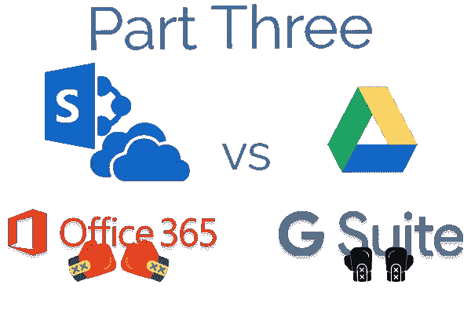

# G Suite 与 Office 365——Google Drive、Sharepoint / OneDrive(第三部分)

> 原文：<https://medium.com/swlh/g-suite-vs-office-365-google-drive-sharepoint-onedrive-part-3-aac64ecd812e>

继续我们的主题，Google Drive 包含的高级功能比微软的产品少。然而，大多数人不需要这些功能。Sharepoint 完美地展示了这种情况。

本次审查将不同于第一部分的[和第二部分](https://alpin.io/blog/gsuite-vs-office365-what-i-actually-love-and-hate-part-1/)的[，原因如下:](https://alpin.io/blog/gsuite-vs-office365-part-2/)

*   与我们讨论的其他产品相比，云存储带来了更多的安全问题。我们会报道的。
*   这些产品各自的历史有助于我们理解它们的功能，所以我们简单地探究一下它们的起源。

**TL；G Drive 是一个个人文件存储和共享工具，它增加了更多的企业功能，如 Team Drive。Sharepoint 是一个复杂得多的工具，专为需要大量管理的组织而构建。G Drive 目前与 Sharepoint 几乎没有共同之处；相反，谷歌的功能与 OneDrive for Business 完全重叠。**

**额外的有用对比表:**看看 UW-麦迪森公司的这张漂亮的[表](https://it.wisc.edu/news/collaboration-tools-google-drive-vs-box-vs-onedrive/)，它把各种功能并列在一起。不管 UW 的表格暗示了什么，Google Drive 是符合 HIPAA 的。

# Google Drive 和 OneDrive For Business 的安全问题

在很大程度上，Google Drive 和 OneDrive for Business 以相同的方式处理安全问题。数据在传输中和静态时都是加密的。Google Drive 采用 AES-128，OneDrive 采用 AES-256；大多数人会告诉你差别可以忽略不计，或者 128 更好(更快)。量子计算可以改变这种情况，让更多比特=更好的论点变得可信；在这个 Reddit 帖子上看到一些热烈的辩论。

然而，对安全的最大威胁仍然是人——爱冒险或粗心的用户。OneDrive 和 Dropbox 中的用户可以更改隐私设置，并广泛共享敏感文件或文件夹，而几乎没有主动工具或监督。(注意:Alpin 提供了一些工具来帮助控制和管理这两种工具的数据。查看我们的 [*特色亮点博客文章了解更多信息*](https://alpin.io/blog/feature-dlp-tools-cloud-storage/)*——我们帮助消除 Google Drive 或 OneDrive for Business 的安全性缺陷。)*

# 谷歌驱动，包括新的团队驱动

*Google Drive 是如何开始的，它将走向何方*

Google Drive 最初是个人(包括组织内部的个人)在云中存储和共享文件的一种方式。2017 年，谷歌[推出了团队驱动](https://www.blog.google/products/g-suite/introducing-new-enterprise-ready-tools-google-drive/)，使管理员能够生成组织或团队拥有的文件夹；以前，所有文件夹都绑定到个人。

*我们喜欢 About Google Drive 的地方*

Drive 的 web 界面外观和性能都非常好。谷歌已经在网络上开发了这个产品，所以我们可以预料到这一点。

Drive 的移动应用非常好用，看起来也很棒。我看到过一些关于移动 OneDrive 的投诉，但很少有人投诉 Drive。

总的来说，我们欣赏这种动力，在很大程度上，它让事情变得简单。随着他们添加更多的特性和功能，复杂性和随之而来的问题可能会出现。我们将会看到结果。

备份和同步应用程序在桌面上运行良好，正如你对云存储领域任何主要参与者的期望。我们也看到了 Google Drive File Stream 的巨大潜力，它提供了对驱动器文件和文件夹的完全访问，而不需要占用你的硬盘空间。也就是说，它会让我们在 Alpin 的电脑崩溃。我们现在坚持备份和同步。

# Sharepoint 和 OneDrive For Business

*Sharepoint 上的一些历史*

Sharepoint 最初是一个企业内部的文件和文件夹存储库。最终，它获得了更多的特性，使整个内部网和仪表板的创建成为可能。现在，任何地方的 Sharepoint 高级用户都喜欢把程序推到崩溃的边缘，结果却被一个沮丧的管理员控制了。如果你去过那里，你可能已经经历过很多次了。

Sharepoint 的组织文件夹与谷歌的团队驱动保持一致。OneDrive for Business 后来出现，类似于 Google Drive 为个人提供的传统文件和文件夹存储。

*我们喜欢 Sharepoint 和 OneDrive For Business 的地方*

两位 Sharepoint 专家向我描述了 Sharepoint 的工作流，称之为他们最喜欢的程序部分(现在是 365 套件中的 Microsoft Flow)。下面是一些[省时的工作流程示例](https://thinkwise.cloud/insights/top5-manage-time-microsoftflow)。

签出文件仍然有效，如果你不希望人们在本地同步文件，这是一个很好的选择。

Sharepoint 中的许多工具和自定义功能为您的 Office 365 订阅提供了一个强大的工具。看一看[这 30 个建立在 Sharepoint](http://www.topsharepoint.com/30-awesome-sharepoint-powered-sites) 中的并不完全可怕的网站。作者称它们“棒极了”，但我觉得这是相当慷慨的。

然而，Sharepoint 有一个双重优势:IT 中的一些可怜的人会接受大量来自推动 Sharepoint 极限的人的 Sharepoint 支持请求。

# 最后的想法——为什么 G 套件增长如此之快

正如你可能已经猜到的那样，我认为没有理由为 Office 365 支付更多的费用，尽管我长期以来一直在工作并对它表示赞赏。这是一款制作精良的软件。然而，大多数人并没有在日常生活中充分利用 Office 产品，因此增加的许可成本只会浪费在大多数员工身上。如果需要的话，专家们可能会拿到许可证。

[在第 1 部分](https://alpin.io/blog/gsuite-vs-office365-what-i-actually-love-and-hate-part-1/)中，我们讨论了 G Suite 和 Officie 365 之间一些通常不会讨论的差异，以及对 Gmail 和 Outlook 的深入研究。没有一个明确的“赢家”

[在第 2 部分](https://alpin.io/blog/gsuite-vs-office365-part-2/)中，除了真正高端的计算密集型活动，Excel 将击败工作表，我们也没有看到文档、演示文稿或电子表格的最终赢家。

所以我的猜测是，为什么 G Suite 增长如此之快？为什么要为闲置的功能支付更多的钱？

## 这个故事发表在 [The Startup](https://medium.com/swlh) 上，这是 Medium 最大的企业家出版物，拥有 343，876+人。

## 在这里订阅接收[我们的头条新闻](http://growthsupply.com/the-startup-newsletter/)。

