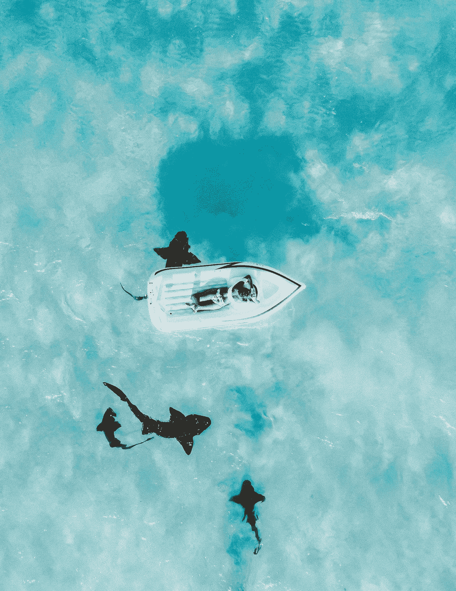
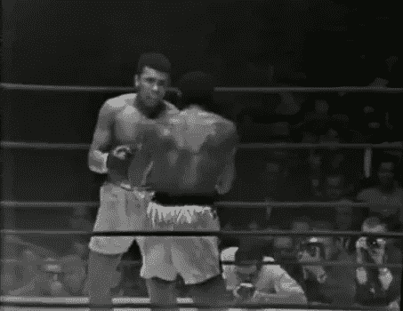
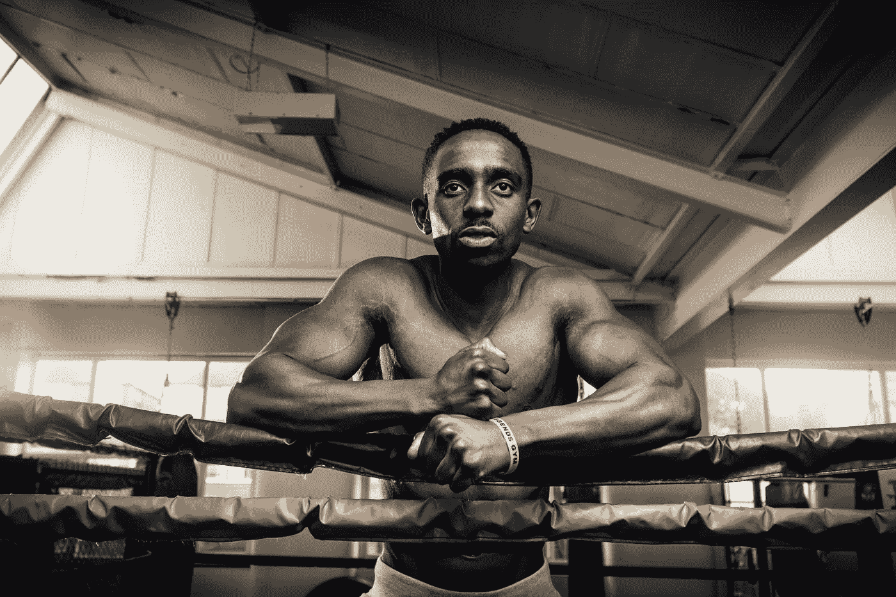

# 以更简单的方式获得指数级的自信

> 原文：<https://medium.com/swlh/gaining-an-exponential-amount-of-confidence-the-easier-way-d3b7040c705e>

> 这个世界根本不在乎你。

这是事实。

人们一般都是为自己着想。他们正在处理他们自己的战斗和他们自己的恶魔，他们很好地把你视为他们前进道路上的障碍。

似乎我们经常努力，努力，努力，在阶梯上提升了几级。我们如此努力地工作来获得这些爬行的收获，在我们知道之前，一些事情发生了，让我们再次指数级地倒退。

我们如何面对挫折？

# 我们如何建立信心，这样我们就可以直视恶魔的眼睛，确保他退缩——而不是我们？

他妈的脸上挨了一拳。

没错。

在下巴上开一枪。

吸收一个会让你跌落到地板上的干草制造机。

无论是字面上还是象征性的。

你的脸被打过吗？

[https://bit.ly/2M1juBB](https://bit.ly/2M1juBB)

糟透了。

很尴尬。

令人沮丧。

很痛苦。

## 但这也是令人羞愧的。

它在增强。

这是一个学习的时刻。

我打拳击已经快一年了。

在我开始拳击之前，我年轻时参加过一次拳击比赛。是因为一个我都不记得的朋友。我们互相挥拳相向，狠狠地打在对方的脸上。我们都带着黑眼圈离开了比赛。

它打开了感受一次成功的大门。

然后我开始拳击。我的教练和我一起练习，一直盯着我的脸、肚子和侧面。糟透了。

我被撞的头几次，我记得世界会停止。我会对这种感觉感到非常惊讶，我不得不结束这一轮。我的直觉会退缩。我觉得我要吐了。

然后我又挨了几拳。我开始熟悉这一经历。

> 恐惧开始慢慢地但肯定地消退。我觉得我已经准备好了。
> 
> 我甚至欢迎他们。

被打脸也可以比喻成生活。

# 真实故事:

我的拳击教练是我的导师。

他帮助我成长为一个思想者，一个战士，一个有创造力的人。

他给我的生活留下的印象是无与伦比的。

就在两天前，他向女朋友求婚了。

**两人的一个小故事**:我的拳击教练是一位 60 岁的黎巴嫩移民。他来自一个贵族家庭，该家庭在黎巴嫩内战期间需要逃离黎巴嫩。

> 他目睹了朋友和家人遭受的暴行，甚至他最大的敌人也不希望如此。

他妻子抛弃了他和儿子后，他独自抚养他的儿子。

谈一些涉及到他人生的“打脸”。

他的[前女友]是一个来自纽约北部的 26 岁美国女孩。她出身于中上阶层家庭。他们在拳击馆相遇。

他们在一起两年了。

我的教练知道他爱这个女孩，需要让这个女孩知道。她一直有点担心年龄差距。

为了在沙滩上划一条线，我的教练向她求婚了。他告诉我，他认为自己在赌博，她有 80%的可能性会说“不”

不料，他的信念得到了证实，他被关闭了。他被压垮了。他有一个想法，事情不会按照他的方式发展，这种信念的现实加剧了这种毁灭性的打击。

在一次训练结束后，我和他一起吃了早餐，谈论了这件事。

> 他告诉我他当然很难过，但是他做得很好。他承受了打击，现在他必须决定，在他的一生中，如何回应这个打击。

**对他来说，这段感情结束了。现在已经没有回头路了。他不得不接受打击，放弃他爱的女人。**

他被揍了很多次。他通过自己的经历告诉我，生活中所有的打击都成倍地增加了他面对这个世界的信心。他被打，被打，被推倒。

> 一场比赛有 12 个回合。你被击中了，你需要站起来反击。

# 结论:

Photo by [Harvey Gibson](https://unsplash.com/photos/ThqaTYD_l0o?utm_source=unsplash&utm_medium=referral&utm_content=creditCopyText) on [Unsplash](https://unsplash.com/search/photos/boxing?utm_source=unsplash&utm_medium=referral&utm_content=creditCopyText)

自信在生活中是一件棘手的事情。

人们经常建议你“假装直到你成功”也许这可以为你工作一段时间。

## 然而，我不认为这是可持续的。会有事情出现，彻底拆穿你自己的谎言。

建立自信的唯一真正催化剂是被人打脸。

挨一拳，不管是字面上还是象征性的。在你的生活中，每次你被击中，你的身体会愈合得更好，你的思想也会。

**再说一次，这个世界根本不在乎你。**

当你被打了一拳，你会怎么回应？这是建立自信的关键。

## 所以你被揍了，你打算怎么回应？

# 准备好接受刺激了吗？

我提供给你一个经过测试和验证的 6 部分指南，它包含了强大的概念，可以帮助你识别、规划、成长和完成你的创造性追求。

# [> > >在此获得免费指南< < <](https://www.tribeloyal.com/free-6-step-course)

> ***学到了什么？按住👏说“谢谢！”并帮助他人找到这篇文章。***
> 
> ***还评论！你喜欢什么？你讨厌什么？你在做什么？***

## 这个故事发表在 [The Startup](https://medium.com/swlh) 上，这是 Medium 最大的创业刊物，拥有 333，253+人关注。

## 在这里订阅接收[我们的头条新闻](http://growthsupply.com/the-startup-newsletter/)。

