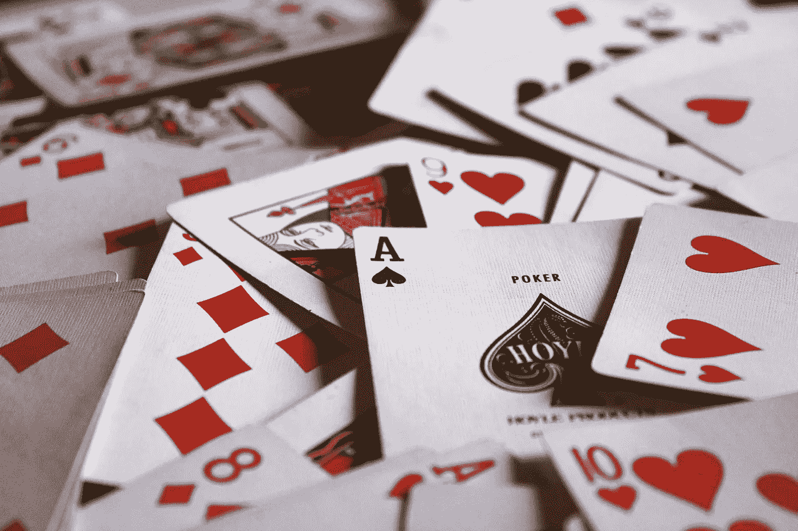
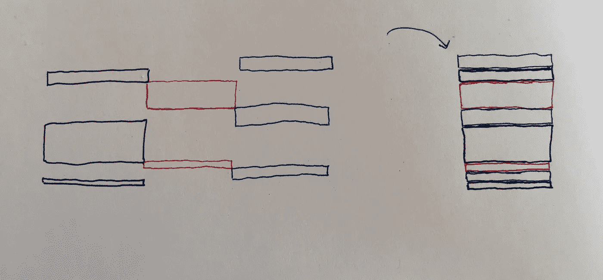
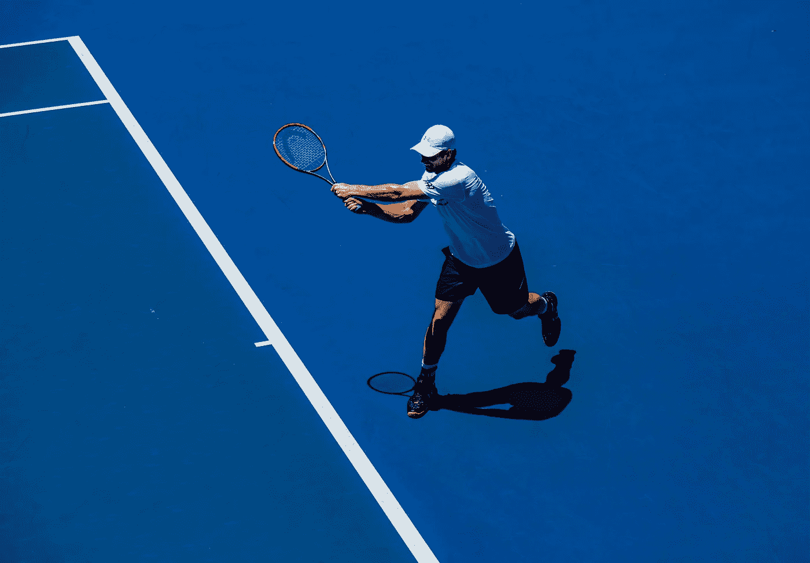

# (生活的)游戏

> 原文：<https://medium.com/swlh/game-of-life-dfa5f6b6eeaa>

## 这篇文章解决了许多源于似乎主宰我们生活的高压情景的焦虑。我至少可以说我的生活。

Photo by [Jack Hamilton](https://unsplash.com/photos/9SewS6lowEU?utm_source=unsplash&utm_medium=referral&utm_content=creditCopyText) on [Unsplash](https://unsplash.com/?utm_source=unsplash&utm_medium=referral&utm_content=creditCopyText)

**我一直意识到我自己令人失望的一面，那就是不能有效和充分地处理这些高压情况。**

**…但是，我对自己表演的愿景和期望依然存在。**

在那些宁静的夜晚，当你真正独处时，这似乎困扰着我的思想。我在一场足球比赛中没能控制住一个传中的球，现在我想起来了。我和女孩说话时的焦虑和尴尬，或者当我讲一个没人笑的笑话时的尴尬场景。

这些失败很沉重，但奇怪的是，并没有阻止我醒来(和睡觉)时梦想自己表现最佳——带球穿过防守和一个精彩的顶角，平稳地移动到一个可爱的女孩身上，成为一群人的中心。但似乎有一个巨大的脱节，我形象地想象为这三组块:

Black blocks: *low pressure situation. Red blocks: missing connections. Blue blocks: high pressure situation.*

*   **黑块** : *你可以在低压情况下做这个活动或动作*
*   **红色块** : *缺少连接，如缺乏知识或经验*
*   **蓝色块** : *你可以在高压情况下做活动或动作*

把它们放在一起，你就有了一个完整的人。因此，我们的想法是降低你筹码中黑色方块的比例，同时提高蓝色方块的比例，这实际上意味着你可以在压力大的情况下做更多的活动或采取行动。

让我们先来看看是什么让一种情况成为“高压”。糟糕的表现通常会带来某种损失，比如被拒绝的尴尬，在薪资谈判中对你未来财务的高风险，或者比赛中的时间压力。

在这些情况下，你会经历对失败的恐惧，对如何行动的不确定性的不安，并且只是简单的不舒服。你的身体将恐惧的感觉转化为身体扩张你的瞳孔，提高你的心率，让你的整个神经系统陷入疯狂——本质上激活了古老的*战斗或逃跑*反应，这是自穴居人时代以来人类生存的固有方式。然而，在我们这个时代的社会中，大多数情况都不再围绕着“吃或被吃”了。

然而，这还有另外一个要素:[*冻结* *响应*](https://www.ncbi.nlm.nih.gov/pmc/articles/PMC2489204/) 。当我们感到没有任何生存的希望来对抗任何攻击我们的敌人时，这就发生了。这也是当你进入你没有经历过的高压环境时会发生的事情。

这个话题在禅宗哲学和丹尼尔·卡内曼的 [*思考快与慢*](http://amzn.eu/j7kOwuq) 中都出现过——它们都谈到了两种不同类型的心。

*   卡尼曼的研究将大脑描述为一个系统 A (快速、直观、感性)和系统 B (更慢、更深思熟虑、更符合逻辑)的混合物。
*   禅宗运动把这类似地描述为一个思考的头脑和一个观察的头脑。

Photo by [Christopher Burns](https://unsplash.com/photos/YSfTcJZR-ws?utm_source=unsplash&utm_medium=referral&utm_content=creditCopyText) on [Unsplash](https://unsplash.com/?utm_source=unsplash&utm_medium=referral&utm_content=creditCopyText)

在这些紧张的事件中，系统 A 思维接管，已知的反应模式被激活。重要的是，如果没有开发，这些模式可能不是最佳的，或者不会产生您想要的结果。这就是运动员为重复训练的原因——在比赛中，肌肉记忆比有意识的思考更重要。观察的头脑退居其次，观察思考的头脑处理事务。

> 不过，它处理业务的能力可能相当差。

最终，他们都提到了旁观者效应的观点。在很多我们遇到的高压场景中，我们变成了容器。在那一刻，当球悬在空中，当你的老板问你“你认为你值多少钱？”在薪水谈判中，当女孩回说“嘿”时。

你暂时脱离了现实。你看到自己对这种情况做出反应，但并不能完全控制自己该做什么。

You when your boss says “Come into my office.” «Photo by [Joey Pilgrim](https://unsplash.com/photos/5BHDL8JaxZc?utm_source=unsplash&utm_medium=referral&utm_content=creditCopyText) on [Unsplash](https://unsplash.com/?utm_source=unsplash&utm_medium=referral&utm_content=creditCopyText)»

与此形成鲜明对比的是，低压力的情况通常仍然会涉及到某种压力源:也许是与陌生人的对话，其中一些人你并不完全感到舒服。或者在一次训练中，有防守队员围着你。但是由于缺乏利害关系和这些事件经常大量重复，我们倾向于更好地处理它们。这是你取得梦幻进球的地方，当你知道如果你搞砸了，绊倒了，没有人会等着看你笑。

红色方块是巨大杠杆的来源。这些是你知识中缺失的空白，或者是缺乏经验的信号。如果你发现自己的表现没有达到预期，很可能是缺少了一块拼图。可能你对控球没有[好的把握(像我一样没有)。或者你不知道如何](https://www.youtube.com/user/freekickerz)[战略谈判](http://amzn.eu/77Dn2zp)。或者你不知道该对一个女孩说什么。

所以你读书是为了获取知识，弥补差距。你让自己处于不舒服的境地来解决你缺乏经验的问题。通过推动自己去解决红色的障碍，你就减少了处理高压情景时的摩擦，慢慢地降低了自己对危险的敏感度。

T 这种重复既能训练你克服失败带来的冻结反应。从失败和别人的错误中学习。

黑色块会慢慢缩小，变成蓝色块。在高风险、高压力的情况下，你会完成更多。

*你曾经在高压情况下取得过惊人的成绩吗？在下面的部分留下评论并分享你的想法。*

**感谢阅读！这是我的第一篇媒体文章。**

**如果你想和我取得联系，可以发邮件** [**这里**](mailto:saifbhatti@u.northwestern.edu) **。**

## 这个故事发表在 [The Startup](https://medium.com/swlh) 上，这是 Medium 最大的企业家出版物，拥有 290，182+人。

## 在这里订阅接收[我们的头条新闻](http://growthsupply.com/the-startup-newsletter/)。

