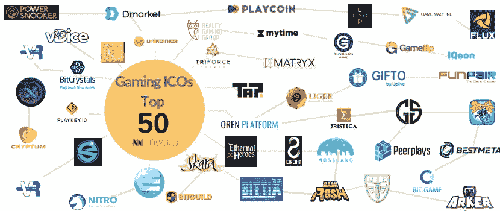

# 游戏 ico，2019 年蓄势待发？

> 原文：<https://medium.com/swlh/gaming-icos-poised-for-growth-in-2019-3dfe02dc99bc>

## 年初至今的融资趋势和业绩

> [下载报告](https://www.inwara.com/report/gamingicos?utm_source=gamingstartup&utm_medium=gamingstartup&utm_campaign=gamingstartup)

根据 Statista.com 的数据，游戏行业预计将从 2017 年的 1089 亿美元增长到 2020 年的 1285 亿美元。采用水平不断提高，就 ico 数量而言，该行业已跃升至第 5 位。尽管如此，许多项目谁已经适应区块链…