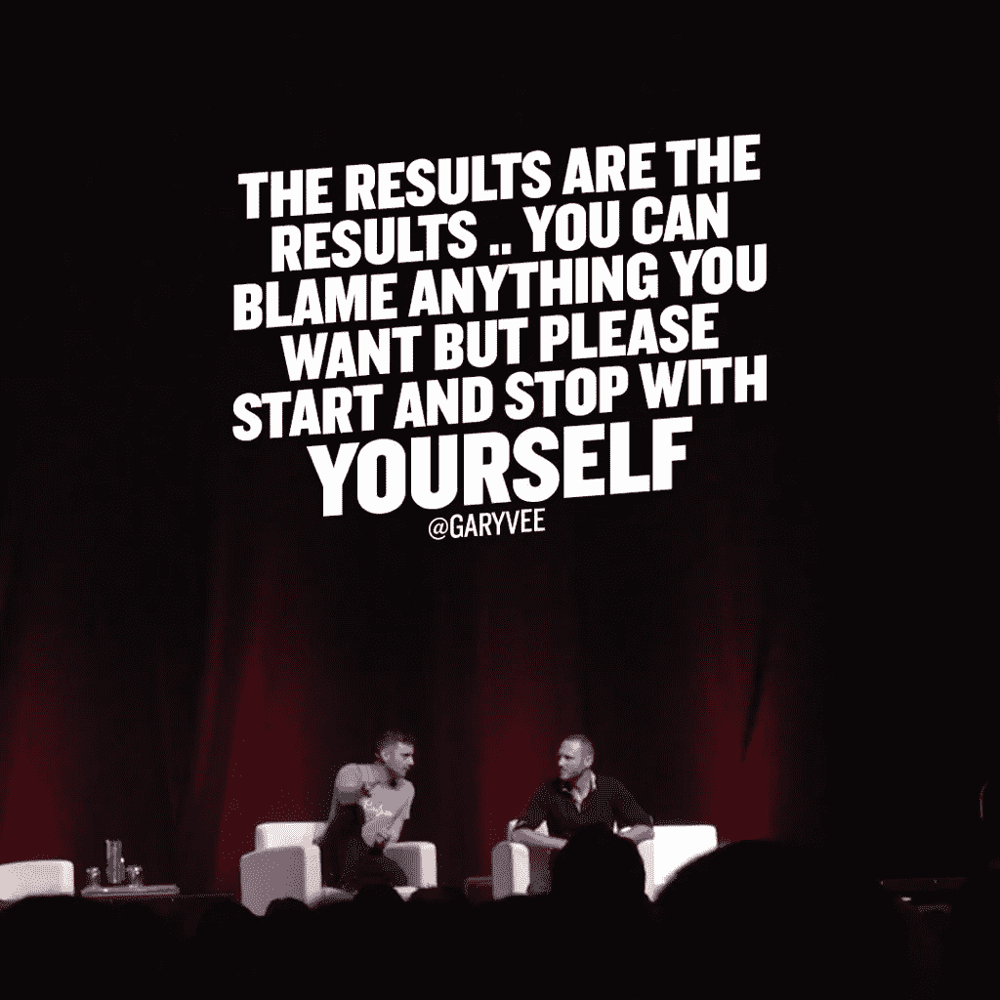

# 加里·维纳查克并不总是充满 S#*&！

> 原文：<https://medium.com/swlh/gary-vaynerchuk-isnt-always-full-of-s-25965160865c>

## 加里·维最有价值的三课

加里·维纳查克是那种第一次听他讲话就很容易让人讨厌的人。

他的鲁莽、严肃的动机立刻令人不快。他满脑子都是唾液，醋，一些其他随机餐具，最重要的是，他自己。

在前一段中，我认为他唯一不同意的是使用*动机*。

尽管说了很多励志的话，加里·维并不是一个励志演说家。

那他是什么？

他是另外一个人。一部分是人类行为专家，另一部分是企业家大师。

到目前为止，根据我对加里的描述，你可能会认为我讨厌这个家伙。

你错了。

嗯，不完全是。有一段时间我觉得他非常讨厌。

> 能量太高。太自我放纵了。太夸张了。

但这是加里独特魅力的一部分，如果你呆得够久，他会喜欢你的。

> 那个*高能*有办法变成*你的*高能。
> 
> 自我放纵会成为你增强自信的一种方式。
> 
> 那种夸张的态度会成为你对这个世界的看法，如果你只是…倾听。

这就是加里·维的真正魔力。这是他以一种让人感觉真实可信的方式给出建议的能力，尽管他很自负，但他来自一个真正关心他人的地方。

在这个世界上，每个人都想从你那里得到什么，有人唯一的愿望就是你给他你的注意力，这样他就可以说一些最终会让你受益的话，这非常令人耳目一新。

这就是加里的全部技能…他渴望聚光灯，他知道获得这种光芒的最好方法是用好的、可靠的建议淹没你。

加里·维是媒体上最受欢迎的作家是有原因的。他统治 Instagram、脸书、YouTube 和其他网站是有原因的。

因为他有些东西值得一听。

这里有三个最有价值的。

# **努力就是一切**

这是一个反复出现的主题，你会从世界上几乎所有的成功人士那里听到。这个世界上很少有完全由你掌控的事情。

天赋、技能、机会……都是喧嚣的副产品。

需要澄清的是，当我们说 hustle 时，我们实际上说的是工作。

成功并不复杂，但它*是*难。

所以不要再认为每件事都应该比它简单。

你已经写作了 10 年，还没有为你的处女作找到出版商，这没关系。

在过去的一年里，你每周工作 80 个小时，试图让你的事业起步，这并不重要。

继续工作。

坚持每天出现并完成工作。即使你在森林里看不到路。

继续走。

从生活中得到你想要的一切的唯一方法是永远不要停止为之努力。

这就引出了第二课。

# 失败不仅是必要的，而且是好的

尝试失败也没关系。

尝试失败一百次也没关系。

只有当你放弃并停止尝试时，你才真正成为一个*失败者。*

快，想一想你认识的最成功的人。也许你脑海中浮现出了埃隆·马斯克、史蒂夫·乔布斯或送奶工巴里的形象。

你召唤了谁并不重要，他们没有失败过几百次，如果不是几千次的话，也不会有今天。(什么，你认为任何人都能成为送奶工？说真的，看看周围…有多少送奶工还在外面？没错，是精英领域。)

人们未能实现其远大人生目标的首要原因是:他们止步不前了。

花的时间太长了。太难了。太贵了。

人们可以想出无数的借口来解释为什么他们没能赢，但是最终只有一个借口是重要的。

他们厌倦了失败，他们退出了..

当我们谈论借口的时候，让我们谈谈我从加里·维纳查克身上学到的第三件事。

# **一切都是你的错**

事实上，我从加里·维那里学到的并不多，我从斯多葛派哲学家那里学到的更多，比如马可·奥勒留，但这是如此重要的一课，我觉得怎么强调都不为过。

我就这个话题写了一篇很长的文章，如果你想看的话，可以点击下面的链接。

 [## 帮助你主宰生活的传奇语录

### 马库斯·奥勒留，所谓的五个好商人中的最后一个，写了一系列的日记条目(后来由…

medium.com](/the-mission/quotes-from-a-legend-to-help-you-dominate-life-35671ba2390b) 

如果你想要浓缩的悬崖笔记版本，那么听着…

在这个世界上你只能控制一件事，那就是*你自己*。

别人怎么想不重要…你控制不了。

别人怎么做不重要…你控制不了。

生活、市场、世界做什么都不重要……你控制不了。

这里重要的一点是:不要在你无法控制的事情上浪费你的时间、精力和资源。

这是绝大多数人的做法。他们把注意力集中在别处。他们抱怨，推卸责任，指责别人，却从不承担责任。

但是你和他们不一样。

你不一样。因为你认识到，通过宣称对生活中所有的成功和失败负有最终责任，你就掌握了主动权。

这是一个非常强大的操作平台，因为这意味着外界绝对不能让你偏离轨道。

当然，你可能会被绊倒，但你承认失败，掸掉身上的灰尘，重新站起来。

只有当**你**选择停止时，你才能被停止。

这可能是我从加里·维纳查克身上学到的最有价值的东西。

**感谢阅读！如果你喜欢这篇文章，帮我一个忙，拍一下**👏**几十次。你的支持对我来说意味着一切！**

[**点击这里参加免费的五个势力范围电子邮件课程！**](http://www.thehyperfocusedmind.com/)

## 这篇文章发表在 [The Startup](https://medium.com/swlh) 上，这是 Medium 最大的创业刊物，有 313，216+人关注。

## 在这里订阅接收[我们的头条新闻](http://growthsupply.com/the-startup-newsletter/)。

