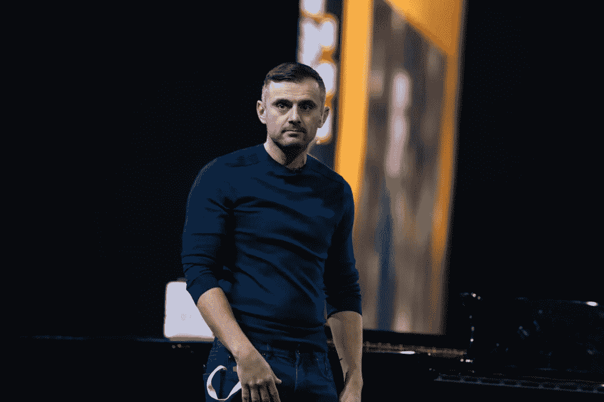
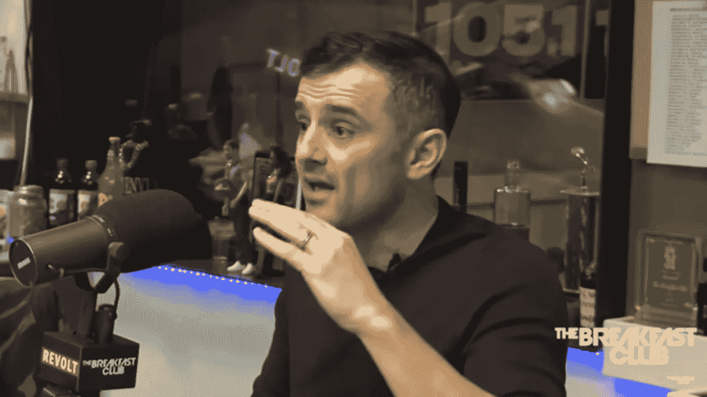

# 加里·维纳查克谈为什么你不应该停止追求你的梦想

> 原文：<https://medium.com/swlh/gary-vaynerchuk-on-why-you-shouldnt-stop-pursuing-your-dreams-649b7a455063>

> 人们的注意力现在是资产。不是钱。如果有人给你一分钟。这就是注意。这是最重要的资产。
> 
> 你应该感谢有人在听。

感恩。耐心。这是加里强调的两个品质。

# 对于仇恨者来说

在我开始分享 Gary 的建议之前，我想说的是，Gary 的生活方式遭到了很多人的憎恨。有些人会称之为不健康。他好像不在乎，这更让人气愤。

动作很重要。我已经尽可能地在这个博客上忙碌了。毫无疑问，加里是一个影响。然而，记住心是很重要的。我不认为加里不知道，只是他的演讲让人以为他只是为了得到认可而活着。

正如他的前雇员杰罗姆·贾尔所言:

> 如果你正在学习商业/公关/营销，那么今天就退学吧。这个世界已经充满了营销人员和商人。这个世界不需要更多这样的东西。这个世界需要心灵治疗者和问题解决者。你的心比你的大脑 *强大一百万倍(摘自*导师部落，*261–2 页)*。

这就是加里受到的憎恨。

当然没那么简单。这个世界需要一些东西，也许是各种观点的结合。加里和杰罗姆都很重要。

> 这个世界需要各个领域的骗子。

然而，加里强调耐心是至关重要的。尽可能经常地提醒自己这一点很重要。

人们会继续批评加里，认为他知道所有正确的答案。这是肯定的。也许他没有所有正确的答案。但是他会赢吗？他当然会。不管他的态度如何。他的坚持不懈将使他获得喷气机队。

让我们听听 Gary 的一些实用建议——他是这个领域最好的建议之一。

Image taken from one of the sources (included below).

# 何时投资的建议

如何投资？什么时候投资？我们怎么知道？这看起来像是一件很冒险的事情，但是这其中有什么逻辑吗？有什么游戏计划吗？

Gary 澄清说，在回答投资什么这个问题之前，你需要问几个问题。

1.  你多快想要回钱？如果你有一些钱。如果你投资股票市场，10，000-100，000 美元加起来。每 8 年都会有股市崩盘的时刻，但如果你没有把钱取出来，你不会失去任何东西。如果你投资股票市场，你就是在投资美国。
2.  如果你只有 1000 美元。赚钱的最好方法是车库销售和出售物品。建立一个可以赚钱的社交媒体账户。达到 100，000 粉丝的大关。这是一种赚钱的方式。

只会是工作。你有多聪明并不重要。重要的是你有多坚持。

我最近听到流行音乐人艾德·希兰重申了这一点，他说坚持比天赋更有价值。

你这样做(插入你的激情:音乐、商业、博客)，是因为你想和莎莉交往吗？

如果你热爱这项运动，你就会赢。如果你想用它来做别的事，你就会失去它。

创业的问题在于它需要时间，而且你必须牺牲很多东西。这种牺牲与生活中的几乎所有领域都相似。

如果你想要一个健康的家庭。牺牲是巨大的。你必须每天把家庭放在你的利益之前。

如果你想玩音乐，你将不得不牺牲你的人际关系，甚至可能是学校。

如果你想要一个成功的博客，在你开始赚钱结束你的日常工作并追求自由写作生涯之前，你可能必须在工作前比其他人早起好几年。

> 没有被动收入这种东西。你不可能一夜暴富。不要试图去理解那个游戏。投入工作。

# 你的动机是什么？

当被问到他的动机是什么时，他说:

> 我想回报。
> 
> 我想打败所有人。游戏。我沉迷于这个游戏。
> 
> 只有在你自己的意识里和自己做爱。不要在意别人怎么想。

你有驱动你的东西吗？

你想以积极的方式做出贡献吗？

> 有人给我 10 万美元让我发表演讲，我拒绝了。然后我退一步想:这比我 20 多岁时赚的钱还多。。。。
> 
> 我不会轻易这么说。我不是想说我很酷。从 25 岁到 30 岁，我没有赚到 10 万美元。我可以在 41 岁的时候把它传递下去。这就是当你工作 20 年，每天工作 18 个小时，不在乎别人怎么说你的时候会发生的事情。。。。如果他们在你身上拉屎。。。你根本不在乎。这就是突破口。

把*有效的利他主义*视为你职业追求的一个有价值的最终目标。我已经在这里写了更多:

 [## 让我们试着有意识地给予&用声音给予

### "有活下去的理由的人几乎可以忍受任何方式."—弗里德里希·尼采，《偶像的黄昏》

medium.com](/@jakubferencik/let-us-try-to-give-intentionally-vocally-326c1233b0c5)  [## 我们能结束全球贫困吗？这是现实的目标吗？

### “讨论。。。是不够的。如果我们不把哲学与公共(和个人)事务联系起来，那还有什么意义呢

medium.com](/@jakubferencik/can-we-end-global-poverty-is-this-a-realistic-goal-b893cb7cf479) 

关于加里五世的更多信息:

 [## 你所在年份的市场

### 我日交易关注和建立业务。

medium.com](/swlh/market-for-the-year-you-live-in-6303a73f01e1) 

# 来源:

## 在你走之前…

*如果你觉得这篇文章有帮助，请点击*

如果你想让你的朋友在某种程度上从中受益，请点击下面的按钮或分享关于脸书的文章。谁知道呢？也许他们会喜欢。我写信给你是为了让你继续思考，让我继续感恩和反思。干杯干杯干杯，下次见，

继续反思。

## 这个故事发表在 [The Startup](https://medium.com/swlh) 上，这是 Medium 最大的企业家出版物，拥有 290，182+人。

## 在这里订阅接收[我们的头条新闻](http://growthsupply.com/the-startup-newsletter/)。

