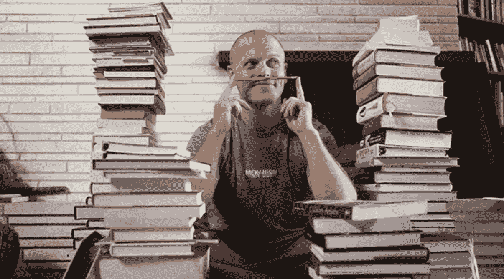
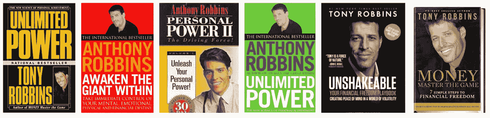
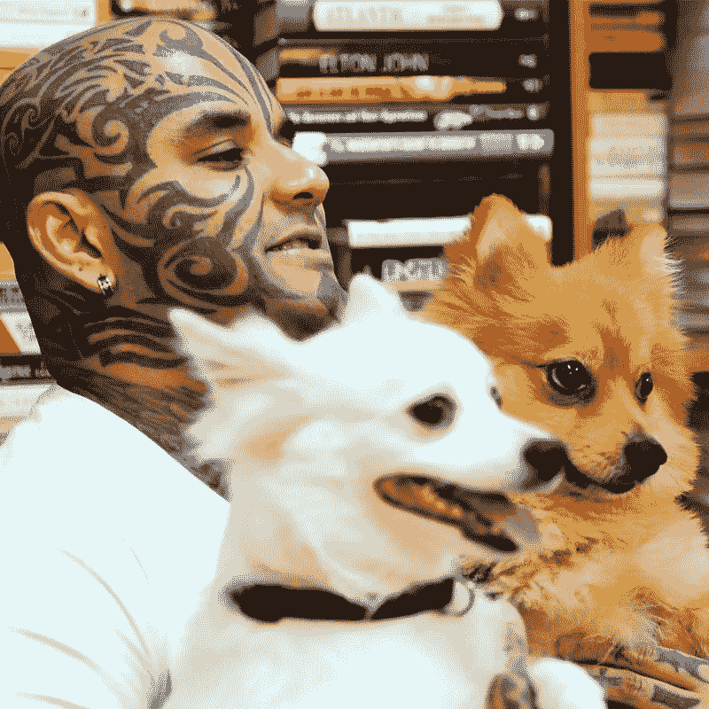
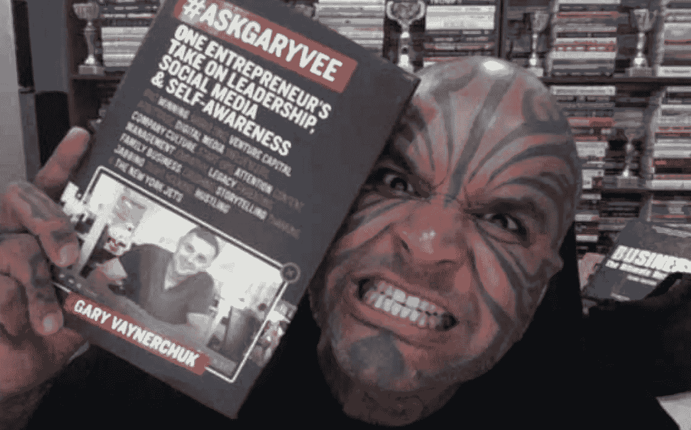
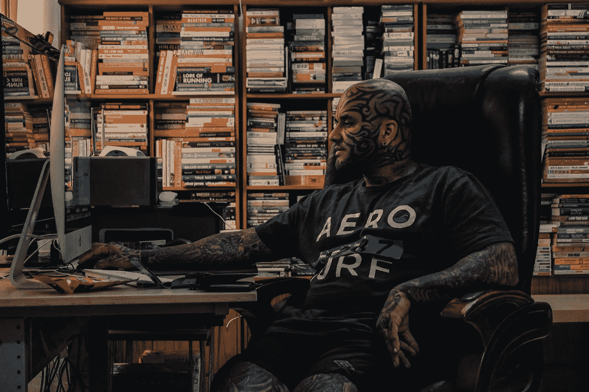
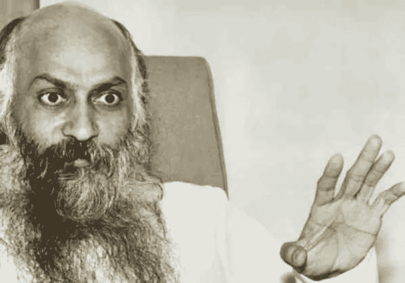

# 加里·维纳查克，托尼·罗宾斯，蒂姆·费里斯——那么接下来是什么？

> 原文：<https://medium.com/swlh/gary-vaynerchuk-tony-robbins-tim-ferriss-so-whats-next-6e3a976d3441>

我是一个在线品牌，在网上贡献了超过 4000 篇文章和视频。所以我通常会收到来自世界各地的电子邮件、信息和请求。鉴于我的童年并不完美，我与贫困作斗争&也犯了很多错误——我想我和很多人有共鸣。

然而，不是每一次互动都是好的，不是我收到的每一条信息都是积极的，也不是我读到的每一封邮件都是明智的。在所有好的、坏的和丑陋的事物中，有一条共同的线索将它们联系在一起——自我完善的幻觉。

年轻人或工薪阶层的专业人士告诉我以下情况并不少见:

1.  我读过蒂莫西·费里斯所有可能的书
2.  我听过托尼·罗宾斯所有的音频节目
3.  我订阅了加里·维纳查克的博客，听了他所有的播客
4.  我已经读了 100 本自我提高的书
5.  我已经看完了 100 多个 Ted 演讲

这样的例子不胜枚举。

然而，在听完或读到这样的自白后，当我给他们发送这样的回复时，人们会感到惊讶:

“所以……现在怎么办？”

当我这样说的时候，人们通常会一片空白。我不知道他们在期待什么。也许是赞美，也许是“哦，是的，太棒了……”或者可能是一句鼓舞人心的话，比如“你正朝着正确的方向前进。”

但我不会说那样的话。

我只是听他们说…呃……”好吧。那么接下来呢？”

问题是，人们期望读一本书、听一段播客、注册一门课程或参加一个研讨会后获得一个证书会让他们突然变得“特别”或“不同”。属于一个高级或精英俱乐部的人。

就像因为我是一个无神论者，有人突然加入了无神论运动，跳到我面前，搂着我，自豪地说“我们是无神论者，不是像你一样实行生殖器切割的宗教极端分子。”

看书、听播客或看视频只做一件事——给你信息。就是这样。没别的了。这就像看世界新闻一样好。它只给你信息。

就像看 CNN 和听唐纳德·特朗普在过去一年做的事情不会让你成为一个可以竞选公职的政治家一样，听加里维、托尼·罗宾斯和蒂姆·费里斯的话也不会让你聪明、聪明、特别或成为一个成功的故事。

我认为人们没有意识到的是知识不是力量。知识的应用是。

我读了将近 800 本书。从某种意义上说，我不再计算我读了多少书，读得有多快。今天，我的 6 TB 硬盘中存储了价值超过 55 万美元的书籍、mp3、DVD、在线课程和教育数据。

我是否读完了所有的书，学完了所有的课程，记住了存储在那里的所有信息？

绝对不会。

这是否让我比 16 岁开始厕所清洁工的职业生涯时更见多识广——哦，是的。

然而，读这些书是不是让我比别人更成功，更富有，更成功，更强大。

绝对不行。

这让我更了解情况。

我总是告诉人们——阅读空手道，观看空手道视频，听关于空手道的 mp3，背李小龙的名言不会让你成为世界级的空手道专业人士。

你必须走出去，在未来 10 到 15 年的每一天里，练习、竞争、战斗、实验、研究、学习并掌握空手道。只有在你投入了 10，000 个小时的反复深度练习、反复盲目的奉献和反复无谓的痴迷之后，你才会到达某个地方。

我们生活在这样一个时代，赞、积极的评论和社交媒体分享让任何人往好的方面疯狂传播，往坏的方面傲慢无知。考虑到人们是如何挑选他们愿意相信的东西的，毫不奇怪，甚至一个 11 岁的印度孩子告诉我“嘿，兄弟，我读过马克·曼森的《不给 A F 机会的微妙艺术》”

好吧，你读过一本书——那么现在怎么办？

我认为人们也许应该停止读那么多书，开始做一些生活中有意义的事情。

人们需要明白的是，是的，加里·维纳查克、托尼·罗宾斯和蒂姆·费里斯的内容是好的。但是这里有一个新闻快报——他们通过销售他们的品牌赚了数百万美元。你做了什么？你是如何“具体”改变你的生活的？你取得了哪些“可衡量的”进步？

说到底，即使是自强不息的行业也是赚钱的行业。没有收入，没人关心，没人打扰，也没人相信你的谎言。

所以，下一次有人告诉你，“嘿，伙计，在过去的十年里，我每天都读一本书”的时候，深呼吸，不要动，然后在短暂的停顿之后，像奥修一样睁大你的眼睛，问他们“好吧…现在怎么办？”

# 洛伊·马切多

## 这个故事发表在 [The Startup](https://medium.com/swlh) 上，这是 Medium 最大的企业家出版物，拥有 285，454+人。

## 订阅接收[我们的头条新闻](http://growthsupply.com/the-startup-newsletter/)。

