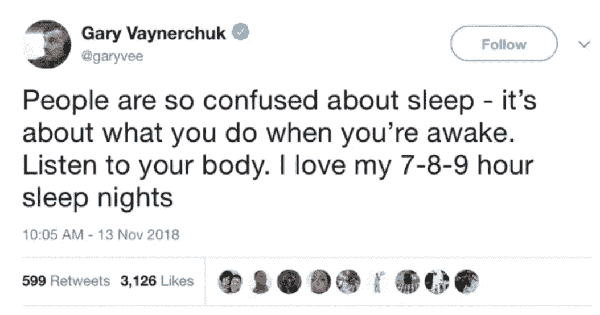

# 加里·维纳查克对“色情骗局”的思考(通过模因讲述)

> 原文：<https://medium.com/swlh/gary-vaynerchuks-actual-thoughts-on-hustle-told-through-memes-4992dc9ce616>

我的团队把这篇文章放在一起，我想与大家分享:)享受！

—

很多人误解了加里关于“努力工作”和“拼命工作”的信息

最终，加里要传达的信息是对你的生活感到满意，并到达一个你不觉得有必要抱怨的地方。不要让自己过度劳累或不开心。

在这篇文章中，我们想创造一些更多的上下文来说明他实际上的意思和人们认为的意思。我们想用迷因来做这件事。)

# 人们认为加里的意思是:“如果你一天不工作 15-18 个小时，你的生活就不够充实。”

# 加里真正的意思是:

如果你不抱怨，加里没什么好说的！

他给出的建议实际上只是给那些不开心、抱怨或夸夸其谈却没有用行动支持的人。最终，你的行动需要与你的雄心相匹配。

如果你想建立一个为你的生活方式“提供资金”的企业，你渴望过上顶层 1%的生活……这意味着要达到这一目标需要付出大量的努力。付出代价需要很长时间——这可能意味着放弃你白天工作后的休闲时间，或者比平时早起一点。

但是如果你整天看《网飞》和玩电子游戏，你真的很开心，那就太棒了

快乐是最终的投资回报，而不是金钱。你是否

# 人们认为加里在说:“你们都应该像我一样努力工作。”

# 加里真正的意思是:

加里热爱建立企业的过程，这就是为什么他制定了一个目标，要收购价值数十亿美元的运动队纽约喷气机队。DailyVee 只是 Gary 记录他作为一名企业家的旅程的方式。

但是加里是个极端的人。除非你清楚自己是谁，想要什么，否则你不应该试图模仿加里的职业道德，甚至不应该自己创业。

# 人们认为加里在说:“成功需要很多很多年。你不应该放弃你的事业。”

# 加里真正的意思是:

创业现在很“酷”，有很多人试图成为不适合创业的人。

不是每个人都应该花费数年时间来尝试创业——许多人只是没有足够的天赋，或者“不适合”创业带来的压力和紧张。

没关系。全力以赴做自己擅长的事情比妄想自己的技能有趣得多。

# 人们认为加里在说:“为了成功，我必须牺牲睡眠和家庭时间。”

# 加里真正的意思是:

如果你每晚需要 7-8 个小时的睡眠，那完全没问题。你不需要牺牲睡眠来建立你的生意或副业。

这与你花在睡觉、通勤上班或与家人共度时光的时间无关。它是关于在你不做这些事情的时候你在做什么。如果你*真的*想在白天花更多时间放松，那太好了！

要知道，你会把生意留在桌面上，这完全取决于你的野心。

我们已经看到越来越多的文章和评论谈论 Gary 对忙碌和努力工作的观点，所以我们想花一些时间来解决这些问题，并围绕他实际所说的内容创造背景。

最终……加里不会强迫任何人过他们不想过的生活。他只是在给人们施加“压力”,让他们停止抱怨，获得更快乐的心态

感谢大家阅读并跟随 Gary 的旅程！

—加里维团队

*请通过在推特* *上分享这篇文章来帮助我们传播这个信息！*

[*加里·维纳查克对喧嚣的真实想法*](https://www.garyvaynerchuk.com/gary-vaynerchuk-thoughts-on-hustle/) *原载于 2018 年 12 月 13 日 GaryVaynerchuk.com。*

## 这篇文章发表在 [The Startup](https://medium.com/swlh) 上，这是 Medium 最大的创业刊物，拥有+399，714 名读者。

## 在这里订阅接收[我们的头条新闻](http://growthsupply.com/the-startup-newsletter/)。

