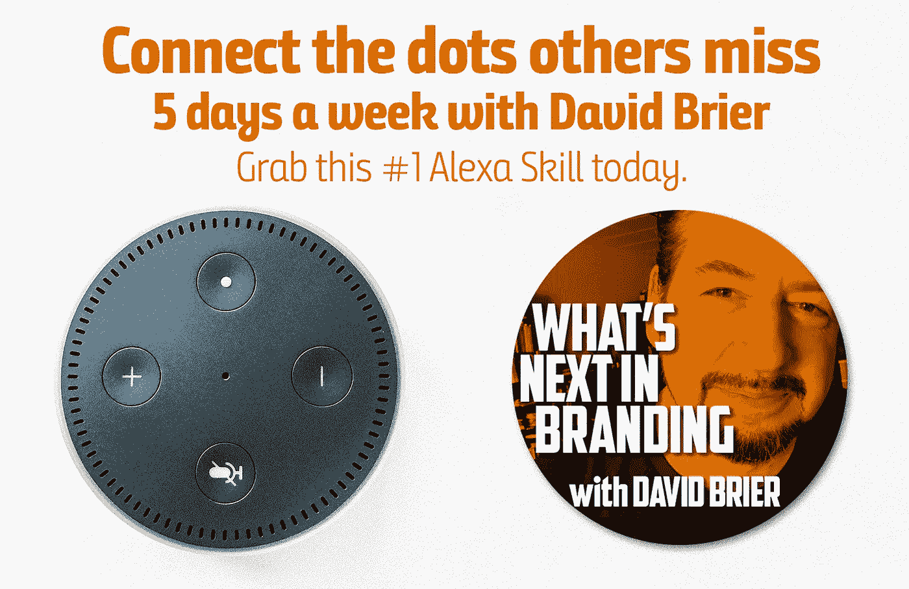

# Alexa 上的 GaryVee，你的品牌，和下一个搜索引擎

> 原文：<https://medium.com/swlh/garyvee-on-alexa-your-brand-and-the-next-search-engine-13ff27a81e90>

## 他是我们都知道的声音。他掌握着事情发展的脉搏。以下是 Gary's 预测的将盖过视频的下一个前沿领域。

GaryVee(或者那些不熟悉他的“品牌名称”的人称为 Gary Vay**nerchuk)说，“Alexa 有可能杀死谷歌。”**

# Alexa 技能是海滨物业度假

加里进一步写道:

> “比起播客本身，我更认为 Alexa 是一个难以置信的获胜机会。如果你认为播客是当前创意的目的地，那么 Alexa Skills 就是海滨度假胜地，尚未被大众发现和预订。

这可能会向一些人澄清为什么我，一个建立品牌和他们的品牌故事的视觉品牌设计师，用我的 [*“品牌的下一步是什么”*](http://amzn.to/2ydjuM0) Alexa 技能购买了一些“海滨资产”，数千万人可以在他们的 Echo 设备(或装有亚马逊 Alexa 应用程序的 iPhones)上访问这些技能。

目前，我是 Alexa 的第一品牌技能，[品牌重塑](https://www.risingabovethenoise.com/how-to-rebrand-19-questions-ask-before-you-start/)，以及无数能让任何企业都欣喜若狂的关键词。

正是因为这个原因和这些(也来自 Gary)，我加入了 Alexa 的行列:

*   “事实上，[音频和流媒体的年增长率高达 76%](http://www.nielsen.com/us/en/insights/reports/2017/2016-music-us-year-end-report.html),超过了视频每年 250 亿的年增长率。”
*   “在过去的 24-36 个月里，品牌和个人都开始重视音频。”
*   “下一个搜索引擎*是‘语音’…。这是你的*下一个*机会。”*

当然，我必须想办法让别人知道我的“海滨房产”。所以我把它作为一种推广，这样我就不会融入这个新领域的所有噪音中:

# Alexa 和采样的力量:亲耳聆听

所有伟大的品牌样本。从音乐到床垫，到全食超市的食物样品，再到各种各样的“免费试吃”。

那就是 Alexa 对我的意义:*一个样本*。我的想法，我的方法，我的成功和我处理失败和障碍的方式。

为了给你一点你可能错过的味道，只需 ***启用*** 或[订阅](http://amzn.to/2ydjuM0)——它们平均每集 3 到 4 分钟(如果你想[听前几集](https://www.risingabovethenoise.com/garyvee-on-alexa-your-brand-and-the-next-search-engine/)，[这篇文章](https://www.risingabovethenoise.com/garyvee-on-alexa-your-brand-and-the-next-search-engine/)有一个播放器，可以让你访问截至今天的所有 35 集):

有了“声音世界”和 Alexa，我一周 5 天都能接触到我绝对不会与之交谈的人。

*你如何用“你的样本”吸引人？*

## 从这篇文章中获得了价值？
然后鼓掌，分享，关注我，订阅我的 [YouTube 频道](https://www.youtube.com/user/headmusik)每周有新视频。需要一个品牌重塑或一个难忘的主题演讲人？在这里找到我。

## 这个故事发表在 [The Startup](https://medium.com/swlh) 上，这是 Medium 最大的企业家出版物，拥有 351，974+人。

## 在这里订阅接收[我们的头条新闻](http://growthsupply.com/the-startup-newsletter/)。

