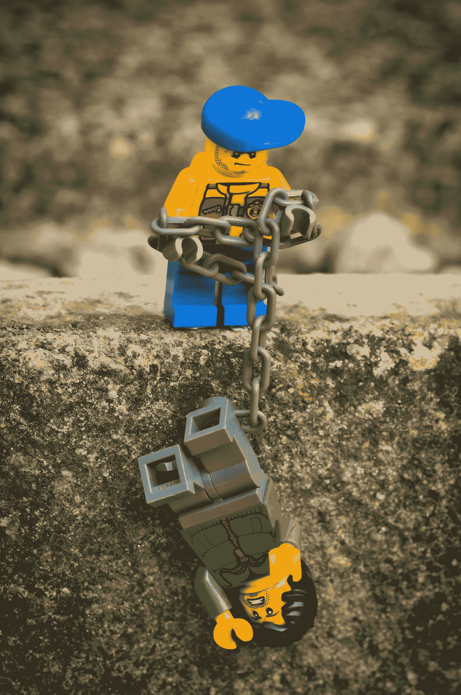

# 收集客户反馈(并加以利用)，就像你的生命依赖于它一样。

> 原文：<https://medium.com/swlh/gather-customer-feedback-and-use-it-like-your-life-depended-on-it-8cfdf867b9a6>

Toys R’ Us left us hanging. We loved you, but, it seems, in the end, you didn’t love us back. Photo by [Philip Veater](https://unsplash.com/photos/Y58Sww9SR1c?utm_source=unsplash&utm_medium=referral&utm_content=creditCopyText) on [Unsplash](https://unsplash.com/search/photos/toys-r-us?utm_source=unsplash&utm_medium=referral&utm_content=creditCopyText)

我记得小时候迷恋过玩具反斗城。

我来自加勒比海，我没有无障碍的特权，但我一直梦想着去一家玩具专卖店会有多棒。看到、感觉到并(希望)得到所有我心中渴望的美泰玩具、孩之宝游戏和 1000 个拼图。

作为一个成年人，我能够去美国旅行，体验我童年梦想的一部分。感觉不一样，但回顾 2012 年在曼哈顿的旗舰店还是很不错的。

所以看到它死去我很痛苦。真的，没必要。

许多人会说，《玩具反斗城》之所以失败，是因为财务管理不善和对辉煌的妄想。那是真的。

但它也失败了，因为它不重视顾客的意见。它没有足够快地倾听客户的需求，当他们意识到问题时，已经太迟了。

随着技术的发展，客户的需求也在不断变化。他们希望在线速度和可访问性。他们希望在商店里有良好的顾客互动和体验，他们希望与他们支持的品牌建立情感联系。

最好的企业主明白这是一种关系，健康的富有成效的关系需要持续的沟通；因为人会变。

杰出的企业主明白他们所服务的人不再是“顾客”。他们是无名氏和吉姆·布朗。他们有名字和个人欲望，他们试图理解每一个名字和每一个愿望。

这就是为什么您需要反馈。无论您有一个客户还是一万个客户。

更重要的是，你需要使用它。

以下是您可以询问客户的一些问题:

*   **你现在在纠结什么？**
*   **使用我们的产品/服务有多容易？**——使用您的产品越困难，他们就越不可能想再次使用它。见[客户努力得分](https://www.amazon.com/Effortless-Experience-Conquering-Battleground-Customer/dp/1591845815/ref=sr_1_1?ie=UTF8&qid=1528298799&sr=8-1&keywords=the+effortless+experience)。
*   **我们如何改进产品/服务？**
*   **您是从哪里/怎么知道我们的产品服务的？** —您可以找到理想客户的志同道合者在哪里闲逛，并接触更多的人。
*   **您会向您的朋友/家人推荐我们的产品/服务吗？** —也称为净推广者分数，此问题有助于了解他们对您的评价。
*   **我们还能为您提供什么？** —您做得够了吗？你能增加更多的价值吗？合适的客户会毫不犹豫地说。

在电子表格、文档或类似于 [Airtable](https://airtable.com/) 的应用程序上收集这些数据，并寻找相似之处。开始为客户解决痛点。开始做出我们客户想要的改变。

永远为你的客户做一件正在进行的工作，并听取他们的意见。

一切都取决于它。

## 这个故事发表在[的创业](https://medium.com/swlh)上，这是 Medium 最大的创业刊物，有 332，253+人关注。

## 订阅接收[我们的头条新闻](http://growthsupply.com/the-startup-newsletter/)。

