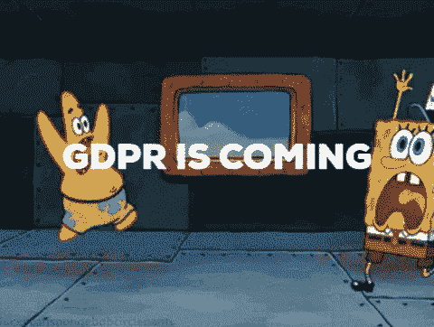
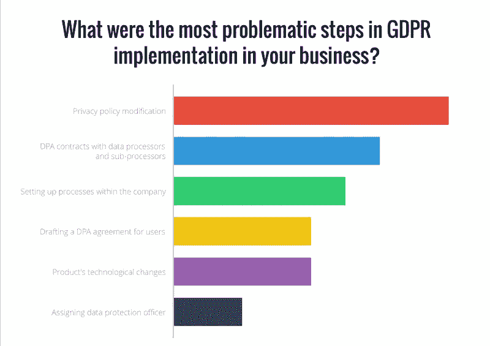
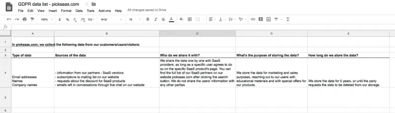
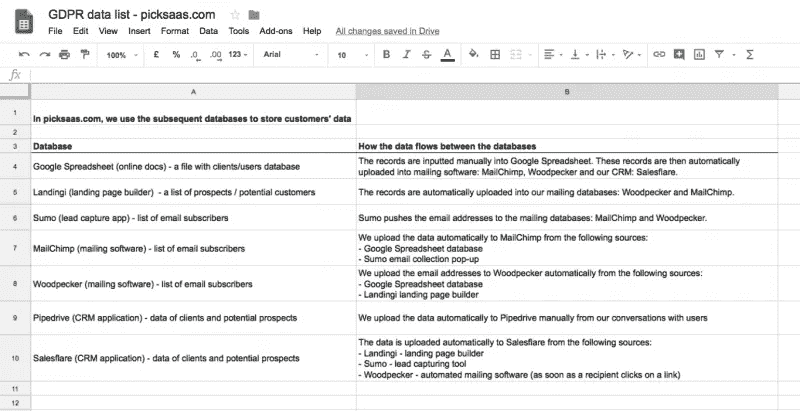
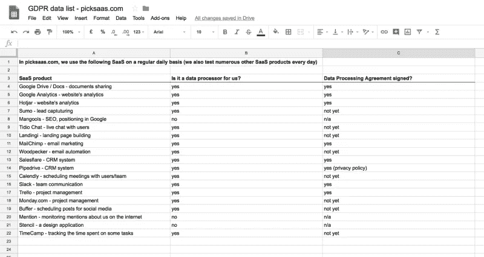
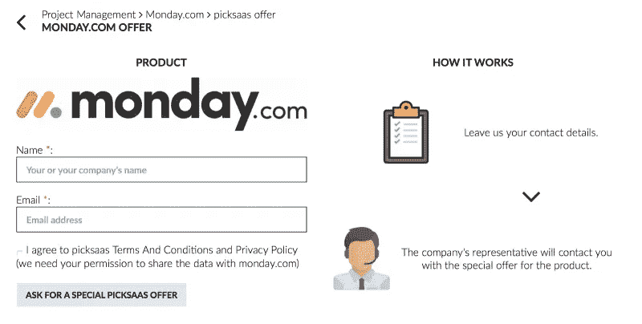
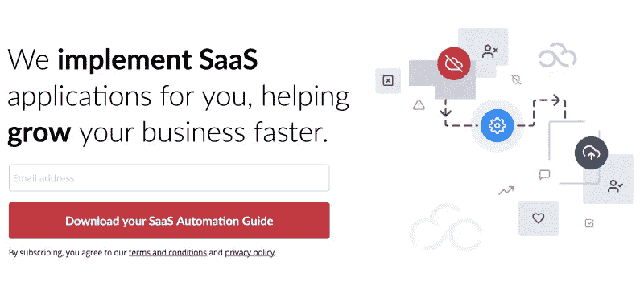

# 针对人类和 SaaS 用户的 GDPR 合规清单

> 原文：<https://medium.com/swlh/gdpr-compliance-checklist-for-human-beings-and-saas-users-53f2c5dc16e6>

*无免责声明*

*我们读了太多关于 GDPR 的理论指南，告诉我们写的可能不是真的。以下清单反映了我们对正确实施 GDPR 协议的看法。然而，我们已经付出了额外的努力来获得法律办公室对特定实现元素的意见。*

因此，让我们开始研究 GDPR 实施的实际方面吧！

# 首先，GDPR 到底是什么？

[通用数据保护条例](https://whatis.techtarget.com/definition/General-Data-Protection-Regulation-GDPR)是一项立法，于 2018 年 5 月 25 日生效。它与收集、存储和处理您的客户、供应商或任何其他业务合作伙伴的个人信息有关。

## 在实践中意味着什么？

这意味着自 2018 年 5 月 25 日起，您可能需要对您的组织处理个人信息的方式进行一些更改。这些包括例如收集的电子邮件地址、姓名、地址或电话号码。

这是否意味着我将不得不删除我已经存储的客户的任何个人信息？不，你只需要采取一些额外的措施，使你如何存储和使用这些数据更加透明。

## 这是否意味着我再也不能收集和存储任何个人信息了？

不，你仍然可以收集客户的数据，你只需要在存储数据的方式上更加透明。

## 我应该害怕 GDPR 吗？

如果你想忽略它，你可能应该。罚金可能高达 2000 万欧元或全球公司收入的 4%，这取决于哪一个更高。如果不忽略，就不要太担心。在中小型企业中实施并不困难。

## 实施 GDPR 需要多长时间？

这在很大程度上取决于您的组织的大小和规模，以及您已经处理数据的方式。我们将研究下面的具体步骤。

## GDPR 也适用于离线存储的数据吗？

是的，如果您离线存储数据(例如在纸质卡片上)，您还需要采取额外的措施来确保数据处理的安全性。

## 我需要签署任何书面协议来达到 GDPR 标准吗？

可能不会，大多数与确保你合规相关的协议都可以在网上签署。我们将在关于数据处理协议的第 5 节中讨论这个问题。

## 根据 GDPR，什么是个人信息？

以下清单与术语“[个人信息](https://www.eugdpr.org/gdpr-faqs.html)”有很大关系。但这到底意味着什么呢？对于 GDPR 标准，个人信息是:

*   名字
*   电子邮件地址
*   照片
*   电话
*   银行存款
*   社交媒体帖子
*   计算机 IP 地址
*   +与特定个人相关的任何其他可识别信息

因此，例如，如果您有每个客户的姓名、电子邮件地址和任何其他数据的列表，它将被视为个人信息。

另一方面，如果您有多少客户位于特定区域的统计数据，则不被视为个人信息。

## 有哪些活动是到目前为止常见的，但自 GDPR 实施以来将被禁止的？

> **律师评论**
> 
> “是的，例如在招聘过程中。如果您想要存储候选人的简历超过一个招聘期，例如，以后联系他们，您需要候选人的许可来存储指定的期限。否则，你需要从记录中删除简历。”przemysaw rogiński，[rdl&合伙人](http://www.roedl.net/pl/en/locations/gdansk.html?utm_source=picksaas)法律事务所

# GDPR 实施清单

在每个公司实施 GDPR 可能会有所不同。可能需要更多的步骤来确保您的公司符合所有要求的标准。然而，有几个步骤是非常明显和必要的。

我们询问了公司的创始人和代表们实施 GDPR 最困难的步骤。

根据 30 多个回答，建立更新的隐私政策已成为应用新标准的最大问题。然而，要知道隐私政策中需要修改的地方，您需要首先评估一些事情。这些与您在公司内处理数据的方式有关。

## 1.确定 GDPR 是否适用于您的组织。

GDPR 条例适用于以下实体:

*   在欧盟运营的组织/实体
*   在欧盟以外运营但收集欧盟公民相关数据的组织/实体

您的公司可能在欧盟之外运营，但从欧盟收集客户数据。然后，你应该安排一个人负责回答来自欧盟官员的联系。

*例如，让我们假设你的公司位于美国，但在欧盟有客户，并存储他们的个人信息。你应该在你的公司里指定一个人负责处理你的欧洲客户的数据，并在有任何问题时联系欧盟官员。*

## 2.确定自己是数据控制员还是数据处理员。

GDPR 法规根据您的实体类型实施不同的要求。这是什么意思？意味着你的组织既可以是所谓的“数据控制者”，也可以是“数据处理者”。

**谁是数据管理员？**

很可能是你的公司。[数据控制者](http://www.osborneclarke.com/insights/am-i-a-data-controller-or-a-data-processor-and-why-is-it-important-anyway/)是收集和管理/存储任何其他实体的个人数据的个人或公司。很可能，没有多少公司不收集任何个人信息。你的公司很可能是一个数据控制器。

> 数据控制器是一个电子商务商店，它收集客户的电子邮件地址、他们的姓名和地址。

**谁是数据处理器？**

还有一些公司和实体本身并不控制个人信息(并未直接从特定的人那里获得)。他们在业务活动中使用其他公司的数据，或者提供服务让其他公司处理他们客户的数据。

> 数据处理器是谷歌。它提供谷歌电子表格、谷歌文档或[谷歌分析](https://picksaas.com/analytical-tools/google-analytics?utm_source=blog&utm_campaign=GDPR)等服务来处理你的顾客/客户的数据。

## 3.创建您从客户/用户/访问者那里收集的数据列表。

您可以简单地设置电子表格，在其中列出您在业务中收集的数据类型，包括:

*   数据的来源
*   您与谁共享数据
*   目的
*   期间

在 picksaas 中，我们用上述信息建立了 Google 电子表格，并向公众开放。这有助于我们对用户尽可能透明，同时保持自己符合 GDPR 标准。

您可以在此处找到我们公开发布的电子表格:

[收集的数据列表，picksaas.com GDPR](https://docs.google.com/spreadsheets/d/1KAuQxe5unbszF5TAzPG0gBZ7AWbSIn3C1QRsPyZb2uI/edit?usp=sharing)

## 4.为你的数据库创建一个谷歌电子表格列表，包括数据如何在它们之间流动的信息。

与上一点类似，您可以建立一个 Google 电子表格，在其中列出您存储客户数据的所有位置。

在 picksaas 中，我们还创建了额外的选项卡，详细描述了我们存储客户数据和任何其他个人信息的位置。

## 5.创建一份您使用的任何数据处理器(SaaS 软件)的清单，并与他们签署一份数据处理协议。

但是让我们慢下来，先简短地解释一下定义。

> **什么是 SaaS？**
> 
> SaaS(软件即服务)是任何管理你业务的在线工具，如谷歌文档、 [Slack](https://picksaas.com/communication-tools/slack?utm_source=blog&utm_campaign=GDRP) 或 [LiveChat](https://picksaas.com/live-chats/livechat?utm_source=blog&utm_campaign=GDRP) 。

你应该写下你使用的 SaaS 产品的清单。想想他们中的哪些人存储了你或你的客户的个人信息(换句话说，他们中的哪些人是数据处理者——见第二点)。

> **什么是 DPA(数据处理协议)？** DPA 是规定数据处理器处理数据的条款的文件。

您已经准备好了应用程序、软件和应用程序的列表。现在你需要问问自己，以上哪一个处理你控制的数据。

在实践中意味着什么？这意味着，例如，如果我们使用 [Salesflare](https://picksaas.com/crm/salesflare?utm_source=blog&utm_campaign=GDRP) 来存储我们客户的个人信息(参见“什么是 GDPR 所说的个人信息”)，Salesflare 就是我们的数据处理器(它处理我们客户的数据，并以一种良好、可管理的形式引导和显示给我们)。因此，我们需要联系 Salesflare，与他们签署 DPA。类似地，我们已经对我们使用的所有其他应用程序进行了测试，如 [Pipedrive](https://picksaas.com/crm/pipedrive?utm_source=blog&utm_campaign=GDRP) 、 [Hotjar](https://picksaas.com/analytical-tools/hotjar?utm_source=blog&utm_campaign=GDRP) 或 [MailChimp](https://picksaas.com/mailing-automation/mailchimp?utm_source=blog&utm_campaign=GDRP) 。

**如何签署 DPA 协议？** 可以使用法律认可的签名系统以电子方式签署 DPA 协议。大多数 SaaS 提供商支持此选项，因此无需来回发送纸质文档。然而，在本文发表之日，其中一些网站只提供了。pdf 文件可供下载，带有打印签名。这意味着可能需要下载 DPA，并将签名的纸质副本保存在您的存储中。签署《和平协议》的方式取决于公司。有时，SaaS 公司在其隐私政策中“嵌入”DPA，因此签署隐私政策就等于签署 DPA 协议。

这是我们从 [Pipedrive](https://picksaas.com/crm/pipedrive?utm_source=blog&utm_campaign=GDPR) 收到的电子邮件:

> “根据《GDPR》第 28 条，控制器和处理器之间的关系需要以书面形式作出(根据同一条第(9)款，电子形式是可以接受的)。这就是我们的服务条款和隐私政策的由来。这两份文件也作为您的数据处理合同，规定了您在处理您控制的个人数据方面给予 Pipedrive 的指示，并确立了双方的权利和责任。”

这表明他们的数据处理协议已经包含在他们的隐私政策中。

> **律师评论**
> 
> “即使我们的业务合作伙伴只能临时访问个人信息，您仍应签署 DPA 协议。确保处理方采取适当措施确保数据安全。”przemysaw rogiński，[rdl&合伙人](http://www.roedl.net/pl/en/locations/gdansk.html?utm_source=picksaas)法律事务所

所以，从法律上来说，你应该有一个签署了 DPA 的 SaaS。然而，实际上，在 5 月 25 日之前，很可能不是所有的 SaaS 公司都会准备好 DPA。随着越来越多的公司意识到 GDPR 规则的重要性，这个问题可能会逐渐得到解决。

> 如果你是一个数据处理器，你还需要确保，你与所有的子处理器有适当的 DPA 协议。

**如果 SaaS 提供商的物理服务器位于欧盟以外，我可以使用他们的服务吗？** 实际上，您不应该使用服务提供商，他们将数据存储在欧盟以外的物理服务器上[，除非满足特定条件](https://www.storminternet.co.uk/blog/Why-you-should-care-where-your-data-is-stored/471)(充足性、授权合同关系等。).

在实践中意味着什么？SaaS 服务提供商使用额外数据处理器(子处理器)的云服务。他们可能会让您选择存储数据的位置。在法律上，最好的安全选择是联系您的每个服务提供商，以确保您的数据存储在欧盟境内的位置。

## 6.更新您的隐私政策

最有可能的是，你已经有一个隐私政策，所以你需要做的是添加与 GDPR 相关的具体点。您应该将以下元素添加到您的隐私策略中:

*   您如何收集个人数据
*   你如何使用收集的数据
*   列出与您共享数据的任何一方
*   用户在想要访问或删除个人信息时可以联系的电子邮件地址
*   您的数据保护专员的电子邮件地址(参见第 8 点)

在您的新隐私政策中，您需要尽可能透明地处理数据。列出你存储用户数据的所有地方。让你的访问者知道如何联系你的公司来删除或更改他们的信息。这将确保您的用户可以执行与 GDPR 相关的所有权利。

> **律师意见** “GDPR 没有规定需要更新文档/隐私政策的特定元素。需要改变的内容因人而异，所以关键问题是处理数据的方式要尽可能透明。”przemysaw rogiński，[rdl&合伙人](http://www.roedl.net/pl/en/locations/gdansk.html?utm_source=picksaas)法律事务所

## 7.更新您的 cookie 策略

除了您使用的 cookie 类型的信息之外，您还需要包括在您的网站上使用 cookie 的原因的信息。

例如，您可以将下面一行添加到您的 cookie 策略中，就像在[啄木鸟的](https://picksaas.com/cold-mailing/woodpecker?utm_source=blog&utm_campaign=GDRP) cookie 策略中一样:

> "我们使用 cookies 为您提供最佳浏览体验、网站流量分析和有针对性的广告管理."

## 8.雇用/指派数据保护官

您应该在您的公司内指定负责维护任何 GDPR 标准的人员。此人应该:

*   了解 GDPR 标准和公司内部的数据流程
*   在出现任何请求或数据泄露时，作为负责与当局联系的人员

这个人不一定非得是律师。应该有人知道公司内部与数据流相关的流程。他/她应该是当局或用户报告个人信息问题的最终联系人。最好的选择是指派一个对公司运营有丰富知识的人，例如首席运营官(首席运营官)。

# 9.给你的员工和决策者发一封电子邮件，告诉他们你如何称呼 GDPR

遵守 GDPR 的要素之一是确保您的团队了解您处理个人信息的方式。

如果你是一家小公司，组织一次小型聚会可能是明智的。让您指定的数据保护官解释数据在您公司内部是如何流动的。如果你是一名数据处理员，强烈建议为你的员工组织培训课程。解决与个人信息处理相关的任何问题。

比方说，你有一个相互合作的支持和销售团队。通常，他们会使用一些工具互相交流，比如 Slack。但是您的团队可能会在他们自己的笔记中手动记下电子邮件地址。您需要确保这些数据不会在某个地方存储很长时间，并向您的员工展示使用哪些工具来保存所有个人信息。

尽管如此，在受到控制的情况下，保护自己的最好方法是给所有员工发一封电子邮件。告诉他们谁是数据保护官，并附上您想要的任何信息

> **律师评论** “在公司内部实施任何流程，最重要的因素是确保数据处理对象的合法权利得到执行。这些权利包括访问数据以及从任何记录中修改或删除数据的权利。”przemysaw rogiński，[rdl&合伙人](http://www.roedl.net/pl/en/locations/gdansk.html?utm_source=picksaas)法律事务所

# 10.确保技术安全是最新的

如果你是一家科技公司(如 SaaS)，你最好确保你的产品在技术上是安全的，因为如果你没有应用适当的 GDPR 合规标准，任何数据泄露都可能导致巨额罚款。你需要采取的步骤很大程度上取决于每家公司，但最重要的是要确保你的软件中没有任何重大漏洞，这些漏洞会使你的数据容易泄露。你可以随时使用这个列表作为参考。

> *“顺从 GDPR 不仅是一种义务。这也是一个重温文档、赶上现代潮流的绝佳机会。”Justyna，*[*LiveChat Inc .*](https://www.livechatinc.com/blog/what-is-gdpr-compliance/?utm_source=picksaas)*。*

如果你是一家技术公司，你还需要分析你业务的具体技术方面。产品可能需要修改以确保符合性。例如，Hotjar 不得不[对产品特性](https://www.hotjar.com/legal/compliance/gdpr-commitment)进行大量修改，以确保其分析工具特性符合新标准。

# 11.为请求访问其数据的用户创建响应方案

根据新的 GDPR 标准，您的用户、客户和合作伙伴始终可以:

*   要求提供有关他们存储的数据的信息，以便交付给他们或任何第三方
*   在你的数据库中更新他们的个人资料
*   从你的数据库中删除他们的个人数据
*   希望你停止处理数据

你可能会收到很多人的请求，他们不希望信息存储在你的公司里(尤其是在 GDPR 到位的早期)。明智的做法是建立一个与这些变化相关的沟通流程。

例如，你可以建立一个表单，用户可以在这里提交任何删除数据库中数据的请求。然后，您可以将这些数据自动发送到 [*周一*](https://picksaas.com/project-management/monday.com?utm_source=blog&utm_campaign=GDRP) *项目管理应用程序，然后您的数据保护官可以轻松处理这些数据。或者，你可以用一个* [*GDPR 形式的*](https://www.gdprform.io/?utm_source=picksaas) *方案。*

# 12.在任何数据收集表单下添加“接受”公式

你需要确保访问者接受你更新的隐私政策。一旦他/她订阅了你的邮件列表或者在你的网站上留下了任何个人信息，这种情况就会发生。

> 例如，在您网站上的电子邮件订阅表格下方添加以下公式:“订阅即表示您同意加入我们的邮件列表并遵守我们的隐私政策”。

例如，在 picksaas，我们必须在几个地方实施上述公式，以符合 GDPR 标准。

*Agreement to share data with SaaS vendor in the “Offer request” section*

*Agreement to the privacy policy and terms and conditions on our landing page*

此外，在 GDPR 下，不再可能默认设置任何复选框为“勾选”。确保你不再使用这种“增长黑客”。

此外，如果你在做任何电子邮件营销活动，你应该确保你的用户可以很容易地取消订阅你的邮件。然而，这可能是你已经在电子邮件软件中设置好的。

## 13.在公司内部设置流程，确保您可以行使用户的权利

在实践中意味着什么？你可以问自己以下问题:

*   当有人请求访问他/她的信息时会发生什么？
*   当有人请求删除他/她的数据时会发生什么？
*   如果我的公司发生数据泄露，有人获取了我客户的个人信息，会发生什么情况？

你应该在一个可访问的文档中列出所有上述情况下将要发生的事件。例如，删除数据的请求->转发给数据保护官的电子邮件->数据保护官确保数据从所有数据库中删除，如 [Salesflare](https://picksaas.com/crm/salesflare?utm_source=blog&utm_campaign=GDRP) 、[周一](https://picksaas.com/project-management/monday.com?utm_source=blog&utm_campaign=GDRP)、 [MailChimp](https://picksaas.com/mailing-automation/mailchimp?utm_source=blog&utm_campaign=GDRP) 等。

此外，在新规则下，如果发生任何数据泄露，您有 24 小时的时间向欧洲官员报告，因此确保上述过程快速高效非常重要。

## 14.如果你不需要存储个人数据，那就删除它

根据 GDPR 的说法，如果没有特定的理由，你不应该存储任何个人信息。因此，例如，如果你的文档中隐藏了一些旧的电子邮件列表，就删除它。毕竟，如果你已经很多年没用了，为什么现在还要用呢？

此外，您可以确保定期从任何数据处理器的数据库中删除客户的数据。例如，您可以要求您的[实时聊天](https://picksaas.com/live-chats?utm_source=blog&utm_campaign=GDPR)提供商每月删除一次您的所有聊天数据。

# 实施 GPDR 晚了？

有很多关于 GDPR 的噪音和恐慌。这是完全合理的，你应该尽你所能尽快变得顺从。然而，GDPR 最重要的是对你的客户和商业伙伴保持透明、公平和严肃。

确保您的数据安全，并确保您认真对待任何客户的请求。此外，在你的网站上实现一些必要的文档修改。然后，GDPR 可能不会伤害你的生意。

> **律师对已发布的类似** [**GDPR 追踪器**](https://gdprtracker.co.uk/?utm_source=picksaas) **或**[**ecomply . io**](https://ecomply.io/?utm_source=picksaas)的“GDPR 支持应用”的评论
> 
> “在 GDPR，最重要的事情是确保用户执行正确的数据处理权限。在这个过程中，任何工具都可能很有帮助，但它们不能完全取代法律办公室的参与。”przemysaw rogiński，[rdl&合伙人](http://www.roedl.net/pl/en/locations/gdansk.html?utm_source=picksaas)法律事务所

附加信息:这篇文章将会随着我们发现的关于 GDPR 的任何新问题而更新。您可以 [*订阅*](https://picksaas.us16.list-manage.com/subscribe/post?u=0a811ad254e7cd14718599e3a&id=bdf0cfd955) *来了解最新版本以及我们关于 SaaS 软件的每周更新。*

*在*[*picksaas.com*](https://picksaas.com/?utm_source=blog&utm_campaign=GDPR)*，我们帮助您找到 SaaS 软件来发展您的业务。*

*我们发现、研究和分析 SaaS 应用。与我们聊天，询问最好的软件应用。*

*与我们一起在* [*为您的销售、营销和项目管理实施自动化 SaaS 解决方案*](https://picksaas.com/saas-application-implementation/?utm_source=blog&utm_campaign=GDPR) *。*

*原载于*[*picksaas.com*](https://picksaas.com/blog/gdpr-compliance-checklist)*。*

## 这个故事发表在 [The Startup](https://medium.com/swlh) 上，这是 Medium 最大的创业刊物，拥有 327，829+人关注。

## 在这里订阅接收[我们的头条新闻](http://growthsupply.com/the-startup-newsletter/)。

