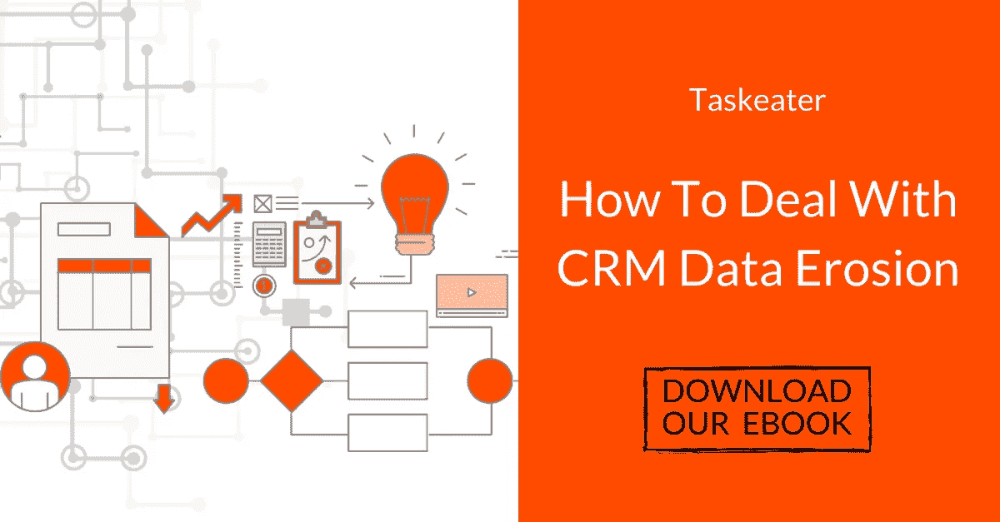
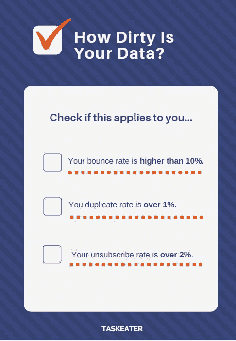

# GDPR 头疼的问题:如何保持你的数据库干净和合规

> 原文：<https://medium.com/swlh/gdpr-headache-how-to-keep-your-database-clean-and-compliant-8b68d7ffe3ee>

**现在，GDPR 在欧洲全面实施，不准确和定期地处理您的数据是一个代价高昂的错误…我们编制了一些实用和可行的步骤，您可以遵循这些步骤来保持您的数据库整洁和合规，而无需您的团队付出巨大的代价或进行巨大的调整。**

* * * *如果你仍然不明白什么是 CRM 清理，或者为什么你需要一个-我们在这里浏览一些关键术语。****

如果你不主动清理和更新你的数据[仅仅一年后，你 70%的数据库](https://www.taskeater.com/insights/crm-maintenance-cleansing-dirty-data/)就可能不准确——所以你积极投资清理和后期清理是至关重要的。

Taskeater 与 400 多家公司合作过，包括帮助客户清理他们的 CRM 数据库、有效的数据输入和数据发现。谈到数据库最佳实践，我们有全面的经验。因此，我们编辑了一些文章来讨论存储数据的注意事项——关注未来的文章。注册[我们的 Lead Generation Insights 时事通讯。](https://www.taskeater.com/newsletter-subscription/)

**我们在电子书中更全面地介绍了数据流失和 CRM 维护:** [**如何应对 CRM 数据流失**](https://www.taskeater.com/downloads/crm-cleanse-database-guide/)

# 为什么 CRM 维护很重要

除了成本之外，定期清理您的 CRM 数据库还有明显的好处，我们在上一篇 CRM 文章中更详细地介绍了这一点— [触发事件销售:如何利用 CRM 清理产生新业务](https://www.taskeater.com/insights/trigger-event-selling-crm-cleansing/)
——但是现在 GDPR 可以强制执行了，公司主要关心的是如何保持他们的数据库合规。

选择加入和同意——你如何获得联系人的电子邮件地址——只是合规性要求的一小部分。您需要主动清理数据库中的过期联系人，并准确标记您的销售线索的获取方式和获取日期，以符合新法规规定的标准。

CRM 清理将有助于保持您的数据符合新的一般数据保护法规(GDPR)。您的数据必须是准确的、最新的，并且只应在必要时保留—定期清理将有助于所有方面。

# 不确定你需要 CRM 净化？

请阅读我们的 CRM 清理系列的第一篇文章，看看您是否需要清理您的 CRM — [CRM 维护 101:您的数据有多脏？](https://www.taskeater.com/insights/crm-maintenance-cleansing-dirty-data/)

或者，如果您想直接跳到我们的速战速决清单，请参见以下内容:

**在我们的电子书中，我们更全面地介绍了整个 CRM 清理过程:** [**如何应对 CRM 数据侵蚀**](https://www.taskeater.com/downloads/crm-cleanse-database-guide/)

# 后 CRM 清理最佳实践，以保持您的数据干净

您应该采用一些最佳实践来保持数据整洁，并确保您的系统尽可能高效地运行。

*   **保持您的联系信息准确无误。你需要定期核实联系信息并保持更新，所以输入新数据时要小心。对数据库进行健康检查，看看有多少条目是不准确和过时的。**
*   开发并遵循**一个适合您业务的数据标准化流程**—阐明数据应该如何输入到您的 CRM 中。这将加强一个有组织和一致的环境，输入数据到您的客户关系管理，并防止人为错误。
*   **不要保留已退订的潜在客户的联系方式。**一旦他们取消订阅，就应该将其从您的 CRM 中完全删除。
*   **标记 CRM 中数据的来源。**你所有的数据都应该有一个标记源，记录你从哪里得到这些数据以及你拥有这些数据有多长时间了。这也有助于顺从。
*   **将销售线索存储在 CRM 中时，记录它们处于哪个阶段。**这将有助于您根据销售渠道中的阶段定制您的信息，并帮助您跟踪您存储了哪些信息。这意味着您知道删除不再有用的内容，从而节省存储空间并确保符合法规要求。
*   **只收集商务邮件地址。检查你的数据库，看看是否所有的电子邮件地址都是公司的。公司邮件通常针对公司，而不是个人地址(hotmail.co.uk 或 gmail.com)。**
*   最后但同样重要的是，定期进行健康检查。你需要定期检查你的数据是否是最新的和干净的。你拖得越久，工作就会越多！

# Taskeater 如何帮助你？

Taskeater 为全球各种规模的 B2B 公司提供 CRM 清理和数据发现服务。我们保证完全保密和安全——我们处理的任何数据都不会存储在中央数据库中，也不会出售。我们**会删除您不再需要的潜在客户，并代之以有效的联系人**，提供准确的联系信息。我们还通过标记您的数据源以及用公司数据替换个人数据来帮助您符合 **GDPR 标准**。[请点击此处联系我们，向我们的专家咨询。](https://www.taskeater.com/contact-us/)

如果您错过了本系列的前几篇文章:

*   **触发事件销售:如何利用 CRM 清洗产生新业务—** [**点击此处**](https://www.taskeater.com/insights/trigger-event-selling-crm-cleansing/)
*   **CRM 维护 101:你的数据有多脏？—** [**点击此处**](https://www.taskeater.com/insights/crm-maintenance-cleansing-dirty-data/)

如果你喜欢我们的文章或者觉得它很有趣，请一定要鼓掌并分享！您的支持意义重大:)

订阅我们的时事通讯，在我们的社交网络上关注我们，了解我们最新的见解。

## 这个故事发表在 [The Startup](https://medium.com/swlh) 上，这是 Medium 最大的企业家出版物，拥有 356，974+人。

## 在这里订阅接收[我们的头条新闻](http://growthsupply.com/the-startup-newsletter/)。

