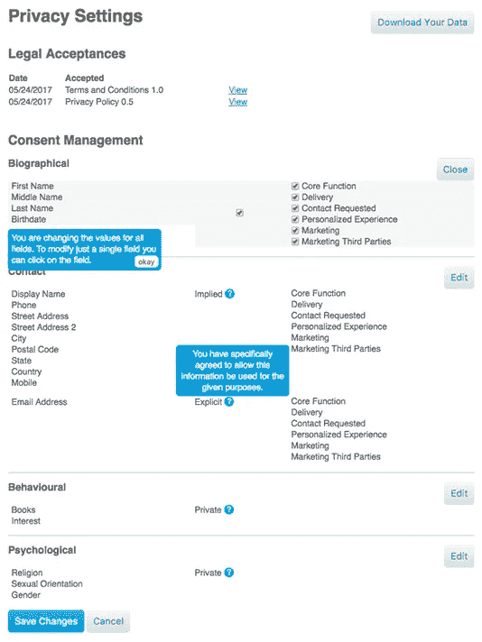

# GDPR:技术在数据合规性中的作用

> 原文：<https://medium.com/swlh/gdpr-the-role-of-technology-in-data-compliance-f254c9139d56>

**随着《欧盟通用数据保护条例》(欧盟 GDPR)于 2018 年 5 月 25 日全面生效，全球企业的合规工作将成为责任。超过 90%的美国企业认为这是他们未来一年的首要数据安全问题，技术将是他们遵守新规则的决定性因素。**

自 2016 年首次采用以来，GDPR 在品牌的待办事项列表中日益凸显。我们正处于为期两年的实施阶段，2018 年 5 月是非常严格的最后期限。

GDPR 旨在对 1995 年的数据保护指令进行彻底改革，试图让个人重新控制自己的个人信息。重点是数据处理器和数据控制器，以统一他们掌握的欧盟公民的数据，这是一项具有挑战性的任务，因为我们的许多技术都没有以数据安全为核心。

简而言之，鉴于现代数据生态系统的复杂性，对于许多全球企业来说，合规性将是一项不小的壮举。

然而，这是没有商量余地的，违规者将被处以全球年收入的 4%或 2300 万美元(以金额较大者为准)的罚款。在这个隐私和消费者信任至关重要的时代，对不守规矩的公司来说，更具破坏性的可能是对品牌声誉的影响。

对于**所有在欧盟市场内经营(或有一天渴望经营)的企业来说，这是一个紧迫的话题**——包括英国，在后英国退出欧盟时代，英国仍将处于 GDPR 的保护伞之下。任何持有欧盟公民个人数据的组织都需要遵守新规定。

Pixabay

可以理解的是，许多美国公司也将此视为头等大事。

事实上，根据最近[普华永道的调查，92%的美国跨国公司](https://www.pwc.com/us/en/press-releases/2017/pwc-gdpr-compliance-press-release.html)将 GDPR 视为未来 12 个月的首要数据安全问题。77%的受访者计划在 GDPR 合规工作上花费超过 100 万美元，只有不到 10%的人准备花费 1000 万美元或更多。

将 GDPR 与技术分开是不可能的。从数据采购到数据安全，再到欧盟试图揭露任何违规行为，这两者在整个过程的每个阶段都纠缠在一起。

技术引领我们走到这一步，它将成为接下来的核心。然而，这并不是欧洲联盟的新的当务之急。虽然在某些方面这被视为欧盟对许多全球企业贪婪的数据收集的专横回应，但关于技术和个人权利之间关系的讨论可以追溯到 20 世纪 60 年代的欧洲。

GDPR 只是这些担忧的现代表现。

这些规定以典型的平铺直叙的语言写成，明确了必须达到的标准，但对于如何评判企业以及这些规定将如何实施，仍有一些人感到惊愕。

因此，我们应该将技术视为透明度和合规性的促进因素，如果有效使用的话；或者在不小心使用时成为进步的巨大障碍。

随着如此多的国际企业花费大量资金来整顿自己的公司，一个新的技术市场已经开始发展。软件提供商正在推出新产品，以帮助国际企业进行合规工作，并验证他们的进展。

# 使用技术审计个人数据

许多组织面临的一个紧迫问题是，他们根本不知道自己拥有哪些个人数据，也不知道这些数据都存放在哪里。

引人注目的是，只有 [33%](https://www.ca.com/content/dam/ca/us/files/infographic/are-you-ready-for-the-eu-gdpr.pdf) 的组织有信心能够迅速识别他们掌握的每个人的所有数据。

一些人使用术语个人身份信息(PII)来理解 GDPR 所涵盖的内容，但这并不能说明全部情况。

PII 通常与出生日期或社会保险号等信息有关；然而，GDPR 还包括由第三方 cookies 捕获的行为数据，例如一个人访问了哪些网站。

无论一个公司使用多少种不同的数据库技术，如果要审计它所负责的数据，它都必须将这些技术整合到一个无缝的清单中。

如果我们要抓住这个问题的核心，理解数据控制器和数据处理器的不同作用是很重要的。

*   **数据控制者:**《GDPR》第 4 条将数据控制者定义为“单独或与他人共同决定处理个人数据的目的和方式的机构”
*   **数据处理器:**数据处理器代表控制器服务数据。GDPR 大大增加了他们的责任，这是有限的数据保护指令。这将影响基于云的存储解决方案，到目前为止，这些解决方案一直占据着信息公正处理者的地位。

因此，数据控制者通常是向欧盟公民出售产品或服务的品牌，而数据处理器则是存储或使用数据来帮助控制者的第三方。

技术将在获得公司所需的每个客户的单一视图方面发挥关键作用。

一些新的解决方案已经进入市场。

例如，CA Technologies 提供了一个[测试数据管理器](https://www.ca.com/gb/products/ca-test-data-manager.html)产品，可以帮助组织将他们的数据资产链接在一起，并根据个人对它们进行分类。这是一项困难且不可否认的乏味任务，但它在未来应该会有回报。组织需要证明他们在哪里保存每个欧盟公民的数据以及他们拥有的数据类型，以便每个人都可以请求从他们的记录中导出或删除这些信息。

这些数据还必须是结构化的，以便个人可以请求信息，并以清晰易懂的方式发送给他们。

例如，“数据请求者 Jane Roe 与地址 123 Bellevue Street，Baltimore 我们的侧写技术将她归类为人口统计 ABC1 她从事金融工作，已婚。”

这需要复杂的数据管理，能够识别、争论和监控每个人的相关信息。

品牌也应该审核他们的数据处理器列表，以了解他们的 GDPR 合规水平。这些技术提供商将成为密切关注的对象，其中主要是一些美国的广告技术提供商。

# 利用技术收集个人数据

公司需要获得网站访问者的明确同意才能获取他们的数据。这意味着需要向个人提供该网站想要收集的数据类型的列表，他们必须主动选择他们想要选择的选项。恼人的弹出窗口要求消费者点击以换取一连串敏感信息来源的日子将很快成为过去。

这当然刺激了对新技术的需求，以帮助品牌符合 GDPR 的严格排列。Janrain 推出了一款[同意生命周期管理](http://www.janrain.com/resources/data-sheets/consent-lifecycle-management/)工具来实现这一目标。

它允许品牌创建同意书，明确要求消费者选择一系列预定义的领域:

然后，该工具会存储这些数据，让消费者能够轻松控制他们希望向公司提供的洞察力水平:

尽管如果用户希望在一系列个人网站上进行更改，这可能会很麻烦，但我们应该期待未来的技术能够简化这一过程。就目前而言，这至少为那些希望确保他们提出正确问题并以合规的方式获得消费者同意的组织提供了一些思路。美国公司 Evidon 推出了类似的解决方案来简化品牌和消费者的同意程序。

还值得注意的是，GDPR 会影响第三方 cookiess，这些 cookie 通常是在未经消费者明确同意的情况下收集的。这可能会给受影响的网站带来一些真正的挑战，因为他们需要首先了解他们庞大的数据池，然后获得他们所依赖的行为数据的同意。

根据最近为欧盟委员会进行的研究，2016 年欧盟货币化数据市场价值 595 亿€。如果这个行业要从 2018 年开始蓬勃发展，就需要找到新问题的新解决方案。否则，这也可能影响全球众多品牌的广告策略，谷歌、脸书和亚马逊是最有可能的受益者。

# 使用技术保护个人数据

GDPR 明确表示，品牌必须确保在数据泄露的情况下，不会获得任何可用的消费者数据。这意味着品牌必须对每个消费者的数据有一个单一的视图，并且他们必须完全保护数据，以确保数据不会被窃取和在其他地方使用。

下图显示了过去十年中美国数据泄露数量的上升，因此可以有把握地推测这将影响大量总部位于美国的跨国公司:

[Source](https://www.statista.com/statistics/273550/data-breaches-recorded-in-the-united-states-by-number-of-breaches-and-records-exposed/)

当然，这看起来像是一系列艰巨的任务——尤其是对大公司而言。《GDPR》特别提到了数据保护官(DPO)的角色，这是公司内一个非常具体的职位，以满足这个新时代的需求。

即使在公司指定了 DPO 的情况下，他们仍然需要技术的帮助来加密客户数据并监控他们对 GDPR 的进展。SAS 响应了这一需求，推出了新的 GDPR 专用仪表板(截图如下),显示规定的所有合规领域，以及公司在相关指标方面的进展。这突出了跨数据库的高性能或低性能区域，对于正在努力应对新法律带来的挑战的组织来说，这将是一个非常受欢迎的解决方案。

许多公司已经开始建立自动违规警报，这将使任何潜在问题立即引起他们的注意。考虑到跟踪如此广泛且不断变化的数据点的难度，我们应该会在未来几个月看到更多的技术提供商进入这一领域。

# 关键要点

在每一个关键时刻，我们都应该考虑到大多数现代技术的设计都没有将数据隐私问题作为核心。在竞争优势的竞争中，大多数技术都将数据捕获置于数据安全之上。然而，GDPR 为获得这一优势开辟了新的途径。

通过将监管视为与消费者建立信任并提高我们数据透明度的平台，前瞻性企业有机会开创一个让消费者受益的数据驱动营销新时代。

这从使用技术评估以下四个方面开始:

*   **审计:**清楚地了解您所有数据的存放位置，并将这些信息整合到每个客户的单一视图中。
*   **捕获:**使用一个平台来帮助标准化您的同意书，并以合规的方式捕获随后的数据。
*   **流程:**对敏感信息进行加密，确保在发生数据泄露时，没有有用的数据被窃取。
*   **监控:**利用一个仪表盘来监控你的进度，并设置自动提醒，这样你就可以在出现问题时迅速采取行动。

*最初发表于*[*www.clickz.com*](https://www.clickz.com/gdpr-the-role-of-technology-in-data-compliance/113865/)*。*

## 这个故事发表在 [The Startup](https://medium.com/swlh) 上，这是 Medium 最大的企业家出版物，拥有 292，582+人。

## 在这里订阅接收[我们的头条新闻](http://growthsupply.com/the-startup-newsletter/)。

