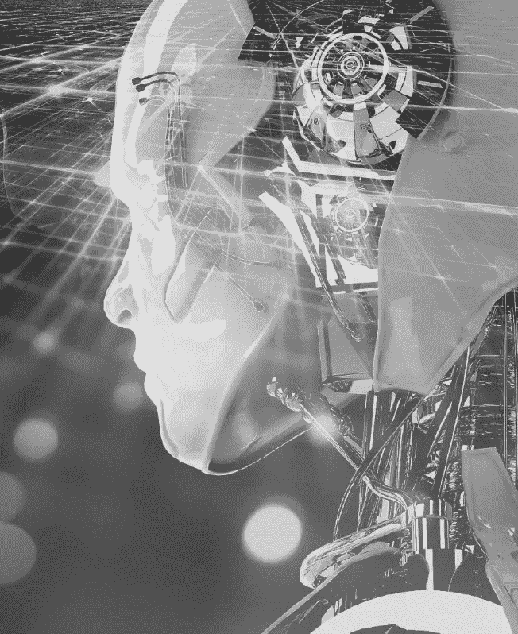
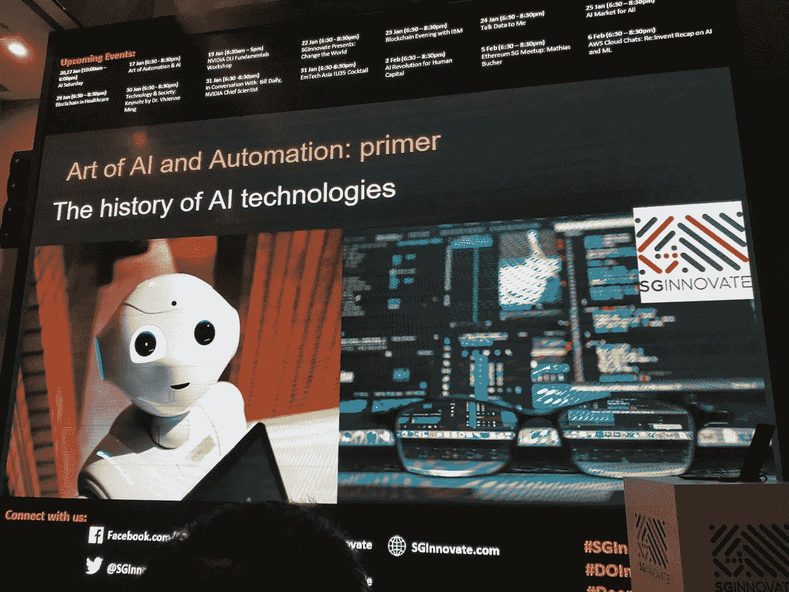
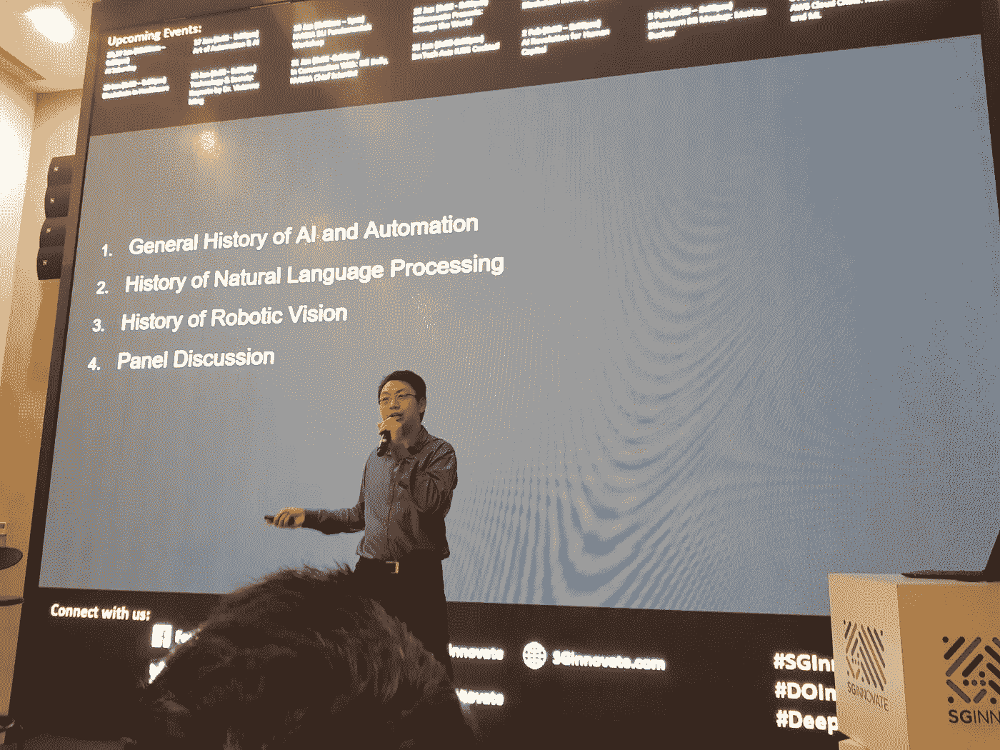
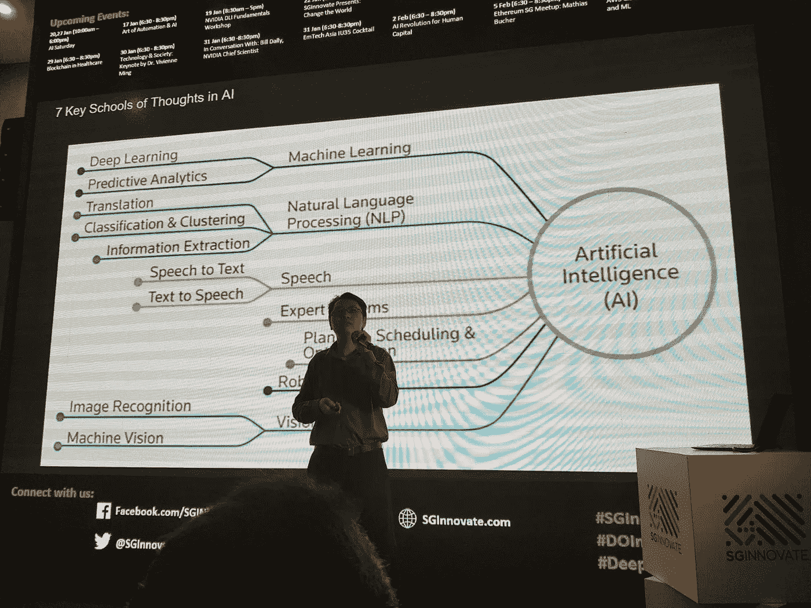
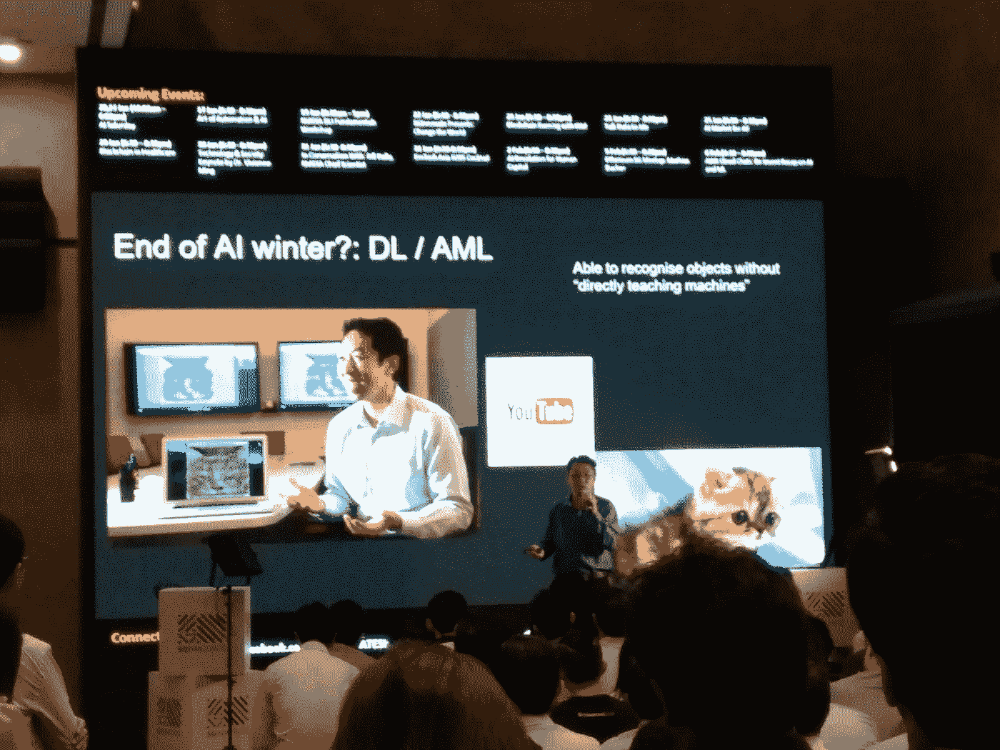

# 通史:人工智能和自动化的艺术

> 原文：<https://medium.com/swlh/general-history-art-of-ai-and-automation-22905a308dc>

Art of Automation and AI

# 介绍

嗨，我叫安德鲁。在接下来的半个小时里，我们要做的是解释世界上发生的技术转变，尤其是在新加坡。近年来，新加坡一直在投资一些举措，以成为人工智能技术中心。

所以在这么短的时间内，移动和云已经成为两个主导平台的转变，为全球社会和其他国家创造了大量的机会。现在就在我们说话的时候，人工智能正在主导所有科技巨头公司的议程。而且他们是硅谷内外最重要的公司。看看谷歌的桑德尔·皮帅和脸书的马克·扎克伯格，这些首席执行官都说人工智能是我们工作的核心。AI 正在指导我们的 R&D 议程。

这是一个我们从未听说过的新事物吗？

因此，事实证明，人类一直梦想着制造出行为像人类或展示人类智慧的机器。古老的中国文明一直试图创造像自动机或自主工具一样运行的机制。在科幻小说中，我们有弗兰肯斯坦电影和最近的星球大战电影等等。所有这些都助长了人类的冲动，也许我们可以创造出行为像人类的东西。

那是因为公众不明白什么是人工智能。AI 是怎么入门的？

那么什么是人工智能呢？人工智能基本上是当机器或应用程序展示或模仿人类行为或人类智能时所展示的一门学科。

那么，如果人工智能的行为像人类的思维一样，那么我们应该如何看待人工智能？

像仆人一样，我们人类的头脑可以帮助我们，互相帮助。或者，当我们屈服于邪恶的想法和粗心的决定时，我们人类的思想也会毁灭我们，这些想法和决定是我们没有深思熟虑过的。

这也引起了挪威历史学家和政治学家克里斯蒂安·劳斯·朗格的共鸣。1921 年，兰格与 T2·哈尔马·布兰廷分享了诺贝尔和平奖。他认为技术是有用的仆人，但也是危险的主人。

著名的加纳谚语提到奴隶不能选择他的主人。正因为如此，我们需要学习如何掌握人工智能。那么如何才能掌握 AI 呢？如果我们没有集体的责任来分享这些知识并讨论它，会发生什么？

亨利·威尔逊·艾伦是 50 多部小说的作者，五次获得美国 T2 西部作家奖的刺激奖，也是李维·史特劳斯终身成就奖的获得者，他认为知识应该被分享，这样人类才能更好地控制自己的命运。所以他说:保守秘密，它就是你的奴隶。告诉它，它就是你的主人。同样，我在这里尽可能简单地解释人工智能的历史和什么是人工智能，这样我们就有希望成为它的主人。

我们认为人工智能在最近和不久的将来会对我们的日常生活产生深远的影响。然而与此同时，我的许多朋友和公众对什么是人工智能以及人工智能的历史一无所知。

通过了解人工智能的历史，我们理解了人工智能的含义，最重要的是不担心人工智能的影响，因为我们通过了解人工智能的历史了解了人工智能的局限性。

# 7 个主要的思想流派

有 7 个主要的思想流派。让我快速描述一下这些思想流派的概况，然后我们用故事和历史来深入研究它们。

我们最常听到的是机器学习，这是一种使用数据来分析、解读模式、学习、预测和自动化任务的研究。在机器学习中，我们还有其他的，但主要的驱动力是深度学习和预测分析。

在你学会预测或学会自动化复杂的任务之前，你可能需要和机器说话，而机器需要理解你。这就是自然语言处理的内容。或者简称 NLP。

那么，如何将口头交流转化为数字信息呢？这就是语音到文本的翻译。另一条路呢？这就是文本到语音的翻译。

假设你有一个专家。你用机器学习、语音识别和自然语言处理来整理他们的思维过程和工作流程，你可能会得到一个像专家一样解决问题的专家系统。

那么无人驾驶汽车是专家系统吗？如果你加上规划，导航和优化。规划、导航和优化是人工智能的一个类别，它在一组约束条件下计算出不同路径和选项的可能性，以达到特定的目标。

现在，如果你把这些放进一个装有智能传感器的移动机器里，你就会得到机器人。如果你想要移动的无人机或能看见的机器人，你给他们视觉。这些是基本的核心思想流派。

当我和你们分享这些学科的故事时，请记住这张图片。

要了解历史，我们必须回到过去。目前有 3 个不同的故事，作为人工智能的关键历史章节被共同分享。规划和调度的历史，预测分析的历史和人工智能的现代史。

# 优化的历史

让我们从计划、调度和优化的历史开始。

1754 年，数学家约瑟夫·路易斯·拉格朗日发现了一种最大化和最小化泛函的方法。拉格朗日给莱昂哈德·欧拉写了几封信来描述他的结果。因此，拉格朗日创造了拉格朗日优化技术。由于这一创造，我们能够通过改变受各种约束的不同参数来找到函数的最大值或最小值。

虽然拉格朗日创造了拉格朗日优化，艾萨克牛顿开发了迭代方法，使我们能够计算一个一个单位的方法来达到这个答案。

牛顿的方法最早于 1685 年由[约翰·沃利斯](https://en.wikipedia.org/wiki/John_Wallis)在一本历史和实用的代数论文中发表。1690 年，[约瑟夫·拉弗森](https://en.wikipedia.org/wiki/Joseph_Raphson)在《分析普遍性》中发表了简化的描述。在 1740 年， [Thomas Simpson](https://en.wikipedia.org/wiki/Thomas_Simpson) 将牛顿法描述为使用微积分求解一般非线性方程的迭代方法，并指出牛顿法可以通过将梯度设置为零来用于求解优化问题。

然而，我们知道能够对这些方法进行计算编程是很重要的。把这些放进可编程算法的突破来自乔治·伯纳德·丹齐格，是一位美国科学家。他创造了这种方法，因为他正在寻找 70 个人对 70 份工作的最佳分配。测试所有排列以选择最佳分配所需的计算能力是巨大的；可能构型的数量超过了宇宙中粒子的数量。丹齐格创造了单纯形算法，为线性规划奠定了基础。线性规划背后的理论大大减少了必须检查的可能最优解的数量。

因此，概括地说，增量计算以达到目标的想法起源于 1685 年牛顿的帮助下，沿着拉格朗日在 1754 年构想优化的数学解决方案的道路。只是在 1947 年，Dantzig 开发了单纯形算法，奠定了线性规划的基础，然后我们才能将优化作为人工智能工具来应用。

现在让我们转向预测分析的历史。

# 预测分析的历史

当你想预测一件事的时候，你需要先从你的过去中得出一些推论，然后根据你的推论评估一个结果。例如，如果你注意到新加坡在过去的 365 天中有 200 天都在下雨，你很可能会预测明天下雨的几率超过 50%。为了达到这个预测，你要把新加坡和历史上下雨的概率联系起来。那么，我们如何让计算机推断出这样一种模式，然后根据这种模式做出预测呢？

原来早在 1859 年，查尔斯·达尔文写了《物种起源》，第一章是关于“驯化下的变异”。查理斯的表亲是当时的弗朗西斯·高尔顿，高尔顿用了他余生的大部分时间来探索人类群体的变异。因此，他建立了一个研究项目，涵盖了人类变异的多个方面，从精神特征到身高；从面部图像到指纹图案。这需要发明新的特征测量方法，利用这些测量方法设计大规模的数据收集，最终发现描述和理解数据的新统计技术。在检查了前臂和身高测量后，高尔顿在 1888 年独立地重新发现了[相关性](https://en.wikipedia.org/wiki/Correlation)的概念，并展示了它在遗传、人类学和心理学研究中的应用。高尔顿对姓氏灭绝概率的统计研究引出了[高尔顿-沃森随机过程](https://en.wikipedia.org/wiki/Galton%E2%80%93Watson_process)的概念。所有这些都为现代统计学和回归奠定了基础。那么，是谁将它们投入大规模应用，尤其是商业和经济应用呢？

结果，拉格纳·弗里希和简·丁伯根开始使用这些方法来解决经济问题。他们在 1969 年因为创造了计量经济学而获得了第一个诺贝尔经济学奖，计量经济学是一种使用统计和回归来解决商业和经济问题的研究。

所以这些发明家创造了技术和技术的应用。但是，那些创造了第一台统计计算机器的人呢？原来早期的统计计算硬件之一是由约翰·阿塔那索夫开发的。

约翰·阿塔那索夫是爱荷华州立大学的数学和物理学教授。阿塔纳索夫在 1940 年至 1942 年间建造了他的机器。他的机器受到爱荷华州统计实验室的启发，这是美国第一个统计实验室，由密歇根大学数学教授詹姆斯·格洛弗于 1910 年建立。阿塔纳索夫把他的机器放在一个计算实验室的环境中，很像统计实验室，它将“以低成本用于技术和研究目的”解决线性系统。

# 人工智能现代史

现在让我们转到人工智能的现代史，它可以追溯到 1956 年。回到人工智能的起源，一群科学家启动了一系列研究项目，这些项目的明确目标是给计算机编程，使其像人类一样行事。所以我们有马文·明斯基，约翰·麦卡锡，克劳德·香农和纳撒尼尔·罗彻斯特。他们都聚集在达特茅斯，说让我们做研究。研究的目的是创造像人类一样行为的人工智能。所以从后来成为计算机科学子学科的学术学科的角度来看，这标志着人工智能的诞生

那么他们打算做什么呢？

他们的研究议程基本上说“计算机是复杂的。人类也很复杂。让我们试着给计算机编程，让它像人类一样完成复杂的任务。

# [推理]

因此，让我们首先尝试看看我们是否能教会计算机像人类一样进行推理。换句话说就是看电脑会不会下棋。或者解决代数应用题。或者证明几何定理。或者诊断疾病。给计算机提出一个问题，我们看它能否推理出答案。所以这里你看到 AlphaGo 在下围棋。这是计算机科学家试图设计的原型推理系统。

# [知识表示]

我们试图教计算机做的另一件事是在现实世界中表现知识。为了让计算机理解人类并与之互动，计算机必须理解现实世界并与之互动。什么是对象？人是什么？什么是语言？所有这些都必须被编程到计算机中，并使用特定的语言来完成，如[list] lisp，这是一种为此目的而发明的语言。如果你还记得计算机科学家约翰·麦卡蒂，他是 lisp 的发明者。他试图教计算机世界上真实的事情。

# [规划和导航]

我们日常生活中需要的下一件事是计划和导航。我们想教计算机知道如何规划和绕墙导航。类似这样的。我们如何从市政厅到 SGinnovate？我们如何理解公共汽车在哪里？交通灯在哪里？我们如何停下来，我们应该走哪条路到达那里？如果有很多方法可以到达目的地，最安全的路径是哪里？所以在 20 世纪 60 年代中期，有一群科学家在门洛帕克发明了 SRI 机器人，它带有摄像头，可以规划和导航一条短路径。

# [自然语言处理]

我们想教计算机做的另一件事是说语言。如何理解一门语言？如何理解一个句子的上下文？你和我用语言以非常微妙而有力的方式表达世界各地的感受和想法。目标是教会计算机尽可能多地理解这些。IBM 在乔治敦建立了第一个自然语言编程系统。冷战期间，它试图将英语翻译成俄语，将俄语翻译成英语。

# [感知]

所以我们需要教计算机做的另一件事是感知世界上的事物。我们如何看待世界上的事物？我们如何听到世界上的事情？我们如何感受世界上的事物？达特茅斯的团队教会了计算机感知人类的五种感官。科学家们认为他们应该解决的最棘手的问题是视力。因此，来自麻省理工学院的马文·明斯基创建了一个项目，专注于计算机如何感知现实世界中的物体。所以这个实验基本上是让一个机器人知道如何拿起一个物体并把它放在另一个物体上。因此，计算机必须使用摄像机来识别该物体，以便拾取该物体，并识别另一个物体的位置，然后将第一个物体放在第二个物体上。

# [一般情报]

希望是，如果我们能教会计算机用五种感官感知，理解上下文中的语言，规划，导航和应用逻辑推理，那么也许我们能够让计算机展示一般的智能。那么什么是一般智力呢？这是我们人类所拥有的一套智能。这就像拥有情商，一种阅读、理解和回应另一个人的能力，在一个特定的社会特定的情况下，使用一套特定的道德价值观。这就像从数据中获得直觉，并能够用常识向交易对手解释这种直觉，或者能够用“常识”行事。我们还希望计算机能够发挥创造力，就像看到新图案的能力一样，能够发挥创造力，并将这种创造力应用到实际应用中。最终我们将能够创造一个真正像人类一样思考、行为和推理的机器人。这就像普罗米修斯电影中的角色大卫，一个学习驾驶宇宙飞船的机器人。或者另一个角色，一个机器人酒保，电影《过客 2016》里的亚瑟。我们再也无法区分人类和智能机器人。这是希望我们可以教机器人特定主题的基础知识，让它们能够像人类一样学习、应用和思考相同的特定主题。

# 艾·温特斯

这是我们现在在世界上看到的一个非常巨大的雄心勃勃的事业的目标。

所以现在让我们开始谈论 AI winters 的一般历史。每个人工智能冬天之前的一段时间是政府和私营部门投入大量投资和资源的时期。

然而，当你想到 20 世纪 60 年代时，那时的计算机是大型机。所以当时的计算机科学家非常有远见。所以发生了一系列的商业周期，我们称之为人工智能温特斯。所以人们会制作一些超级吸引人的演示，大量的研究和资源开始涌入这个领域。然后这些创业公司和研究使用这些资源来运行课程，他们在每个周期都破产了。

因此，在每个冬天，人们开始思考人工智能研究的含义，并对其产生错觉。据我们所知，这些人工智能冬季周期不止发生了一次，而是发生了几次。

我在这里基本上向你解释了关键的人工智能冬季。所以在每一个周期中，我将向你们展示为什么人们会如此兴奋，为什么人们会突然醒悟。

请记住，第一个人工智能的冬天开始于 1950 年代和 1960 年代之间，这与核冬天有相似之处。如果那个地区发生了核爆炸，没有人会再想去那里，所以这种影响和我们在每个人工智能冬天看到的一样。这种爆发如此糟糕，以至于人们怀疑我们是否应该在人工智能研究上投入资源。正是在每一个人工智能的冬天，资金枯竭了年复一年。

现在让我带你们去看看这些周期的故事。

# 【第一届 AI 冬季】

因此，第一个周期始于对英语和俄语之间翻译的兴趣，这基本上是自然语言处理。那时，美国人正从朝鲜战争中走出来，进入冷战，从俄罗斯进口到古巴的导弹让美国人感到害怕。所以第一个实验性的 NLP 开始于 1954 年。公司和政府投入了大量资源，翻译前 60 个句子似乎是一个简单的成功。他们希望能有一个通用的翻译系统。事实证明，这是一个难以置信的困难。

所以把它放在上下文中，这里有一个简单的例子，如果你拿出一本圣经，你看下面的句子，叫做“精神是愿意的，但肉体是软弱的”，这是一个比喻。这基本上是说，我们有动机去做，但我们只是没有这样做的纪律。

然而当我们把英语单词翻译成俄语并放回原处时。这是我们把俄语翻译回英语时得到的结果，它说威士忌很烈，但肉却腐烂了。如果你想一想，这是误译，这很明显。这是因为我们作为人类，理解上下文智能。

所以回到 20 世纪 60 年代，NLP 不能捕捉句子的上下文含义。它只是逐字翻译。语言学家会称之为语义翻译错误，但计算机科学家会称之为合成词翻译。而且当时的逐字翻译还不错。然而，当你在这些句子中有很多错误时，你会得到一个非常可怕的文本，没有抓住原作者想要表达的意思的本质。

这就是导致第一个人工智能冬天的原因。因此，幻灭是指从文本中捕捉上下文含义的本质，而不是逐字翻译。

这是第一次意识到计算机科学家意识到需要捕捉上下文，捕捉习语和文本中特定语言的细微差别。在此期间，自动处理语言社区表示，在开发智能 NLP 功能方面取得的进展非常缓慢，以至于没有必要再投入更多的投资。这开始了第一个人工智能冬天。

# 【第二届 AI 冬季】

现在我们来看第二个 AI 冬天。因此，在第一次人工智能冬季尝试翻译语言之后，计算机科学家决定寻求另一种方法。所以他们说“也许我们应该把语言翻译限制在一个特定的领域。”所以他们开始沿着这个方向移动和研究的项目叫做微观世界。

因此，计算机科学界是这样想的:让我们看看，通过进一步将人工智能限制在特定的领域知识，也许我们可以在人工智能领域取得进一步的进展。

在那段时间里，漫威·明斯基开始了其中的一些项目。他专注于开发机器人的感知能力。这就像机器人看着相机中的物体，并在这个意义上有一个特定的背景。所以在那个微观世界里，特定的焦点是对计算机说:‘拿起一块积木，把它放在另一块积木的上面。’所以系统必须找出这种可能性。所以在这个项目中，第二个方块是一个金字塔，不可能把一个立方体放到金字塔上，系统会回答这是不可能的。

与此同时，Joseph weizenbaum 启动了一个名为 Eliza 的项目，Eliza 是当今计算机科学系当前人工智能课程中常用的参考项目。伊莱扎项目是关于谈话疗法的。想象你去见一个谈话治疗师。你想讨论一系列问题。所以这个系统是在模仿专业谈话治疗师或顾问的行为。所以让我给你一个简单的例子来说明这个治疗师是如何工作的。

这就是对话的过程，我会尽力说得慢一点，这样你就能跟上，所以典型的顺序是用户说些什么，然后计算机会说些别的作为回应。想象一下，现在你坐在电脑前，输入这些信息。

你:男人都一样。

电脑:以什么方式

你:他们总是给我们添麻烦

电脑:你能想出一个具体的例子吗

你:我男朋友让我来这里

电脑:你的男朋友让你来这里

你:他说我大部分时间都很沮丧

电脑:听说你很沮丧，我很难过

你:是真的。我很不开心。

电脑:你觉得来这里会让你不开心吗？

你:我需要一些帮助，这似乎是一个解决办法

计算机:如果你得到一些帮助，这对你意味着什么？

你:嗯，也许我能和我妈妈相处得很好。

电脑:告诉我更多关于你家庭的事情

你:我妈妈把我照顾得很好

电脑:你家里还有谁很照顾你

所以你可以通过这个例子看到它非常逼真。你可以想象完全相同的真正的谈话治疗师在完全相同的对话中对你说计算机对你说的话！

人们非常复杂，但计算机可以解析这种语言。你可以看到上面的例子非常有说服力。但问题来了。问题是，一旦你开始对着电脑谈论除了治疗师所谈论的以外的任何事情，幻觉就完全消失了。这些回答变得毫无意义。

让我给你举另一个例子:

你:我希望了解你

电脑:你为什么会说我想了解我？

你:所以我可以写我的报告

计算机:是什么让你相信你能写出你的报告？

你:我不明白你的问题，请澄清？

电脑:早些时候你说过你想认识我

你:是的

电脑:你能详细说明一下吗？

你:我希望认识伊丽莎

电脑:想要是什么感觉？

你:想要什么？

电脑:也许你的计划与此有关？

你:诶，什么计划？

电脑:是因为你说关于你的生活吗？呃，什么计划？

你:就是因为你，我才那么说的？啊？

因此，你可以看到，在任何其他情况下，除了伊莱扎被编程的想法，系统的反应变得不正确，不相关。这就好像你在玩弄英语句子的句法，试图欺骗某人误解这些句子。一旦你试图说任何超出程序脚本的话，伊莱扎是一个真正的谈话治疗师的幻想就会破灭。事实上，英国政府发表的一份报告指出，人工智能完全没有实现其任何宏伟的目标。因此，这开始了第二个人工智能的冬天。没有更多的资金。不再有创业公司。

# 【第三届 AI 冬季】

现在我们迎来了第三个人工智能冬天，这可能是最后一个冬天。

这个冬天始于 20 世纪 80 年代初。然而，深度专家系统的活动实际上始于 20 世纪 60 年代，初创公司在 20 世纪 70 年代开始出现，公司在 80 年代开始涉足。

所以我们不擅长一般的机器翻译，因为我们不能把任何英语文本翻译成有意义的俄语句子，反之亦然。我们似乎也无法在微观世界中发挥作用，不管是放置物体块还是像谈话治疗师一样谈话。也许我们应该走相反的路。

为什么我们不模仿一些复杂到令人难以置信的行为，比如诊断疾病或者扮演化学家？让我们看看我们是否能进入这个复杂的领域，给它们编程，称之为专家系统。

直觉告诉我们，我们找到一位专家，并采访他们。通过这样做，我们试图了解他们的世界，并将他们的知识编入一个专家系统。计算机试图模仿这种专家行为。

这里有一个很好的例子。1965 年，爱德华·费根鲍姆和卡尔·贾索里写了一个系统，可以从质谱仪的输出中识别化合物分子。

这启发了斯坦福大学的 Edward schlife 在 1972 年编写了一个名为 Mycin 的程序来诊断传染性血液疾病。所以你输入一堆代表症状的数据，计算机就诊断出这是哪种传染性血液疾病。大约有 50%到 60%的准确率。这种准确率相当于医生做同样的诊断，所以他们再次让人们兴奋起来。

所以他们会这样想。嘿，我们可以把这种高度专业的行为变成一套规则，让计算机成为专家。想必下一个专家系统会更容易建立。如果我们只是不断迭代，那么我们可能会编写成千上万个这样的系统，最终我们会得到一个完整的人工智能系统。兴奋之余，IBM 推出了这个名为 Shell 的综合推理系统，Linkedin 的创始人雷德·霍夫曼在这个系统上实习。另一个想法是，如果我们能很快地生产出这些系统，我们就能解决很多专家短缺的领域的问题。这种想法也可能让人类到达人工智能的乐土。在这段时间里，有很多初创公司试图一次性建立一个人工智能深度专家系统。当时最著名的一个项目叫做符号系统。这是一台运行编程语言的 lisp 机器，由约翰·麦卡锡发明。社区对这是前进的道路感到非常兴奋。不幸的是，建立一个专家系统并不能帮助你建立其他的专家系统。那时数据存储非常昂贵。数据计算非常昂贵，而且一切都是孤立的。很明显，你必须自己构建每一个系统，它们不能互相交流，这意味着这样的前进道路几乎是不可扩展的。此外，大多数初创公司的创始人都没有深厚的领域专业知识。因此，创业公司必须找到专家，与他们交谈，将知识代码解码到系统中，就时间和资源而言，整个过程非常冗长乏味。而这导致了专家系统的崩溃和第三次 AI 寒冬的开始。

所以我们有 3 个繁荣和萧条周期，3 个人工智能冬天。如果你读了维基百科，做了一些研究，你会发现这是更多的人工智能温特斯。尽管如此，这是三个主要的人工智能冬季商业周期。

# 【深度学习:AI 春天的开始？]

最近，我们取得了突破。或者也许我们正在摆脱未来的人工智能冬天。我想向你们描述这个突破。

那么这个突破是什么呢？所以这个突破就是深度学习，它是机器学习算法的一种。

让我们回顾一下我之前谈到的技术，在这些技术中，我试图与专家交谈，并了解专家的行为，然后继续将这些规则编码，然后将它们输入计算机。

与我之前谈到的技术不同，这些深度学习技术模仿人脑，然后通过一组数据帮助计算机像婴儿一样学习。

这是与之前 AI winters 中提到的技术相反的方法。这个想法起源于 20 世纪 40 年代，两位研究人员 Mcculler 和 Pits 提出了在人脑上建模数据结构和算法的想法，我们今天称之为神经网络。

许多研究人员详细阐述了这些想法，以使算法更快，更准确，并做出更好的预测，因为我不想对深度学习或神经网络做全面的历史。让我举几个重要的故事来告诉你最近的要点。

运行脸书人工智能实验室的伊恩·拉奥孔使用神经网络来识别邮政编码的笔迹。他的方法可以将手写的邮政编码地址自动数字化。这是 20 世纪 80 年代完成的。

从这一点出发，杰弗里·辛顿和约舒阿·本吉奥致力于深度信念网络。Geoffrey Hinton 是 now 谷歌人工智能团队的一员，Yoshua bengio 在蒙特利尔大学。他们的研究导致了谷歌搜索语音。所以语音到文本的翻译是深度信念神经网络的直接后代。

另一位来自德国的重要贡献研究员是 Jürgen Schmidhuber，他的工作是关于具有深度前馈神经网络的循环长短期记忆。最基本的是，你的大脑有许多神经元与许多其他神经元相连。所以我们为什么不写一个算法来模仿大脑中的神经网络，这些神经网络在节点中相互作用。

因此，沿着神经网络历史的道路，谷歌决定进行一项实验。正如你可能期望的那样，谷歌可以通过利用其规模经济来运作看似无法资助的项目。

这里有两个尺度。

第一个维度是数据。谷歌有很多邮件，很多视频，很多搜索结果。吴恩达在他实验中使用了 Youtube 视频。那时他是斯坦福大学的教授，所以他有 1000 万个视频作为训练集。

第二个维度是计算能力。谷歌热爱分布式计算。他在 16，000 台核心计算机上对 1，000 万个视频应用神经网络一周。你猜怎么着？猜猜他们发现了什么？所以你首先发现的是猫。人们喜欢上传猫的视频。在视频中的 20，000 个对象上，神经网络识别出这些对象中的 16%。成千上万的物体被这个神经网络识别出来。

有趣的是。我们没有专家教你识别猫。我们基本上把一堆数据输入到模型中，模型学习对输入进行分类，因此在这种情况下，识别猫和其他类似的物体。这是在没有任何专家指导和规则的情况下完成的。这就是革命的核心。这是人工智能的大突破。只要拟合一堆数据，计算机就会自己学习分类。

因此，如果你问这个问题，为什么人们在这个非常时刻对神经网络或深度学习如此感兴趣，而我们自 20 世纪 40 年代以来一直在研究这个问题？

下面是答案。答案是规模。与伊恩·兰库恩的实验相比，安德鲁的实验多了 100 万个计算周期，多了 33，000 个数据像素。所以你可以看到，随着计算能力变得越来越便宜，随着存储成本变得越来越便宜，训练计算机使用深度学习进行学习所需的资源变得越来越便宜。因此，我们开始看到许多创业公司和项目使用深度学习。

所以让我给你一个什么是深度学习的感觉。我会用谷歌深度学习工具 tensorflow 向你们展示。因此，这里的目标是学习找出我们是否能够从一堆数据中分类或区分一组模式。你可以用神经网络看到蓝色和橙色的部分。所以让我们开始吧。

在右手边，我们看到橙色的点和蓝色的点。所以橙色的点和蓝色的点是数据。将橙色圆点视为垃圾邮件，蓝色圆点视为非垃圾邮件。或者橙色点是攻击性的论坛帖子，蓝色点是非攻击性的论坛帖子。或者橙色的点是 youtube 视频中的猫，蓝色的点是 youtube 视频中的狗。所有这些类别都用这些点来表示。神经网络的工作是在这些点周围画一个边界。

在左侧，您可以看到我们选择了不同类型的数据。这些数据可以是电子邮件、论坛帖子或我们试图分类的图片。

现在让我们开始构建神经网络。所以你可以看到我在增加层，每一层代表一层神经网络。这就是为什么我们称之为深度学习，深度代表了我们添加到网络中的额外的多个层。然后我会在每一层增加一些神经元。当我在那个特定的层上增加一个额外的神经元时，神经元就被连接起来了。将要发生的是，神经网络将根据我们提供给它的现有数据的输入来训练自己，并设置每个节点之间的连接强度。

因此，您可以看到，当我输入数据时，连接到每个节点蓝色和橙色线会根据每个节点之间的连接强度而变暗或变亮。现在让我们来看看这些神经元到底在做什么。

我将点击这里的“play”按钮，开始输入模型数据，您将看到所有节点之间的连接强度将被调整，然后输出结果将显示为阴影部分，网络的目标是在中间的蓝色点和橙色点周围分别绘制一个边界。

注意，我只需要几次迭代就可以画出边界。这给了你这些工具在做什么的直觉。那就是我还没有告诉系统我想要完成什么。我所做的只是将一堆数据输入到系统中的特定数据结构中，然后计算机会自己学习设置网络中所有这些节点之间的连接权重，这样它就可以用数学方法画出蓝色点和橙色点之间的边界。

我希望你能感觉到深度学习系统中的数据结构和算法做得怎么样，能做什么。为了让你对规模有个概念，我们在屏幕上有几百个连接，在网络的节点之间。如果你要买一个 Nvidia 驱动计算机卡并运行它，它很可能有 2700 万个连接。如果你还记得吴恩达的 Youtube 猫项目，它有数千万的连接。如果你感到有点害怕，你会知道你的大脑视觉皮层有 10 的 6 次方个以上的神经元！我们还需要一段时间才能建立一个像人脑一样复杂的深度学习系统。

我听到有人说唷！真是松了一口气！这是一种观点。另一个视角是哦！想到我们正在通过更大的数据和更大的神经元网络来构建更复杂的系统，这是一件令人兴奋的事情！

那么深度学习在日常生活中有多大用处呢？如果你有智能手机，你会有 Siri 或谷歌语音使用机器学习。如果你从亚马逊买东西，下一个推荐来自使用机器学习的推荐引擎。如果你拿 Grab 或优步来说，定价机制是由机器学习驱动的。因为深度学习在使应用程序变得更好方面变得如此富有成效，所以公司正在寻求在每个业务部门、每个部门、每个国家应用深度学习和机器学习。

那么深度学习将把我们带到哪里呢？

我举一个自动驾驶中导航搜索深度学习的例子。乔治是 Comma.AI 的首席执行官。他自己制造了一辆无人驾驶汽车。让我把这个放在上下文中。

2004 年，达特茅斯发起了第一次大挑战，建立一个自动驾驶解决方案来导航马哈里沙漠。他们从当时领先的大学和创业公司获得了 20 份参赛作品。领先的参赛作品来自卡内基梅隆大学，名为沙尘暴的自动驾驶汽车在甜点中行驶了 100 英里中的 7.5 英里。

在 2007 年，达特茅斯赞助了 60 英里城市球场挑战赛。CMU 获得了第一名，完成了全程。所以你可以看到深度学习的自动驾驶的进步。以前 2004 年只有 7.5 英里，现在 2007 年 60 英里。

这引发了自动驾驶程序的军备竞赛。现在，每一家大型主要制造商都有一个庞大的自动驾驶项目，有数千名工程师。你可以回想一下特斯拉、Grab、优步、谷歌，他们有数千名工程师从事这项工作。

现在**乔治**已经利用深度学习技术自己制造了一辆自动驾驶汽车。因此，你可以看到这些先进的技术和数据可以让一个人实现这一壮举，当有成千上万的工程师在世界上最好的一些实验室里工作时！

多亏了开源，乔治才能够做到这一点。顺便说一句，乔治解决方案有效！这显示了深度学习的前景，一个人可以自己制造一辆自动驾驶汽车。

在 NLP 中还有很多其他的深度学习的好例子，感知。因此，从这里开始，所有的公司和风险投资公司都在关注初创公司和他们的产品，看看他们是否将一些深度学习技术或机器学习技术纳入了他们的解决方案。因此，我们似乎正处于人工智能的春天，深度学习已经在所有人工智能子学科上取得了根本性的突破

抓住你的马！坚持住。然而，我想让大家知道，尽管这仍然令人兴奋，但我们需要对神经网络的局限性或深度学习的局限性保持谨慎。如果一个纯粹的深度学习应用程序真的像一个孩子在没有任何专家指导的情况下通过观察所有数据和理解数据来学习东西一样工作，那么它的行为就会像这个故事一样。

所以我给我的小侄子读了一个故事，讲的是一辆车被卡住了，而这辆车得到了另一个帮手的帮助。婴儿认识到，如果他被卡住了，他会寻求帮助，任何有爱心的人都会来帮助他。

所以有一天，他骑着自行车走在空旷的甲板上。他骑得很快，头撞到了墙边，头部大量出血。幸运的是，他的父母是医学专家，他们决定缝合他的头部。这在他的头上留下了一个小伤疤，他经常哭。所以我看到了他的头，我问他你的头怎么了。

所以，他没有告诉我他的头撞到了墙上，因为他骑得很快，并且斜向了墙的边缘。猜猜他说了什么？这是他说的。他指着自己的头说爸爸妈妈让我痛。这个例子说明了什么？它说明了真正理解孩子如何学习以及孩子如何讲述故事的重要性。如果我没有问他的妈妈和爸爸发生了什么事，我不会知道他头部受伤的原因是他快速骑车和他需要父母的关注。因为这个孩子太小，他学会了从他最近的记忆中讲述，而不是揭示他跌倒的机制。

因此，让我们回来了解“让我们用深度学习解决每个问题”背后的警示信息。因此，就像上面的例子一样，假设你只是纯粹地应用当前的深度学习方法，而没有对你正在做的事情有深刻的理解。虽然你可能知道算法，但可能有一天你会对数据进行深度学习，然后发生了一些事情，你真的不知道如何以及什么导致系统以你不理解的方式做出反应。所以深度学习有时不允许你解释结果的机制。这就是缺少的部分，或者我们所说的可解释性。学习解释模型非常重要，知道什么触发了结果，所以在某些用例中，我们可能真的能够更好地了解我们如何应用深度学习来解决问题。在这种情况下，这与专家系统或监督机器学习非常不同，在监督机器学习中，你基本上理解并能够解释结果，因为你知道系统中有什么，深度学习模型是我们所说的黑盒模型，而相比之下，另一个模型是白盒模型。

话虽如此，深度学习仍然是 AI 解决问题的其他工具中的一个伟大工具。就像老管理说的，如果你的工具箱里只有一把锤子，所有的东西看起来都像钉子。因此，重要的是理解业务问题，理解它，使用各种计算机科学技术，使用批判性思维、设计思维、计量经济学思维等技能来真正构建该问题的深层解决方案。

非常感谢大家，播客到此结束。

我希望你喜欢这个播客，请分享它，这样我们可以建立一个更美好的世界。

我是 Andrew Liew，祝您有美好的一天。

原文章写自本帖:

[http://www.qicstart.com/podcast](http://www.qicstart.com/podcast)

## 这篇文章发表在[《创业](https://medium.com/swlh)》上，这是 Medium 最大的创业刊物，有 286，184+人关注。

## 在这里订阅接收[我们的头条新闻](http://growthsupply.com/the-startup-newsletter/)。

