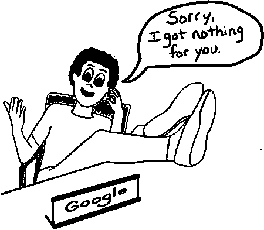

# 通过关注信息空白产生创业想法

> 原文：<https://medium.com/swlh/generate-startup-ideas-by-focusing-on-information-voids-2fc9c517176c>

> “我最后说，如果没有别人在做，也许那应该是我。”
> 
> — [AJ Wilcox](https://www.linkedin.com/in/wilcoxaj/)

这是开公司的实际经验。

关于一个主题的信息空白可能是一个信号，表明有机会满足市场的需求。

B2Linked 是一家专注于提供 LinkedIn 广告服务的数字营销公司，其创始人 AJ Wilcox 就是如此。

> *最初谷歌搜索答案却一无所获的公司，如今在 LinkedIn 上为客户投放广告的支出超过了世界上任何一家公司。*

AJ 的旅程是一个案例，说明了**保持激情**和**专注于你着手解决的原始问题**的力量，因为没有其他人这样做。

# AJ 是一名寻找答案的数字营销人员

AJ Wilcox 从第一天起就迷上了 LinkedIn 的广告。

他曾与谷歌 Adwords 合作，但这是不同的东西。LinkedIn 广告以不同的方式与他对话。兴奋之余，AJ 开始搜索信息，以了解更多关于该平台的信息，并将他的战略提升到一个新的水平。

但是有一个问题。

那是 2014 年。

没有人在 LinkedIn 上写、说或发表关于广告的文章。几乎每次他试图寻找答案时都一无所获。论坛和每个 Quora 帖子上关于 LinkedIn 广告的问题都没有得到回答。

Aj 很困惑。为什么专家们不分享他们的经验和回答问题？

这种情况持续了几个月，

> “我最后说，如果没有别人在做，也许那应该是我。”
> 
> — [AJ Wilcox](https://www.linkedin.com/in/wilcoxaj/)

# 第一步:从消费者变成创造者

AJ 做了一个重要的转变。决定充满激情地创造前所未有的价值。他不会再寻找答案，他会提供答案。

从网上论坛开始，他开始为自己起名字。他在网上找到了与 LinkedIn 广告相关的问题，并努力开始工作。

## 开始回答 Quora 的问题

AJ 开始挖掘并回答其他人的问题。他花了几天时间回答关于 LinkedIn 广告的问题。

自 2014 年以来，他仅在 Quora 上就提供了 [98 个 LinkedIn 相关问题](https://www.quora.com/profile/AJ-Wilcox)的详细回答。

AJ 花时间在 Quora 上，因为那是最热闹的地方。

## 找到你的观众在哪里

它可能不是适合你的 Quora。你是否会一直停留在同一个网站上，在那里其他人就一个话题问着同样的问题，却没有答案？可能有一个集中聊天的中心枢纽。找到源头，专注于成为那里的专家。

如果看起来只有 20-30 个人参与对话，也不要担心。这意味着可能还有数百人在被动阅读 Quora 和 StackOverflow 等网站上的帖子。

## 保持耐心

培养观众需要时间。可能需要几个月或几年才能看到任何牵引力，但重要的是开始并保持一致。

AJ 完成了这项工作，并成为 LinkedIn 广告方面的专家。这变成了演讲和面试的机会。

## 开始在会议上发言

AJ 开始变平了。他开始在数字营销会议上发表关于 LinkedIn 广告的演讲。他是唯一一个谈论 LinkedIn 的人。

AJ 没在意。

他一直关注 LinkedIn 的广告，因为他相信更多的人需要知道他们有多棒！如果你对你所展示的东西没有真正的热情，你就不可能成为一个伟大的会议演讲者。观众能感觉到。

3 年后，AJ 仍然专注于 LinkedIn 广告。以下是他最新演讲的幻灯片:

有什么方法可以让你在会议上第一个就某个话题发言？前沿是好的投球的一个要素，给你一点优势。

根据你感兴趣的话题，也许没有什么会议是有意义的。如果是这样的话，把你自己回答问题或者关于这个话题的陈述录下来，放到 YouTube 上。

## 创办公司

开始努力是困难的。创办一家公司可能会让人害怕。但是，如果你做得对，创办一家公司会给你如何度过每一天的最终自由。

为了确保他能够专注于他对 LinkedIn 广告的热爱，AJ [创办了一家公司](https://b2linked.com/)。凭借他新获得的曝光率，他得到了第一批客户。开公司对客户来说没那么可怕。AJ 的知识非常适合代理业务模式。这让他从第一天就开始创收。

他只需要三件工具。电子邮件、LinkedIn 广告编辑器和 Excel。大多数数字营销公司能够引导，因为他们是非常实际的公司开始。

但不要低估任何新业务获得初始牵引力的难度。前 5 个客户很难。你得自己去争取。无论你提供的是服务还是产品，观众都会给你很大的帮助。

# 保持专注

在会议上发言或获得几个大客户后，很容易分心。

AJ 的许多客户问，“你也能运行我的谷歌广告吗，我在脸书的广告怎么办？”

但是 AJ 在他的新公司有一个规定:

> LinkedIn 广告要么成功，要么失败。他疯狂地让自己的公司专注于为客户提供 LinkedIn 营销服务。不允许其他工作。

我确信客户愿意为其他服务支付高价。没关系。每一次 AJ 都坚持他对 LinkedIn 的关注。他总是说不。

# 继续保持专注

专注是如此重要。许多企业家犯的最大错误是注意力不集中的结果。

太容易分心了。但是坚持你最初开始做的事情。专注于你开始解决的原始问题。

# 享受旅程

做好多年保持专注的准备。

即使做了很多伟大的决定并保持专注也不意味着会很容易。支撑你的是激情。

创建一家公司并不容易，但 AJ 喜欢这样。

你可以从他的声音中听出来。

You only have to listen to this interview for 2 mins to be able to tell AJ has a passion for what he does.

如果你发现自己在网上寻找某个话题的答案，却总是一无所获。也许你应该问问自己…

那里隐藏着一个公司的伟大想法吗？

可能有。如果你能创造机会，专注于让你起步的东西，也许你可以复制 AJ 的成功。

*这个帖子的一个版本首先出现在* [*LinkedIn*](https://www.linkedin.com/feed/update/urn:li:activity:6330883177405648896) *上，在那里我定期分享多年来帮助建立* [*形状*](https://shape.io/)*[*PPC 管理软件的故事和想法。*](https://shape.io/)*

**

## *这个故事发表在 [The Startup](https://medium.com/swlh) 上，这里有 258，400 多人聚集在一起阅读 Medium 关于创业的主要故事。*

## *点击订阅接收我们的头条新闻[。](http://growthsupply.com/the-startup-newsletter/)*

**