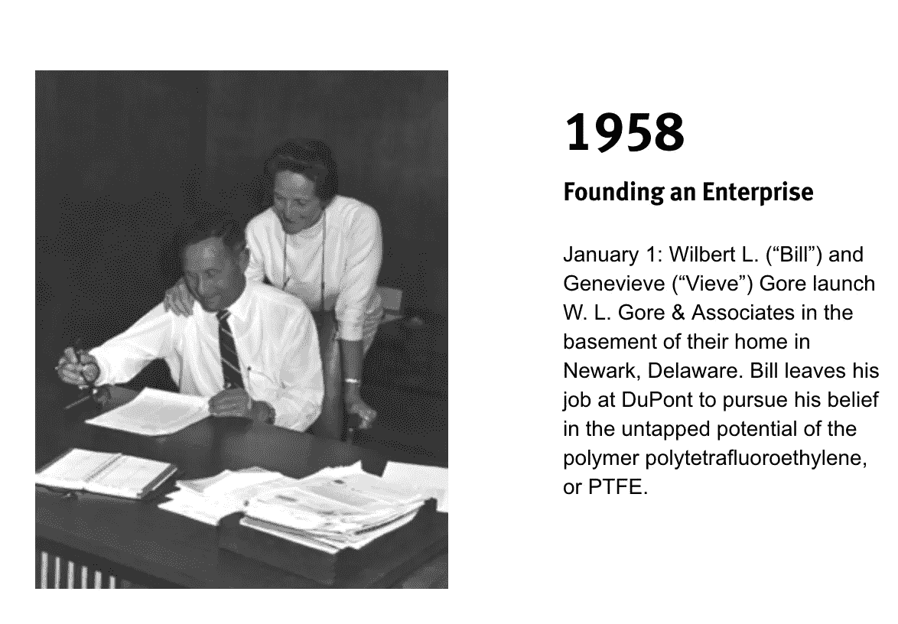

# 以小博大 30 亿美元(第一部分)

> 原文：<https://medium.com/swlh/get-3-billion-big-by-staying-small-part-i-fccfd0923ba6>

WL·戈尔公司的教训，最初的“文化驱动”公司

如果你曾经进行过户外探险，你可能会遇到 GORE-TEX，这是全球顶级户外防护服品牌之一，因为它兼具透气性和防水功能。然而，GORE-TEX 面料不仅可以在登山夹克中找到，反映了该公司真正的创新性质:无论你是在进行一系列运动，为警察或消防服务工作，执行美国宇航局的任务，甚至是在温布尔登的中央球场观看网球比赛，在包含该材料的可伸缩屋顶下，GORE-TEX 可以在数百种——不，数千种——产品中找到。

你可能*不*知道的是，Gore——Gore-TEX 面料只是其母公司的一个小部分——是一个真正创新和惊人成功的组织。早在文化第一运动出现之前，戈尔就是一家文化第一的公司。它已经连续 20 多年被评为“最佳工作场所”，每年的收入超过 30 亿美元，而且没有放缓的迹象。

戈尔文化和戈尔产品都处于世界领先地位，这并非巧合:W.L. Gore and Associates 的创始人威尔伯特·戈尔(又名比尔)在设计公司时就考虑到了这一点。他无法忍受官僚主义，他坚信，没有通常的等级、级别和头衔，公司也能繁荣发展。他着手证明他的假设是正确的。

1958 年，比尔辞去了在杜邦公司做了 17 年工程师的工作，和妻子吉纳维芙(Genevieve，人称“维芙”)一起在家的地下室创办了一家文化驱动的电子初创企业。在杜邦工作期间，Bill 偶尔会在一个特别工作组中工作——一个由具有专业知识的不同同事组成的小组，他们会聚在一起，用六周到六个月的时间来解决一个特定的问题。当时，在 50 年代，同事们会称呼彼此为博士、夫人或先生，但在任务组期间，这种正式程度将会消失，人们会以名字相互称呼——直到任务组结束，之后他们会回到他们在公司层级中通常的角色、位置和正式程度。

特别是在一个任务组之后，在这个任务组中，团队专注于聚合物聚四氟乙烯，或 PTFE，Bill 觉得虽然目前的问题已经解决，但 PTFE 还有更多未开发的潜力。他还发现自己不得不回到更传统的层级体系中，这让他感到沮丧(在杜邦，这些任务组是最后的解决方案，只有当人们无法通过在传统层级体系中工作找到解决方案时才会使用)。

**围绕机遇组织**

自那以后，比尔迈出了无数想成为企业家的人走过的一大步，他辞去了工作，与维夫一起创立了 W.L .戈尔事务所。他们相信有更多的可能性，并决心围绕机会而不是功能来组织。事实上，他们多年来一直在进行这样的对话，第一次讨论工作场所文化是在青少年时期在犹他州山区背包旅行时。

我们可以在脸书、Spotify、Transferwise 和许多其他科技公司扩大业务的过程中看到类似的“围绕机会组织”模式。

从第一天起，比尔就痴迷于创新和关于公司文化的问题:

***——为什么一个组织要等到危机发生后才做出改变、承担风险或发现突破？***

***——如果没有指挥链和令人窒息的等级制度——没有老板、没有副总裁、没有监督者，经营一家公司是可能的，那会怎样？***

***——如果你抛开规则书，创建一个重视人类繁荣并以激励工作为核心的组织，会发生什么？是否仍有可能实现持续的盈利和增长？***

***-如果您允许公司中的每个人与其他人交谈，会产生什么影响？***

***——要创建一家工作令人兴奋、富有挑战性、充满乐趣和自我导向的公司，需要发生什么？***

***——事实上……为什么整个公司不能没有官僚主义呢？***

比尔和维夫没有等待“某一天”来检验他们的假设；他们根据这些直觉白手起家，并成功了。

最初，他们从桥牌俱乐部的成员那里筹集了种子资金，并在自家后院为公司生产的电子产品建立了生产线；员工们会睡在他们的地下室里，在厨房里寻找他们可以在生产过程中使用的器皿。据说早期客户会发现该公司的第一个产品绝缘电线电缆中混有草叶。

快进几年:该公司在运营的第一个十年里达到了许多里程碑，包括其产品登上月球，出现在世界上最先进的计算机中，并在美国的特拉华州和亚利桑那州，以及德国、苏格兰和日本开设了更多的制造工厂。尽管这个国家的文化多种多样，戈尔人从第一天起就开始培育戈尔文化，这种文化深深地植根于每一种植物之中。

以小见大:邓巴的数字

比尔和维夫发现，如果你想要一个没有官僚主义的区域，你必须不断地关注它。戈尔的众多独特之处之一是，它的工厂从来不会容纳超过 150-200 名员工，这也是帮助企业文化保持无官僚主义的一个重要方面。一旦接近这个数字，该公司将在其他地方开设另一家工厂——理由很充分:公司传说有一天，比尔走过办公室时，他意识到他不知道每个同事的名字，这让他感到困扰，并引发了对群体性质的有趣见解。通过反复试验，比尔发现当一个团体的成员达到 150 人时会发生什么。比尔认为，这达到了一个临界点，人与人之间以及组织内部的关系性质发生了变化——变得更糟。

他围绕这一见解组织了业务。戈尔大楼(刻意保持平淡和实用——在以后的文章中会有更多介绍)只能容纳 150 人；食堂有 150 个停车位和 150 个车位。工厂不是在机器满负荷运转或达到特定目标时达到最大产能，而是在停车场和食堂满了的时候，此时，另一家工厂开始营业——有时就在几英里之外。

**这保证了工作环境:**

**——每个人都知道其他人的名字**

**-没有直线管理，也没有胸牌**

**-彼此承诺的深度加强**

社会问题被最小化。

这种保持植物小的原则成为了邓巴数理论的起源，并被马尔科姆·格拉德威尔在他杰出的著作《引爆点》中概述。人类学家和进化心理学家罗宾·邓巴(Robin Dunbar)研究了戈尔以及军事单位、美洲原住民和阿米什人社区，之后他提出，任何一个人可以与之保持稳定、有凝聚力和富有成效的关系的最大人数是 150 人左右。

邓巴的理论来自于对比尔·戈尔的观察和直觉——如果你想真正变大，你需要保持小规模。有影响力的建筑师和设计理论家克里斯托弗·亚历山大(Christopher Alexander)解释说，一旦你达到 150 岁，“就会发生一些事情——一些难以描述但非常真实的事情——这些事情会在一夜之间改变社区的性质。如果你变得太大，你就没有足够的共同点。你们没有足够的共同点，然后你们开始变得陌生，那种紧密的友谊开始消失。”

正如我们将在第二部分看到的，这种友谊绝对是世界级“戈尔方式”的关键

# [Culture Decks Decks decked](https://www.culturegene.ai/books)将于 2018 年第四季度出版，现在注册即可抢先阅读第一章，并在该书出版时收到通知。

*参考文献:*

(2012)[https://www . scribd . com/document/342803223/W-L-Gore-Culture-of-Innovation-pdf](https://www.scribd.com/document/342803223/W-L-Gore-Culture-of-Innovation-pdf)

(2000 年)[http://store.darden.virginia.edu/wl-gore-associates](http://store.darden.virginia.edu/wl-gore-associates)

[https://www.dropbox.com/s/whsxif75lka8xeq/billgore.ppt?dl=0](https://www.dropbox.com/s/whsxif75lka8xeq/billgore.ppt?dl=0)

(2001 年)[https://www.fastcompany.com/51733/fabric-creativity](https://www.fastcompany.com/51733/fabric-creativity)

(2009)[https://work place democracy . com/2009/07/14/workplace-democracy-at-w-l-gore-associates/](https://workplacedemocracy.com/2009/07/14/workplace-democracy-at-w-l-gore-associates/)

(2010)[http://www . management exchange . com/story/innovation-democracy-wl-gores-original-management-model](http://www.managementexchange.com/story/innovation-democracy-wl-gores-original-management-model)

(2015)[https://www . intrareneurshipcoun 会. com/building-a-culture-of-innovation/](https://www.intrapreneurshipconference.com/building-a-culture-of-innovation/)

(2015)[http://fortune.com/2015/03/05/w-l-gore-culture/](http://fortune.com/2015/03/05/w-l-gore-culture/)

(2017)[http://fortune.com/best-companies/w-l-gore-associates/](http://fortune.com/best-companies/w-l-gore-associates/)

确切的数字仍有争议——一些消息来源称是 150 人，另一些说是 200 人。为了简单起见，我就用 150 吧。

有关 CultureGene 服务的更多信息，请访问

## 这篇文章发表在 [The Startup](https://medium.com/swlh) 上，这是 Medium 最大的创业刊物，拥有 338，320 多名读者。

## 在这里订阅接收[我们的头条新闻](http://growthsupply.com/the-startup-newsletter/)。

