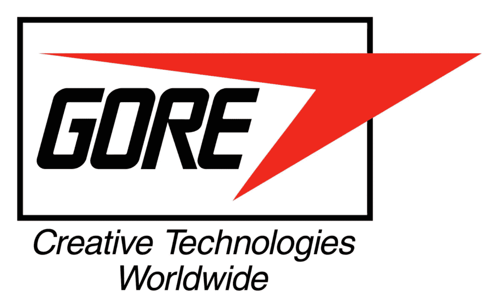

# 以小博大 30 亿美元(第二部分)

> 原文：<https://medium.com/swlh/get-3-billion-big-by-staying-small-part-ii-10f7b27cc5a4>

WL·戈尔公司的教训，最初的“文化驱动”公司

在我之前关于戈尔的[文章](/swlh/get-3-billion-big-by-staying-small-part-i-fccfd0923ba6)中，我们研究了公司的起源，以及公司如何通过保持小规模而变大(30 亿美元)，每个工厂容纳不超过 150-200 名员工，这要归功于创始人比尔·戈尔的观察，基于他自己的经验，一旦一个团队达到 200 人左右，“我们决定”的对话就变成了“他们决定”——这就产生了很多问题。

不过，戈尔不仅仅是限制其工厂的员工数量。员工将戈尔独特的文化称为“戈尔之道”，而“戈尔之道”的核心是四条指导原则，这四条原则在过去 60 年中塑造了公司文化。

**戈尔文化的指导原则**

无论任何特定工厂位于哪个国家，四个指导原则贯穿整个企业:

1.**自由:**指导自己的工作，失败，采取行动，以最少的官僚作风犯错误

2.**公平:**对待自己、他人、客户和供应商

3.承诺:说到做到，并且

4.**吃水线:**全体员工承诺，在采取任何可能因“吃水线以下”和沉船而损害公司的行动之前，将与其他员工协商。

**实验自由**

戈尔欢迎创意，但最重要的是，行动能帮助员工发现他们的创意是否有价值。企业家精神是这种文化的核心。

不过，这种策略对一家公司来说并非没有风险，戈尔知道这一点。许多公司在一个想法看起来无法实现时会提前终止，但戈尔鼓励员工继续研究和尝试一个想法，即使只有一线希望。(毕竟，比尔的儿子和继任者鲍勃·戈尔(Bob Gore)最初就是这样发现快速拉伸聚四氟乙烯使其变得更强的——他实验到了令人沮丧的地步，在沮丧中，他极快地拉伸它，从而发现它不会断裂，并立即发现了膨体聚四氟乙烯(ePTFE ),后来成为所有 Gore-Tex 材料的基础。)

如果一个想法或项目确实失败了，参与的每个人都要反思发生了什么，什么可行，什么不可行，为什么。这种“事后分析”提取了所有的知识，然后应用于整个企业的其他地方。当一个计划或项目被扼杀时，香槟就出来了。在戈尔，失败仍是进步，因为公司并不追求速赢；它总是着眼于长远。

**公平**

公平对待自己、同事、客户和任何与你做生意的人是戈尔方式的核心部分。嫉妒和竞争等原始能量受到这一指导原则的控制，每个人的自我都受到抑制。公平原则确保该公司在现任首席执行官特里凯利(Terri Kelly)所描述的“最大诚信”的环境下运营，不会为了快速取胜而走捷径。

**承诺**

让员工自由选择工作内容的这种相当激进的做法，与你对一个项目的承诺几乎是一种神圣誓言的共同观点形成了平衡。你可以事先拒绝加入一个项目，但是一旦你做出了承诺，你就必须承担责任，你必须信守诺言。有人引用比尔·戈尔的话说:“没有人能为另一个人承担责任。”。所有的承诺都是自我承诺。独裁主义者不能强加承诺，只能发号施令。反应的差异是巨大的。正如 Terri Kelly 在 2009 年的一次谈话中所说，员工生活在文化中，创造他们引以为豪的产品，员工和产品都承诺做他们说过要做的事情。

**水线**

虽然鼓励自主性和创造性，但不允许员工仅仅为了自主性和创造性而沉迷其中。他们必须时刻牢记这样一条原则:在没有事先咨询同事的情况下，不要“下水”。在船上，吃水线是船体与水面的交汇点。在戈尔，这意味着您承诺在采取任何可能“低于底线”即损害公司的行动之前咨询其他同事。

这一原则提供了清晰的界限，平衡了戈尔员工固有的自由和自主。正如戈尔网站上的一位同事所说，“你需要主动出击，同时知道何时寻求他人的意见。”

吃水线原则为公司创造了一种共同的责任感，因此即使员工不拥有公司的股票(要么是选择不拥有，要么是因为在 12 个月内没有在戈尔工作，因此有资格成为所有者)，他们仍然对公司拥有深刻的归属感。它也替代了公司控制的预算——人们可以选择投资他们想投资的任何东西，只要它不在“水线以下”。

但是，这些革命性的工厂究竟发生了什么，导致戈尔自 1982 年以来在多个国家不止一次而是多次被列入“最佳工作场所”名单？回答这个问题是本文的重点。

**一个格子，不是一个层次**

戈尔基本上没有传统的层级结构，而是采取“格子”结构的形式——尽管近年来随着业务的增长，有了一个更标准的结构:一位首席执行官(Terri Kelly 当选)，四个主要部门和许多以产品为中心的业务部门。除此之外，没有老板，没有直接下属，没有职称；取而代之的是，大家只是单纯的一个协理。同事之间的关系真的很重要，全球团队定期聚在一起建立并保持一种联系感。公司传说，因为同事可以在名片上写任何他们想要的东西，一个同事的名片上印着“最高指挥官”的字样！

这种等级制度的中立化在整个组织中蔓延，不管它适用于哪个国家。戈尔专门雇佣那些天生“了解”这种方法的吸引力和实用性的人。只有在极少数情况下，当公司不得不与更广泛的外部环境和文化互动时，这种变化才会发生。例如，在韩国，等级制度是该国文化的重要组成部分，因此员工的名片上都会有基于等级的头衔，但这只是作为更广泛文化中人们的一种对外工具。在公司内部，这些头衔毫无意义，在戈尔工作的每个人都知道这一点。

网格结构的美妙之处在于它使公司中的任何人都能够与他人互动和协作，而没有任何通常的紧张或关于谁可以与谁互动的无形规则。信息可以在人与人之间自由流动，不需要直线经理的批准，使沟通变得直接和个人化。当比尔在杜邦公司不同的臭鼬工作类型的特别小组工作时，他已经体验到了这种积极的影响，在那里，称呼同事姓氏的常见礼节消失了，取而代之的是一种不仅仅是不那么正式的熟悉——这还导致了巨大的创造力和生产力。

戈尔的实际结构是流动的，不能在纸上清晰地表达出来，不像许多组织那样有固定的、明显的层级结构。相反，它根据个人互动、项目、对自己选择成为其中一员的团体的承诺以及团体强加的纪律而不断进化。你能得到的最接近组织结构图的东西就是列出每个工厂的工作人员。

**每个人都是你的老板，没有人是你的老板**

在 2001 年为*快速公司*、[的艾伦·多伊奇曼](https://www.fastcompany.com/51733/fabric-creativity)撰写的一篇文章中，描述了戈尔公司的新员工黛安·戴维森(Diane Davidson)和她最初的赞助商之间的互动，戴安·戴维森是受雇为 Citywear 品牌工作的，她最初的几周是被指派来指导她的。

戴维森不停地问她的老板是谁，她的担保人一遍又一遍地回答她:“不要用 B 开头的词”，这让她很沮丧。戴维森是一位经验丰富的高管，她怀疑这又是一种企业委婉语，与她在以前的组织中遇到的许多情况没有什么不同。“偷偷摸摸，有大佬是吧？”她问道，尽管她最终明白了在戈尔，“每个人都是你的老板，没有人是你的老板。”。"

在戈尔，没有人是你的老板，因为没有直线经理，每个人都是你的老板，因为如果你承诺在一个项目上与同事一起工作，你就要对团队中的每个人负责。因此，虽然员工不向特定的经理汇报，而该经理再向他们自己的经理汇报，但每个人都应该负责与任何受其工作影响或参与其工作的同事进行充分、主动的沟通。在戈尔开展业务的某些国家，如台湾、韩国或日本，传统上存在根深蒂固的等级制度，这无异于一场革命。

此外，人们相互之间工作非常密切。在戈尔，信息孤岛不是问题，因为销售人员、工程师、营销人员和公关人员都理所当然地密切沟通。正如一位员工所说，这让员工对产品和产品销售市场有了一个完整的了解。

戈尔方式的这一方面的基础是一个基本信念，即个人希望做对公司有益的事情，人们有能力认识到我们都在同一条船上(这反映在员工股票计划中——员工拥有公司 25%的股份，这当然意味着风险和回报都真正属于他们)。

虽然没有具体的职位名称，但员工*因特殊技能而被*聘用，因此每个工厂都有研发专家、机械师、化学家、销售人员和工程师。这创造了真正的协作精神，并允许角色融合。然而，员工不是被分配到项目中，而是选择他们希望参与的项目或想法，人们被视为多面性的，因此不期望他们只参与一个项目。

加入一个团队会让你进入初学者模式。在上述文章中，戈尔的另一位同事约翰·摩根(John Morgan)表示，在戈尔建立任何一种信誉都需要大约 18 个月的时间，而你在团队的前六个月主要是了解你的同事，比其他人工作得少得多，但你会深深地吸收和沉浸在团队正在做的事情和原因中。在戈尔，人们*做什么*不像在许多企业文化中那样容易定义；你可能会发现自己同时涉足多个领域。最终，你可能会发现自己承担了很多责任，但这是慢慢发生的。

在最初的团队工作几个月后，员工被鼓励加入第二个甚至第三个团队，这表明大多数人都有不同的兴趣。这为员工提供了为公司做出贡献的巨大空间，也给他们带来了一定的压力，让他们发挥出最高水平。

说到绩效，戈尔的薪酬与绩效直接相关，由同行排名系统决定。戈尔公司的每个人都由 20-30 名同事进行排名，反过来，每个同事必须评估 20-30 名同事。有趣的是，这个过程并没有固定或特定的标准——人们只是被要求说出谁对戈尔的成功做出了最大的贡献。下一阶段包括由来自不同职能部门的担任领导角色的个人组成的委员会进行讨论，在此期间讨论结果，并给员工分配 1-20 分的总评分。然后，工资曲线与排名保持一致，与贡献相关联。我的感觉是，这一体系之所以能够运转，正是因为人们在日常工作中相互之间的密切联系。知道你的同事会根据你的贡献以及天生的领导哲学对你进行排名，这可以成为发挥你最佳水平的强大动力。

阅读关于戈尔的文章，你会觉得选择离开的人并不多，统计数据也证实了这一点:该公司的自愿离职率低得惊人，只有 3%。该公司引以为豪的是，它的员工寿命很长，因为这种文化自然会产生忠诚度。工作不会——事实上也不可能——变得无聊，因为你一直面临着成长、学习、尝试和提高的挑战，而且你的同事不仅仅是同事，他们还是共同创造者、同事、导师和学员。

**结论**

戈尔的四项指导原则帮助塑造了世界上最著名的公司文化之一。戈尔信任员工，给予他们自由和自主权，让他们从事自己感兴趣的工作；它还要求比许多公司敢于承担的更多的责任，要求对公司做出反映高度信任的深度承诺。官僚主义和等级制度的缺乏证明了比尔·戈尔对道格拉斯·麦格雷戈在 20 世纪 60 年代提出的革命性的“Y 理论”的信仰，该理论认为人们并不是从根本上懒惰，而是从根本上被激励去做一些有意义的事情。

作为一家公司，戈尔生产了无数创新产品，并在六十年间创造和维持了一种真正鼓舞人心的公司文化。在该系列的第三篇也是最后一篇文章中，我们将看看戈尔是如何取代直线管理的(这很有趣)，我们将讨论领导者是如何产生的，而不是被任命的。我们还将了解额外津贴在戈尔是如何发挥作用的。不出所料，就像戈尔文化的许多其他方面一样，额外津贴的做法让公司与众不同。

更多关于公司文化的博客，请查看 www.culturegene.ai/blog

**参考文献:**

(2012)[https://www . scribd . com/document/342803223/W-L-Gore-Culture-of-Innovation-pdf](https://www.scribd.com/document/342803223/W-L-Gore-Culture-of-Innovation-pdf)

[(2000 年)http://store.darden.virginia.edu/wl-gore-associates](http://store.darden.virginia.edu/wl-gore-associates)

(2000 年[https://hbr.org/product/w-l-gore-associates/UV3176-PDF-ENG](https://hbr.org/product/w-l-gore-associates/UV3176-PDF-ENG)

[https://www.dropbox.com/s/whsxif75lka8xeq/billgore.ppt?dl=0](https://www.dropbox.com/s/whsxif75lka8xeq/billgore.ppt?dl=0)

(2001 年)[https://www.fastcompany.com/51733/fabric-creativity](https://www.fastcompany.com/51733/fabric-creativity)

(2009)[https://work place democracy . com/2009/07/14/workplace-democracy-at-w-l-gore-associates/](https://workplacedemocracy.com/2009/07/14/workplace-democracy-at-w-l-gore-associates/)

(2010)[http://www . management exchange . com/story/innovation-democracy-wl-gores-original-management-model](http://www.managementexchange.com/story/innovation-democracy-wl-gores-original-management-model)

(2015)[https://www . intrareneurshipcoun 会. com/building-a-culture-of-innovation/](https://www.intrapreneurshipconference.com/building-a-culture-of-innovation/)

(2015)[http://fortune.com/2015/03/05/w-l-gore-culture/](http://fortune.com/2015/03/05/w-l-gore-culture/)

(2017)【http://fortune.com/best-companies/w-l-gore-associates/ 

(2012)[https://www . fast company . com/3002493/Terri-Kelly-un-CEO-wl-gore-how-deal-chaos-grow](https://www.fastcompany.com/3002493/terri-kelly-un-ceo-wl-gore-how-deal-chaos-grow)

## 这个故事发表在 [The Startup](https://medium.com/swlh) 上，这是 Medium 最大的创业刊物，拥有 339，876+人关注。

## 在这里订阅接收[我们的头条新闻](http://growthsupply.com/the-startup-newsletter/)。

