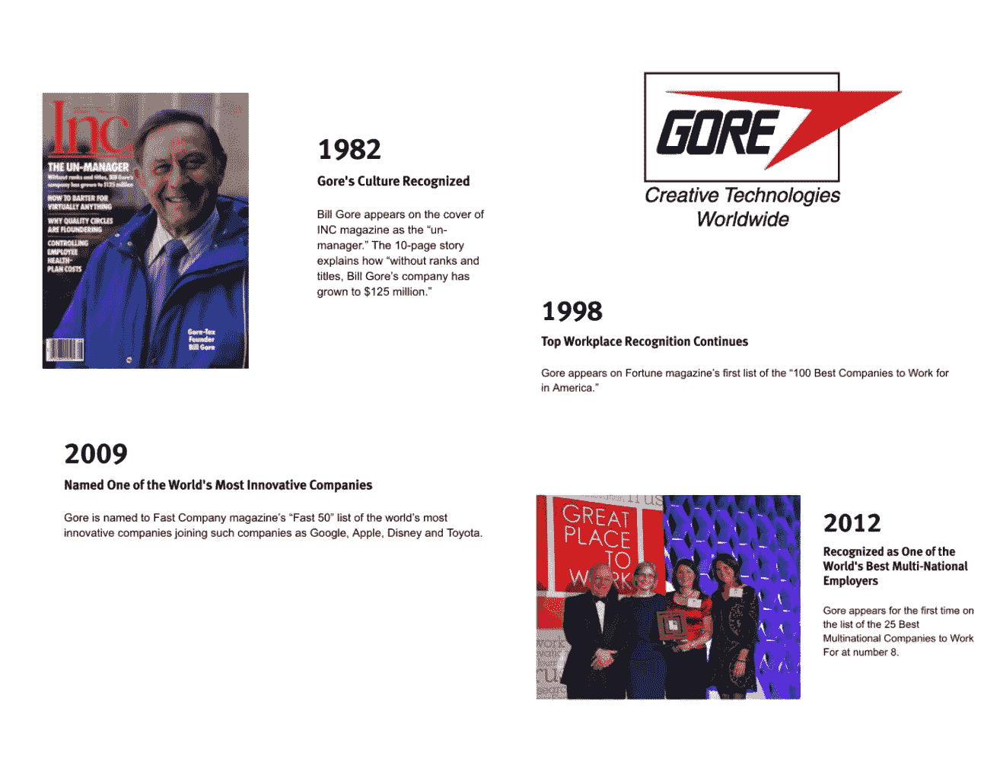
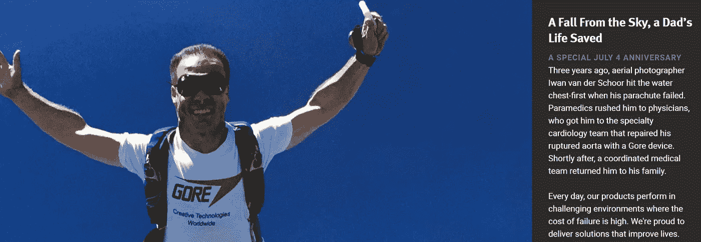

# 以小博大 30 亿美元(第三部分)

> 原文：<https://medium.com/swlh/get-3-billion-big-by-staying-small-part-iii-47b4a84639c6>

在我们关于 W . L Gore Associates 的三集系列的最后一集，我们将看看在一家因其文化而享誉全球的公司中，管理层和领导层是如何工作的。1982 年，当《Inc》杂志把比尔·戈尔放在封面上，称他为“不可理喻的经理”时，戈尔的反直觉文化首次被公认为非常强大。1998 年，该公司首次出现在《财富》杂志的“美国 100 家最佳雇主”名单中。

那么，为了创建这样一家真正将文化放在第一位的创新型、创业型公司，领导层的幕后究竟在做什么呢？回答这个问题是本文的重点。

**赞助，非管理**

在戈尔，人们不会像许多新兴的自我管理和/或 Teal 组织那样接受管理(如本文[文章](https://www.culturegene.ai/post/why-would-you-let-your-employees-choose-their-own-salaries)中提到的 Makers Academy)。

然而，如前所述，每个人都有一个赞助商。加入戈尔后，您会被分配到一个“初始赞助商”；之后，你可以选择接近一个你想得到指导的特定的人。赞助人对新合伙人的责任包括帮助他们的被赞助人学习戈尔的方式，破译任何行话，并揭开事情如何运作的神秘面纱。在最初的几个月里，新同事会经历一种在戈尔工作的文化冲击，因为他们试图理解这种不可思议的工作方式。赞助商的工作不是监督或监控被赞助人的工作，而是支持被赞助人的发展和成功。他或她将向员工介绍不同的团队，并帮助员工在工厂进行的各种项目中找到适合自己技能的人。

随着赞助活动的发展和演变，围绕它的文化也在发展。一个赞助者小组每年举行会议，反思和审查赞助者的作用，并研究在其指导下的人可以利用的机会和可能性。他们赞助人的繁荣很重要。

**领导者必须有追随者**

如今，关于领导力的文章、书籍和播客成千上万，但关于追随者的却很少。在戈尔，领导者必须有追随者这一基本事实已经融入了公司的运作方式。戈尔的任何人都没有义务成为其他人的“追随者”，这意味着每位领导者都必须展示自己的领导力，吸引和吸引人们与他们合作。激情、诚信和正直被视为关键特征，随着时间的推移，领导者在戈尔脱颖而出，真正实现了“天生领导力”的理念。

一位同事将其描述为“进化”为领导力，他说“你回头看，有人在跟踪你”。这就像变形虫正在成形。

展示领导力包括非常清楚你的决定背后的“为什么”。没有人的决定可以免于质疑或审查，任何人，即使是新同事，都有权质疑决定背后的推理。要成为戈尔的领导者，实际上就是领导一个项目，你必须对一个产品或项目有一个想法，并在内部向足够多的同事推销，这些同事具备推动项目向前发展所需的技能。正如 Terri Kelly(最近由 Jason Field 接任戈尔首席执行官)所说，“这个过程有时令人沮丧，但我们相信，如果你在前面花更多的时间，你将拥有不仅完全认同，而且致力于实现结果的同事。在这个过程中，他们还会帮助完善想法，让决策变得更好。

实际上，凯利在 2005 年被选为首席执行官，这让她自己都很惊讶。她的故事证明了一个原则，即任何员工最终都可以胜任公司的任何职位，也证明了戈尔是多么热衷于从内部招聘员工。Kelly 于 1983 年从特拉华大学机械工程专业毕业后加入公司，担任工艺工程师，她从未在其他地方工作过。她最初是军用面料业务的产品专家，后来成为该部门的负责人，最后成为全球面料部门的负责人。她协助在中国深圳建立了一家工厂，这是戈尔在亚洲的第一家面料厂。除了领导这个部门，Kelly 还是监督 Gore 战略方向的企业团队的一员。

然而，凯利说，2005 年被选为首席执行官让她震惊不已。不过，这种震惊显然不是她的能力的反映；在过去的 13 年里，她在这个角色上显然是成功的。不出所料，就像戈尔的许多事情一样，她接受了“戈尔方式”的角色，并在 *Fast Company、*被称为“非首席执行官”，这要归功于她的非正统方法:她乘坐经济舱，认为自己是“碰巧”成为首席执行官的同事，并说“我作为首席执行官管理公司的想法是一种误解”，而是澄清她的目标是“提供总体方向”在她看来，她的部分职责是帮助公司应对持续的不确定性、混乱和模糊，这些是在 VUCA 生活和工作的重要组成部分。

Kelly 意识到需要能够容忍混乱，这与保持戈尔的创新文化尤为相关。在一次采访中，她解释道，“我们有我们所谓的呼风唤雨者和执行者。造雨者想出疯狂的想法，实施者把它们变成现实。这两个让对方抓狂。如果您不小心，控制权将会落入实现者手中。所以我们试图保护造雨者。这意味着我们必须适应更多的混乱。

**想要创造？利用你的涉猎时间**

不过，该公司在创意过程中注入了一些结构。如今，如果一个同事想要探索一个项目或产品的新想法，并且正在履行他们所有的主要承诺(因此不违反四个指导原则中的一个“吃水线以下”)，他们就会成为产品冠军，并且必须招募一组同事利用他们的业余时间与他们一起工作。他们利用戈尔公司官方称之为“涉猎时间”的时间来完成这个项目，用一周工作时间的 10%来创作、实验和玩耍。戈尔只对探索独特和有价值产品的同事感兴趣，而不是那些大喊“我也是！”的产品这种通过鼓励和支持创造性探索来实现创新和创造力的承诺，是我在许多初创企业中看到的，我在这篇博客中采访了这些企业的创始人。在支持人们追求他们认为最吸引人、最令人兴奋或最能激发好奇心的想法的文化中，往往会产生真正有动力的人和大量优秀的想法——戈尔就是一个很好的例子。

*一个经常被引用的业余时间项目的例子是戈尔的长生不老吉他弦。戴夫·迈尔斯(Dave Myers)是一名工程师，他的日常工作主要是开发心脏植入物，他使用聚四氟乙烯为他的山地车电缆制造了一种防砂砾涂层。他想知道同样的原理是否可以应用到吉他弦上，因为他已经注意到，随着人们手指上的油在弦上积累，吉他弦往往会失去音调质量。当时，戈尔在音乐行业的产品为零，迈尔斯开始工作，召集志愿者和他一起工作。这些琴弦花了三年时间开发，但这种等待是值得的——仙丹琴弦保持音调的时间是行业标准琴弦的三倍，如今的销量是竞争对手的两倍。*

在“涉猎”阶段之后，团队将经历戈尔专有的名为“真实、成功、价值”的审查流程，在此过程中，他们将探讨以下问题:

*机会是真实的吗？*

真的有人会买吗？

我们能在市场中取胜吗？

经济学看起来像什么？

*这能让我们赚钱吗？*

*是否独特有价值？*

*能否获得专利保护等持续优势？*

回答这些问题没有设定最后期限；它们让员工能够“为创新而组织”,而不是试图为创新而计划——这两者之间有着天壤之别。

**逃避津贴**

戈尔并没有随波逐流地为员工提供额外津贴，如小睡舱、迷你高尔夫球或啤酒券。这种文化建立在我总是问受访者的问题上:强大的、根深蒂固的价值观，这可能是世界上最好的例子之一，说明为什么文化第一的公司会创造出独特的竞争优势。

但这并不意味着在戈尔工作没有额外津贴；该公司经常出现在最佳工作场所的名单上，而且理由充分。除了我们在前三篇文章中探讨的难以置信的工作体验，该公司还提供了压缩工作周的机会；经常有现场健身房；提供工作分享、令人兴奋的角色转换和远程办公；此外，志愿者还可以带薪休假，大学学费也可以报销。

该公司适应移动技术的速度一直很慢，直到最近，在千禧一代员工的反馈下，iPhones、iPads、工作流应用等才融入公司的日常运营。在真正的戈尔形式中，该公司正在采用技术使其员工更加互联，但该公司并不急于推进这一进程。戈尔的变革是缓慢、小心、谨慎地实施的。与一些公司不同，在戈尔，当一件事情被采纳后，它就会被坚持下去。

**结论**

在加里·哈默尔 2010 年为《T4》《华尔街日报》撰写的一篇文章中，哈默尔写道，“第一次参观戈尔的工厂感觉很奇怪，甚至令人不安。我在戈尔公司几乎没有发现任何与我在数百家其他公司观察到的管理实践相匹配的东西。我感觉自己就像一个外科医生，给一个看起来像人的病人开刀，结果却发现里面充满了电线和电路。然而，随着我对戈尔的了解，我意识到这种类比是错误的。戈尔非常人性化，相比之下，我研究的所有其他公司都是半机器人。戈尔的管理模式看起来古怪，只是因为我已经习惯了大多数其他公司普遍存在的不人道做法。

比尔·戈尔关于工作的基本理念在当时是革命性的:他认为工作场所可以是人类繁荣的地方，这是当今越来越多的话题，但在 20 世纪 50 年代公司成立时才是真正的革命性。比尔关于管理的反文化思想始于他的第一批员工，在公司起步时，他让他们住在自己的房子里，而不是给他们发工资。60 年过去了，这家公司仍然很大胆。它相信自己的员工，引领并践行自己的价值观，并从长计议，这使它能够经受住对真正创新至关重要的起起落落。通过这样做，它成功地创造了一种文化，一次又一次地鼓励持续的、真正的突破。

[https://www.goremedical.com/products/ctag---patient/patients](https://www.goremedical.com/products/ctag---patient/patients)

关于[文化基因](http://www.culturegene.ai/)的更多信息

# [文化甲板解码](https://www.culturegene.ai/books)将于 2018 年第三季度出版，现在注册以获得第一章的预览，并在该书出版时得到通知。

**参考文献:**

(2012)[https://www . scribd . com/document/342803223/W-L-Gore-Culture-of-Innovation-pdf](https://www.scribd.com/document/342803223/W-L-Gore-Culture-of-Innovation-pdf)

(2000)[http://store.darden.virginia.edu/wl-gore-associates](http://store.darden.virginia.edu/wl-gore-associates)

(2000 年[https://hbr.org/product/w-l-gore-associates/UV3176-PDF-ENG](https://hbr.org/product/w-l-gore-associates/UV3176-PDF-ENG)

[https://www.dropbox.com/s/whsxif75lka8xeq/billgore.ppt?dl=0](https://www.dropbox.com/s/whsxif75lka8xeq/billgore.ppt?dl=0)

(2001)[https://www.fastcompany.com/51733/fabric-creativity](https://www.fastcompany.com/51733/fabric-creativity)

(2009)[https://work place democracy . com/2009/07/14/workplace-democracy-at-w-l-gore-associates/](https://workplacedemocracy.com/2009/07/14/workplace-democracy-at-w-l-gore-associates/)

(2010)[http://www . management exchange . com/story/innovation-democracy-wl-gores-original-management-model](http://www.managementexchange.com/story/innovation-democracy-wl-gores-original-management-model)

(2015 年)[https://www .intrareneurshipcoun 会. com/building-a-culture-of-innovation/](https://www.intrapreneurshipconference.com/building-a-culture-of-innovation/)

(2015)[http://fortune.com/2015/03/05/w-l-gore-culture/](http://fortune.com/2015/03/05/w-l-gore-culture/)

(2017)【http://fortune.com/best-companies/w-l-gore-associates/ 

(2012)[https://www . fast company . com/3002493/Terri-Kelly-un-CEO-wl-gore-how-deal-chaos-grow](https://www.fastcompany.com/3002493/terri-kelly-un-ceo-wl-gore-how-deal-chaos-grow)

## 这篇文章发表在 [The Startup](https://medium.com/swlh) 上，这是 Medium 最大的创业刊物，有 340，876 人关注。

## 订阅接收[我们的头条新闻](http://growthsupply.com/the-startup-newsletter/)。

