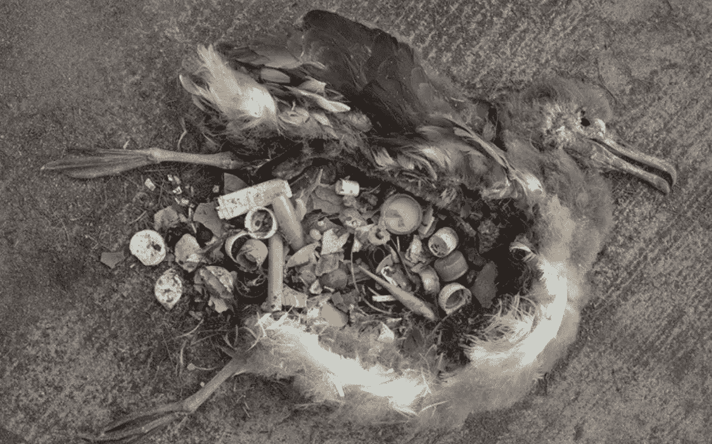

# 把那些垃圾从你的生活中清除出去

> 原文：<https://medium.com/swlh/get-all-that-garbage-out-of-your-life-8eef023119c>

从健康的垃圾习惯开始新的一年

Plastic trash kills millions like her, Photo credit National Geographic

我们在没有浪费的情况下进化，但随后出现了工业革命。从字面上看，垃圾是我们从自然中获取并处理掉的所有废物，就好像自然是一次性的一样。

但是，最近的头条新闻告诉我们，过度消耗森林、化石燃料和更多的资源正在导致我们整个世界遭受巨大的痛苦…