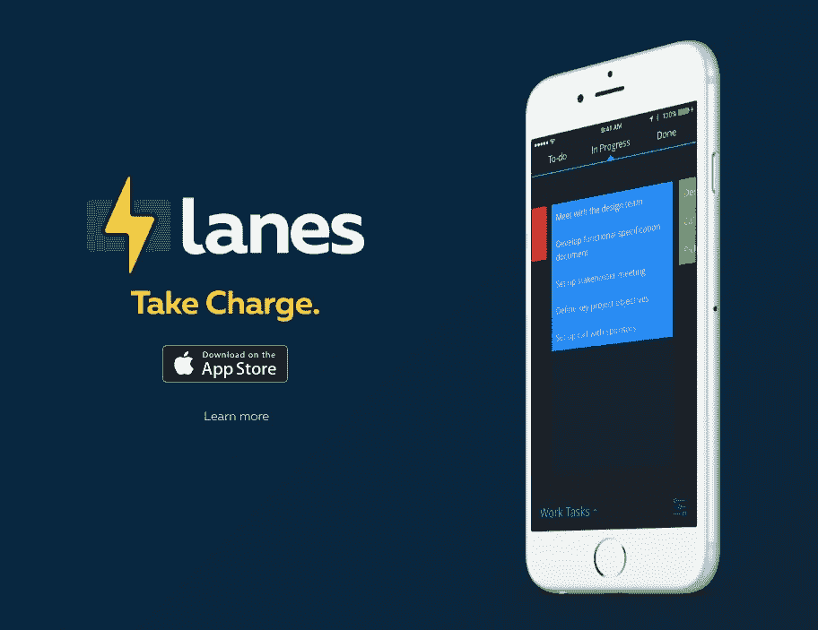

# 使用这 11 款应用和工具，让自己变得有条理、有动力、有灵感

> 原文：<https://medium.com/swlh/get-organized-motivated-inspired-with-these-11-apps-tools-57abebc20d48>

我的一位导师曾经告诉我，当我们刚刚起步时，要专注于你的创业、你的家庭和保持健康。当我们建立这个列表时，我们把这个想法保留在脑海中，并试图创建一个应用程序列表来帮助我们做到这一点。如果你想变得专注、有条理和有灵感，那就继续阅读吧！

# 变得有条理

# [InboxVudu](https://www.inboxvudu.com/)

InboxVudu 是你收件箱最好的朋友。当你有可能错过一封重要的电子邮件或忘记准时跟进某人时，我们会静静地坐在后台让别人知道我们。

它会分析你收到和发出的邮件，找出你需要采取的行动。当重要的请求进入您的收件箱时，使用它来掌握它们，并提醒您需要跟进的已发送邮件。

[**在这里了解更多**](https://www.inboxvudu.com/)|[**iOS 版下载**](https://itunes.apple.com/us/app/inboxvudu-your-intelligent/id1002147785?mt=8) | [**添加到 Chrome**](https://chrome.google.com/webstore/detail/inboxvudu-for-gmail/enjlfmdglkpjpiegaeabakhcfgejpkjc?hl=en-US)

# [车道](http://lanesapp.io/)

Lanes 是一种组织工作流程的简单方法。一个一体化的任务跟踪器，看板，待办事项列表和泳道应用程序。使用 Lanes 来管理您的工作流程、待办事项、家庭作业、购物、学习或特殊活动。

[**在此了解更多**](http://lanesapp.io/)

# [快捷键](http://quickkey-app.com/)

QuickKey 是一个自定义键盘，允许您预定义文本的“片段”,如您的电子邮件地址、常用短语等，以便您可以快速登录应用程序、填写表格或键入自定义短语。

如果你曾经在注册时不小心输错了你的电子邮件地址，或者在网上订购了一些东西，而不得不输入你的地址，你就会知道这有多乏味。快速键使它变得简单。只需轻轻一点，你就可以输入你的电子邮件地址。表格很容易填写，根据需要插入你的姓名和地址的每一部分。

[**在这里了解更多**](http://quickkey-app.com/)|[**iOS 版下载**](https://itunes.apple.com/us/app/quickkey-custom-snippet-keyboard/id1005335125?mt=8)

# [幻灯片邮件](http://www.slidemailapp.com/#.g0xswu:TByR)

SlideMail 是一种全新的智能电子邮件方式。它将帮助你管理、分类甚至回复收到的电子邮件，并与你设备上已经安装的你最喜欢的应用程序集成在一起。

[**在这里了解更多**](http://www.slidemailapp.com/#.g0xswu:TByR)|[**iOS 版下载**](https://itunes.apple.com/us/app/slidemail/id973705988?ls=1&mt=8)

# [门户](https://www.pushbullet.com/)

将图片、视频和其他文件从电脑上传到手机应该是快速而轻松的。Portal 通过使其像拖放一样简单来提供帮助。它非常容易使用。只需打开应用程序，拉起电脑上的 Pushbullet，你就可以开始了。此外，文件通过您的 WiFi 连接传输，这意味着它们不会计入您的移动数据限制。

[**在这里了解更多**](https://www.pushbullet.com/) | [**下载安卓**](https://play.google.com/store/apps/details?id=com.pushbullet.android.portal)

# **得到启发**

# [桌面搜索](http://deskhunt.com/)

书桌搜索是一个灵感工作空间与关注焦点、人体工程学和自我提升的故事相遇的地方。

[**在此了解更多**](http://deskhunt.com/)

# [漫步公司](http://www.gowander.co/)

分享你冒险的方方面面，从你拍的照片到你走过的路线，发现你周围令人敬畏的徒步旅行、散步、乘车和驾车。在 Wander 和其他社交网络如 Twitter 和脸书上与朋友和关注者分享你的日志。通过喜欢和评论你最喜欢的杂志来表达你的爱。还可以找到你最喜欢的杂志的起点，这样你就可以在现实生活中亲身体验了。

[**在这里了解更多**](http://www.gowander.co/)|[**iOS 版下载**](https://itunes.apple.com/us/app/wander-co-location-based-photo/id944064086?mt=8)

# [等级](http://thelevelapp.com/)

等级帮助你每天致力于你的目标，并向个人实现迈进一步。一个目标，两个提醒，每天。

最美的动作是我们每天重复的动作。个人成长是有意识的行动——微小的、可行的日常目标就像一滴一滴的雨水，积少成多，就会倾泻而下，使我们的生命复苏、更新和滋养。我们建立关卡来培养有助于我们达成目标的习惯。

[**在这里了解更多**](http://thelevelapp.com/)|[**iOS 版下载**](https://itunes.apple.com/app/apple-store/id988175021?mt=8&ref=web)

# [音频结](http://audioknot.com/)

有很多有价值的视频(访谈、炉边聊天、演示)是每个创始人都应该看着去学习的，
但是大部分都可以在 AudioKnot 上听！

[**在此了解更多**](http://audioknot.com/)

# [小日志](http://littlelogs.co/)

在你制作和学习的过程中，记录你的工作进度。这是一个谈论商店的地方，也是一个制作和学习酷东西的社区的一部分。

[**在此了解更多**](http://littlelogs.co/)

# [我的理由](http://binaryformations.com/products/my-reasons/)

无论是培养新的好习惯，还是打破旧的坏习惯，都有理由让自己变得更好。我的理由把这些理由放在最前面和最中心，让你有动力做到最好。我的理由记录了你在养成更好习惯方面的进展，因为你每天都在标记你的成功，但它远不止于此。

给每个习惯加上照片和文字，代表你想要养成或改掉这个习惯的原因。每当你需要灵感时，只需启动我的理由，一个关于你的理由的美丽动画会帮助你保持动力。

[**在这里了解更多**](http://binaryformations.com/products/my-reasons/)|[**iOS 版下载**](https://itunes.apple.com/us/app/my-reasons-habit-builder/id972535220?mt=8)

*发表于* **创业、旅游癖和生活黑客**

-