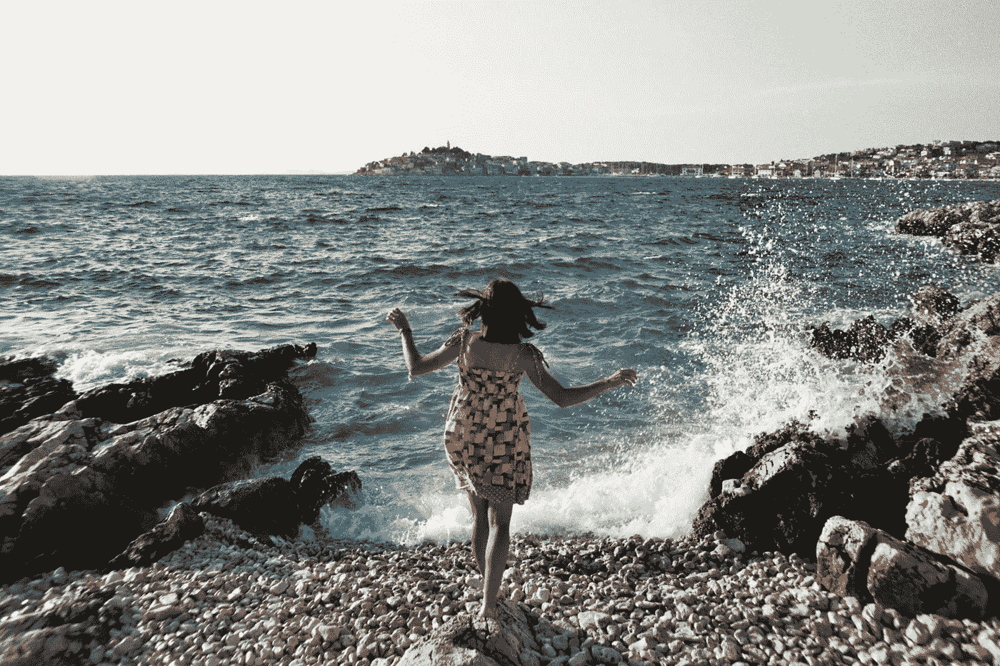
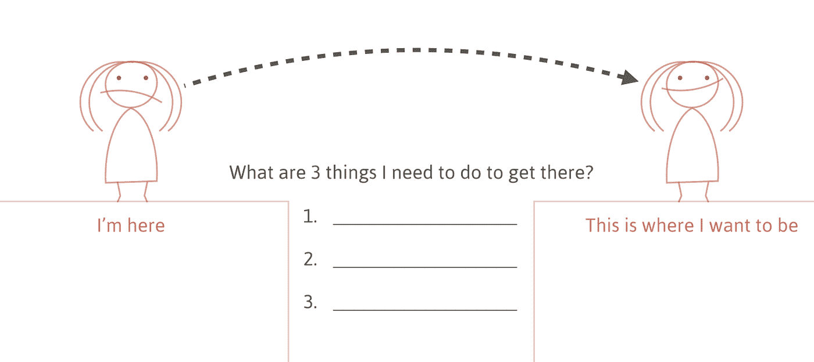

# 走出你的创作窠臼

> 原文：<https://medium.com/swlh/get-out-of-your-creative-rut-57b8f7b9e8da>

过去的两个星期糟透了。

感觉我的创造力被扼杀了。

有一天我醒来，我能感觉到:我是在墨守成规。

吓到我了。

我靠想象谋生。当想法没有出现时，我会绝望。

> “来吧，大脑！给我点东西！”

通常，我有相反的问题。想法像尼亚加拉瀑布一样从我这里涌出。但这一次，我举起杯子，希望得到一点灵感；但是没有人来。

**你有过这样的感觉吗？你工作、创造和制造的动力消失了？(如果是的话，[在这里告诉我吧](http://twitter.com/home?status=%40mijustin%20I%E2%80%99ve%20definitely%20been%20in%20a%20creative%20rut%20before.))**

在过去的几天里，我逐渐恢复了动力。

以下是一些对我有帮助的事情:

# 不舒服

当我们情绪低落时，我们倾向于冬眠。我们想在温暖的毯子下，吃麦片，闷闷不乐。或者，我们从 Twitter、脸书和 YouTube 等网站寻求安慰。

不要寻求安慰。你需要给自己一些不熟悉的东西。

我强迫自己开车 45 分钟到邻近的城镇去看一部纪录片。

我知道这对我有好处，因为:

*   在开车的过程中，我会有很长时间不受干扰地思考。
*   这部电影会让我接触到新思想。
*   我会认识新的人

摆脱创造性思维定势的最快方法是让自己不舒服。这意味着:

*   让自己置身于新的、不熟悉的环境中
*   花点时间和你平时不怎么来往的人在一起。
*   承担风险。尝试新事物。做一些非传统的事情。

不适就像一个没有电的创造性电池的跳线。

# 帮助别人

缺乏动力，我们转向内部。我们努力培养我们的创造性灵魂。

但是自我关注不是答案；外向焦点是。

我的朋友戴夫需要一个网站。我可以做网站。

通常我没有时间为朋友做这样的项目。我太专注于自己的事情了。

但是，因为我缺乏灵感，我没有任何目前的项目。

所以我帮助 Dave 为他的公司建立了一个简单的静态网站。

我们一起度过了早晨。我可以说，推出这个网站代表了戴夫和他的新业务的重大进展。看到这给了我能量。

帮助别人可以更新你的精神。

# 吃

太多时候，当我墨守成规时，我会强迫自己呆在办公桌前。“不完成某件事，我哪儿也不去，”我会说。

这就像试图从岩石中挤出水一样。

离开你的桌子。出去吧。散散步。躺在草地上。坐在河边。深呼吸。

我试着练习一种轻松的冥想方式，在这种方式下，我不会专注于任何特定的事情，我只会专注于呼吸。我从十次呼吸开始:慢慢地吸气，慢慢地呼气。

你的大脑不是你的奴隶；你需要让它漫游。

# 重新关注你的目的地

一旦我感觉到我的创造能量回来了，我拿出一张纸，画了这样的东西:

我在一边写道:“这就是我现在的位置。”

在另一边，我写道:“这是我想去的地方。”对我来说，这个目的地代表了我的企业的一个具体收入目标。

中间，我问:“要到达那里，我需要做哪三件事？

重新关注我的现状和我的目标之间的差距，是一种激励。它还帮助我想出了我可以采取的具体行动。

当你墨守成规时，行动会创造动力。

# 睡觉前问这两个问题

有了新的动力，我能够开始跟踪我的进展。

我发现最有效的方法是每天晚上问这些问题:

1.  我今天完成了什么？
2.  我明天要做什么？

跟踪每天的成就是对你速度的视觉提醒。在我把它们列出来之后，我会再看一遍，然后在上面打个“x”或“✔.”“X”代表任何对我实现目标没有帮助的事情。复选标记是帮助我取得进步的行动。

问自己“明天我要做什么”会为你的第二天创造目标。你想完成哪三件大事？现在，当你醒来时，你不会问:“我今天该做什么？”你已经知道了。

# 健康习惯

我的朋友科里提醒我习惯的重要性。

当我们情绪低落的时候，我们想喝啤酒，熬夜，吃垃圾食品；这只会让你感觉更糟。你不能控制世界上正在发生的事情，但是你可以按时睡觉，吃蔬菜，去跑步。

还有职业习惯。在合理的时间开始工作。早上做你的创造性工作。下午回复邮件。为您的代码编写测试。保持你的桌子干净。备份你的硬盘。

在健康习惯上下双倍赌注。当你处于困境时，他们会支持你。

我希望这些想法对你有所帮助。本文发源于我的快讯( [*订阅此处*](https://justinjackson.ca/newsletter) *获取未来文章)。*

干杯，
贾斯廷·杰克逊
@ mi Justin

## 这对你有帮助吗？给它一个♥，并帮助其他人找到它！

*原载于 2016 年 11 月 18 日*[*Justin Jackson . ca*](https://justinjackson.ca/rut/)*。*