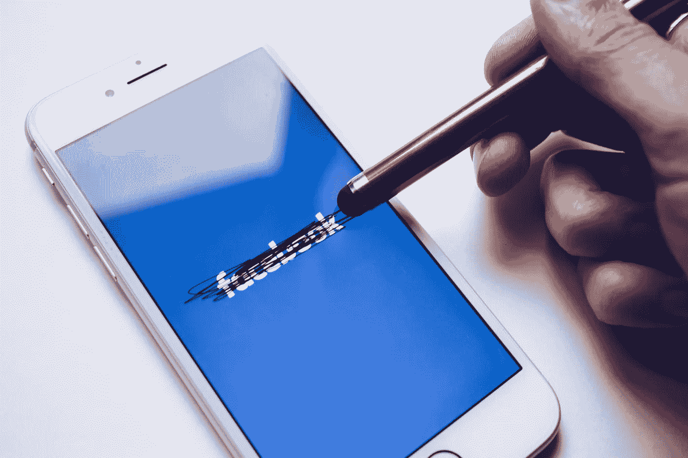

# 摆脱脸书应用程序！

> 原文：<https://medium.com/swlh/get-rid-of-the-facebook-app-39eaed64c763>

## 是的，和你一样，我想我会后悔的。但我真的没有！

我不是想逼你去做数码排毒或什么的。因为，正如 AJ Jones 在他的文章“[为什么数字戒毒应该消亡](/s/story/the-digital-detox-is-dead-but-we-still-need-to-use-technology-more-wisely-31f7964a96d8)”中所说，进行真正的戒毒肯定是重新控制你在技术、智能手机使用和社交媒体方面的行为的最糟糕的方式。这也可能是最好的方法…