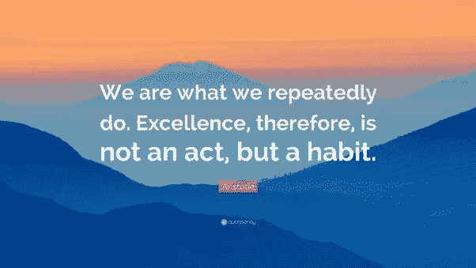

# 彻底摆脱你无益的懒惰

> 原文：<https://medium.com/swlh/get-rid-of-your-unproductive-laziness-once-and-for-all-8e2c9b459482>

## 当你看到自己浪费了多少时间时，你会震惊的…

Photo by [Lidya Nada](https://unsplash.com/photos/_0aKQa9gr4s?utm_source=unsplash&utm_medium=referral&utm_content=creditCopyText) on [Unsplash](https://unsplash.com/search/photos/strength?utm_source=unsplash&utm_medium=referral&utm_content=creditCopyText)

我花了很长时间才弄明白如何找到自律的冰山一角，更不用说潜藏在下面的基本原理了。

> 简单的事实是，机会对你不利。

在 2018 年，我们生活在一个随时可以拥有一切的世界。

见鬼，你甚至不需要出门去杂货店买食物。我们已经发展了如此巨大的规模经济，以至于如果你住在某些地区，你所要做的就是去一个网站，点击几个盒子，一两天后你就会有你的食物。

从这个意义上来说，生活是非常了不起的。

然而，这对我们生活中*有意义的*方面有什么影响？

> “任何值得做的事都需要时间。”

不管是你母亲告诉你的，还是老师告诉你的，或者你在浏览 Instagram 时偶然发现了这句话，这句格言仍然适用。

这种并置出现在我们现在的社会以及它提供的所有*即时满足*。

## 自律就是牺牲现在，与未来的自己讨价还价。

那到底是什么意思呢？

嗯，它可以在许多情况下出现，但它广泛地意味着现在就投入工作，播下种子，这样你未来的自己就可以收获成功。

在构建有意义的东西时，生活中没有捷径。

仅仅告诉你自己，“我会遵守纪律”是不够的，至少在我的经历中是这样。人类的大脑不是那样工作的。有反对我们的外部制约力量(社会和技术的即时满足力量)和人类大脑“放松”和懒惰的习惯在我们的生活中创造了一种可怕的昏睡鸡尾酒。

*   当我们看到含糖食物时，我们发现很难抗拒。
*   当我们想到健身的时候，小睡一会更容易。
*   当我们该去睡觉并睡个好觉的时候，我们会打开《纸牌屋》。

Photo by [Noah Buscher](https://unsplash.com/photos/11lDEHFy_hA?utm_source=unsplash&utm_medium=referral&utm_content=creditCopyText) on [Unsplash](https://unsplash.com/search/photos/kid-with-candy?utm_source=unsplash&utm_medium=referral&utm_content=creditCopyText)

感觉就像我们在原地打转，心里想着我们要遵守纪律，然而我们却一次又一次地陷入这些懒惰的陷阱。

好消息是有办法克服和设置再次跌倒的障碍。

无论你是在创业，却找不到日常工作的纪律，还是你可以找到写回忆录的纪律，以下这些步骤将帮助你建立纪律，实现你的目标。

# 将你的“目标”重组为“任务”

目标是有压力的。当你最终构建出你想要的东西时，你就为自己的失败或成功做好了准备。

本质上是二元的。

任务很有趣。

你有一个最终目标，为了达到这个目标，你会遇到一些障碍。它让你成为自己故事中的英雄，而不是二元的“成功”或“失败”

# ***巩固你的地盘。***

Photo by [Wang Xi](https://unsplash.com/photos/kJQ6cDyodAM?utm_source=unsplash&utm_medium=referral&utm_content=creditCopyText) on [Unsplash](https://unsplash.com/search/photos/painting-easel?utm_source=unsplash&utm_medium=referral&utm_content=creditCopyText)

一个人在哪里锻炼？

一个人在哪里写作？

一个人睡在哪里？

为了优化你的自律，一个最佳的空间是必要的。对我来说，我每天都在洛杉矶市中心的同一家咖啡馆写作。

我这样做是因为这个空间是我的“工作圣殿”我的公寓是一个休闲、睡觉和烹饪的地方。我在市中心跑步，在单独的健身房里练习 HIIT 和拳击。**我创造了一些空间，当我在那里时，这些空间可以让我的大脑执行特定的任务或扮演特定的角色。**

# 让你的早晨保持一致。

早晨和最初几个小时的活动为一天余下的时间定下了基调。

科学家和自助大师多年来一直在宣扬这一知识。为了培养自律，保持早晨的一致性是最重要的。

对我来说，这甚至包括我起床的顺序**铺床>撒尿>刷牙>漱口>淋浴>在浴室穿好衣服>吃同样的早餐(全希腊酸奶加花生和纯素食蛋白奶昔)>边吃边看一个快速的教育视频>拿起笔记本电脑>走到咖啡馆。**

我这样做几乎没有变化。它变得自主，并渗透到其他自主自律中。

# ***偷耐克的口头禅。***

每当我感觉到拖延的感觉，我就偷耐克的口头禅， ***“只管去做。”***

我一遍又一遍地告诉自己 ***“去做吧。”***

我知道这听起来很俗气。当我对自己说了足够多的时候，我脑海中就会出现一些不同寻常的东西。就像是思想接管了我的身体自己在动。

*   也许我感觉很懒，不想去打那个沉重的袋子——我这样告诉自己。
*   也许我不想写——我这样告诉自己。

它会改变你大脑中的某些东西。当你开始陷入低迷时，记得告诉自己这一点需要正念。

# ***加强你的饮食。***

这似乎很容易成为谜题的一部分。

你吃的东西在很大程度上决定了你如何容易屈服于眼前的满足而不是延迟的回报。

当你的橱柜和冰箱里堆满了高度加工的含糖垃圾时，你的大脑也会如此。

> 花点时间想想你上一次吃蛋糕是什么时候。这可能让你事后感到麻木和昏昏欲睡，不是吗？

如果你用麻痹性食物填饱你的脸，你应该如何解决自律的障碍？你需要给你的身体补充适当的营养，当遇到这种情况时，要抵制“简单解决”的冲动。

# 用富有成效的工作来充实你的一天。

> “游手好闲是魔鬼的工作。”

这很有趣。

在写这篇文章的几个小时前，我正在和我的拳击教练聊天。

他最近和他的女朋友分手了，因为他向她求婚了(不幸的是，她拒绝了求婚)。我们在谈论当你白天什么都不做时，你会觉得很懒，这是多么有趣。然而，当你的一天排得满满当当时，你的能量水平是最重要的。

当你安排好你的一天，并找到富有成效的事情来占据组成它的各种时间时，你强迫自己用一种有纪律的方法来克服障碍。

当你发现自己无事可做时，懒惰便悄然而至。在你的一天中创建系统，让自己忙碌起来(但是不要让它充满“忙碌的工作”,保持高效)。

最终，为了建立自律，你必须构建一个存在的系统，而不是一个光开关目标。

每天早上醒来，你都有另一个机会去对抗那些试图把你压垮的阻力。当你建立起适当的防御工事来对抗抵抗时，你会发现你的自律开花结果。

[*https://bit.ly/2H3IUyT*](https://bit.ly/2H3IUyT)

# 还有谁想自己当老板？

## 我提供给你一个经过测试和验证的 6 部分指南，它包含了强大的概念，可以帮助你识别、规划、成长和完成你的创造性追求。

# [> > >在这里获得免费指南< < <](https://mailchi.mp/4b982beed325/free-6-step-course)

## 学到了什么？按住👏说“谢谢！”并帮助他人找到这篇文章。

## 还评论！你喜欢什么？你讨厌什么？你在做什么？

## 这篇文章发表在《T4》杂志《创业》(The Startup)上，这是 Medium 最大的创业刊物，拥有 339，876+读者。

## 在这里订阅接收[我们的头条新闻](http://growthsupply.com/the-startup-newsletter/)。

