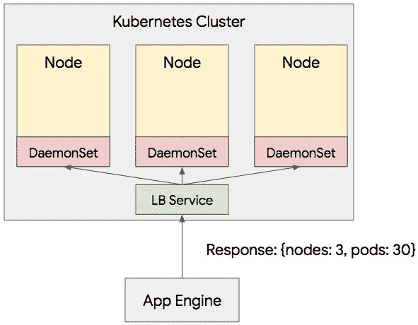
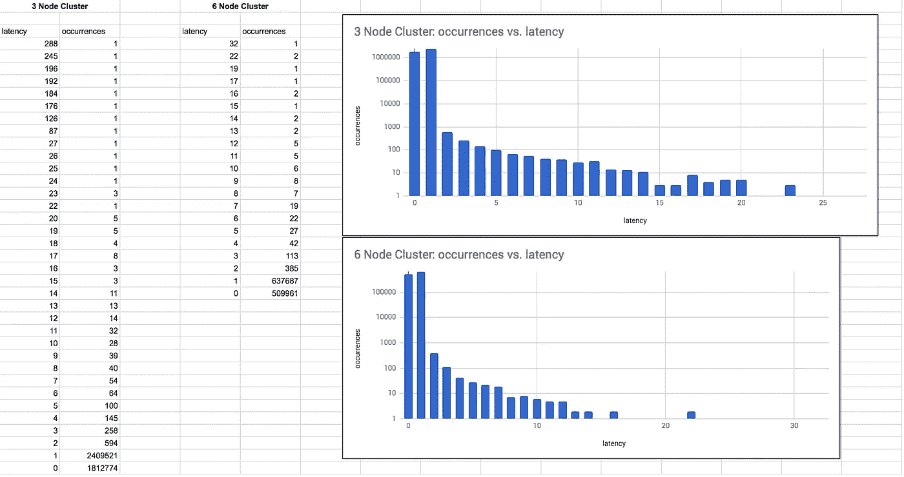

# 免费获得三倍于您的 Kubernetes 集群的容量！好得难以置信？

> 原文：<https://medium.com/swlh/get-three-times-the-capacity-for-your-kubernetes-cluster-for-free-too-good-to-be-true-6f0c3032c296>

几个月前，我在黑客新闻上看到一段[对话。一个海报假设你可以在一个](https://news.ycombinator.com/item?id=17241412)[谷歌 Kubernetes 引擎](http://g.co/gke)集群中运行多个节点，价格与你使用[可抢占虚拟机](https://cloud.google.com/preemptible-vms/)的价格相同。

[计算一下](https://cloud.google.com/products/calculator/#id=7b38b894-861c-4720-a477-15025f89f6d0)，你可以以更低的价格获得 3 倍的容量，而且因为 Kubernetes 负责重新安排 pod，你不必担心实例被抢占。听起来很棒，对吧？

从我的个人经验和与多个高级 GKE 用户的交谈来看，这种节约成本的方法似乎确实有效。我实际上遇到过一个大型 GKE 客户(500 多个节点),他们在 100% PVM 上运行所有无状态生产工作负载。他们报告说没有任何问题，并且对节省的成本非常满意。

一切都准备好了吗？好吧，下一个评论攻击了这个想法，说**“你的信息明显暗示你对你所建议的东西没有经验，因此你没有意识到它的缺点。”**

哇，好刺耳！这个人是对的吗？纯粹在 PVM 上运行您的工作负载是不是太疯狂了？或者，您真的可以获得 3 倍的容量而不会有任何负面影响吗？在网上争论只能让你到此为止，所以我决定亲自做一个测试。

***TL；DR:*** *它工作的* ***出奇的好*** *，但是有很多注意事项，我只会在特定的情况下推荐给高级 Kubernetes 用户。* ***一般来说，如果你在你的 GKE 集群中没有在某种程度上使用 PVM，你可能会把钱留在桌子上。***

# 我们需要的数据

为了以最可靠的方式进行测试，我想收集:

1.  在任何给定时间运行的吊舱的平均数量，
2.  群集中的平均节点数
3.  豆荚数量最少
4.  最少的节点数

如果您可以在一个常规的 GKE 集群上运行 10 个 pod，那么您应该能够以相同的价格在一个可抢占的 GKE 集群上运行 30 个相同的 pod。但是如果 PVM 关闭如此频繁，以至于吊舱的平均数量少于 10 个，或者即使吊舱的最低数量低于 10 个，那么就会出现中断。对于节点来说也是一样:如果低于 1，PVM 将导致中断。

# 集群

为了给我的集群最好的表现机会，我决定使用一个 [GKE 区域集群](https://cloud.google.com/kubernetes-engine/docs/concepts/regional-clusters)。这些真的很酷，因为它们自动分布在一个区域的所有三个区域中，并为您提供多个主节点以实现高可用性。更重要的是，它可以防止特定区域中的 PVM 节点缺货，如果 Google 计算引擎系统需要更多虚拟机用于该区域中的标准节点，就会发生这种情况。

我创建了两个集群，以便测试两种不同的场景。

第一个是三节点 PVM 集群，这是 GKE 集群的默认大小。但是因为它们都是 PVM，所以这个集群比单个 n1-standard-1 实例更便宜。我想说，这种设置非常适合那些想要尝试一下或者正在运行测试工作负载，但是想要一个 24/7 运行的集群的人。

第二个是六节点 PVM 集群。这是三节点集群的两倍，但仍比标准虚拟机的三节点集群便宜 30%。我觉得这对于生产系统来说是一个更现实的测试，因为理论上你可以将产能翻倍，同时降低成本。

# 数据收集

为了收集数据，我知道我必须把一些不同的服务放在一起。

首先，我需要从 Kubernetes API 实际收集统计数据。为此，我创建了一个公开 REST 端点的 DaemonSet。这个 DaemonSet 将使用 Kubernetes APIs 来找出集群中运行了多少节点和单元。我选择使用 DaemonSet，因为这是确保每个节点上始终有一个副本运行的简单方法，所以除非所有节点都宕机，否则我至少可以 ping 其中一个节点。

第二，我需要一些集群外的东西来实际 ping 这个 DaemonSet 并收集数据。为此，我使用了[谷歌应用引擎](https://cloud.google.com/appengine)和[谷歌云调度器](https://cloud.google.com/scheduler/)服务。我使用 cron 服务每分钟运行一次我的应用程序引擎功能，但是我需要更多的粒度。所以，我在我的应用引擎函数中运行了一个循环，每秒执行 60 次。不是超级科学，但它的工作和简单的设置。



现在是豆荚。我希望每个节点运行 10 个 pods，所以我只使用了一个简单的 nginx 部署，并设置 replicats = #Nodes x 10。

最后，我需要一个地方来存储和查询这些数据。尽管它的大小只有 100 MB，我还是使用了 Google BigQuery，因为它是无服务器的，不需要任何设置，并且易于使用。我的模式非常简单，对于对 DaemonSet 的每次调用，我将存储 pod、节点的数量，以及调用返回所需的等待时间。延迟时间在很大程度上取决于随机的网络条件，但我预计该时间在很低的秒范围内。

现在到了无聊的部分。等待中。我需要至少一个月的数据才能做出任何声明。所以我把一切都部署好了，暂时忘了这件事。很长时间…

# 结果呢

你很幸运，我已经做了等待的部分！

首先，让我们看看 pod 和节点的平均数量和最小数量是多少。我们可以通过一个简单的 SQL 查询来实现:

```
SELECT 
  avg(nodes) as avgnodes, 
  avg(pods) as avgpods, 
  min(nodes) as minnodes, 
  min(pods) as minpods
FROM <DATASET>.<TABLE>
```

对于三节点集群，结果如下:

```
╔════════════════════╦═══════════════════╦══════════╦═════════╗
║      avgnodes      ║      avgpods      ║ minnodes ║ minpods ║
╠════════════════════╬═══════════════════╬══════════╬═════════╣
║ 2.9984359359062274 ║ 29.99116207854014 ║        1 ║       0 ║
╚════════════════════╩═══════════════════╩══════════╩═════════╝
```

对于六节点集群:

```
╔═══════════════════╦═══════════════════╦══════════╦═════════╗
║     avgnodes      ║      avgpods      ║ minnodes ║ minpods ║
╠═══════════════════╬═══════════════════╬══════════╬═════════╣
║ 5.996882929477012 ║ 60.00895171877486 ║        5 ║      30 ║
╚═══════════════════╩═══════════════════╩══════════╩═════════╝
```

从这些数字中可以看出一些有趣的东西。首先，平均数字超级接近最大数字。这向我们展示了 GKE 从 PVM 节点关闭中恢复的速度非常快。记住，PVM 总是在 24 小时后关闭，所以这些关闭事件一直在发生。

*注意:六节点集群的 avgpods 略高于最大值。我认为这是因为一致性问题和 pod 处于待定状态或其他原因。不是 100%确定。*

下一件事是最小数字。首先，很明显 PVM 引起了一些巨大的流失。对于较小的集群，我们下降到 0，这是不好的。对于较大的集群，我们降到了最大值的一半，这一点也不差。请记住，我们正在以 30%的低成本运行两倍的容量！

这些数字只告诉了我们故事的一半。平均值和绝对最小值可能非常具有欺骗性。我们真正关心的是请求的分布，以及 p50、p90 和 p99 的延迟。因此，让我们编写一个新的 SQL 查询来给出这些数字。

```
SELECT 
  latency, 
  count(*) as occurrences 
FROM (
  SELECT 
    pods, 
    TIMESTAMP_DIFF(time, 
                   LAG(time) OVER (ORDER BY time ASC), 
                   SECOND
    ) as latency 
  FROM <DATASET>.<TABLE> 
  ORDER BY time
)
GROUP BY delta 
ORDER BY delta DESC
```

好的，这个查询要复杂得多(感谢 BigQuery 团队的同事们的帮助！)，但它给我们的结果是这样的:

```
+---------+-------------+
| latency | occurrences |
+---------+-------------+
|      10 |          28 |
|       9 |          39 |
|       8 |          40 |
|       7 |          54 |
|       6 |          64 |
|       5 |         100 |
|       4 |         145 |
|       3 |         258 |
|       2 |         594 |
|       1 |     2409521 |
|       0 |     1812774 |
+---------+-------------+
```

这告诉我们等待时间为零秒、一秒等的请求的数量。

以下是所有数据和一些图表:



[See the data here](https://docs.google.com/spreadsheets/d/e/2PACX-1vS_lGkkZnmHVMoCGQ35MtEfYrb9eLLbDysSC7_M3m3DO-1SDRw-vWUAn_fXAtvK8onqYU3QWEUpumHQ/pubhtml?gid=0&single=true)

我们可以看到，绝大多数请求都在两秒以内，这很好。

但是，对于较小的集群，有一个需要 200 多秒才能完成的长尾请求。这显然是集群降到零节点的时候。

**这是真正酷的部分。两个集群的 P99.9 延迟仍然低于两秒！**

# 结论

PVMs 在 GKE 的表现比我预期的要好很多。我原以为它们会很好，但它们会在很长一段时间内同时下跌。虽然较小的集群确实会出现这种情况，但较大的集群基本上足够大，可以很好地摆脱节点变动。

因为大型集群中单个节点宕机的影响小于小型集群，所以我认为集群越大，这种变动影响工作负载的可能性就越小。

使用 PVMs 还会在你的系统中创建一个自然的[混沌猴](https://en.wikipedia.org/wiki/Chaos_Monkey)。因为节点总是在变动，所以您的代码总是要接受弹性测试。这太棒了，因为您的基础设施为真正的中断做了更充分的准备。

当然，运行有状态的工作负载(比如数据库)会复杂得多，甚至是不可能的。此外，由于潜在的风险，在 PVM 上运行需要尽可能长的正常运行时间的东西也更具挑战性。对于这两种场景，您可以轻松使用 [GKE 节点池](https://cloud.google.com/kubernetes-engine/docs/concepts/node-pools)来创建可抢占和标准虚拟机的混合，以满足您的需求。

由于自动化和规模经济，云的核心承诺一直是降低成本。我真的觉得如果你没有利用与 GKE 的 PVMs，你就错过了那个承诺。

使用 PVM 创建集群只需单击一个标志或按钮，您还在等什么？


“group of people doing fist bumps” by [rawpixel](https://unsplash.com/@rawpixel?utm_source=medium&utm_medium=referral) on [Unsplash](https://unsplash.com?utm_source=medium&utm_medium=referral)

# 最后一句话

对于这个测试，我只关心正在运行的 pod 的数量。在现实生活中，您会有多个微服务，每个微服务都有自己的 pod。如果单个微服务的所有 pod 都宕机，这是一个坏消息。您可以使用 PodAffinity 规则来确保这种情况不会发生。

这篇博文有一些关于 PodAffinity 的好细节:

[https://medium . com/kok ster/scheduling-in-kubernetes-part-2-pod-affinity-c2b 217312 AE 1](/kokster/scheduling-in-kubernetes-part-2-pod-affinity-c2b217312ae1)

同样，一些微服务不能容忍 PVM 造成的持续流失。您应该使用 NodeAffinity 来确保这些微服务不会被调度到 PVM 上。

这篇博文有一些关于 PVM 的 NodeAffinity 的很好的细节:

 [## 使用可抢占的虚拟机将 Kubernetes 引擎账单削减一半

### 可抢占虚拟机的固定价格比常规虚拟机低 80%,但不幸的是，它们的广告宣传主要针对…

medium.com](/google-cloud/using-preemptible-vms-to-cut-kubernetes-engine-bills-in-half-de2481b8e814) [](https://medium.com/swlh)

## 这篇文章发表在 [The Startup](https://medium.com/swlh) 上，这是 Medium 最大的创业刊物，有+388，456 人关注。

## 订阅接收[我们的头条新闻](http://growthsupply.com/the-startup-newsletter/)。

[](https://medium.com/swlh)