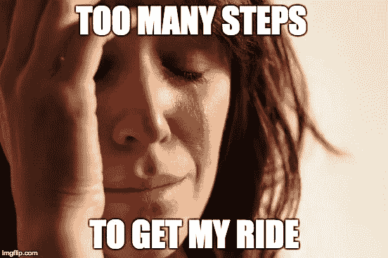

# 使用亚马逊 dash 按钮乘坐优步

> 原文：<https://medium.com/swlh/getting-a-uber-ride-using-the-amazon-dash-button-c4dcef42051c>

[**见本文新 AWS 物联网按钮**](/@geoffrey___/summon-uber-with-the-new-amazon-dash-button-876b54385dec#.z9k5awmz3) 的改进版本

这个周末，我从[这篇很棒的帖子](/@edwardbenson/how-i-hacked-amazon-s-5-wifi-button-to-track-baby-data-794214b0bdd8)中得到灵感，决定订购一个[亚马逊 Dash 按钮](http://www.amazon.com/b/?node=10667898011)。我知道这个小设备可以帮我解决一个自从我 3 个月前搬到旧金山以来一直存在的痛点。

像许多人一样，我每天使用 [**【优步】**](https://uber.com) 上下班*——看看你优步，我很想看看每月的通勤计划！*每天早上，我都经历着同样的套路——解锁手机，打开 app，一遍又一遍地选择同一个取车地点，同一个目的地。我知道，第一世界的问题，对吧？

> 但我喜欢优化，所以如果所有这些都可以通过一个按钮来完成呢？

目标很简单；按下一个按钮——很方便地位于我的浴室里，我只需要做好准备，然后离开我的公寓。汽车会就在那里等我，根本不用碰我的手机。

今天早上我做了第一次现场测试，棒极了！

下面是我是如何做到的，你也可以尝试一下——但是，如果你更喜欢直接看代码，请访问[**Geoffrey/Uber-dash**](https://github.com/geoffrey/uber-dash)**。**

## 用亚马逊应用程序设置按钮

首先，你需要设置你的 dash 按钮，以便使用亚马逊应用程序与你的网络进行通信。遵循您可以在**亚马逊应用** — **您的账户**—**Dash devices**—*下找到的步骤，在最后一步让您从亚马逊选择订单之前，小心退出设置过程。* *:说话 _ 无 _ 恶:*

## **获取按钮的身份**

使用并运行本文中[提供的第一个 python 片段，可以找到你的按钮 **(** 例如***A0:02:DC:B1:3d:B2***)**的 **MAC 地址**。**](/@edwardbenson/how-i-hacked-amazon-s-5-wifi-button-to-track-baby-data-794214b0bdd8)

## **拦截你的按钮的通信**

**得到按钮的 MAC 地址后，我决定使用 [**Nodejs**](https://nodejs.org/) 和 [**pcap**](https://github.com/mranney/node_pcap) 模块多玩一点网络。我不是网络专家，所以我花了一些额外的时间来玩数据包。我检查了它们的结构，以便发现和提取我感兴趣的部分。**

**不幸的是，我只能找到整数数组形式的 MAC 地址(例如，[160，2，220，177，61，178])。我真的没有进一步搜索，并将数组转换成通常的 6 组由冒号分隔的两个十六进制数字— *如果您知道用这个 pcap 模块从数据包中提取十六进制 MAC 地址的更好方法，请告诉我！然后我将这些与目标的 MAC 地址进行了比较:dash-button。每当它们匹配时，我就调用处理函数。***

**我还必须抑制数据包检测，因为我在一次按压中检测到了几个数据包。**

## **当按钮被唤醒时呼叫优步**

**一旦您能够检测到按钮在您的网络上唤醒，您就差不多完成了。现在你几乎可以做任何你想做的事情，包括使用他们的 API 订购一辆优步汽车。**

**我创建了一个非常简单的 [Express](http://expressjs.com/) 应用程序，它允许你与优步进行 OAuth，以便给予应用程序为你请求乘车的权限。**

**瞧，现在我们只需要监听按钮，并在按钮被按下时调用 **uber.call** 。**

## **获得您的第一次 dash-uber 骑行！**

**首先，克隆[这个回购](https://github.com/geoffrey/uber-dash)并编辑**。/source/config.js** 文件添加你的 dash 按钮 **MAC 地址**，你的**优步申请凭证**以及你要订购的**取货**和**落货坐标**和**产品 id** *(UberX，UberBlack…)* 。**

**使用 **npm install 安装依赖项。****

**运行**。/dash-button.js** 它将监听破折号按钮并调用优步:**

**为了获得按钮被按下时您想要使用的产品 id，您可以在登录后访问[http://localhost:3000/products](http://localhost:3000/products)。它会回复您提货地点的可用产品列表。将您选择的产品 id 复制/粘贴到您的配置文件中，然后重新启动该程序。**

## **捐助**

**请随意[分叉此项目](https://github.com/geoffrey/uber-dash)并提交拉动请求。我知道这是一个快速和肮脏的黑客，所以有大量的改进空间。当我在[checker](https://checkr.com)工作不太忙的时候，我很乐意看你的简历。(我们正在[招聘](http://grnh.se/xual31)！)**

****

***发表于* **创业、旅游癖和生活黑客****

************

**-**