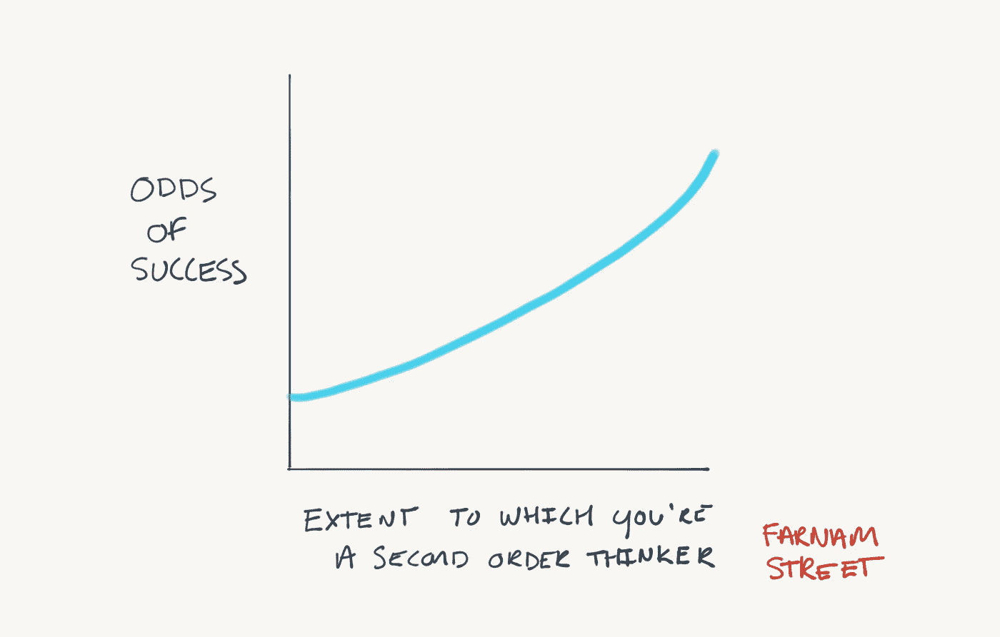

# 从不同的层面思考，获得人生的优势

> 原文：<https://medium.com/swlh/getting-an-edge-in-life-by-thinking-at-a-different-level-44952f0d6214>

你不可能做出好的决定，除非你关注很多不同的事情，而这些事情并不都是有形的。

决策既是科学，也是艺术。

如果我们有目标的话，目标不是做出完美的决定，而是做出更好的决定。

要做到这一点，我们需要好运、更好的洞察力或者更少的盲点。

既然运气并不是一个真正的计划，我们可能应该专注于更好的洞察力和更少的盲点。([法南街](https://www.farnamstreetblog.com/)，我经营的热门网站，致力于消除你的盲点。我们一整天都在阅读，所以你不必在《T4》周刊的多学科文摘中捕捉精华，我们称之为[大脑食物](https://www.farnamstreetblog.com/newsletter/)。)

在生活的大部分时间里，你可以通过去健身房或图书馆，甚至去一所更好的学校来领先他人一步。然而，在思考中，很多你认为能让你进步的东西并不奏效。

你上过什么学校，学过什么课程，甚至有过什么导师，这些都不重要。只有少数具备这些优势的人能够获得更深层次思考所需的技能和洞察力。

在知识经济中，做出更好的决策是关键。不管怎样，剩下的越来越自动化了。如果我们不能做出比算法更好的决策，我们很快就会失业。

**你必须找到一个边缘。你必须换一种方式思考。**

在他杰出的著作《最重要的事情》中，霍华德提出了第二层次思维的概念。

> 第一层次的思考是简单而肤浅的，几乎每个人都可以做到(对于任何试图获得优越感的事情来说，这是一个不好的信号)。第一层次的思考者需要的是对未来的看法，比如“公司的前景很好，意味着股票会上涨。”二级思维是深刻的，复杂的，令人费解的。

第二层次的思考者会考虑很多我们放入决策日志的东西。

比如，可能的结果范围是什么？我是对的概率有多大？后续是什么？我怎么会错呢？

对我来说，真正的区别在于，一级思考者是那些寻找简单、容易和可辩护的事物的人。第二层次的思考者更努力，不接受第一个结论。

如果这听起来像工作，你是对的。确实是。

“这并不容易。谁觉得容易，谁就是傻。”
—查理·芒格

这就是事情变得有趣的地方。

**非凡的表现只能来自与众不同。**一定是那样。当然，低于平均水平的表现也来自于与众不同——不利的一面。

马克斯写道:“问题在于，非凡的业绩只能来自正确的非一致预测，但非一致预测很难做出，很难做出正确的预测，也很难付诸行动。”。

目标不是盲目的分歧，而是一种让你与众不同的思考方式。如果你做了别人都在做的事情，你就不能指望超越别人。

*本文改编自* [*二次元思维:聪明人用什么跑赢*](https://www.farnamstreetblog.com/2016/04/second-level-thinking/) *，那最初出现在* [*法南大街*](https://www.farnamstreetblog.com/) *。*