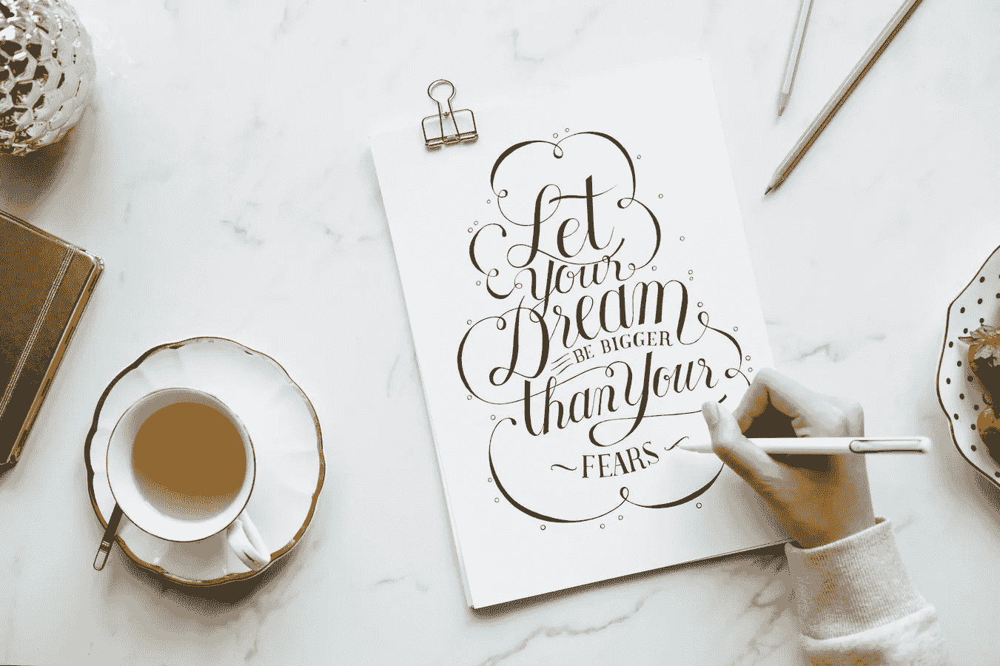

# 重新骑上自我激励的马

> 原文：<https://medium.com/swlh/getting-back-on-the-self-motivation-horse-f68217d3f9b0>

Image by [Rawpixel](https://unsplash.com/photos/l_4KG3TJEbA)

几个月前，我陷入了消极的深渊。我发现自己在逃避以前喜欢做的事情，看了太多的网飞；同时在内心惩罚自己。这是一个恶性循环——我会避免和心爱的人出去，因为我需要工作，但我会没有动力去完成任务，以至于我避免它，并希望我已经出去了。