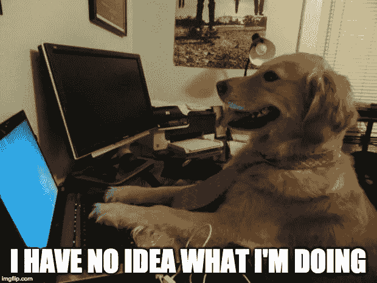

# 对不舒服的感觉感到舒服

> 原文：<https://medium.com/swlh/getting-comfortable-with-feeling-uncomfortable-5c9d4a93beed>

你是否曾经走进一个几乎不知道会议内容的会议，不知道对你的期望是什么？

你有没有听过一个你不认识的术语或首字母缩略词，不知道如何在不暴露你的无知的情况下处理对话？

你有没有走进你的办公室，想到你不应该在那里，你将要篡夺别人的椅子？

你有没有想过，当你对如此多的细节和自己的可信度都不确定的时候，你该如何带领一个专业团队走向成功？

你有没有在团队中感觉自己是唯一的冒名顶替者，不知道他们什么时候会发现你？

如果是这样，你应该熟悉成长为领导者的不适。

由上述和类似情况引起的令人畏惧的感觉是一种逃避风险和自我保护的自然倾向的症状。我们将不确定的情况与威胁我们感知的“自我”的风险联系在一起，“自我”是我们对自己和他人的定义。暴露我们的无知，我们的弱点，我们的恐惧，可能会破坏我们努力实现和努力维护的微妙的社会平衡。这种反应是进化压力的产物，目标不是成为最好的，而是足够好以确保我们基因的生存。

不幸的是，从这个角度来看，领导力不是为了保护我们自己，而是为了重新定义自己而反复失去我们对自己的想法，不断走出我们的舒适区以扩大它，违背我们默认的本能以冒险，失败和学习，通过成长的必要痛苦变得更强大，并在通往卓越的道路上迎接下一个挑战。

虽然不适是成长的一个必要阶段，但有一些想法和实践可以帮助减轻它。

## 你在和人类打交道

不管你打交道的人有多聪明多有见识，他们最终都是人。他们可能已经经历了你的许多经历，他们年轻，不确定，也许在某个阶段是理想主义者，也许是痛苦的，他们遵循驱动你的相同的基本欲望，他们是儿子和女儿，母亲和父亲，某人的朋友，某人的情人。他们不完美，有感情。下次你在令人畏惧的情况下遇到新的人，提醒自己他们人性的基本真相。试着在心里祝福他们。给他们一个真诚的微笑，一个自信的握手，当你问他们怎么样时，表现出真诚的兴趣，直视他们的眼睛。注意他们的名字，当你告诉他们很高兴见到他们时重复一遍，这将帮助你记住他们的名字，并建立更强的联系。这些小小的举动会有很大的帮助，它们会给人留下积极的印象，你可能会发现自己不那么紧张了。

## 了解你自己

了解别人最好的方法就是先了解自己。认识到驱动你的欲望，理解你的高阶功能是如何转化和合理化它们的。如果你想更好地控制你的行动和结果，你需要在它们展开时留意它们的真实性质。你越是提高这项技能，你就越能识别他人的行为模式。

## 你不需要知道所有的事情

虽然做好功课并确保为任何对话做好准备很重要，但在繁忙的日程安排中，你不太可能有时间仔细研究每个细节并通读每份文件。为了对讨论有所贡献并提供指导，你只需要对主题有足够的了解就可以提出正确的问题，收集可以让你跟进的信息，并确定可以提炼细节的合适人选。

将你的分析技巧应用到你在会议中收集的信息中，向利益相关者重复你对他们所展示的内容和你所推断的内容的理解，挑战假设并确保你真正理解。如果你有什么不明白的，不要害怕问。如果你觉得你暴露了对某些人认为显而易见的事情的无知，提醒他们你是一个学习者，你真的有兴趣理解他们希望你帮助解决的问题。你的工作不是什么都知道，而是意识到你所不知道的。

## 只有当你有话要说的时候才说话

你有没有因为忙着想怎么说才显得聪明而忘记别人在说什么？如果你把注意力集中在自己身上，而不是集中在正在讨论的问题上，你就不太可能做出贡献或说出任何聪明的话。

一个好的领导者在说话之前会倾听和观察。你听得越多，观察得越多，你就越了解该说的和不该说的，该看的和不该看的。抵制打断的冲动，学会在你根据收集到的信息充分形成自己的想法后，识别出你有机会介入的短暂间隙。

沉默可以是不确定和自信的标志。学会识别不同之处。

## 诚实

正如我的一个好朋友曾经说过的，美丽的谎言和丑陋的真相之间的区别在于，你对美丽的谎言无能为力。

对利益相关者诚实。如果有问题，承认并告诉他们你正在做什么。如果他们的要求不太可能被考虑，告诉他们，解释你的优先事项和驱动因素。

对你的团队诚实。如果前方有艰难的时刻，人们有权知道。确保你知道你将如何提供帮助，并清楚地表达出来。作为一个领导者，你应该在任何战斗的第一线。

如果有什么事情你不知道，而你认为你应该知道，不要羞愧地承认它，并通过表现出兴趣来花时间学习。

## 提问而不是提供答案

你的工作更多的是提出正确的问题，而不是提供答案。如果你想说服某人某事，最好的方法是通过问他们正确的问题让他们得出相同的结论。你应该带领人们走上一条路，而不是为他们行走。抵制提供僵化观点的诱惑。通过提问来微妙地解释它，问题的答案会引导你去理解它，并不时地为惊喜做好准备，你可能会学到一些新的东西并重新考虑你的信仰。

## 呼吸

在任何潜在不适的情况下，学会放松。专注于你的呼吸，识别并释放你身体的任何紧张。注意你反抗和防御的表情。敞开心扉，以欢迎的态度拥抱这些事件。让你自己变得有可塑性，而不失去你的核心和本质。最小化意外对你造成的伤害的最好方法不是通过僵化，这可能导致裂缝，而是通过延展性，这导致适应。

## 你有责任

你团队中的每个人都有责任，但你最终要负责任。永远不要公开指责你的团队成员，即使他们有错。最终，没有处理好这个问题是你的错。你应该保护你的团队，与团队成员建立牢固的关系，让他们觉得他们可以依靠你，而不是在他们犯错时出卖他们。

你应该创造一个实验和失败都安全的环境。如果你想让你的团队成长，你必须给他们足够的空间去超越他们的舒适区。

如果你的团队中有任何问题，你有责任迅速私下解决。对外界来说，你是你团队的代言人。

你应该是第一个承认错误并承认错误的人。犯错误没关系，只要你能从中吸取教训。

## 保持简单

你将不得不处理很多复杂的事情，所以，无论你在哪里有能力这么做，都要让事情变得简单。不要让流程和程序过于复杂。不要将复杂性应用于质量保证。不要试图通过像对待机器一样对待人来避免问题。自动化低风险容忍度流程，促进共享知识和信任的文化，在这种文化中，质量结果是适应性迭代的产物。

## 谦虚一点

无论你在人生的哪个阶段，你都有很多东西要学。不要认为你比任何人都好。你不知道他们的故事，你不知道他们经历了什么，他们走过什么路，他们学到了什么你没有的教训。

要善良，要公平。始终尊重每一个人。坚定你的脚步，勇敢你的选择。不要拖任何人的后腿，让人们心甘情愿地以你为榜样。

无论代价如何，都不要损害你的正直。只要你保持核心完整，你可以从任何跌倒中恢复过来。

## 永远不要停止学习

腾出时间学习。找导师，读书，保持对知识的渴望，保持对理解的渴求。如果你真的想成长，你需要不断学习。不要只关注与工作相关的主题。横向学习，学习更多关于心理学、哲学、物理学、历史、科学以及任何其他激发你求知欲的学科。扩展你的思维，滋养它的动态结构，因为这最终会对你的生活产生积极的影响。成为一个批判性的思考者，因为这将教会你从假设中辨别事实，从虚假信息和错误信息中辨别信息。

永远寻找事实，挑战假设，做一个坚持不懈的调查者，直到你满意地理解了解决问题所需的真相的所有细微差别和观点。

## 不要偷懒

如果某件事是每个人的责任，那它就不是任何人的责任。每当有不令人满意的解释时，坚持到底，直到你明白为止。每当有你不愿意接受的事情，第一个采取行动去纠正它。以身作则，寻找盟友，让人们共同追求进步。永远不要假设有人会处理一个问题，除非你确切知道是谁。

## 按优先顺序处理

日程繁忙，利益冲突，你不可能让每个人都满意。学会优先处理高价值的任务，并向那些你需要加强关系的人交付成果。要知道，为了到达目的地，你有时需要先发制人，在障碍形成之前阻止它们，从而避开它们。学会政治化，认识到显性和隐性的利益，学会为了获得而给予，但永远追求最终的更大利益。永远不要接受你不舒服的妥协。总会有另一种方法，尽管找到它可能需要更多的时间让问题和环境演变。

# 结论

感觉不舒服往往是成长的症状。如果你想成为一名高效且不断发展的领导者，你需要习惯这一点。提醒自己，今天感受到的不适，就是明天的自信。拓展视野，挑战极限，重新定义自己。接受并公开承认你的人性，通过它建立诚实的联系。了解自己，对自己和他人都要真实。通过表达愿景、提出问题、激发兴趣来展示路径。避免命令，接受一切都是相对于参照系的变化，通过参照系你可以增加你的知识。永远不要停止学习，认识到无论何时你感到不舒服，你都在学习。放松，如果你感到不舒服，你只是在做一个领导者。

## 这个故事发表在 [The Startup](https://medium.com/swlh) 上，这是 Medium 最大的企业家出版物，拥有 298，432+人。

## 订阅接收[我们的头条](http://growthsupply.com/the-startup-newsletter/)。

