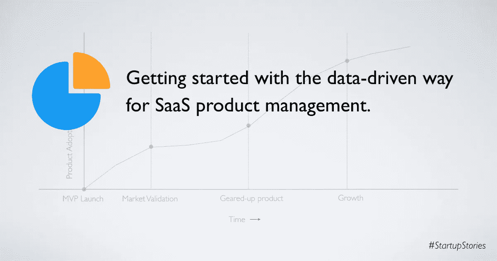
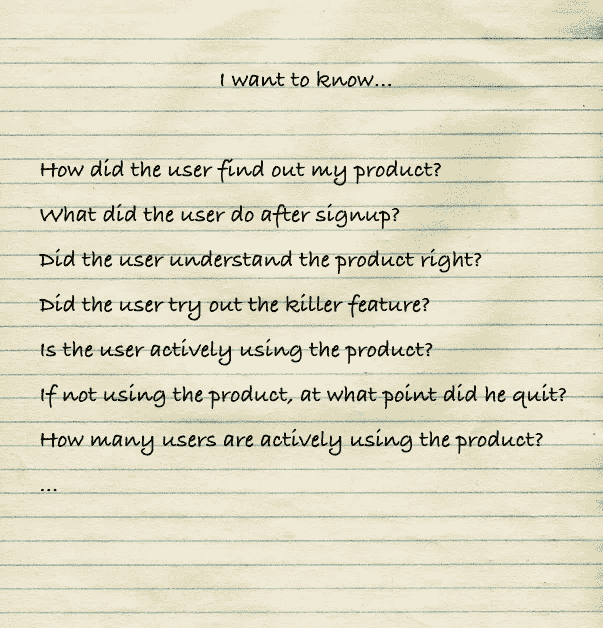
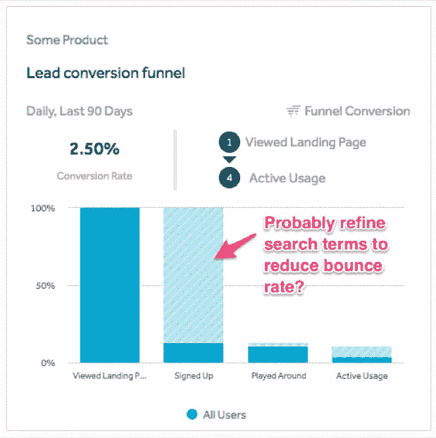

# SaaS 产品管理的数据驱动方式入门。

> 原文：<https://medium.com/swlh/getting-product-analytics-right-for-your-saas-startup-cbc15afc6>

如果你经营着一家 SaaS 的初创公司，并想知道如何做出数据驱动的决策，这篇文章就是为你准备的。在过去的几天里，我一直在为我的 SaaS 产品——[slick pos](https://www.slickpos.com/?utm_source=medium&utm_medium=blog&utm_campaign=product_analytics_article)设置产品分析。这篇文章是我的学习和我如何着手创建我每天都在查找的仪表板的汇编。

**首先，从问题开始**

我们建立的第一个 SaaS 产品，只有谷歌分析和用户注册电子邮件提醒。几天后，我们意识到我们目前的设置是不够的——我们脑海中有十几个没有答案的问题。

产品管理应该是一个闭环反馈过程，知道这些问题的答案将使你达到“产品-市场匹配”。列出具体问题只会确保分析设置的其余部分与您的目标保持一致。不要一开始就把所有的数据都转储到一个仓库中，而是从你最初的问题所需要的东西开始。

**跟踪什么？**

一旦你有了第一组问题，下一步就是确定哪些数据点能够回答你的问题。让我们考虑这个问题“我今天有多少活跃用户？”—这个答案是主观的。一些产品可能会将付费订阅的用户数量视为活跃用户。对于像我们的 SlickPOS 这样的免费增值产品，活跃用户是那些进行了超过“x”次交易并且在过去“y”天内一直活跃的用户。因此，根据逻辑答案，我们着手捕捉所需的数据。最佳做法是将捕获的数据分组如下:

*   *用户身份* —对于 SaaS 的产品来说，大多数关键绩效指标(KPI)都围绕着用户。因此，第一部分是识别用户并在每个用户下对指标进行分组。
*   *用户属性* —用户位置、性别、用户名、账户类型等属性最好作为用户属性来捕获。
*   *用户事件* —这些是您想要针对用户捕获的时间轴活动。例如，特定功能的使用、运行报告等。
*   *用户事件属性* —您可以捕获事件的附加属性，用于过滤或分组。例如，报告下载事件的报告类型属性。

有时候，我们可能想知道某个特定的属性是用户属性还是事件属性。如果您使用该属性来查找用户构成，那么将其捕获为用户属性—例如:“我的用户中有多少百分比是付费用户？”。如果该属性用于表示时间线图表，那么将其捕获为一个事件，例如:“本周有多少“z”类型的报告被下载？”

**设置数据管道**

既然您已经定义了要捕获的数据点，接下来的部分就是如何捕获它们。大体上有两种方法:

*   *定制数据仓库* —如果你有资源和专业知识，你可以建立自己的数据流基础设施和数据仓库。这样做的好处是，你可以完全控制能做什么和产生的成本。
*   *使用现有工具*——我会向大多数早期创业公司推荐这种方法，因为它节省时间，而且你也可以从免费计划开始。你可以检查一下 [Mixpanel](https://mixpanel.com) 或[Amplitude](https://amplitude.com)——这是我个人用过的几个产品。我也强烈推荐使用[谷歌标签管理器](https://www.google.com/analytics/tag-manager)从你的 UI 中捕获事件。标签管理器帮助您从用户界面开始捕获新的事件，并进行新的集成，而不需要每次都更改代码。如果您计划拥有多个数据源和目的地，也可以使用[段](https://segment.com)。

**获取销售线索归属并与用户关联**

对于 SaaS 的产品，能够远程销售是一个主要因素，你可能会运行像 Adwords，脸书广告，搜索引擎优化博客等数字营销活动。虽然广告平台给了你追踪转化率的能力(如果没有转化率追踪，我绝不会开展活动！)，您还应该捕获销售线索属性作为用户属性。虽然你的直接转化可能是注册，但哪些注册会转化为活跃的使用呢？—销售线索归属用户属性可以回答这个问题。

捕捉线索归属的一个重要方面是从第一天起就使用 [UTM 跟踪](https://blog.bufferapp.com/utm-guide)。克隆 [LunaMetrics 活动跟踪谷歌电子表格](https://docs.google.com/spreadsheet/ccc?key=0AliSM9M0UxNsdHJNamhSaTdsXy1TT0VuenladW50TUE&usp=sharing)是一种简单快捷的方式来跟踪你的 UTM 化的网址。除了 UTM，你还可以为你的用户获取初始推荐域名。这里的一个小挑战是将匿名用户(拥有这些初始 UTM 和推荐者属性)与注册用户联系起来——但是我在数据管道中提到的大多数工具都解决了这个问题。

**分析从潜在客户到活跃用户的漏斗。**

A sample lead conversion funnel

销售线索转化漏斗可能是你需要的第一个漏斗。漏斗的一个例子可能是这样的:浏览登陆页面->注册->玩一会儿->成为活跃用户。这个漏斗主要告诉你这些——1)从一个步骤到另一个步骤的转换百分比是多少，你可以在哪里即兴发挥。2)中间是否有什么东西突然坏了，以便你能快速反应并解决问题。

**经常定义和监控健康指标**

为您的产品定义一个或多个健康指标，并确保您每天跟踪它。当我说健康指标时，它本质上不是错误日志，而是表达产品使用情况的关键性能指标(KPI)。以我的产品为例，它是销售交易的数量。对于像脸书这样的产品，它可以是创建的职位数量和份额数量。你必须捕捉这些事件，并能够按时间间隔查询它们，如每小时，每天，每周，每月和每年。您的目标是不断提高指标，同时注意异常情况。您还将开始注意到允许您根据使用模式优化支持和资源的循环模式。

**提出特征审计**

正如开始提到的，您的产品分析设置应该使您能够进行数据驱动的产品管理。功能审计图在这里很有用——它可以帮助您识别产品中的重要模块——您应该更多地关注最常用的功能，如果维护成本不合理，甚至可以考虑减少很少使用的功能。您可以将功能使用记录为用户属性(如 isFeatureXyzEnabled)和事件(用于绘制功能使用频率)。

**跟踪可能引发潜在销售的事件**

现在你已经知道你的营销活动进行得如何，你有多少活跃用户，产品的使用有多活跃，你的客户使用最多的功能是什么——你必须确保从每个潜在客户那里获得最大的回报。这包括倾听用户事件，并促使您的销售团队抓住销售机会。举个例子，在我们的产品中，当客户的短信点数不足时，我们会向他们发送电子邮件提醒。除了这封客户电子邮件之外，我们还提醒我们的销售团队跟进客户，让他购买更多积分。这确保我们不会失去追加销售的机会，即使客户错过了他的电子邮件。

当然，您可以将更多指标添加到您的产品分析仪表板中。我还没有谈到收入指标、客户生命周期价值、客户细分等。也许，我会把这些留到以后的另一篇文章中，但是上面提到的这些应该可以让你开始。该说的都说了，该做的都做了，切记**没有什么可以替代与客户的直接对话**，所以要一直保持对话！

## 这篇文章发表在[《创业](https://medium.com/swlh)》上，这是 Medium 最大的创业刊物，有 286，184+人关注。

## 订阅接收[我们的头条新闻](http://growthsupply.com/the-startup-newsletter/)。

