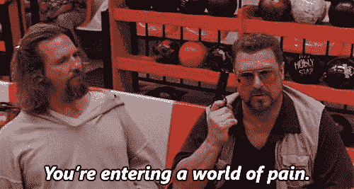
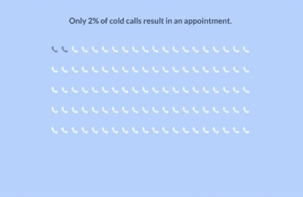

# 在销售中被拒绝不是你能做的选择。但是重新站起来才是。

> 原文：<https://medium.com/swlh/getting-rejected-in-sales-is-not-a-choice-you-can-make-but-getting-back-up-is-24b7a685e36f>

## 被拒绝后如何更好更快恢复的 3 个技巧。

Photo by [photo-nic.co.uk nic](https://unsplash.com/photos/KhHUkOXQo4k?utm_source=unsplash&utm_medium=referral&utm_content=creditCopyText) on [Unsplash](https://unsplash.com/?utm_source=unsplash&utm_medium=referral&utm_content=creditCopyText)

如果你从事销售，没有比**未能**达成交易更好的学习方法了。

被拒绝的滋味可能会让你有点不舒服，但作为销售人员，这是生活中不可或缺的一部分。

A normal day in the world of sales people

然而，被拒绝还是很糟糕。这也使得许多有着光明未来的潜在优秀销售人员无法取得更大的成功。这里有 3 个小贴士可以帮助你在拒绝打击你的情绪之前战胜它:

## **1。从假设无论如何都会有人拒绝你开始。**

检查这些统计数据:

I)只有 2%的陌生电话能促成约会。

[Marketing Donut](https://www.marketingdonut.co.uk/sales/sales-techniques-and-negotiations/why-you-must-follow-up-leads)

ii) 80%的销售需要 5 次跟进才能达成交易。[Hubspot 2016]

他们告诉你什么了？销售是一个艰难而乏味的游戏。所以，当有人拒绝你的时候，不要太在意。可能有很多原因，比如竞争、定价、以前与销售代表的合作经历，或者仅仅是他们的心情。摆脱那种可能是你的错的诱人感觉，是继续打持久战的关键。(这就引出了我们的第二条建议)

## 2.不容易反弹？运用情绪急救。

科学家说，不同人的大脑在面对拒绝时会有不同的反应。2010 年一项[有趣的研究](http://www.pnas.org/content/108/15/6270.full.pdf)发现，当我们经历拒绝和身体疼痛时，我们大脑中被激活的区域是相同的。是的，对一些人来说，被拒绝就像被打了一拳。你可能无法改变痛苦，除非你可以选择不痛苦。

> 拒绝造成的最大伤害通常是自己造成的。就在我们的自尊心受到最大伤害的时候，我们却去进一步伤害它。— [绷绳绞车](https://ideas.ted.com/why-rejection-hurts-so-much-and-what-to-do-about-it/)

暂停一下，思考一下你生命中最有意义的贡献和联系。想办法进行一些情绪急救。想想你的优势，或者和朋友或心爱的一天聊聊天。

记住你以前的成就或客户评价也会提升你的自尊，减少你的情感痛苦，建立你前进的信心。

## 3.拓宽你的关系网，增加你的机会。

继续前进的最好方式是踩下油门，去寻找名单上的下一个潜在客户。尽快。不要让一个凹痕阻止你享受美好的一天。这就是为什么确保你撒下更大的网，在你的盘子里有更多的机会是非常重要的。销售是一个数字游戏。通过增加赢得更多交易的机会来战胜困难。利用最新的智能销售工具，最大化您的机会。不要把你过去的包袱带到下一次销售。摆出积极的态度，让你的下一个顾客为之倾倒。

## 感谢阅读:)如果你喜欢这个故事，给我们一些“掌声”。对我们来说意义重大，也有助于其他人了解这个故事。

## 你试过我们的关闭页面了吗？这是现代销售专业人员的跟进工具，他们喜欢把每一位客户和每一次跟进都当作一件大事来对待。在这里免费试一试。

## 这篇文章发表在[《创业](https://medium.com/swlh)》上，这是 Medium 最大的创业刊物，有 288，884+人关注。

## 订阅接收[我们的头条新闻](http://growthsupply.com/the-startup-newsletter/)。

