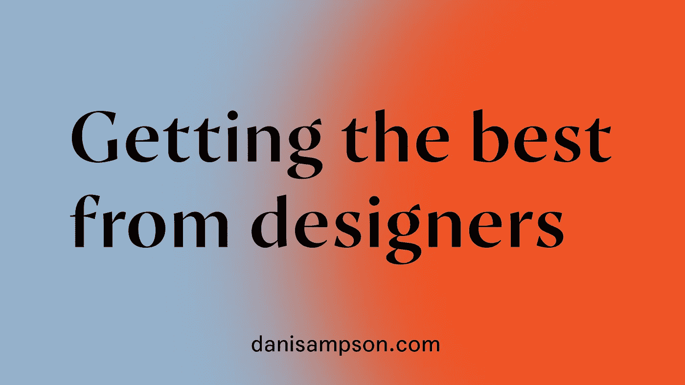
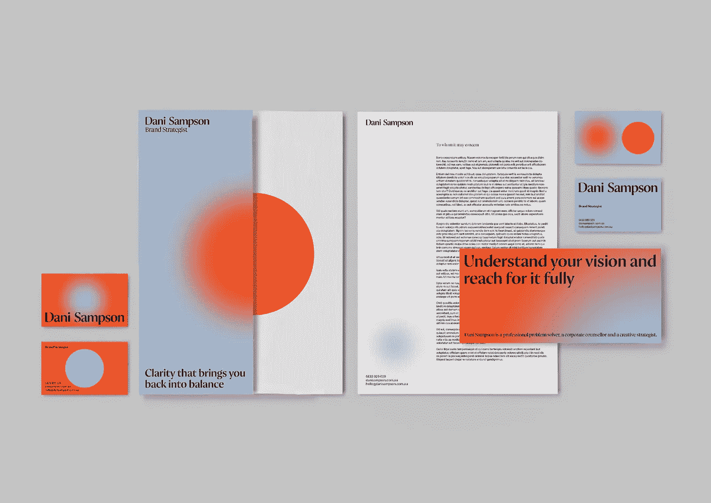

# 从您的设计师那里获得最佳效果

> 原文：<https://medium.com/swlh/getting-the-best-from-your-designers-a971b6c02459>

# 肯德里克·拉马尔演唱了一首名为《一美元值多少钱》的歌曲。

# 我经常发现自己在问，一个品牌值多少钱？更重要的是，它值多少钱？

如果你在墨尔本做品牌推广，一个 logo 探索、调色板和一套字体从 2000 美元到 25000 美元不等。我想再次强调“开始”这个词，因为许多公司已经花费了数十万甚至数百万来打造自己的品牌。

毫无疑问，设计师应该为他们的工作获得报酬。制作符合品牌形象的视觉效果需要细微差别和技巧。他们不只是按下一个按钮，然后设计就发生了，他们通过探索和迭代的过程来寻找一些东西，旨在将你的本质和你做的一切融入一个合理的小图形设备中。

然而，我认为品牌更强大的地方在于它的执行——它应用于数字和印刷资产来讲述你的故事的方式。这些内容可以是名片和小册子、社交媒体资产、视频介绍和结尾、插图、图像等等。真正的价值在于一个品牌在视觉上陪伴内容的能力；文章、演示文稿、社交媒体帖子等。

这可能是一个先有鸡还是先有蛋的问题，先创造视觉效果还是先创造内容。各机构的做法不同。有些人以战略职能为主导，有些人则是纯粹的设计师。我建议几乎总是先制定策略和内容，然后才是设计。这是我从艰难的道路中学到的东西，经历过设计师困惑或不得不逆向设计图形来满足概念。这就是战略如此重要的原因。如果你在开始考虑设计、重新设计、宣传材料，尤其是网站之前就有了自己的战略，那么你就能从设计师那里获得最大的收益。

Animation for [Dani Sampson](https://danisampson.com/) by [Confetti Studio](http://confettistudio.co/) — Based on key brand messaging, ‘Here to clarify, not confuse.’

雇佣一家代理公司来承担一个品牌项目的部分费用是他们需要事先做的探索。沉浸式学习、研讨会，以及(有时)愚蠢的品牌调查，这些调查会问你更喜欢古驰还是普拉达，以及你会把自己描述成哪种鞋…

虽然沉浸和工作坊对于揭示品牌发展的个性和偏好至关重要，但不同的战略家和设计师在提取这些信息并对其进行有意义的理解方面具有不同的技能水平。这就是为什么有人在组织内部工作，或者作为组织的代表，来引导设计机构朝着正确的方向发展是很有帮助的。你要给他们清晰的简介，确保他们与正确的内部人员进行面试，并确保他们没有“错过”他们的品牌概念。

你越早确定你的语气、你的关键卖点、你为利益相关者提供的价值、你可能撰写和分享的文章、你需要参加的活动、你应该在会议上发言，以及所有其他值得采取的营销、沟通和运营举措，以改善你的品牌，视觉品牌化的练习就越准确，视觉效果就越有用。这也意味着，当你是一家会计公司时，你的设计师不会将一个潜在的品牌模型应用到建筑头盔上，或者当你不打算打印一份硬拷贝手册时，你不会设计印刷手册。

我认为已经确定了交付模式的创意产业是广告业。你不是作为一个单独的设计师，而是作为一个组合；文案兼设计师。文案提出想法、书面内容和笑点，设计师匹配创意并以智能视觉驱动。

一个品牌是无价的(我开始听起来像一个美国运通的广告)，它值得做好。设计一个品牌是你不应该偷工减料的事情，因为即使是一个“只是为了现在”的解决方案也会很快过时，发出错误的信息，而且修复起来可能非常昂贵。

正确地开始，从里到外开始，从一个符合目的的战略开始，这个战略将满足你的组织的目标，并最大限度地利用你的设计师。记住，设计师喜欢简洁明了的设计。澄清一下，不要混淆！

Brand developed for [Dani Sampson](http://www.danisampson.com/) by [Confetti Studio](http://confettistudio.co/) — Based on fit-for-purpose brand strategy

## 这篇文章发表在 [The Startup](https://medium.com/swlh) 上，这是 Medium 最大的创业刊物，有+401，714 人关注。

## 订阅接收[我们的头条](http://growthsupply.com/the-startup-newsletter/)。

