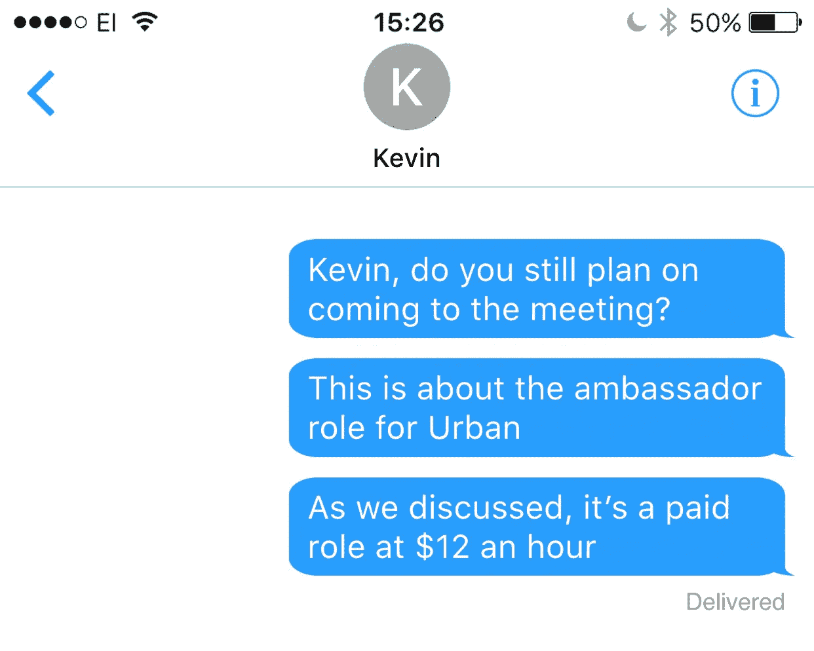

# 鬼影，困扰，火绒:这是万圣节的所有时间！

> 原文：<https://medium.com/swlh/ghosting-haunting-tindering-its-halloween-all-the-time-2c3e7cd99570>

## 当我们不在乎的时候，我们会做鬼。我们害怕时会做鬼。因为说不很难。听到不更难…

SCU 本森纪念中心我正和梅根和艾米丽在一起拍摄照片。

“嘘！希望他没看到我这样！”
*“谁？”*
“我的前任。他只是路过。”
*“那个给你当鬼的家伙？”*
“是啊..他最近一直在看我的 Insta stories "
*"不会吧！你觉得他还想见你吗？”*

**旧金山州立大学**西米给我抓拍的故事梗概。

“我通常只为一个人拍摄一个故事。真的很具体。”
*“那么为什么要做一个故事呢？为什么不聊天？”* “那太逊了，你知道的。我不想让他知道我是为了他。”
*“你在找什么？”* “只是他看了……”

吃过披萨之夜后，我和梅勒妮一起整理我们的营销设备。

*“这么说，萨拉终究还是给我们当了鬼……”* “我知道……她说她非常需要这份工作，以为她会来的！”“这种行为在这里很普遍吗？”很糟糕，但我猜她找到了另一份工作…

我已经在学校外面等了 30 分钟了。没有凯文的踪迹。

**SoMa San Francisco** 我正和我的高中朋友玛雅在一起——终于，有人和我同龄了！

“我有一个坦白…我勾搭上了亚历克斯”
*“什么.他妈的？?"* “还没完呢……从那以后他就不回我电话和短信了”
*“你们不是像……朋友一样吗？我是说，好朋友？”* “嗯，显然重影好友并不违法！”

我给我的实习生发了一条短信，问她事情进展如何。幽灵特工。

我发送了第四封电子邮件提醒，以安排与主动提出与我会面的成功企业家的会面时间。幽灵特工。

我把我的第六条 iMessage 信息发给那位口头承诺投资我们本轮的成功高管。幽灵特工。

我浏览 Instagram。我发现几个月前在我身上做鬼的那个朋友一直在我的故事里出现。

我在我的 Instagram 故事上贴了另一张照片。我跑去和我在萨尔萨舞课上认识的新千年朋友吃饭。

本周的统计数据是:新连接 23 个，幽灵 8 次。我领先了！

练习你令人难忘的技巧；打下面的绿心。我喜欢像那样被鬼缠身！

*PS:人名和地名都是虚构的。体验是真实的。*