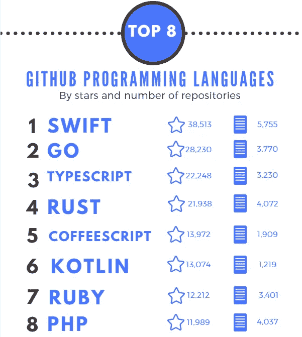
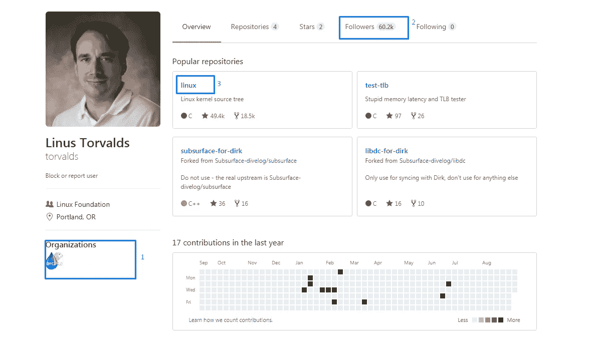

# GitHub:非技术企业家手册

> 原文：<https://medium.com/swlh/github-manual-for-non-technical-entrepreneurs-99922485bf0d>

GitHub 是世界上最大的存储和处理 IT 项目的托管服务，但这还不是全部。该资源与近 2400 万开发者和超过 10 万个组织合作。去年，全球 10 大企业中有 50%使用了 GitHub Enterprise，其中包括沃尔玛、苹果和通用汽车。作为一名企业家，你如何使用 GitHub 开展业务？

# 开源有什么意义？

首先，我们应该解释为什么这么多人愿意免费分享他们的知识。开源社区的基础和我们在 Github 上的理念是分享，以获取和投资我们的技术知识，然后我们也会使用这些知识。我们的员工积极支持这一想法，因此公司定期向其[资源库](https://github.com/stfalcon-studio)添加新的有用解决方案。

# GitHub 的术语

如果你计划在工作中使用 Github，或者你的外包团队使用这种托管，你可能需要知道 GitHub 的俚语。

*   **Git** —版本控制系统，从一开始就保存项目中的所有变更，并可以选择返回到过去的任何变更；
*   **星星**——类似脸书上的点赞(多多益善)；
*   关注者 —注册更新的人。
*   **贡献者** —参与项目开发过程的人员；
*   **Fork**—Github 上公共库的副本；
*   **分支** —用于开发单独的任务；
*   **合并** —将一个分支注入另一个分支的过程；
*   **提交** —记录对存储库的更改；
*   **代码评审** —代码验证是否符合需求、目标和设计；
*   **Pull request** —如果您已经在 fork 中做了一些更改，现在您想要将更改添加到源存储库中，那么您需要发出一个 Pull 请求，将您的更改采纳到主存储库中。存储库的所有者可以接受或拒绝这样的请求。

# GitHub 作为获取信息的手段

GitHub 是一种面向开发者的社交网络，因此，你不仅可以分享项目，还可以关注新闻。作为一名企业家，你可能感兴趣的是:关于项目开发的信息、趋势技术以及与你合作的开发者的简介。

# 关于 GitHub 开发的信息

Github 上大概有 10 TB 的源代码。它是最大的协作 It 开发托管服务，每月有 600 万活跃用户。不是每个人都积极参与开发，有些用户只是关注项目的发展，他们感兴趣。作为一名企业家，你也可能有兴趣成为第一批知道项目(你的潜在竞争对手或项目，你会很高兴看起来像)最新变化的人。当前流行的 GitHub 项目库你总能在这里找到。

# 技术发展数据

[393](https://blog.sourced.tech/post/language_migrations/) 截至 2017 年 7 月，Github 上注册了不同的编程语言。 [Swift](https://github.com/showcases/programming-languages?s=stars) 是现在发展最活跃的，Ruby 和 PHP 也在前 10 名。

对于开发人员来说，订阅编程语言帐户和开发人员使用的技术页面，可以随时了解最新的更新和使用最现代的解决方案。作为一名企业家，你可以使用这些数据来选择一个离岸开发团队——在公司的网站上，你可以看到它是否适用于最流行的技术。

# 开发商的水平指标

在选择离岸开发团队时，除了公司的投资组合之外，客户通常更喜欢查看开发人员的简历。另一种方法是在 Github 上查看开发者简介。

*简介*[*Linus Torvalds*](https://github.com/torvalds)*，Linux 创始人，Git 创建者*

**你可能在开发者的 Github 档案中找到什么**

1.  在个人资料照片下面，你可以找到 GitHub 中**组织**的链接，开发者就在那里——这是了解开发者兴趣的好方法；
2.  **订阅用户** —开发者水平及其在专业环境中声誉的指标之一；
3.  **库**和**活动**——开发者在 Github 项目中的贡献。即使您不是技术专家，存储库名称中的关键词也会告诉您开发人员更关注哪些技术。例如，查看 Linus Torvalds 的简介，就不难理解这个人积极参与了 Linux 的开发:)

顺便说一句，Github 简介不仅对打算雇佣外包团队的客户有意思。包括我们在内的很多公司都关注候选人的 GitHub 账户中是否存在优质开源项目。参与开源开发再次证实了开发者对 IT 世界的兴趣，项目水平是开发者能力水平的另一个指标。如何在 Github 上进行成功的 it 项目，您可以在我们的文章中找到。如何在 GitHub 上创建一个成功的项目你可以在这里找到。

# 你可能不知道的迷人的 GitHub

# Github 不仅仅是软件产品

最大的主机服务被公司和其他领域的专业人士使用:医药、教育、零售和许多其他领域。

2013 年，GitHub 宣布可以以交互式地图的形式存储地理数据，特别是 GeoJSON 文件。GitHub 上地图的功能包括地图变化的可视化和选择显示风格的可能性。这个方向上的一个有趣的项目是——[存储库](https://github.com/benbalter/congressional-districts),它保存了关于美国所有选区的互动故事。

# GitHub 上的州法律

美国、德国、法国和日本的州法律也可以在 Github 上找到。例如，斯蒂芙·莫兰(Steeve Morin)确保将拿破仑时代以来法国民法典的所有变化都放在服务中。德国走得更远，创建了一个德国联邦议院账户——2012 年，公民可以在 Github 上访问最新的法律。从那时起，德国居民不仅可以监督变更，还可以提出请求，但是，要使变更生效，必须得到联邦议院的批准。

# 作为企业家，你如何使用 GitHub

如你所见，GitHub 不仅为开发者提供了广泛的机会——招聘人员、公司甚至政府都在工作中使用它。创业者可以从 GitHub 获得什么:

1.  要找到一个离岸开发团队，并获得更多关于开发人员的信息，您将与；
2.  有可能观察网络和 IT 发展的最新趋势，获得关于越来越受欢迎的项目和技术的新闻；
3.  获取关于你的项目的数据-竞争者和项目图标的发展；
4.  通过创建公司简介并邀请 GitHub 成员成为您项目的贡献者，提高您的解决方案的有效性。

stfalcon.com 工作室在为大公司开发大规模解决方案方面有丰富的经验，我们很乐意为您的企业做一个项目。详细说说你需要什么**。让我们一起创造奇迹吧！**

**最初发表于*[*stfalcon.com*](https://stfalcon.com/en/blog/post/GitHub-manual-for-non-technical-entrepreneurs)*。**

**

## *这个故事发表在 [The Startup](https://medium.com/swlh) 上，这是 Medium 针对企业家和初创公司的领先出版物。*

# *你可以订阅[在这里获取头条](http://growthsupply.com/the-startup-newsletter/)。*

**