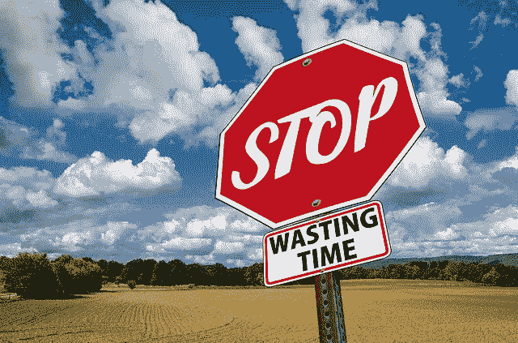

# 放弃，放弃！

> 原文：<https://medium.com/swlh/give-up-giving-up-aff69164cc4d>

如何对借口说不，对梦想说是？

我曾经告诉自己很多借口。也许你也一样。我过去常常为辞职或甚至不开始工作、创业甚至新的爱好找借口，比如:“我没有足够的时间”、“别人可以比我做得更好”、“钱不够用”、“太难了”、“太无聊了”、“我不想等了”、“不值得努力。”我曾经列出过无数个不应该做某事的理由。

它们很少是真正合法的理由。如果你想把一个想法变成梦想，克制住使用上面我反复使用的众多借口中的一个作为出路的冲动。

**“太难了”的借口。**

大多数值得为之奋斗的事情都是艰难的。当你做的时候，他们很少会感到惊奇。但是最终的结果往往值得你付出努力。
目标需要叫做工作的东西。而且很不幸，很多时候，工作感觉不是很好玩。

但是，这里有一个秘密可以帮助你:那些你崇拜的或者和你比较的成功人士也经历过工作和奋斗的艰辛。

不要认为你是特别的，他们在开始和结束时没有精神挑战。确实如此。有时候，通往成功的道路会让人感觉很棒，但这种时候很少。往往可能一点都不觉得好玩。

但是，如果你朝着正确的方向前进，当你征服了所有的子目标，当你看到自己越来越接近时，至少会有成就感。这种感觉本身就是一种奖励。很明显，我们经常误解自己的局限。我们能够做的比我们想象的要多，包括许多我们声称太难的事情。

那么我们为什么要找那么多借口呢？

因为尝试和失败是痛苦的。

大多数时候，我找借口，因为我害怕被拒绝，或者担心自己不够好。从某种意义上说，是我先拒绝了自己，别人才会有机会。我一生中大部分时间都缺乏自尊。不幸的是，我的父母从未真正学会如何鼓励或激励他们的孩子。他们从未学会如何温柔地与孩子交谈，使用支持性的语言，或赞美成就。我逐渐意识到，你不能一辈子都责怪别人。你有责任做出前进的决定。这不容易，但没人说过会容易。

破解这个的一些建议:

**1。让你周围都是相信你的积极的人。**

拥有爱你的朋友和家人会对一个人的自我价值创造奇迹。然而，并不是所有人都有可靠的、支持我们的朋友或健康的、鼓励我们的家庭。这就是支持系统成为重要资源的地方。你可以加入相关的团体或参加以积极和支持为重点的活动。我总是有意选择社交团体和聚会。

2.另一个建议是尝试新事物，擅长某事。擅长某件事，任何事，都会提升你的自尊，给你在其他领域继续前进的动力。仅仅是学习一个新的爱好就能帮助你建立一个学习、提高和自我感觉良好的模式。

**“我没有时间”的借口**

如果你发现自己经常说自己太忙而没有时间做某事，你需要确定你是真的没有时间，还是在以此为借口。大多数时候你只是不想有时间，这是完全不同的。我相信这是最广泛使用的借口，却最没有价值。如果你客观地检查你的时间表，你很可能会找到一些时间来做你一直在回避的事情。

我们似乎总能找到时间去做一些有趣的事情，比如约会、看电视、闲逛、睡懒觉或者去欢乐时光。这是为什么呢？

最常被忽视的时间是早上上班前或出门前。很多人声称他们不能起得更早。但是你必须问你自己，“比起睡懒觉或者看电视，我更看重达成目标和想要成功吗？”事实是，适应新的节奏可能需要几天甚至几周的时间，但之后你会养成习惯，就像你养成了放弃的习惯一样。如果你真的检查了你的意图，并决定你真的想开始一些新的东西，你可能不得不放弃一些不再为你服务的价值较低的东西，以便为你的下一次努力腾出空间。

**“我不够好”的借口**

这导致了低自我价值感。每个人都有不同的学习曲线，学习任何新的东西或擅长某事都需要实践。许多人看着那些已经掌握了一项技能或在努力中受到尊重的人，却没有考虑到他们成功的所有工作、时间、努力、眼泪和挫折。我们大多数人只看到了完美的个人，却没有想到他们可能面临的质疑和挑战。如果你以这种方式思考，你的信仰系统是有缺陷的，需要修复。

当我学习新的东西时，我经常是最差的或者倒数第二或第三，就像我在我的嘻哈舞蹈课上一样(相信我——我环顾四周！).成为最差一点都不鼓舞人心，感觉也不好。我总是处于放弃的边缘，不断告诉自己，我不是天生的，不知何故其他人都是。

一开始处于最底层，并不意味着你会一直处于底层。我发现，如果我真的坚持做某件事，我可以一路努力达到顶峰，通常会掌握那项技能，甚至超过其他所有人。

失败者能够也确实会赢。

**“我不够上进”的借口**

动机是一个值得研究的有趣领域。我对动机的定义是强烈的能量和做某事的愿望。然而，动力对我来说仍然是一种情绪。真是善变。如果你在获得动力方面有困难，试着向内看，看看你是否能确定可能的因素或原因。你可能会抑郁，虽然我不太愿意提到抑郁，因为这是一个经常被误用和误解的术语。

我们中的许多人对于没有过上梦想的生活感到沮丧，这与临床抑郁症有很大的不同。对于这些制造借口的人来说，可以立即做出改变来改善你的生活状况。

提醒你自己的最终目标，让自己从当下可能经历的短暂不适或恐惧中转移注意力。

**提醒**你自己的薪水支票，如果这是你正在或将要在任何缺乏动力的感觉中挣扎的话。

**提醒自己，如果你继续下去而不是过早放弃，你将拥有的职业经历或人生经历。因为你的未来可能需要一个或两个！**

提醒自己实现你所追求的目标是什么感觉。

到头来，你找的借口对你伤害最大。不要因为别人对你的失望而内疚，提醒自己不要让自己失望才是最重要的。

善待自己。你值得！

爱你的坦尼娅。

**附加故事:**

[你个人品牌中的“个人”。](/swlh/the-personal-in-your-personal-brand-96c4bbf678eb)
[为什么你还是一般。相信我，你不会迷失。](/swlh/the-personal-in-your-personal-brand-96c4bbf678eb)
[关于写一本非虚构的书，他们没有告诉你什么。](/@TanyaHQ/what-they-dont-tell-you-about-writing-a-non-fiction-book-a15b3218376d)

# 如果你喜欢这个故事，请分享！我的书《戒烟吧！即将在亚马逊上发布。你可以在[媒体](/@TanyaHQ)以及[脸书](https://www.facebook.com/TanyaHeadquarters/)和 [Instagram](http://www.instagram.com/tanya.hq/) 上关注我的更新！

## 这篇文章发表在《创业》(The Startup)杂志上，这是 Medium 最大的创业刊物，拥有 300，118+读者。

## 在这里订阅接收[我们的头条新闻](http://growthsupply.com/the-startup-newsletter/)。

