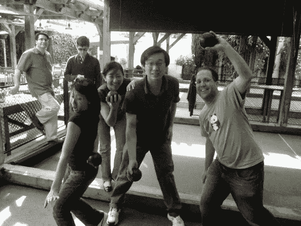

# 回馈社会

> 原文：<https://medium.com/swlh/giving-back-681c6a6ace39>

## 脸书校友女性创始人志愿者导师

# 背景故事:2007 年

这是季节。我早到了脸书。我从 2007 年开始，当时公司只有 200 人。虽然我是从用户运营团队开始的，在第一线与用户一起工作，但我很快找到了进入 Facebook 平台这个令人兴奋的世界的方法。

Facebook Platform 是一个团队，它与任何想要建立与脸书联系的体验的外部开发者合作——无论是 Facebook.com 上的游戏或应用程序，还是将你的朋友带到你身边的网站。例如，脸书登录外部网站，或类似的按钮在网络上。

我是团队中除了工程之外的早期成员之一，帮助开发人员、企业家和财富 500 强公司理解将社交融入核心的价值。我们帮助他们设想并执行社交如何改变他们与用户互动的方式，以及用户如何与他们互动。

From an early Facebook Platform Offsite in Bocce Ball

很难记得脸书不是一个家喻户晓的名字，但那是我们工作的时代。人们没有看到它的价值。还没有。如果你是 CNN，为什么你会在意带你的朋友一起来，为什么脸书的人能看到你的文章很重要？你是 CNN，人们来找你。我们的工作是让人们看到脸书的价值——让他们想象我们今天生活的世界。

正是在这个团队中，我的生活发生了改变。一个敢于把社交想象成每个人日常生活的一部分的团队--一种登录并把你的朋友带到任何地方的方式。在此期间，我很幸运地不断接触到业内一些最具灵感和创新精神的人——在公司和整个生态系统中。我遇到了许多年轻的崭露头角的企业家，他们敢于在我们身上赌一把——他们愿意用他们的两人公司，有时是他们的毕生积蓄，赌社交是未来。

[fbFund](https://www.crunchbase.com/organization/fbfund) 是我的一个项目，一个 1000 万美元的基金，一半来自 [Accel](https://www.accel.com/) ，一半来自 [Founders Fund](https://foundersfund.com/) ，但是由脸书管理。我和我的一位同事凯特·李(Cat Lee)在脸书那边管理该基金——创建项目、制定标准、提交一份又一份申请、提出资助建议，这些建议最终提交给创始人基金的彼得·泰尔和 Accel 的吉姆·布赖尔(Jim Bryer)审批，并在受资助者获得资助后对他们进行管理和指导。

2008 年，我们在 Lyft(当时是 Zimride)遇见并资助了洛根·格林和约翰·齐默，这是我们的首批投资之一。我们资助了 [TaskRabbit](https://www.taskrabbit.com/) 当它只是一个 Leah Busque (acq。由宜家提供)。我们资助了[wild fire](https://www.crunchbase.com/organization/wildfire-interactive)——后来被谷歌收购——当时只有 Victoria Ransom 和 Alain Chuard。

通过 Facebook 平台生态系统，我遇到了 Airbnb，当时它只有 12 个人，Dropbox 是屈指可数的，以及许多其他你今天看到和使用的服务。2009 年参加我们 fbFund 演示日的大多数天使投资者最终都筹集了自己数百万美元的基金。

随着时间的推移，脸书成长起来了，从 200 张友好的面孔成长为今天拥有数十亿用户的庞大公司。因此，我在这一路上结交的许多朋友也成长了——领导着当今一些最有影响力的产品或团队。

# **今天:2017 年**

快进到今天，2017 年即将结束。

从我开始建设脸书的那一天起，已经过去十年了，从我开始一段旅程，让我能够见到如此多有影响力的领导人。接受他们的指导和鼓舞，我在做的每一件事情中都带着这种成长的精神。我最新的作品？一家由女性创办、专为女性服务的公司名为 Tara&Co. [Tara & Co](http://www.taraand.co) 正在为忙碌的女性重新设计产品。

我们致力于为世界各地的女性树立榜样，并打造适合她们生活方式的产品，让她们不必妥协。

就在几周前，当我们欢迎[史宗玮](https://hearsaysystems.com/company/leadership/)(首席执行官，Hearsay Systems，星巴克董事会)[金·斯伯丁](https://www.linkedin.com/in/kim-spalding-7020216/)(通用汽车，谷歌小企业广告)[琳达·芬德利·科兹洛夫斯基](https://www.etsy.com/team/member/lkozlowski)(首席运营官，Etsy)加入我们的[顾问委员会](/@JuliaLam/announcing-tara-cos-advisory-council-d7f3b505bb0b)时，我有幸得到了三位杰出女性的指导。了解最终客户并能帮助我们推出正确的产品线和加速业务发展的顾问。

这就是女人需要的，她们自己的顾问委员会。正确的人，在正确的时间给予正确的指导。

众所周知，对女性来说，今年是令人惊奇但又艰难的一年。我们的许多恐惧都被量化了，在关于成为女性创业者或职场女性有多难的统计数据中，以及在无数骇人听闻的故事中。我们内心深处对某些事情是如何因种族、性别或介于两者之间的因素而发生的潜在怀疑最终得到了证实。平等的面纱已经被揭开，展示了几十年来被宽恕的行为，这种行为将我们视为不平等的。

我是一个女人。我是有色人种。天生我就面临很多劣势。但是，这些不利因素中的一部分被机会抵消了——在正确的时间获得资本、建议、同行和其他资源是你创业成败的关键。站在像脸书这样正在成长中的数十亿美元的公司中间是令人惊讶的，正因为如此，我得到了不是每个人都能得到的机会。

本着回报的精神，并感谢那些帮助我塑造职业生涯的人，今年我花了一些时间思考我个人还能做些什么来帮助提升女性。

我问自己:我该如何与其他女性分享我有幸拥有的这种机会？

# **回馈**

鉴于这个假期，我从我现在和以前的脸书人脉中召集了一些朋友，他们是科技行业最优秀的专业人士，志愿为女性创始人提供一些辅导时间。

我们是一路上所有帮助过我们的人的产物。也许我们可以在产品、合作关系或如何筹集资金方面提供一些建议，帮助更多女性更上一层楼。

如果你想申请导师课程，请在这里填写联系表格[。我们时间有限，不可能帮助所有人，但我们很乐意帮忙。](https://goo.gl/forms/lmirY1S8BNnFMR4A3)

# **认识导师**

# **露西张**

露西从 2011 年开始为脸书工作，当时脸书收购了她在 2010 年居住在纽约时共同创立的白鲸。Beluga 认识到，在群发短信或在其他消息应用中提供群发支持之前的日子里，缺乏让群体在旅途中沟通的好解决方案。

白鲸成为 Facebook Messenger 的种子，她在 2011 年帮助推出了该网站。她在 Messenger 上工作了 4 年，应用工程和产品专业知识帮助推出了 Messenger 的许多功能，包括阅读回执、群发消息改进、GIF 搜索和 Messenger 平台。Messenger 现在拥有超过 12 亿的月用户。

最近，她与 Chan-Zuckerberg Initiative 的项目 Summit Public Schools 合作，致力于为 K-12 教育建立和扩展个性化学习。她在谷歌开始了她的职业生涯，在那里她帮助建立了 AdWords、谷歌新闻和谷歌文档。Lucy 拥有加州大学伯克利分校的计算机科学学士学位。

专家行业:信息、教育、消费软件

**技能专长:**产品、人员管理、iOS 开发、UX/用户界面、原型制作、面试

# 瑞克手臂爆炸

将他的软件工程背景与超过 17 年的产品营销和业务开发经验相结合， [Rick](https://www.linkedin.com/in/rickarmbrust/) 专注于从多个角度观察行业趋势，并尽早识别高影响力的技术。他最近加入了高增长企业 SaaS 创业公司 Amperity，担任其业务发展副总裁。在 Amperity，Rick 将花大部分时间建立高影响力的关系(如微软、亚马逊)并确定商业产品计划以取得长期成功。

Rick 曾在一些最具影响力的科技公司担任重要的产品管理、产品营销和业务开发职位，包括脸书、Instagram 和微软。他还担任各种创业公司和组织的顾问，包括 Marble Robotics(送货机器人)、Standard Cyborg (3D 打印假肢)、Framer(设计)、Segment (SaaS)、HiQ(人力资源分析)、Nobel Labs(采矿和商业炸药)。

此前，Rick 领导了脸书平台和移动领域的合作计划。在哈佛商学院时，他被招聘为脸书第一个商业发展实习生，并很快成为脸书早期商业发展团队的一员。在脸书期间，他与 Instagram 的创始人密切合作，建立了最初的 FB 整合和 FB 合作伙伴关系的初始阶段。这种合作关系导致了社交媒体史上最成功的收购之一。

在脸书之后，Rick 在两个处于成长阶段的初创公司担任过高管职位——细分市场和知名公司。

他拥有西北大学的计算机工程学士学位，这意味着他要么是商业开发领域最乏味的人之一，要么是本科班最差的工程师。里克更喜欢前者(如果可以选择的话)。

**专家行业:**企业和/或 SaaS、聊天/p2p 通信、照片、本地搜索&发现、营销自动化、分析、开发者工具/服务、设计师工具/服务

**技能专长:**合作关系、产品市场契合度、CEO/创始人层面的问题、产品体验、投资者关系、解决问题(特别是。交叉学科)、定价、GTM

# 杰克·彼得森

[Jake](https://www.linkedin.com/in/jake-peterson-08395b3/) 是一名数据科学家，拥有超过 10 年的研究经验，致力于寻找创新的量化解决方案来解决营销和应用增长问题。他设计了一个电子邮件推荐引擎、旨在促进数据库营销新方式的多种细分模式，以及 Acxiom 的 e engage Cluster——一种衡量电子邮件订户参与度的标准化方法。他曾与数十家领先数据分析的小型初创公司合作，并在脸书工作期间建立了多个世界级的数据科学团队。他拥有圣克拉拉大学的计算机科学和哲学学士学位。

**专业:**营销分析、潜在类聚类、数据剖析、画像分析、多元分析(PCA、ICA、非负矩阵、因式分解、谱聚类)、回归(线性和 Logistic)、数据编程、SAS、Excel、Python、R、Oracle PL/SQL

# 林心如

[茱莉亚](https://www.linkedin.com/in/juliaclam/)是早期的 Facebooker 用户，连续创业者，现在是[塔拉&公司](http://www.taraand.co)的创始人兼首席执行官。Tara & Co 正在为忙碌的女性重新设计产品。他们的第一款产品 Tracy 2 合 1 包是一款时尚的敞篷包，于 11 月正式推出，预售价值 11 万美元。它们被 Brit + Co、Buzzfeed、SF Chronicle、Techcrunch 和 LA Fashion 杂志报道过。这款包可以三种方式佩戴(单肩包、背包、斜挎包)，最大适合 13 英寸笔记本电脑，并配有拉链手包。

此前，她是风险投资支持的创新旅行技术 Bucket 的联合创始人兼首席执行官，该公司于 2016 年出售。她还是支持新兴亚裔美国媒体艺术家的非营利组织 [A3 基金会](http://www.a3-foundation.org/)的联合创始人，该基金会与圣丹斯学院的合作已进入第五个年头，她还在加州大学洛杉矶分校担任创新和创业顾问。

在加入 startup foray 之前，Julia 是脸书的早期员工(2007 年至 2011 年)，她领导并参与了许多高影响力的开发者营销计划，包括脸书开发者车库计划、最初的“登录脸书”合作伙伴团队、脸书存在和 f8 开发者大会。

朱莉娅还在脸书的 1000 万美元基金 fbFund 工作，帮助选择和指导了 50 多个创业团队，包括 Wildfire (acq。由 Google)、Zimride(现 Lyft)、Taskrabbit (acq。宜家)、Samasource 和 Vitanna。Julia 拥有加州大学洛杉矶分校的传播学学士学位。

**专家行业:**社交媒体、旅游、时尚、社会公益

**技能专长:**任何早期创业、CEO 事务、筹资、众筹、产品、产品市场适合度、实物商品、创意营销、品牌、合作伙伴关系、UX/用户界面、增长、文化、解决问题

# 新导师—2017 年 12 月 28 日新增

# 贝丝·斯坦伯格

Beth 在组织发展、人才战略和领导力发展方面拥有 20 多年的经验。她的重点是帮助领导者和公司解决复杂的组织和发展问题。Beth 专注于推动技术、消费品和服务公司的有用员工计划、领导力培训、高管发展和组织发展。

Beth 在与公司合作帮助他们取得成功方面有着良好的记录。

例子包括:

ry pple-Advisor，2011 年 12 月被 Salesforce 收购，脸书 IPO，2012 年 5 月 BrightRoll 被雅虎收购，2014 年 12 月 Sunrun — IPO，2015 年 8 月 Hackbright Academy — Advisor，被五车二教育收购，2016 年 4 月 WorkLife — Advisor，被思科收购，2016 年 10 月 Jhana Education — Advisor，被 Franklin Covey Company 收购，2017 年 7 月 Beth 拥有圣何塞州立大学心理学学士学位，并参加了斯坦福大学的高管项目。

贝丝是一个国际教练联盟的领导蔻驰是在迈尔斯布里格斯和霍根评估认证。Beth 是 Jhana 教育、温室和 Felicis 风险投资公司的顾问。她也是国际教练联合会认证的蔻驰领导。

贝丝积极参与了国务院的科技女性项目。该计划支持中东、中亚和非洲的 STEM 职业和教育。贝丝是社会风险投资伙伴国际(SVPI)，集体根和隐藏别墅的前董事会成员。

**专家行业:**科技、消费品和服务、人力资本管理

**技能专长:**拓展初创企业、辅导领导者、组织动态、人才战略和规划

# 尼克·弗里德里希

Nick 在大型公司和早期公司的各种运营岗位上拥有 15 年的经验。他本质上是一名操作员，热衷于解决小型、成长型和大型公司中出现的复杂运营问题。

目前，尼克领导 Instacart 的社区运营。在这个职位上，他监管 400 多人的运营，包括规模支持、产品运营和中央运营。在担任目前的职位之前，Nick 在 Instacart 负责东海岸的运营，领导新的市场发布、劳动力管理和整体 P&L 管理。在 Instacart 的 3 年多时间里，他带领团队完成了各种项目，以帮助扩大业务和运营。

在加入 Instacart 之前，Nick 从 2011 年到 2014 年在脸书工作了 3 年多。他帮助建立和扩大了中小型企业销售和支持团队，在他离开之前，该团队的收入增长到 40 亿美元。在脸书工作期间，Nick 带领团队实现了 12 倍的员工增长、7 倍的客户增长和 5 倍的收入增长。

尼克也曾在其他大公司工作过，如美国电话电报公司、Sprint 和 ADP，担任过各种运营、技术和管理职务。他拥有通信工程学士学位，以及佐治亚大学的 MBA 学位。

**专家行业:**网络广告、物流、零售、电子商务、三方市场。

**技能专长:**运营、人员管理、扩展团队、文化、客户体验/支持、外包管理、产品运营、P & L 管理、单位经济分析/建模

# 导师资格

要获得资格，您必须:

1.  团队中至少有一名女性创始人
2.  有一个工作原型
3.  在 2018 年 1 月 5 日之前使用[联系表](https://docs.google.com/forms/d/e/1FAIpQLSdmh_fxug0i7xs0QrKjXqvDNtQFw8gmGng2NXOdDDj2x0mqqw/viewform)申请一次指导会议。

提交将于 2018 年 1 月 5 日 11:59 太平洋标准时间结束，我们将在 2018 年 1 月 12 日之前联系选定的学员，辅导会议将于 2018 年 1 月或 2 月举行。

我们希望在这个假期，我们可以通过投资未来来感谢过去的导师。

# 更新—2018 年 12 月 1 日

感谢所有申请的人——我们被申请和热情淹没了！因此，我们还需要几天时间来选择学员。

## 如果被接受，你的导师会在 1/17 周三之前联系你。

感谢每一个给我们留言的人，我们很快会有更新。

## 这个故事发表在 [The Startup](https://medium.com/swlh) 上，这是 Medium 最大的企业家出版物，拥有 276，798+人。

## 在这里订阅接收[我们的头条新闻](http://growthsupply.com/the-startup-newsletter/)。

