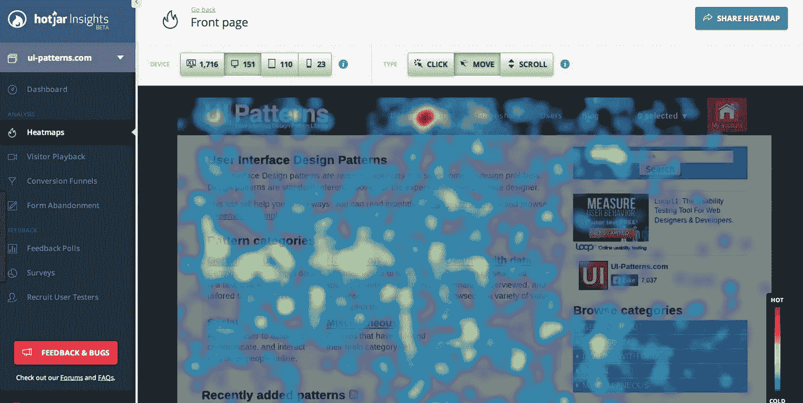
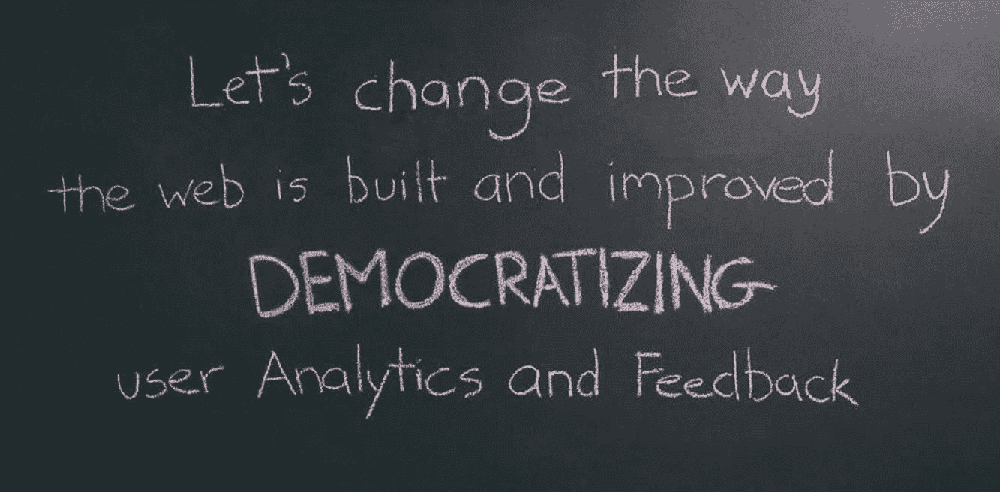
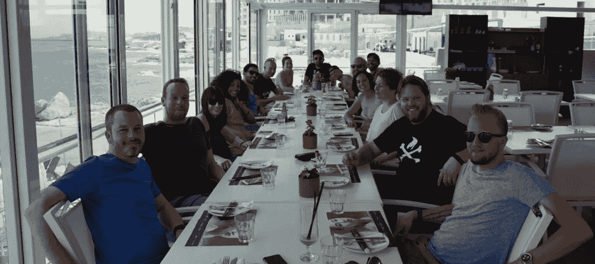
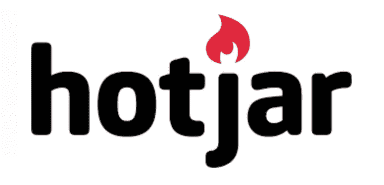

# 给予远程控制:如何建立和扩展远程创业

> 原文：<https://medium.com/swlh/giving-remote-control-how-to-build-and-scale-a-remote-start-up-589993fbde47>

仅在六个月内从创意到 60，000 个测试版注册从测试版到€在不到三年的时间内每年 100 万的经常性收入(ARR)在另外六个 ARR 中€1000 万

*采访 Hotjar 首席执行官兼联合创始人大卫·达马宁*

‍

Hotjar 是一家 SaaS 初创公司，专门提供一体化分析和反馈，具有热图和转化分析等功能。该公司的使命是通过“民主化”用户分析和反馈来改变数字体验的构建方式。这是一项取得了显著成绩的业务:该公司在短短六个月内从 idea 发展到 6 万测试版注册，在另外六个月内从测试版发展到€100 万年经常性收入(ARR)，自 2015 年 4 月推出以来，现在已经实现了€1000 万的 ARR。令人难以置信的是，整个 Hotjar 团队的 56 名成员分布在世界各地。现在，随着它接近三岁生日，该公司正在与 CultureGene 合作，以确保它为下一阶段的增长和进一步的成功做好准备。

我与 Hotjar 的创始人兼首席执行官大卫·达尔马宁(更准确地说，是在谷歌上聊天)坐在一起，了解他和他的联合创始人是如何创造出如此强大的公司文化，并在没有一个共享办公室的情况下不断壮大。

主要亮点:

-一个完整的五阶段招聘流程将最大限度地增加你招聘到最适合自己文化的人的机会

-大卫和他的联合创始人如何以及为什么远程创建企业

remote 带来的独特挑战以及 Hotjar 如何克服这些挑战

-如何让每个人都觉得自己是企业的一部分——即使他们不是永久员工

Hotjar 如何以及为什么关注透明度和信任

‍

**你对组建一个远程团队有什么想法，你是如何组建的？**

促使我们决定建立一家远程公司的主要因素来自我们在马耳他建立的前一家公司，我们现在就在马耳他。我当时是公司的副总裁，Hotjar 的四个联合创始人之一 Johan 是这家公司的所有者，公司发展到有 150 人都在办公室工作。当公司有大约二三十人的时候，我真的很享受:那是我年轻时想要玩乐和聚会的一段时间，公司的文化非常社会化。但是当它达到 130，140，150 人的时候，一些事情改变了我，我真的很讨厌它。在那个时候，这个行业中有足够多的人让我们不去认识每一个人，这感觉不再像一个家庭。实际上，走进办公室感觉很尴尬，我意识到这不适合我。

现在，我一直喜欢旅行，这是我内心深处计划在未来某个时候要做的事情。由于我在工作中的感受，旅行成了我寻找远程角色的动力——我很快就找到了一份顾问的工作。我喜欢能够按照自己的想法工作的灵活性和自由，无论是在家还是在咖啡馆工作，但公司的工作方式有一些我不喜欢的地方。例如，因为我是一名顾问，我必须自己购买笔记本电脑。在英国，也有一些人在一个共用的办公室工作，所以他们和我们之间仍有一种感觉。我只是不觉得我是生意的一部分。

当我们设置 Hotjar 时，我们决定作为一个远程团队从头开始构建它；我想保持我作为顾问的远程角色所拥有的生活方式，我认为如果我能与其他人分享这一机会，会让很多人感到高兴。我还认为这可能是一种从我们的员工那里获得参与度和忠诚度的神奇方式，基本上可以让很多人愿意永远为我们工作！

我们采用了我为某人远程工作的部分个人经验，但也对它们进行了调整和改进。我们最初的愿景是，无论某人是雇员还是承包商，他们都将受到平等对待，即使他们签署的协议和合同会有所不同。整个想法是从第一天开始投资，让人们感到受欢迎。我们为人们购买了他们工作所需的设备，如笔记本电脑和耳机，我们也很早就决定信任我们的员工，允许他们拥有自己控制的预算和津贴，这样他们就不需要得到我们的许可和批准。这节省了很多时间，这些时间经常花在与人们来回沟通，检查他们是否可以花一点钱，这也给了人们很大的自主权，并向他们表明他们得到了我们的信任。

‍

**以这种方式建立远程团队有什么成功之处？**

一开始，我们只有四个人——三个马耳他人和一个瑞典人——我们的基地都在马耳他，彼此相距只有几公里。然而，从一开始，我们就像同一个团队中的远程工作人员一样工作。我们避免见面——即使是在社交场合——也避免了面对面做决定的诱惑。相反，一切都是远程完成的，这是一个违反直觉的举动，但它奏效了。事实上，我对这个团队非常固执，坚持说我们不会一起工作太久。最后，这是一个非常成功的举措，因为当人们后来远程加入我们时，他们会自动适应，不会感到被遗忘，因为我们从一开始就这样创造和塑造了我们的文化。

‍

**组建远程团队有哪些不太成功的地方？**

好吧，在我们第一次雇佣之后，我们完全弄错了！在远程工作中，很容易低估或高估事物，因为对于你的同事知道什么或能做什么存在更多的知识差距，而你的大脑可以很容易地填补这些空白。例如，我不知何故地认为我的联合创始人有足够的经验来做出正确的招聘选择——尽管我*知道*他们没有招聘经验！因为我们是远程工作，我有点忘记他们在这方面没有经验，只是假设事情会很好。这就是远程办公和一起在办公室工作的巨大区别:在个人看来，这样的事情更明显，因为它们就在你面前，而远程办公则很容易将事情视为理所当然，无论是积极的还是消极的。

这意味着在一开始，尤其是我们雇佣了错误的人。我们不得不非常迅速地解雇一个人——事实上是在几天之内——这造成了一场巨大的狗屎风暴。我们从那次经历中学到了一个重要的教训:招聘要慢。事实上，缓慢而痛苦地雇佣*，以确保没有疑问，而且是合适的人选。一旦你这样做了，你就把任何不想要的惊喜的可能性降到了最低。*

我们还发现，尽管这看起来有点不方便，但当你确实要解雇某人时，给他们一个月、两个月或三个月的报酬是一个好主意，以减轻打击并管理发生的事情。你看，现实情况是，使用远程，你冒着从与你虚拟连接的人身上拔掉电线的风险，这意味着突然之间，他们可能独自在那里。再说一次，因为你没有机会当面道别，所以这可能有点冒险。总的来说，要记住的关键是，你需要在你的团队中保持精简，并能够尽快适应和改变。

最后，几个月后我们发现，我们并没有真正进行任何面对面的交流。我们在遥远的地方建立，部分是因为我们的地理位置(我们的基地在地中海中部的一个小岛上！)而这确实会限制我们能够雇佣的人。但有一件事我们最初没有做，那就是扩大或利用我们的人际网络。一旦我们意识到我们在那个领域陷入了一点点的墨守成规，我们开始邀请人们过来，参加更多的活动，带来更多的顾问和导师，这帮助我们建立了更多的网络。

‍

你如何解决招聘问题？

不管我们招聘的是什么职位，我们都有一个相当完整的五阶段招聘流程。

*第一阶段*

第一阶段是一个相当简单但精心制作的调查。我们以一种特殊的方式提出问题，在这个阶段，我们更倾向于确定一个否定而不是肯定。这项调查是为了剔除一些人，这听起来可能是负面的，但对于筛选过程的第一步来说，这实际上比寻找每个可能成为理想雇员的人要容易得多。该调查旨在了解我们是否与申请人意见一致，例如，如果我们要招聘一名客户服务副总裁，我会问一个简单的问题，比如“是什么导致了这种流失？”现在，你可能会认为这是一个直截了当的问题，甚至是一个简单的问题，但它告诉了我很多东西——仅从这一个答案，我就可能排除 60%—70%的申请人；因为很多人会说，当人们对你提供给他们的支持不满意时，就会发生流失。这是一个完全错误的答案！我不想和一个有这种想法的客户体验副总裁一起工作，所以我们马上就知道这个人是自己选择离开这个过程的。

我们设计的问题快速简单，但关键是要避免误报，所以问题必须是防弹的。我们必须小心的一点是，不要以诸如申请人是否知道如何使用某些工具这样的软问题开头，因为这些问题可能会基于完全可以学习的东西而取消某人的资格，坦率地说，这将是愚蠢的。从本质上说，这项调查是为了快速评估我们的申请人的心态，并了解他们是否适合 Hotjar 的文化。

*第二阶段*

第二阶段包括申请人提交一段他们自己的视频，视频中记录了他们对五个关键问题的回答。在这里，我们基本上是在看“周日见面”测试:我们会想和这个人在办公室单独度过一个周日吗？这里有更多的定性和直觉，但我们仍然会提出一些更有结构性的问题。所以，举例来说，如果我们在看诚实，我们可能会问，'如果你能在周一早上做任何事情，你会做什么？'现在，如果申请人回答，'哦，我会检查我的电子邮件，并计划一周，'我们会像，'是啊，我说这是废话！'这并不意味着我们要取消那个人的资格，但如果他们真的前进了，我们会在以后提出来挑战他们。

看到人们对某些问题的反应真的很有趣。这有助于我们了解他们是否很适合远程诚实，坦率，并在飞行中很容易地解释自己。由于远程工作的性质，在这个阶段理解这些事情很重要；在某种程度上，他们将不得不通过视频通话来实现这一点，所以在某种程度上，这个阶段有点像试驾。其次，也是非常重要的一点，正是在这个阶段，我们开始考虑他们会给我们的文化带来什么。我们坚信文化不是一成不变的，每一个加入公司的人都为此做出了贡献。通过问类似周一早上的问题，我们可以知道这个人会带来什么。前两个阶段由招聘协调员 Sarah 和负责每个特定角色的招聘经理负责。

*第三阶段*

第三阶段是面试。这不一定要通过视频来完成；事实上，我们通常更喜欢通过音频来完成。在面试的第一部分，我们会问几个简单的问题来再次检查候选人在调查和视频中给出的答案。然后我们试着去感受他们是谁，去了解他们。我们会问一些突出和关注情感意识的问题，比如，“其他人会如何描述你？”在这个过程的后期，我们可能会对照他们的参考文献来检查他们的答案，看看有多少一致性。这可以告诉我们很多关于他们的情商和自我意识。

在第三阶段，我们还会深入了解他们申请的实际职位。我们就特定的、与角色相关的场景对人们进行测试，以便我们可以看到他们的思维方式以及应对挑战或机遇的方式。面试的大部分时间都集中在情商和意识上，提问的问题包括:“告诉我们你经历过的一次冲突。”同样，我们在这一点上仍在识别危险信号，如果有任何危险信号，这一阶段让我们有机会在这一点上看到相当多的危险信号。坦率地说，在这个阶段，我们试图剔除那些混蛋和任何不可理喻的人，比如潜在的种族主义者或不宽容的人。当你开始与人讨论某些话题时，这种情况会很快出现。显然很难在一个小时内确定这一点，但我们会努力尽快发现一个人性格中的这些部分。

有一次，在第三阶段的面试中，我们遇到了一位非常优秀的开发人员，一位前谷歌员工。我们请他告诉我们他有过冲突的时候，他告诉我们他只和团队中的一名女性一起工作的时候。他说，“哦，我们应该告诉那个女孩，团队中的那个女孩，她叫什么名字，”他的经理无意中听到了，他说，“听着，尽可能不要说，“团队中的那个女孩”，因为这很危险，她可能不喜欢，而且会给人感觉麻木不仁。”他非常生气，因为他被纠正了这个错误，他说了这样的话，“这没有意义。如果她是女孩，她就是女孩。这对我们来说是一个很容易的危险信号，因为他甚至不明白为什么这是一个问题。

*第四阶段*

在第三阶段结束时，通常会有两种情况:要么我们有持续开放的角色，这意味着我们不断将人们带入第四阶段。或者，如果我们打算雇用一个人，比如某个特定部门的副总裁，那么我们将等待进行足够多的第三阶段面试，然后选择两到三个人一起进入第四阶段。

在第四阶段，候选人完成一项任务——我们称之为“绩效招聘”我们设计一个由两个或三个部分组成的任务；对于每一个角色，不管它是什么，任务的一部分包括让人们看一看企业中现有的系统，理解它，为它创建一个图表，解释它是如何工作的，并提出如何改进的建议。我们在这里寻找的是人们是否能以系统的方式思考，以及他们是否善于分析并能清楚地描述一些事情的证据。

对于一个工程角色来说，这可能是一个非常明显的过程，因为这都是关于系统的，但是我们是全面地这样做的。例如，如果我们正在招聘一名客户服务副总裁，我们会让他们看看我们如何处理年度发票的流程；对于运营，我们会告诉他们考虑招聘。在这两种情况下，我们会告诉他们找出系统中的瓶颈，并提出改进的方法。一切都围绕着看他们是否有系统思考的能力；如果你不能或不思考系统，它会产生大问题。

候选人收到 HipChat 的邀请，我们尽可能地尝试将对话从语音和视频转移开，甚至通过 HipChat 给他们任务。除了观察他们如何完成任务，我们还想了解他们如何理解远程工作，他们如何接受远程反馈以及他们如何处理信息。

我们还确定他们在与我们合作的头三个月或六个月内会做的一件事，并要求他们去做。招聘过程中这一部分最重要的事情是让应聘者掌握至少一件我们实际上会用到的东西；我们发现，除非你发明的东西有实际用途，否则人们往往不会用批判的眼光来反思和审视他们的工作，因为不可能对你实际上不需要的东西持批判态度！这就像在你需要之前就去买沙发一样——你只是看看周围的颜色，然后想，‘哦，真漂亮。’这不实际，也不会转化为现实，因为你甚至不会想，“房间有多大？”因此，让候选人从事真正需要的东西会有很大帮助——无论产品或流程已经有多好，我们都会在第 4 阶段要求他们至少改变一部分，返工并改进它。

当我们给候选人关于他们工作的反馈时，我们故意让它变得有点苛刻，看看他们是否能接受:他们能倾听，接受建设性的批评，更重要的是，他们能理解我们说的话吗，他们会离开并修正或改变我们想要他们做的吗？

这一阶段的最后一部分是他们向团队展示他们的工作。在这个阶段有很多人，候选人的工作由招聘团队评估，该团队通常包括招聘协调员和招聘经理。我们还要求候选人给自己的工作打分，这真的很重要——它告诉我们他们是否谦虚，是否有足够的自知之明，明白自己哪里做得好，下次可以在哪里改进。

参与最终招聘团队的每个人都自行决定候选人，并通过 Trello 投票；然后，他们一起看每个人的决定。这一阶段的最终决定部分来自于对他们工作质量的考察，部分来自于他们在整个招聘过程中在各种沟通渠道中的表现。

第五阶段

最后一个阶段，即第 5 阶段，是我们在候选人、招聘经理和我之间建立联系的阶段。在这一点上，我的重点是通过做我所谓的绝望测试来检查招聘团队决定的质量。我主要关注的是，团队是否如此急切地想填补这个角色，以至于在某个地方放松了警惕。通常我没有那种焦虑，所以我能够发现它是否已经发生。我也在最高层面上评估是否有适合这个候选人的文化。这个过程会根据我们招聘的职位有所调整；例如，如果我们要招聘一名高级后端工程师，我将在这里深入挖掘与该特定角色相关的问题。如果候选人申请客户服务英雄的职位，我也会将更多的注意力转移到关于候选人未来的问题上，考虑这可能是什么样的垫脚石，他们将在我们这里工作多久，以及想要这个职位的真正动机是什么。

**告诉我你对学习&发展的想法，包括你在 Hotjar 提供的额外津贴。**

老实说，如果我必须对自己进行高水平的评价，我认为我们在个人发展方面实际上处于相当低的水平。我们很喜欢它，但我们还没有领先。可能是因为我们的团队很有动力，他们都在疯狂地自学。

但我们确实有这样的安排:首先，部门预算是以这样一种方式制定的，各部门可以自己决定为 L&D 做些什么，比如参加哪些活动。我们让人们主动去做，并尽可能主动地去做。我们相信很多事情，所以我们努力让人们去参加。事件可能是我学到最多的地方；听人们分享，生活，关于他们在做什么有很多价值，这也是一个很好的交流机会。

我们还让整个团队成为 Udemy 的会员，这样他们就可以随时随地学习他们想学的东西。然后，我们有个人发展预算，这是每人每年 500 欧元的预算(我们最近还建立了每人 200 欧元的健康预算)。每个人都有一个 Kindle，并有无限的预算来购买任何他们想买的书。

每周，我们都会在演示网站上展示人们如何使用他们的个人发展预算，例如他们是在买书还是在上课，我们会与团队的其他成员分享这些信息。这取决于部门领导对此的关注，目前还没有一个集中的方法。

我们从 L&D 团队那里得到的主要反馈是关于学习内容的指导请求。一般来说，我给人们的回答是，希望有人告诉你，学习什么不是一个理想的地方。我很高兴用建议和想法挑战人们，但我认为学习是你应该主动去做的事情，你可以创造自己的道路，失败和学习，就像其他任何事情一样。

你的价值观之一是透明。描述一下你在 Hotjar 的生活。

为了保持透明，我们主要做了两件事。一个是我们的财务和业务计划可供整个公司使用，我们实际上每个月都会提交，因此围绕产出和结果以及业务状态和未来计划都是透明的。

第二部分是作出决定或打电话的方式；所有人都可以旁听。然而，让团队参加一个超长的电话会议，只是为了看看我们是如何决定一些事情的，这并不是最有效的工作方式。

透明度实际上可以归结为我们日常工作的方式，即坦率、公开、直接和诚实。显然，问题在于，你的规模越大，这种程度的开放就越不自然，就越需要你去设计。如果公司有 20 个人，对每个人都透明和开放会更容易，但是一旦你开始达到 70-80 人，你就需要一个系统。

我们做的另一件事，也是我们一直引以为豪的事，是我们正在进行的消除政治和顶嘴的工作。例如，我们一想到‘让我们对投资者说话吧’，我做的第一件事就是跳上一个公司会议，告诉所有人。我告诉人们，我们将与投资者对话，并解释原因。我说，我们并不是说我们会致力于此，但这是我们的想法。尽管有些人因为不想让投资者参与进来而感到恐慌，但他们还是很感激我们告诉了他们这件事。

透明的目的是建立信任。它把你的卡片放在桌子上。这不是欺骗别人，而是展示你的意图并付诸行动。这就是让你在一天结束时变得透明的原因。

‍

**激进坦诚公司的首席执行官来找你谈话——让我了解一下你的想法。**

我意识到，虽然我很擅长提供反馈，也很坦率，但也许不是每个人都明白我的想法。我们的一名团队成员读了*的《激进的坦诚》*后说，‘我靠！我读了这本书，听起来就像是在读大卫的《如何管理人的手册》。当我读它的时候，我认为它是一个很棒的资源，因为如果有一件事我很擅长，那就是教人。我喜欢寻找具有良好框架的书籍，并让人们来教团队，所以这是一个巨大的胜利。

这是我的遗愿清单，最终成为更好的教师。团队中的某个人以前是老师，他给了我一个非常简单的建议:教学，他说，是问问题，而不是告诉别人他们应该知道什么！这一直困扰着我，因为我意识到我问的问题不够多:我告诉人们一些事情。所以现在我正在我四岁的孩子身上测试这个新方法！(很好用。)

**你对 Hotjar 的自由支配能量的作用有什么看法——人们愿意在工作时间之外付出额外的 20 %,因为他们完全投入并受到鼓舞？**

总的来说，我不认为我们有大量的自由支配的精力。显然，这对企业来说是一个巨大的利好，但有时它也可能与压力有关。我确实注意到，在某些关键的领导岗位上，人们承担了额外的负担。我们鼓励人们休足够的假，在“耻辱墙”上展示没有休足够假的人的名字。总的来说，我认为我们的员工倾向于非常善于关闭，但话说回来，这只是一种假设，需要我们进一步研究。

**你之前提到你在几天内解雇了一个人。你如何判断某人是否不适合 Hotjar，如何让他们离开？**

在我之前提到的具体案例中，有明显的迹象表明这个人不适合这个文化和团队。实际上，这非常可怕:有人被分配了错误的任务，这是在我们第三次雇佣的时候，他们甚至不知道我们希望他们知道的编码语言。然而更重要的是，他们的态度有问题，没有很好地沟通，所以我们马上就知道他们不合适。

在其他情况下，因为我们是自筹资金、快速行动和斗志昂扬的，如果他们只是不执行，那就是某人不适合的最明显迹象之一。看起来好像有一个项目黑洞——项目去了那里，却没有任何东西回来！一般来说，这就是让某人离开的过程开始的地方。有时候，就像我刚才给你举的例子，我们会看到态度问题。我认为不良态度案例实际上更快更容易确定，因为我们的文化如此和谐，我们可以很快发现它。

在人们不执行的情况下，这是我们行动有点太慢的地方，但我们在发现这种情况发生时越来越好，并尽早采取行动。通常，这并不是说这个人工作不够努力；通常情况下，他们的方法和心态是无效的。例如，他们可能正在做太大的项目，或者他们可能正在做太复杂的事情。很少情况下，你可以看出他们只是有点懒，行动不够快。最近，我们解雇了一名产品设计师，因为他们什么也做不了，进展太慢，想法不够好，讽刺的是，我们发现他在业余时间推出了自己的工具，这实际上正好与他收到第一个警告的时间相吻合。有趣的是，我们很快就意识到了这一点。

就时间而言，我认为在最后两个例子中，我们花了大约一年时间采取行动，这太长了。我们将试用期延长至九个月——不是出于财务或法律目的，而是为了让每个人都有正确的心态来对待他们的工作——现在我们的目标是至少让任何误聘按九个月分类。对我们来说，六个月的时间是不可能的。意识到有问题需要三到六个月的时间，而我们在采取行动方面有点太慢太好了。这是我给经理和团队领导的主要反馈之一。我认为这可能是远程工作的一个具体问题。你会想，“嗯，这是一个误会，”或者“事情会变得更好，”但因为你没有面对面地看到别人是如何工作的，所以很容易做出假设和高估它们。

随着时间的推移，一个真正最佳的远程环境可能会迅速消除这种情况，并围绕它构建系统。

你说得对，这是关于建立一个系统。我们过去确实根据我们的五个关键价值观做了一个回顾，突出了每一个，并通过提问对每个人进行了评级。举个例子，我们会问，你在学习并积极尝试学习吗？你的执行速度快吗，能把事情做完吗？我们对每个答案进行了评分，并计算出了总平均分。但是在某一点上我们停止了它，我认为我们需要重新引入它。

**描述一下你在 Hotjar 的入职流程。**

甚至在有人加入之前，他们就会收到一个欢迎礼包，里面有他们的 Kindle、耳机、强项搜索书和他们的公司信用卡。

然后，当他们加入时，所有跨每个角色的核心内容(分配硬件、设备和了解人员)都集中在运营中，因此对每个人都是平等的。新加入的人会认识一些人，并与 Trello 董事会签约。入职的特定角色部分由管理部门的人负责，他们围绕这一部分的流程已经随着时间的推移不断改进。例如，支持团队中的人遵循一个程序，而开发人员遵循另一个程序，我们让不同的领导互相交流，这样他们可以互相学习。

我们通过几种方式建立联系和信任。当我们雇佣产品部门的人时，大多数情况下，我们会让他们飞到马耳他，这样我们就能见到他们，其他加入的人通常都会和我通电话。

公司也分部落，部落独立于团队。当有人加入时，他们会根据自己的优势和角色自动被分配到一个部落。我们把人们分成不同的群体，这样部落就有了多样性。目前，当有人加入时，他们必须发表一篇文章，分享关于他们自己的十个有趣的事实，这是人们了解新朋友的一个很好的方式，但不是让他们了解我们。我们正在考虑为部落引入欢迎派对，以帮助建立新的关系——同样，这一切都将远程完成。你说得很有说服力:这是关于信任。这才是我们真正应该关注的。

‍

# [Culture Decks Decks decked](https://www.culturegene.ai/books)将于 2018 年第四季度出版，现在注册即可抢先阅读第一章，并在该书出版时收到通知。

在 [www.culturegene.ai](http://www.culturegene.ai) 了解更多 CultureGene 信息

## 这篇文章发表在《T4》杂志《创业》(The Startup)上，这是 Medium 最大的创业刊物，拥有 335，210 多名读者。

## 在这里订阅接收[我们的头条新闻](http://growthsupply.com/the-startup-newsletter/)。

