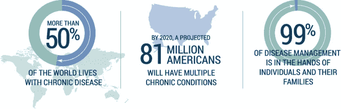
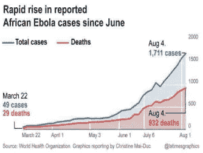
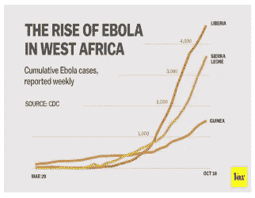
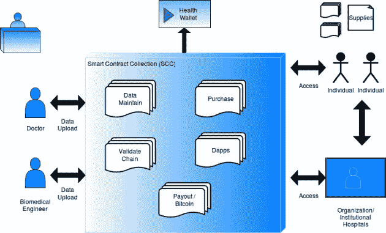
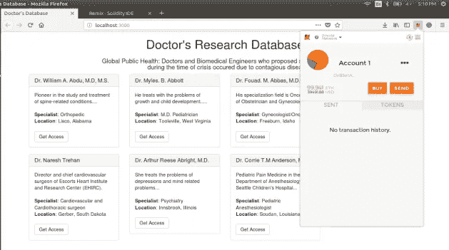
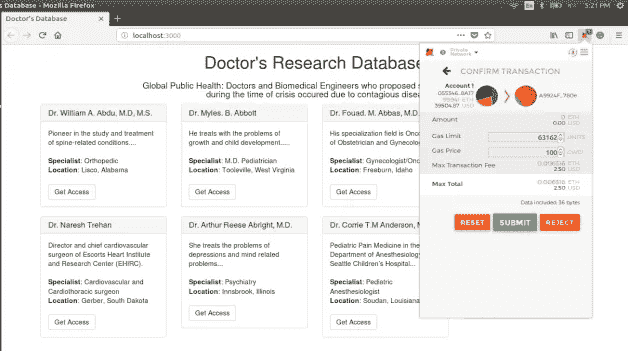
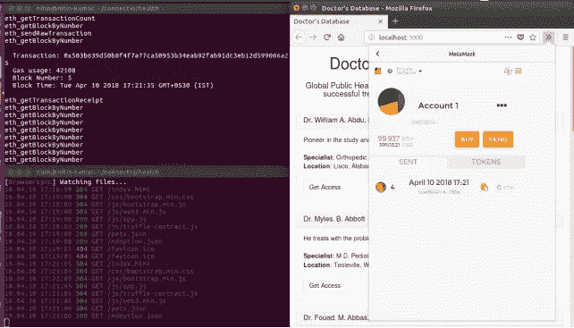
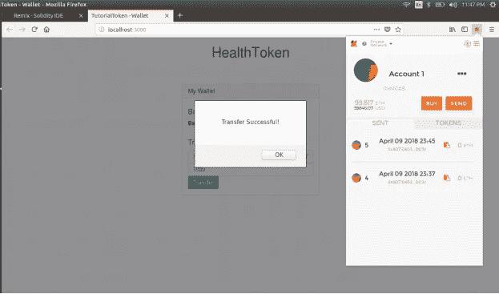

# 全球公共卫生:传染病救济的区块链

> 原文：<https://medium.com/swlh/global-public-health-blockchain-for-contagious-disease-relief-453df74f38da>

区块链在全球公共卫生危机中的援手。

# 尼廷·库马尔

由 [Sukant Khurana](https://medium.com/u/6d41261644a8?source=post_page-----453df74f38da--------------------------------) 指导

Image: WHO

**全球公共卫生现状。**

危机时期公共卫生管理面临的问题。

世界各地的医疗保健领导人一直在关注“公共健康危机”。世界卫生组织(世卫组织)于 2008 年 10 月 29 日至 30 日在里昂组织了一次关于“城市和公共卫生危机”的国际技术磋商。

公共健康危机是由肥胖症影响的流行病造成的。在健康危机的诸多原因中，一个突出的原因是流行病。流行病是全球性疾病的爆发。这些疫情病毒的威胁是无法解决的，只有在个人已经被感染后才能诊断出症状。

危机管理是疫情爆发期间面临的主要问题之一。一个城市的危机管理必须在市和国家或州当局之间进行外部协调，在提供医疗保健的服务和提供应急响应的服务之间进行内部协调，以及与公共设施如交通服务、机场和港务局、旅游业、工业、教育、商业和媒体进行协调。在紧急情况下，必须提前建立一个全国和周边地区专家之间协调努力的结构，以保持与困惑的战略距离。

Image: Center for Managing Chronic Disease, University of Michigan

其他问题是医务人员第一次大规模处理病人，如果疾病未知，必须有快速有效的诊断服务。此外，医院用品可能会很快耗尽，必须准备好获取额外医疗设备库存的计划。根据紧急事件的性质和城市管理部门处理紧急事件的准备程度，公共卫生危机引发的问题因地而异。在此期间面临的最常见问题之一是接收治疗信息。许多贫穷国家由于缺乏资源而得不到治愈传染病的途径。

如果一个人被诊断患有在人与人之间传播的危险疾病，首先要做的一件事就是追踪与病人有过接触的人。在一个拥有公共交通系统、拥挤的人行道和繁忙的娱乐场所的大城市，这几乎是不可能的。如果要尝试的话，将需要特别设计的数据库、可靠的地图(甚至是贫民窟的地图)以及不同层次的人们居住的高层区域的三维投影。

必须提前找到危机管理的解决方案。应该准备好在危机时刻从其他地方动员医务人员在指定的设施中提供医疗保健的计划。在危机发生之前，让疫情调查员掌握患者的数据是最好的解决办法

**趋势解决方案:把全球公共健康放在区块链上？**

分布式分类账可以帮助公共卫生工作者更快地应对健康危机。

*据 Nasr 报道——“公共卫生和区块链真的属于一起。在传染病危机爆发期间，通过区块链可以实现以安全、合规、透明的方式将数据尽快从源移动到目的地"*

区块链，类似于比特币和不同数字货币的基础，由分布式网络维护——验证每一笔交易，并将其记录在网络中所有计算机共享的本质上符合道德的加密账本中。

虽然公共医疗保健系统中的单个协会共享类似的一般任务，但目前信息共享机制通过一系列链，其中政府隐私规则决定谁可以访问和修改信息。拖延时间。期望一些额外的、不时的人工程序来确保正确的协会或个人发送或获得正确的信息，并且该信息被准确地利用。区块链可以自动完成这些程序。

**病例:埃博拉**

激烈的疫情或新感染的暴露需要迅速采取行动，并且沿着这些路线取决于以吉祥的方式共享紧急信息的限度。2014 年的埃博拉紧急情况表明了该框架的不足之处，当时，鉴于政府没有及时获得关于他们健康状况的数据，少数受感染的人被允许回到美国。由于医疗保健数据的不足和如何治愈埃博拉病毒的信息的缺乏，埃博拉病例和死亡率迅速上升。

**案例:爱沙尼亚**

爱沙尼亚可能是医疗保健领域广泛接受区块链创新的最佳案例。150 万爱沙尼亚人受益于完全数字化的医疗记录，这些记录由全国健康数据框架支持。从实验室结果到补救措施或治疗安排，爱沙尼亚人可以接触到他们所有的病史，并将其提供给医疗团体。该框架同样使人能够看到谁得到了信息，并以这种方式得到控制同意。

爱沙尼亚保健框架致力于区块链的认可，其表演艺术家具有国家特征。这个设计瞄准了三个基本目标:创建自主的、合法的、可靠的记录确认，发现并报告未经批准的变更，为超过一百万人制造一个适应性强的框架。

在爱沙尼亚，国家拥有储存医疗信息的安全数据库，这些信息可供治疗和科学团体使用，除非个人另有说明。随后，这些数据可以用于一般的健康思考，例如，跟踪疾病的发展，构建有预见性的模型或接收策略。

疾病控制和预防中心是美国卫生与公众服务部的一部分，该中心正押注于区块链的一个答案，以加强政府层面的信息积累、检查和共享。CDC 与 IBM 合作制造了一个包括医疗保健组织或医生机构在内的表演艺术家系统。目标是通过安全、一致和直截了当的信息贸易框架加强合作。

**区块链时代的流行病学与公共卫生。**

信任是任何合作的关键组成部分，尤其是在健康信息方面。治疗和科学研究人员需要保证他们获得的医疗保健数据是可靠的。这一特点是由区块链建筑设计而成的。在一般的幸福环境中，信任信息的来源或利用是最基本的。公共卫生基金会需要确保他们获得准确和完整的信息，而患者需要保证他们的数据是在他们同意的情况下使用的。

作为一个去中心化和分布式的分类帐，区块链使自由表演艺术家的聚会能够共享先进的资源和数据，而不涉及任何第三方。每一笔交易或数据交换都将被登记在一个分布式账本上。没有控制交易的中央实体。添加到记录中的每个新数据都以这种方式得到系统的一致同意。

美国疾病控制和预防中心(CDC)还宣布其目标是将区块链融合到提供传染病传播信息的支持中，期望区块链将提供一种强有力的方法来保证疾病爆发的数据到达所需的个人，以尽快控制感染的传播。

**通过分散应用提供疾病救助**

区块链的另一个用途是在全球公共卫生领域，用于高效、即时、定向的帮助传递，如针对紧急情况(如埃博拉病毒和各种传染病爆发)的援助基金储备。传统的保存资金流妨碍了紧急情况下帮助传递的及时性，而比特币可以立即传递到特定的可自由审计和跟踪的位置。个人点对点援助和机构援助可以通过比特币的方式进行。在发展中市场(通常手机渗透率为 70%或更高),有各种短信比特币钱包和传输组件，例如 37Coins 和 Coinapult，以及任务，例如 Kipochi，它们与 M-Pesa 等普遍使用的便携式基金阶段相结合(例如，在肯尼亚，31%的 GDP 是通过多功能手机消费的)。可以在传染病跟踪网站上开发应用程序，如 Healthmap 和流感跟踪器，其中可以添加比特币捐赠的额外功能，或者更广泛地说，可以添加有报酬的应用程序。

区块链创新与一种奖励想法有关，这种想法可以促进个人对系统产生兴趣。这些奖励通常以代币的形式出现，这些代币可以授予表现出道德行为的人。这种行为可以是对既定原则或合作水平的关注。关于幸福信息，有些人需要它，有些人要求或传递它。从这一简单的认识出发，应该可以想象执行一个奖励框架来鼓励个人将他们的信息传递给那些需要它的人。

***一个提议的解决方案*** — Dapps 可以建立在存储医生和生物医学研究人员的治疗信息，并与疾病跟踪网站集成的基础上。在危机时期活跃并成功找到疾病治愈方法的医生和生物医学研究人员可以将他们的信息存储在区块链分布式账本上，与其他有需要的人分享。区块链提供了最大的安全性，因此，医生上传的每一条信息都会首先得到验证。作为一个分布式账本，任何当地医疗机构甚至个人都可以访问这些信息，作为回报，医生将获得代币或比特币作为奖励。只有在验证每个事务后，才会添加新的块。因此，即使一个患有流行病的人坐在世界的角落里，也可以通过区块链获得治疗。

即使是那些在危机时期成功度过治愈过程的患者，如果他们愿意，也可以分享他们的治愈过程。成功为那个病人做手术的医生也可以分享他的处方医疗流程。谈到患者的隐私问题，医生被视为公众人物，因此共享医生的研究数据不存在非法条款、伤害或隐私问题。

上图显示了一个医生数据库 Dapp，其中存储了不同医生的研究数据和治愈数据，这些医生成功地提出了对暴发疾病的治疗方案。

人们总是传递各种各样的信息，这些数据中的一部分可能对一般的福利基金会非常重要。尽管如此，通常很难从患者那里收集数据并征得他/她的同意。这个问题可以通过制作一个令牌来解决，当病人分享他们的修复数据时，该令牌将给予他们报酬。公共医疗保健协会可以根据精明的合同中设定的措施代码来制定和处理象征性拨款。这种代币可以在短时间内被患者用来支付治疗用药。

***现在还早。***

在这些概念成为真正的应用之前，仍然有一些问题需要回答。由于当前公私实体之间医疗数据交换的数据所有权和治理结构的复杂性，很难在全球复制爱沙尼亚的情况。这项潜在的创新面临着许多障碍。

*“因此，当一个人患有非常罕见的疾病时，如果你能找到一种方法，让另一个国家的治疗专家远程访问这些信息，你就开始开辟一个更广阔的全球医疗保健系统，使个人能够在正确的时间找到正确的医生或正确的治疗方法。”对我来说，这可能会改变游戏规则。*

**参考文献-**

1.国际咨询世卫组织报告。法国里昂。城市与公共健康危机。2008 年 10 月 29 日至 30 日

2.世卫组织危机管理

3.用于健康数据的区块链及其在健康 IT 和医疗保健相关研究中的潜在用途。[https://www . health it . gov/sites/default/files/11-74-ablockchainforhealth care . pdf](https://www.healthit.gov/sites/default/files/11-74-ablockchainforhealthcare.pdf)(2017 年 10 月 18 日访问)。

4.世界卫生组织。全民健康保险，可持续发展目标 3。[http://www.who.int/universal_health_coverage/en/](http://www.who.int/universal_health_coverage/en/)(2017 年 9 月 16 日访问)。

5.“见见那个撕毁记录规则的国家”。卫生服务杂志。2016 年 11 月 29 日。检索于 2017 年 1 月 18 日。

6.巴克莱银行(2008 年)。预测下一个疫情。柳叶刀。

7.Freifeld CC，Mandl KD，Reis BY，Brownstein JS (2007) HealthMap:通过互联网媒体报道的自动分类和可视化进行全球传染病监测。医学信息协会。

8.布赖恩 m。从区块链技术到全球健康权益:加密货币能为全民健康保险融资吗？BMJ 全球健康，2017 年 11 月。

9.Medium | Ross Clelland，区块链—全球医疗保健封面。2017 年 12 月 29 日

10.Cision、SimplyVital Health 和 Shivom 宣布成立全球医疗保健区块链联盟。2018 年 4 月 27 日

## 这篇文章发表在《创业公司》杂志上，这是 Medium 最大的创业刊物，有 321，672 人关注。

## 订阅接收[我们的头条新闻](http://growthsupply.com/the-startup-newsletter/)。

