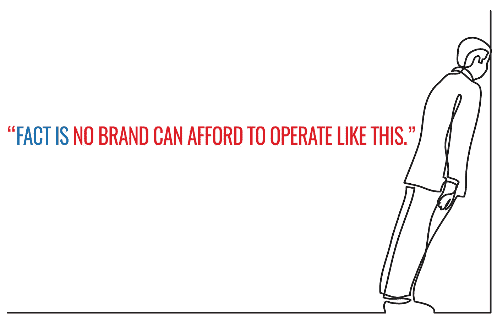
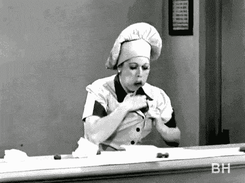

# 继续，边看这篇文章边发短信。我谅你也不敢。

> 原文：<https://medium.com/swlh/go-ahead-text-while-reading-this-article-i-dare-you-134a29fa3027>

多任务处理比严格的无咖啡因咖啡和薯片更快地扼杀生产力。

所以，在你读这篇文章之前，决定你不会**回复一条短信，接一个电话，或者在你读完和看完这篇文章之前做任何事情*。*说真的(你会活下来的)。**

好吗？很好。*我们走吧。*

每项活动都有开始、中间和总结。

那么，为什么有些人忙得不可开交，一天下来几乎什么也没做，而另一些人却非常勤奋(不那么疯狂)，在同一时间段做了更多的事情呢？

# 多重任务:后进生的秘诀

多任务处理是本周《一分钟星期三》的主题(上周我谈到了人们使用移动设备的两种方式[:一种导致增长，一种导致收缩):](http://www.risingabovethenoise.com/busy-brands-really-fail-60-seconds/)

无论我们谈论的是一顿饭、一个淋浴、一个产品发布会、管理一个品牌、锻炼、写作、绘画、创造、生产或组织任何活动。

如果你只是从待办事项清单上的“开始”部分开始，会发生几件事:

*   你会非常忙
*   你能完成的事情数量会很少

伦敦大学的一项研究发现，当参与者在认知任务中执行多项任务时，他们的智商得分会下降，这与他们对吸食大麻或熬夜的预期相似。

所以这需要纪律和专注。

就像一个司机开五辆车。

你必须不停地从一辆车跳到另一辆车，只是为了让引擎加速一点，换挡，让每辆车在路上移动一点。

让这 5 辆车行驶一英里需要多少能量？很长一段时间，尽管你会很忙。

你的士气将不复存在。

企业、品牌和企业家无时无刻不在处理这种多任务流行病。

事实是 ***没有一个品牌能像这样经营下去。***

你的品牌会受损。客户会很惨。士气会很低落。

如果一家企业只处理“提出建议”而从不完成任何交易，你就没有生意可做。

如果你只有“伟大的想法”而从不执行，你就会被打败。

如果你只致力于推出一个产品，而从不提供优秀的产品和服务，你就不会有一个品牌。

计划本身很糟糕。执行力和专注度决定一切。

你必须在到达中间之前*完成开头。你必须在到达终点之前完成中间的*。**

作为一种想法，多任务处理不应该在“开始阶段”存活下来，应该被迅速埋葬。

教训:停止。专注。实现。

这样做一个星期，让我知道这有什么不同。

【www.risingabovethenoise.com】原载于

**

## *这篇文章发表在 [The Startup](https://medium.com/swlh) 上，这是 Medium 最大的创业刊物，有 315，028 人关注。*

## *在此订阅接收[我们的头条新闻](http://growthsupply.com/the-startup-newsletter/)。*

**