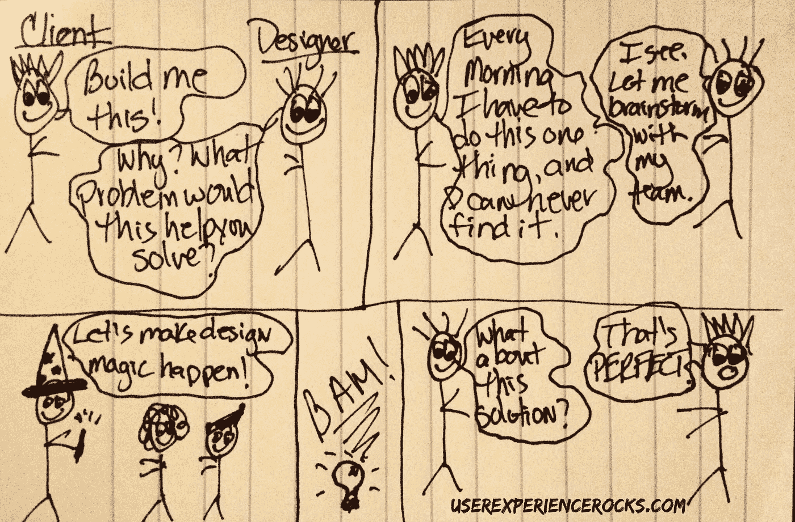

# 优秀的设计师 vs 伟大的设计师

> 原文：<https://medium.com/swlh/good-designers-vs-great-designers-e276aa4ad287>

我们都经历过，对吗？一个客户或利益相关者走进来，告诉你你到底需要做什么。如果你是设计行业的新手，你的膝跳反应可能是成功。听候命令。立刻。

你在设计世界里呆的时间越长，你就越会意识到按照命令来建造永远不会有好结果。人们通常会要求他们想要的东西，而不一定是他们需要的东西。

举个例子，我的一个朋友在一家大型设计公司工作。他们有一个项目，资深设计师在初级设计师刚进门时指导他们。大约 10 年前，在他职业生涯的初期，我的朋友就是那个新手设计师。

他的第一周，他的导师和一个大客户开了一个会，邀请他进来和一些人握手，并观察启动会议。

他们一坐下，客户们就迅速拿出一份他们想要的排版，包括颜色和字体。他们基本上预先设计了整个项目。

我朋友的导师看了看简历，抬头简单地问了一句:“你的目标是什么？”

客户们看起来有点困惑和吃惊。他们的回答大致是这样的，“嗯……我们还没有考虑那么多。”

我的新手朋友承认，对话中突然的左手转弯让他有点局促不安。他说客户们显然非常不舒服，他确信他们会冲出房间。

他的导师平静地回应道:“好吧，我们来谈谈吧。”

经过一个小时的讨论后，他的导师列出了一份完整的目标清单，可以带回给设计团队的其他人，同时客户也同意花一周时间集思广益，找出实现这些目标的最佳解决方案。

当我的新手设计师朋友在会议结束后在大厅里追上他的导师时，他告诉他，他无法相信他就这样“对抗他们”。

这位导师笑着说:“我不是在和他们对抗，我是在确保我清楚地了解他们需要解决的问题。优秀的设计师接受订单，并准确地传递客户想要的东西。伟大的设计师会深入挖掘客户真正的需求。”

我的朋友说那三句话完全改变了他整个职业生涯的轨迹。在那一刻，他知道他想成为一名伟大的设计师。事实证明，他做到了。

*本帖最初发表于 2015 年 8 月 13 日*[*【UserExperienceRocks.com】*](http://UserExperienceRocks.com)*。*

发表于*[**【SWLH】**](https://medium.com/swlh)**(***创业、流浪、生活黑客)**

******