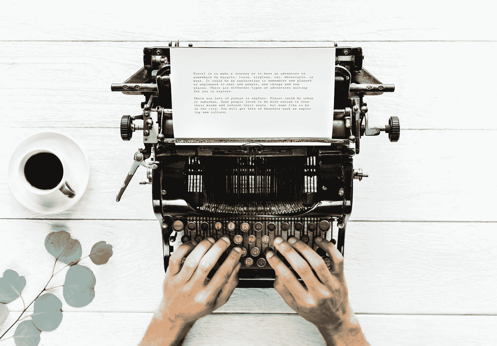

# 好的工作就足够了

> 原文：<https://medium.com/swlh/good-work-is-enough-bce61d509342>

## 重视行动，而不是结果

by [rawpixel](https://unsplash.com/@rawpixel?utm_source=medium&utm_medium=referral)

最近，我在脸书的一个创意小组里偶然发现了一个帖子。我们互相鼓励和帮助，挑战自我，在 YouTube 上制作东西和创作。

一位成员分享了他对他的渠道的不满意。他担心他在频道上聚集的追随者会把他的内容引向错误的方向。

*担心这个是对的吗？还是问错了问题？*

## 我为什么要这么做？

当我们创作的时候，当我们把一些东西放在那里的时候，它是一件艺术品，它是我们的一部分。它必须来自内部，而不是外部动机。

[内部动机](https://www.excelatlife.com/articles/intrinsic_motivation.htm)是一种满足内在成就欲望的动机形式。相比之下，外部动机与外界认可有关，如关注、名声、金钱等。

焦点必须始终清晰。你必须定期修正航向。

外部动机和内部动机的不平衡会导致不坚持和无法完成任务，尤其是在像创造性工作这样被仔细审查的领域。

> “对一个积极的人来说，重要的是做正确的事；是否正确的事情应该不会打扰他。”
> 
> —沃尔夫冈·歌德

我有时也去那里。平衡内在和外在是我们一生都在努力掌握的游戏。这是与我们自己的斗争，与我们自己的自我的斗争。

我想要也需要分享我的作品。否则，我不会完成它，因此不会做任何事情。但当我在网上发帖并得到我真诚要求的反馈时，我发现自己被错误的问题吸引住了:

这似乎引起了人们的共鸣，我是否应该多做些这样的事情？

也许我应该多做些其他事情？

我应该做其他人正在做的事吗？

> "攀比是快乐的小偷。"
> —西奥多·罗斯福

这让我将自己与其他创作者进行比较，这完全适得其反。我没有和任何人竞争，我在学习和成长。这就是我为什么后面的[都是](https://www.instagram.com/uhmrt/)[的](https://www.youtube.com/channel/UCIT9wx6bGtrF9z03WDHLSWQ?view_as=subscriber)这个。

我在做一些特别的东西。而且这*不是对所有人*都是，但对某个人来说是。

我们需要清晰。塞思·戈丁说过，无论何时做任何东西，你都应该问自己:

*1。这是干什么用的？*

*2。是给谁的？*

如果你回答了这些问题并坚持下去，你就不会发现自己讨厌自己创造的东西。随着时间的推移，你可能会反感，但这是值得鼓励的。随着我们的成长，我们应该为之前的工作感到尴尬。但是我们永远不应该质疑我们为什么这样做。

做好工作就够了。

我们能做好工作并把它做好的唯一方法就是这样做。做好工作就够了。正如瑞恩·哈乐迪写的那样，*“我们对结果越不执着越好。”*

我们无法控制结果。我们通过做好工作来确定工作的价值。

我们能控制的是行动。

*非常感谢您的阅读。我努力通过探索你的创造力让你的一天变得更好。请通过回复这篇文章来分享你的经历。* ❤️

## 这篇文章发表在 [The Startup](https://medium.com/swlh) 上，这是 Medium 最大的创业刊物，拥有+383，380 名读者。

## 订阅接收[我们的头条新闻](http://growthsupply.com/the-startup-newsletter/)。

