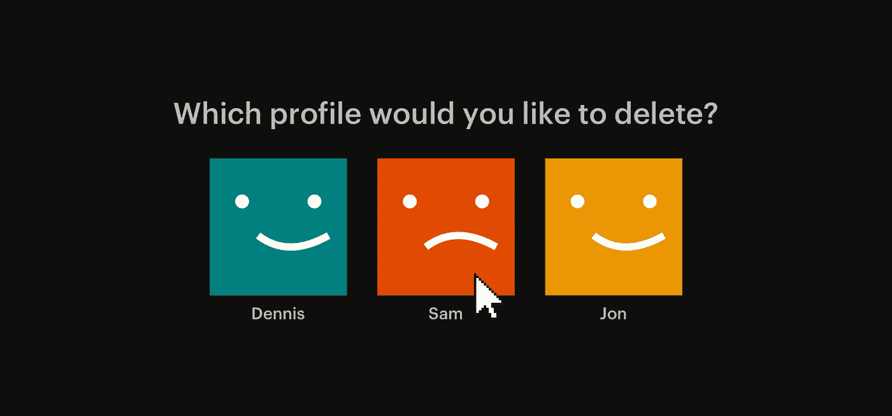

# 再见，网飞。你好，目标…

> 原文：<https://medium.com/swlh/goodbye-netflix-hello-goals-4a2a2ba52552>

我在家的大部分时间都是在沙发上看网飞、Youtube 或者玩电子游戏，这……真他妈的太棒了。谁不喜欢整晚坐着看 Youtube，从一个音乐视频开始，然后 6 个小时后看一集老的[和丹尼斯·诺登(他还活着！).](https://www.youtube.com/watch?v=pCbvXIi8S1s)

> “我想开始这个，但是没有时间”

这是我们经常听到的，但是如果你问同一个人他们是否看了最新的黑镜系列，那么大多数的回答会是“是的，我昨晚都看了！”。

如果我们放弃沙发生活，开始追求我们的目标，会怎么样？今年我已经做出了选择，所以我可以开始我的 [2018 目标](/@sam_hainsworth/public-shaming-by-sharing-my-goals-f92fe21ec2b6)。这是对我自己的一个小测试，看看我是否会在 2018 年更有成效。虽然我不得不承认这不是我计划一整年要做的事情，但我并没有疯…

# 3 条规则

## 再见疯狂观看

电视上没有完全的冷火鸡，但是我一个晚上只能看一集/一部电影，然后电视就关了。

## 不玩游戏了

这是最近占用了我很多时间的事情，我会坐着玩一整天的游戏，然后坐着后悔。我已经决定彻底戒掉游戏(希望能为自己省下一大笔买新游戏的钱)。

## 4 周的期限

我们都有罪的一件事是开始了我从未完成的事情。这是我经常做的事情，以 [Mobloq](https://www.instagram.com/mobloq/) 为例。去年，我和几个朋友一起开始了这个项目，后来我们忘记了它，它就成了死亡项目的坟墓。这个规则是为了阻止，一旦我开始了一个项目，它必须在 4 周内完成！

# 下一步是什么？

我计划从今天开始用 **4 个月**来做这件事，并且我会一直写下去。这真的是一个测试，看看我还能做多少事情，并开始追求某些目标。

为什么不自己给呢？

## 这篇文章发表在 [The Startup](https://medium.com/swlh) 上，这是 Medium 最大的创业刊物，拥有 281，454+读者。

## 在这里订阅接收[我们的头条新闻](http://growthsupply.com/the-startup-newsletter/)。

