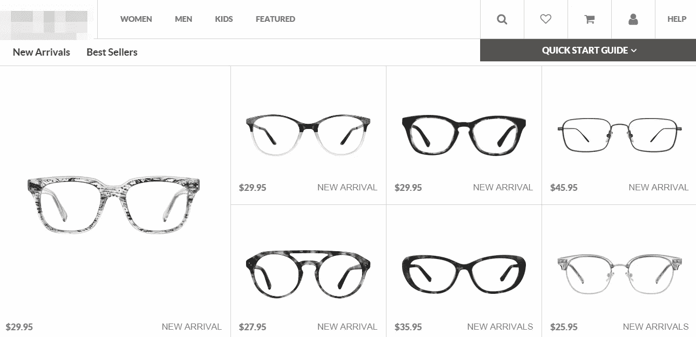

# Google Duplex 的盟友——爷爷？

> 原文：<https://medium.com/swlh/google-duplexs-ally-grandpa-5907f0d133b3>

现代产品是如何把老年人抛在后面的，我们能做些什么。

像你们中的许多人一样，当我在思考[桑德尔·皮帅推出 Google Duplex](https://youtu.be/ogfYd705cRs?t=35m0s) 后的可能性和挑战，并阅读了[关于它的博客帖子](https://ai.googleblog.com/2018/05/duplex-ai-system-for-natural-conversation.html)时，我碰巧在同一天收到了两个有趣的请求。

一位年长的邻居打电话给我，问我是否有时间帮他让他的新 iPhone X 与他的汽车同步，这样他就可以在即将到来的公路旅行中使用手机上的 GPS。

另一个电话是爷爷打来的，他在网上购买新的眼镜时寻求帮助。他说，他本周末有一次旅行，希望在那次旅行之前下订单，并把眼镜送到他的度假屋。我去了他的住处，在他的电脑前花了一个小时，自己浏览网站，直到完成他的购买。他坐在我的旁边，回答我的问题，我们一起去(开始看起来像是一个复杂的过程)购买处方眼镜。它给了我一个全新的视角，让我看到一个看起来优雅的网站对于偶尔的电子商务购物者或外行用户来说是多么的不友好和繁琐。

当我代表爷爷处理电子商务交易时，我可以感觉到我和他的对话与人工智能谷歌助理和预订晚餐的餐厅员工的对话有相似之处(听听[博客帖子](https://ai.googleblog.com/2018/05/duplex-ai-system-for-natural-conversation.html)中的语音样本)——很多来回只是为了获得澄清，*但没有“嗯嗯”*。

这也让我想起了 92 岁高龄的 IDEO 设计师 Barbara Beskind 的精彩演讲(在 https://www.youtube.com/watch?v=QEV5uq_tiw4 观看),她谈到设计不仅仅是为了老年人，也是为了老年人。

我以前浏览过同一个眼镜购物网站大约 5 次，它似乎总是很容易使用——但是设计互联网产品和体验已经成为我生活的一大部分。出于习惯和对行业惯例的敏锐意识，我碰巧知道某个图标意味着什么，以及我必须将鼠标悬停在看起来很酷的网站上的什么位置才能显示登录框。爷爷根本找不到。

现在想象一下，如果 Google Duplex 可以被每个网站所有者训练和配置，为他们的个人网站提供定制的语音辅助导航。视听体验肯定会在网站上延续，但没有导航的臆测。

这将大大降低网站访问者的放弃率。这将大大降低客户支持成本。这将吸引更多的购物者到电子商务网站。在网络的早期，我们曾经为虚拟礼宾添加一个插件，以在预先录制的视频中出现。对于第一次访问的人来说，这总是令人吃惊的，但它仍然有助于通过虚拟礼宾的个性化信息吸引网站访问者的注意力。Google Duplex 仅用语音就能做得更好。网页上甚至不需要私人礼宾的动态图像。

所需要的只是一个耐心而亲切的声音，可以回答老年用户的所有问题，耐心地来回选择功能，让他们不断改变主意，而无需他们触摸鼠标。更重要的是，他们也不应该因为别人可能强加给他们而感到有义务。Google Duplex 可以让老年人在数字上变得流畅。

这种独立的感觉，他们不必四处寻求帮助，只是在高科技产品的包围下继续他们的日常生活，在某种意义上，对数字移民来说确实是非常解放的。谷歌双工可能有一个新的盟友在爷爷。

作者 Ramesh Sambasivan 是商业创新和设计公司[*SiliconGlades*](http://SiliconGlades.com)*的首席设计师和项目负责人，该公司从社会影响的角度帮助初创公司进行产品营销，并帮助更多成熟的组织发掘他们的销售 DNA，以在给予的同时实现增长。*

## 这篇文章发表在 [The Startup](https://medium.com/swlh) 上，这是 Medium 最大的创业刊物，有 323，834+人关注。

## 在这里订阅接收[我们的头条新闻](http://growthsupply.com/the-startup-newsletter/)。

