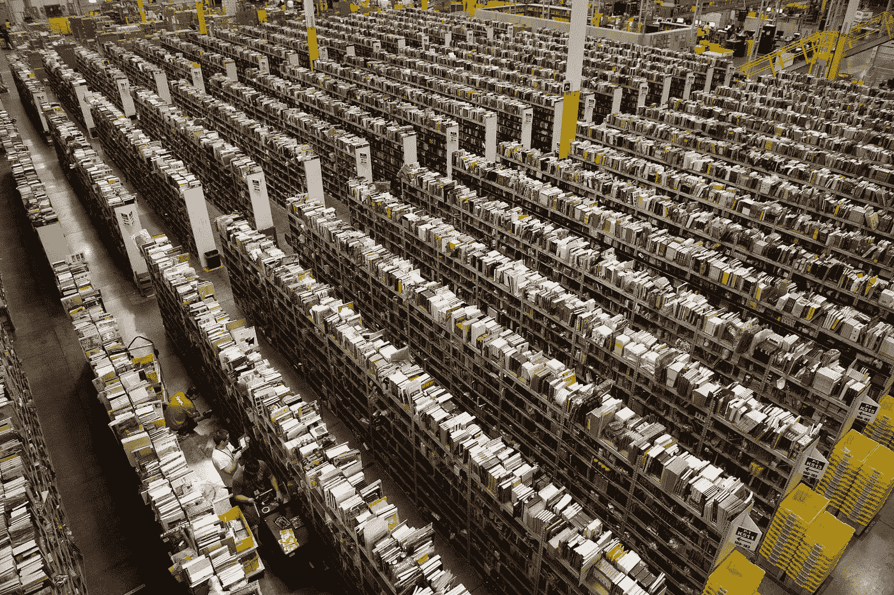
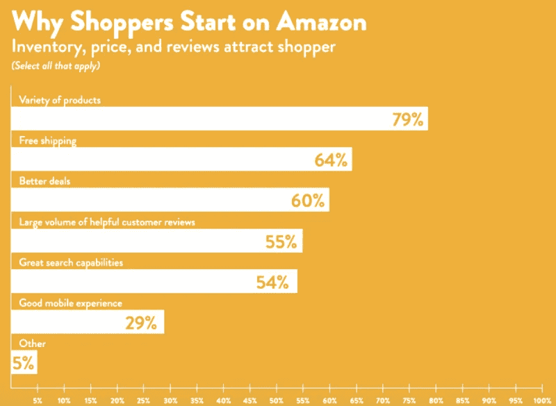
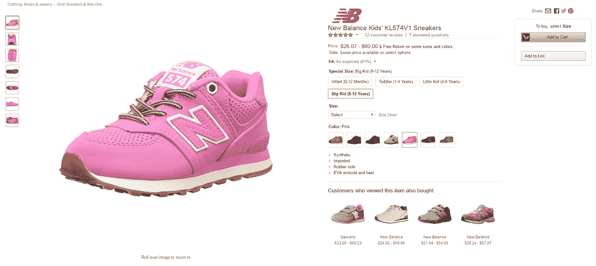
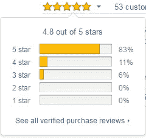
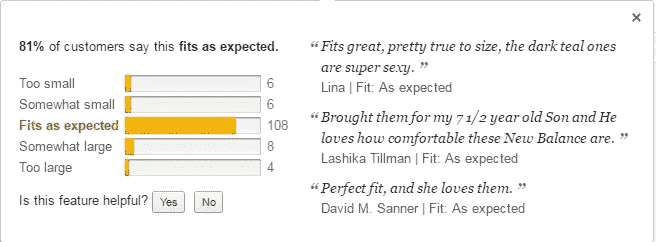

# 谷歌称 Amazon.com 是其直接竞争对手

> 原文：<https://medium.com/swlh/google-has-called-amazon-com-its-direct-competitor-a385c5c381fb>

## 创建真正有利可图的网上商店时要考虑的事情

亚马逊在过去的一年中在金融市场中产生了真正的繁荣，当该公司的股价上涨时，价格立即翻了一番，超过了谷歌股票的价值。Amazon.com 2016 年净营收达[【1360 亿】美元](https://www.statista.com/statistics/266282/annual-net-revenue-of-amazoncom/)，活跃用户数早已突破 3 亿大关。维护和处理如此大量的数据需要大量的资源。在本文中，我们将了解在开发高负载项目时，考虑 Amazon.com 的经验应该考虑什么。

# 亚马逊历史——超乎寻常

*The Amazon warehouse in Swansea*

像现代市场的许多巨头一样，亚马逊也是在车库里起步的。我们都知道网上书店的故事，由于其所有者杰夫·贝索斯的创造性方法，它已经成长为世界上最大的交易平台。亚马逊以这条流量最大的河流命名，如今每天有 400 万次购物，目录中有超过 3.5 亿件商品。它的仓库被列入吉尼斯世界纪录。他们的地盘等于 700 个竞技场，像麦迪逊广场花园，差不多 550 英亩。

每个月大约有 1.88 亿用户访问亚马逊。在过去的几年里，网上商店变得如此受欢迎，甚至 [**谷歌分析**](http://searchengineland.com/googles-eric-schmidts-berlin-speech-biggest-search-competitor-amazon-205761) **开始被称为 Amazon.com 的直接竞争对手。PowerReviews 公司在 2016 年夏天进行的一项调查显示，40%的主要产品需求是通过 Amazon.com 网站**收到的，而 [45%的受访者](http://www.powerreviews.com/blog/new-study-finds-that-retailers-and-brands-can-leverage-reviews-to-compete-with-amazon-and-search/)使用 line 搜索引擎。

# Amazon.com 用户的机会和保证

这家网上商店，通过其 20 个主要部门，销售几乎所有商品——从电子产品、家具到食品。Amazon.com 在加拿大、澳大利亚、巴西、墨西哥、法国、意大利、德国、荷兰、西班牙、英国、印度、中国和日本设有代表处。

除了最广泛的范围和相对较低的价格之外，用户的一大好处是易于支付。所有支付交易都是通过亚马逊进行的，卖家不会从买家的卡上获取数据。用户只需在账户中填写一次卡的详细信息，之后的所有支付都会自动从卡中扣除。很少有像 Endless 这样的独立商店也通过亚马逊账户进行支付。

# 为什么亚马逊商品更便宜

在很大程度上，Amazon.com 的受欢迎程度取决于忠诚的价格和高质量的产品。除了该公司，通过这个在线平台的销售可以由注册交易商进行，然而，担保人仍然是亚马逊。交易平台从其产品和商家的直接销售中获得利润，商家的产品呈现在网站上。带来最大的营业额，从而与供应商签订利润丰厚的合同。

# 发展大型网上商店时考虑 Amazon.com 的经验

# 设计

为了取悦数以百万计的用户，不同国籍和口味偏好的代表，网站导航应该简单，方便，易懂。该公司的标志包含了给每个用户的信息——从字母 A 到 Z 的橙色箭头暗示了商店中任何商品的存在(从 A 到 Z)。这条线形成的半圆让人想起微笑——一个永远欢迎你的在线商店。顺便说一句，第一个标志也完全通过了它的活动——在字母 A 下放置了文字:Amazon.com。地球上最大的书店。

Amazon.com logos 1995 and 2017

# 项目卡

亚马逊的物品卡也很有意义。除了产品的标准查看功能，它还包括颜色和大小的选择、查看评级和评论，您可以查看所选项目的完整统计数据:

*   已经收到回复的客户评论和问题的数量；
*   基于投票人数的详细排名；
*   以鞋子为例——网站上鞋号与你脚的大小的命中率。

在线资源不断地分析提供给用户的商品和功能的性能。这使得在线商店页面对用户来说很方便，给他们关于产品的正确信息。此外，互动交流使每个用户感到他的意见真的很重要。

# 平台和数据库

项目越落后，错误的代价就越高。一旦一个网站 49 分钟不可用，亚马逊在此期间的损失约为 570 万美元。保持亚马逊上的一切正常工作是一项艰巨的任务——例如，建立一个平均 120 个服务中需要访问的页面。为了保持最大网络项目之一的效率，选择了 24/7:

*   Linux 操作系统
*   神谕
*   C++
*   Perl 语言
*   砖石工
*   Java 语言(一种计算机语言，尤用于创建网站)
*   Jboss
*   servlets

C++用于处理请求，而 Perl 和 Mason 用于构建内容。我们只能猜测为什么该公司选择了这种特殊的技术组合。Linux 是服务器的简单操作系统，Oracle 是高度复杂项目的重要数据库，负责存储采购信息、数据用户卡等。C++和 Java 也是为处理高负载项目而设计的——它们提供了快速处理大量数据、可靠和良好交互的能力。

# 服务器

亚马逊的数据中心数量已经达到 30 个，另外 10-15 个处于设计阶段。关于服务器的全部信息并没有公开，尽管已知仅在美国亚马逊的 DTS 的总容量约为 600 MW——相当于 100 万台家用电脑。相比之下，容量为 615 兆瓦的 San Gorgonio Pass (CA)风电场使用 3200 个风力涡轮机来获取能量。

# 可量测性

任何在线项目开发的目标都是它的受欢迎程度，以及由此带来的大客户流量。不利的一面是，高流量和大量数据可能会导致操作中出现严重问题。为了避免它们，你未来的网上商店应该有足够的实力，并准备扩大规模。那么网站的发展就不是问题了。

# 洞察力

如果你决定创建一个为大量商品和用户设计的在线商店，除了用户体验，你还应该考虑以下因素:

1.  优质的服务器设备，确保平稳运行。服务器可以购买或租用。
2.  有能力的团队将全天候支持高负荷在线商店的运营。
3.  一个经过深思熟虑的项目结构，随时可以扩展。大型互联网服务最初应准备好扩展(内容、用户数量、地理覆盖范围、功能)。
4.  可靠的开发平台，可承受最大负载。
5.  愿意进行大额金融投资。高负荷项目的开发不仅仅是创建一个在线商店。如果系统由于技术问题而闲置，开发阶段的节省会导致巨大的财务损失。而一个设计良好、运行良好的网站会给你带来可观的利润。

*最初发表于*[*【stfalcon.com】*](http://bit.ly/oroginaly-amazon)*。*

## 这个故事发表在 [The Startup](https://medium.com/swlh) 上，Medium 的出版物拥有超过 256，410 人的关注。

# 订阅[在这里获取头条](http://growthsupply.com/the-startup-newsletter/)。

