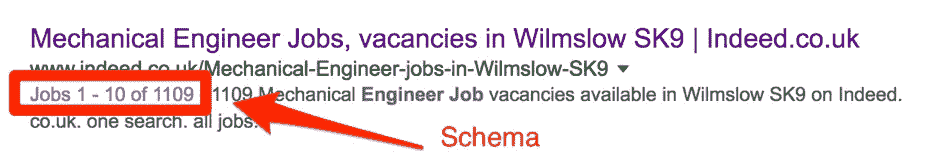
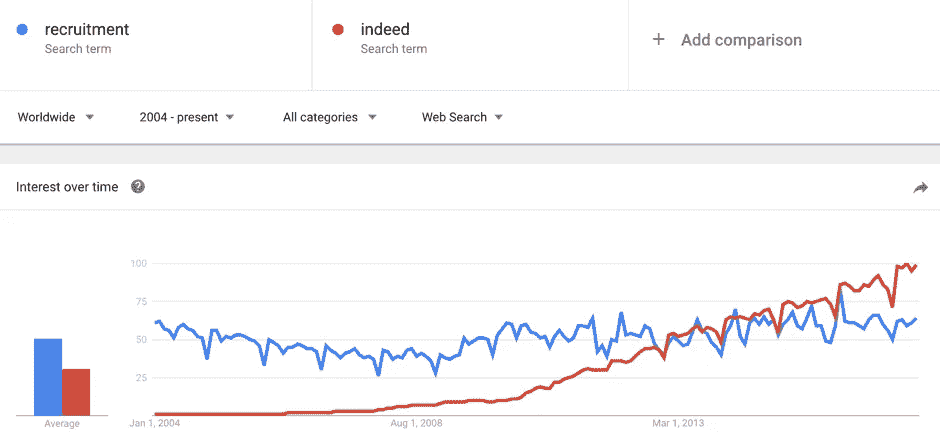

# 谷歌即将削弱 Indeed 在招聘市场的地位

> 原文：<https://medium.com/swlh/google-is-about-to-weaken-indeeds-position-in-the-recruitment-market-8797e50c7f75>

在谷歌的年度 I/O 大会上，这家搜索巨头宣布将推出 Google for Jobs，这一举措旨在缓解求职者目前在网上寻找下一个角色时的摩擦。

通过利用机器学习，Google for Jobs 将通过向求职者提供更相关的结果、通勤时间估计和更好的过滤功能来增强他们的用户体验——所有这些都不需要离开搜索引擎。

然而，正如丹·舒尔所展示的，在 I/O 发生的三周前，谷歌已经在现场用户测试中做到了这一点。

最令人吃惊的是，谷歌花了这么长时间才进入[2000 亿美元的行业](https://www.forbes.com/sites/joshbersin/2017/05/26/google-for-jobs-potential-to-disrupt-the-200-billion-recruiting-industry/)。文[在两年前报道求职行业的主导地位时提出这种情况可能会发生。引用比尔·斯劳斯基的话说——](https://www.venndigital.co.uk/blog/is-indeed-bigger-than-the-recruitment-industry-78869/)

> *“谷歌结构化数据主管阿龙·哈勒维(Alon Halevy)开发了一个将分类信息聚合在一起的网站，就像 Indeed 所做的那样”。[在他为谷歌工作之前]。*

但是谷歌并不是唯一试图控制这个行业的公司，[脸书也加入了这个行列](https://thenextweb.com/guests/should-linkedin-be-worried-that-facebook-have-finally-encroached-on-their-digital-space/)，这意味着世界上最受欢迎的社交网络，以及世界上最大的搜索引擎现在正在帮助用户寻找工作。除此之外，还有 LinkedIn 以及前面提到的，加上其他流行的求职网站，如 Glassdoor 和 Monster。

# 这对那些希望在网上有更多存在感的招聘公司来说意味着什么？

谷歌喜欢它可以大量获取的数据，即那些易于抓取的结构化数据。我们看到 Google 在 SERPs 中使用 schema 已经有一段时间了，而 [job schema](http://schema.org/JobPosting) 已经作为它的一部分使用了好几年，如下例所示。

事实上，Monster 和 CareerBuilder 等其他求职网站使用 schema，与大多数其他网站相比，它们能够以结构化的方式提供更多的职位。这使得他们成为谷歌新的工作搜索功能中的一个明显的目标，这可能是为什么[谷歌声明](https://techcrunch.com/2017/05/17/google-to-launch-a-jobs-search-engine-in-the-u-s/)“它将首先与 LinkedIn、脸书、CareerBuilder Monster、Glassdoor 合作”的众多原因之一。

上述引用的原因是有道理的，因为这些网站是谷歌在 SERP 上主要显示的，但这个功能将更大的品牌置于更亮的聚光灯下。新功能是否意味着用户不太可能点击 SERP 中的有机列表，而直接进入工作搜索功能？

谷歌航班搜索[在这家搜索巨头推出该功能时并没有扼杀竞争](https://www.washingtonpost.com/lifestyle/travel/google-flight-search-four-years-in-success-or-not/2014/10/02/bfb69036-45ab-11e4-9a15-137aa0153527_story.html)(这是你在搜索航班时在 SERP 中得到的搜索框)。但是航空公司的招聘量相比，公司的招聘量是无法比拟的。大多数国家都有几家航空公司在运营，而每个城镇都有许多独立的招聘公司在运营。

大多数人可能会习惯于在谷歌内部点击寻找工作，而不是向下滚动到有机列表中寻找替代的工作/招聘公司，这可能会使大型工作列表网站更加强大，因为它们在搜索引擎中的权重已经很大，并且能够轻松地向谷歌提供机器所需的信息。

事实上，谷歌的品牌已经比招聘行业大了一段时间，正如谷歌趋势的下图所示。虽然我们并不严格地通过搜索“招聘”来找工作，但它确实表明了“确实”这个品牌是如何在这个行业中变得紧密相连的。

如果我错了，谷歌确实给了小招聘公司比我想象的更多的可见性，那么它会像在本地搜索中那样工作吗？如果它的运作有点像当前的本地搜索设置，那么基于链接和评论的结果(仅举几个[从本地搜索获得更多流量的方法](http://searchengineland.com/local-seo-ranking-2016-beyond-251404))将成为招聘公司保持有机竞争力的关键因素。尽管这也不可避免地成为谷歌进一步开发其 Adwords 平台的新领域，但对于招聘人员来说，这是一个利用和击败点击的理想机会。

搜索者的工作地点(通勤时间)也可能是大多数结果算法的一部分，但如果你是一名在世界另一端寻找工作的石油和天然气工程师，该怎么办？

然而，如果我是正确的，并且大的求职推荐网站获得了大部分的职位搜索可见性，那么为 Monster 上的列表付费的招聘人员或者确实浏览了他们的网站的招聘人员肯定会看到他们试图填补的职位，但是，从长远来看，这将如何影响招聘人员的品牌呢？

起初，招聘机构似乎很容易依靠较大的品牌将相关流量和简历输送到他们的网站，但随着他们开始支付更多的钱来争取关注，让他们的职位空缺被看到，这将开始影响他们的利润率。

因此，与其简单地依赖职业介绍巨头向招聘网站输送流量，不如招聘者积极主动地开始宣传他们的品牌和服务。目前，整体来看似乎不太乐观，83%的人才招聘专家将求职者的质量从一般到糟糕。

**这意味着招聘人员不得不开始提供更多。**

**他们需要创造更多的理由让候选人回到网站，直接再次使用他们的服务。**

招聘人员需要提供更多的理由，让客户认可他们提供的员工，以便他们继续回来寻求更多的人员解决方案。

他们还必须做好准备，最大限度地利用推荐流量的增加和可能发生的有机流量的减少。招聘人员需要[接受这个](https://www.venndigital.co.uk/blog/taking-market-share-back-from-referral-giants-78838/)，并与通过网站的候选人建立长期的关系。

[创造那些积极的时刻](https://www.venndigital.co.uk/blog/how-brand-experiences-influence-your-customers-memories-78743/)，而不是给候选人或客户留下招聘者品牌的负面印象。如果招聘人员没有不断地致力于他们的品牌产品，并努力成为他们所供应的行业的同义词，那么他们应该准备好开始付费，以便在非常拥挤的 realms，Monster 和 Glassdoor 领域中被听到。

*原载于 2017 年 6 月 1 日*[*【www.venndigital.co.uk】*](https://www.venndigital.co.uk/blog/google-is-about-to-weaken-indeeds-position-in-the-recruitment-market-86908/)*。*