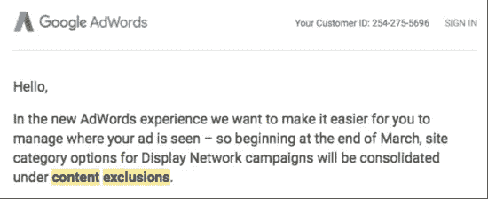
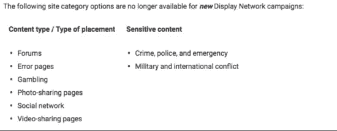
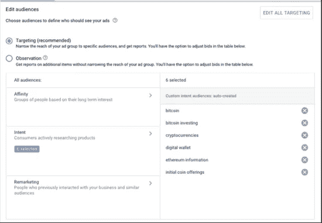
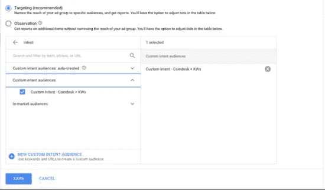
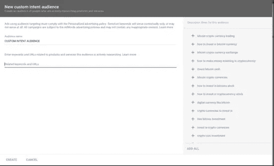
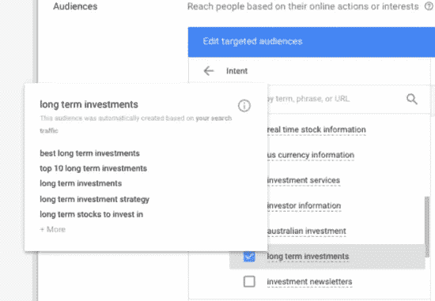

# 谷歌的定制意向受众:受众定位的可喜进步

> 原文：<https://medium.com/swlh/googles-custom-intent-audiences-a-welcome-step-forward-in-audience-targeting-8b38da0f84e7>

by[Brian Swift](https://readyfireaim.eu/author/bswift/)| 2018 年 3 月 22 日| [PPC](https://readyfireaim.eu/category/paid-search/)

我很不情愿地强制切换到新的 AdWords 界面。

到目前为止，我一直抵制这种改变，主要是因为我讨厌任何强加给我的东西。

一个很好的例子发生在今年 1 月，当时 Gmail 赞助的促销活动(GSP 广告)无法再从旧界面创建。此后不久，我们在旧的 GSP 活动中经历了明显的业绩下滑。

上周，我的收件箱里又收到了一份令人兴奋但同样不受欢迎的公告(见下文)。

对于没有收到备忘录的人来说，这一变化意味着什么:

现在，如果你和我一样，那么到目前为止，你可能也会抵制新的界面。

但是尽管我很喜欢夸夸其谈，但这并不是我今天和你们谈话的原因。我写这篇文章是因为我现在相信谷歌已经找到了让营销人员想转向新界面的特性…

进入*定制意向受众*。

# 什么是客户意向受众？

在我更深入地解释之前，重要的是要注意新的定制意图受众只在新的 UI 中可用。所以，如果你仍然坚持旧的界面，可能是时候最终做出改变了。

简而言之，自定义目标受众是一种更精细的目标定位形式，它允许您将目标人群锁定在您提供的特定产品和服务的市场中。自定义意向受众仅在显示网络上可用。

以下是谷歌对这项新功能的描述:

> “自定义目标受众帮助您定义并接触到您企业的理想受众。定制意向受众以广告效果为出发点，让您能够超越预先定义的受众类别，在人们做出购买决定时接触到他们。”

我喜欢将定制受众视为弥合市场内受众和定制亲和力受众之间差距的工具。

市场内受众通常需要更高(因此不可持续)的点击费来获得任何吸引力；尽管定制的亲和型观众通常会带来大量的观众，但我经常发现质量有所欠缺。

有两种类型的自定义目标受众:

1.机器学习、自动生成的方法(对新手或赶时间的人来说很棒)。

2.创建你自己的(DIY)方法:将与你的自由报告或产品相关的关键词和 URL 混合在一起。这与您创建自定义亲缘关系受众的方式完全相同。

# 如何创建自定义目标受众

创建自定义目标受众相当简单。下面是帮助您充分利用该功能的分步演练:

1.  在新的 AdWords 界面中选择一个展示活动(或创建一个新的活动)，然后选择受众选项卡
2.  一旦你在观众中，你已经选择了一个广告组，选择编辑/目标按钮，并选择“意图。”它应该位于“亲和力”和“再营销”标签之间。

3.然后，你可以选择使用谷歌自动生成的目标受众，或者创建自己的目标受众。在本演练中，我们将创建我们自己的自定义目标受众(因为我知道您比大多数营销人员更高级一些)。

4.点击+新的客户意向受众。

5.输入您选择的关键字和网址，然后选择“创建”。

注意:不言而喻，你应该选择由一个相似的主题明确连接的关键字和 URL。

**目标提示:**在决定使用什么样的网址和关键词时，考虑一下你的潜在客户已经在使用的网站和关键词。一个很好的起点是你在展示网络上的排名和你的最高流量关键词/搜索词。

对于任何想要使用谷歌自动生成的受众的人，如果您将鼠标悬停在受众的名称上，您可以确定您的受众的关键特征，包括:

*   它是基于什么。
*   您帐户中的相关关键词。
*   与受众正在积极研究的产品和服务相关的常见关键词和 URL。

启动活动后，请记得查看“受众”选项卡，了解哪些受众正在转化，以及您可以进一步优化活动的地方。

# 最后的想法

毫无疑问，谷歌的人工智能(AI)对我们潜在客户行为的了解，比我们作为营销人员希望了解的更多。虽然意向受众和预测受众仍然缺乏激光聚焦的搜索精度，但定制意向受众是一个令人兴奋的新功能，它使我们能够在正确的时间锁定与我们的业务高度相关的特定人群。

到目前为止，印象有限，我们已经看到了这个新的目标工具的一些积极成果。

## 这篇文章发表在[《创业](https://medium.com/swlh)》上，这是 Medium 最大的创业刊物，有 312，596+人关注。

## 订阅接收[我们的头条新闻](http://growthsupply.com/the-startup-newsletter/)。

