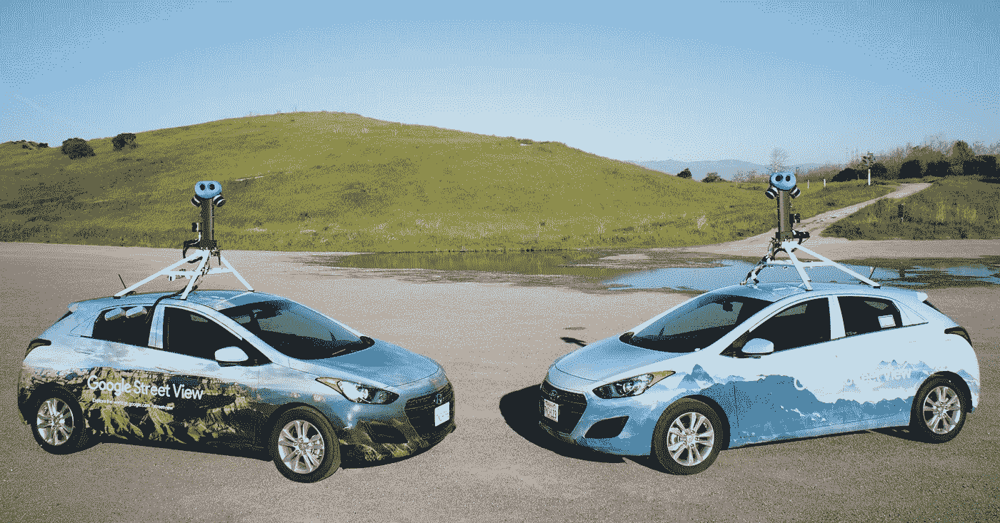
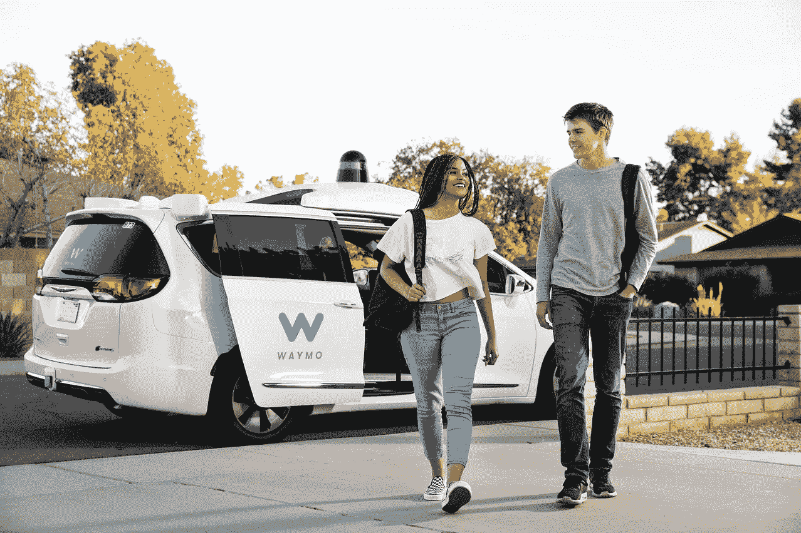
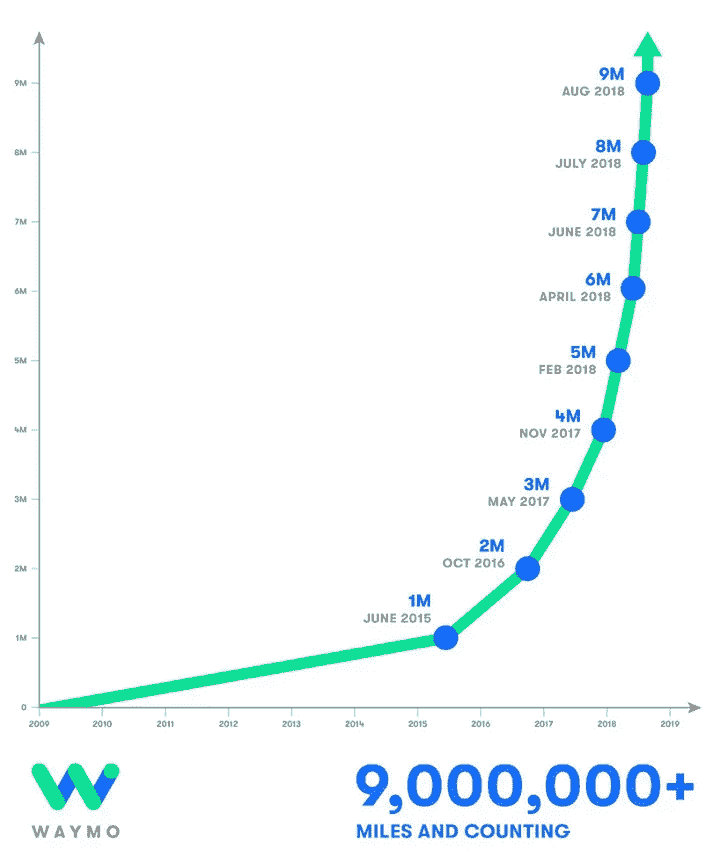
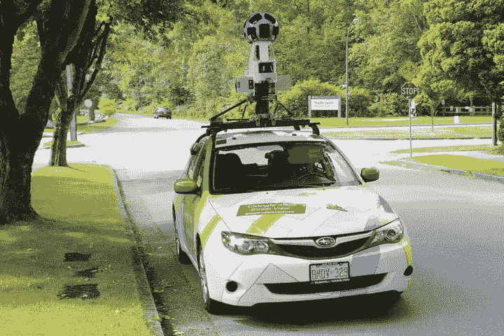
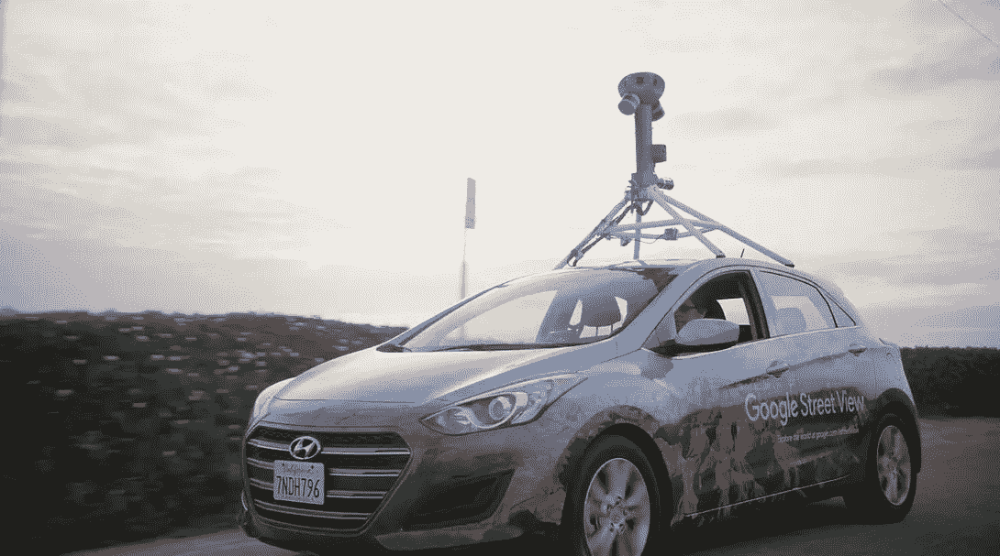
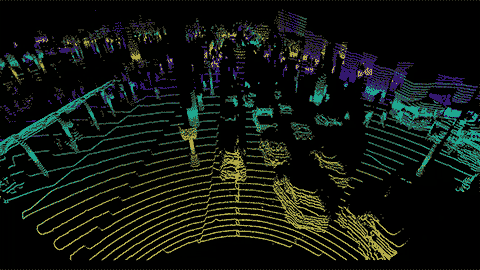
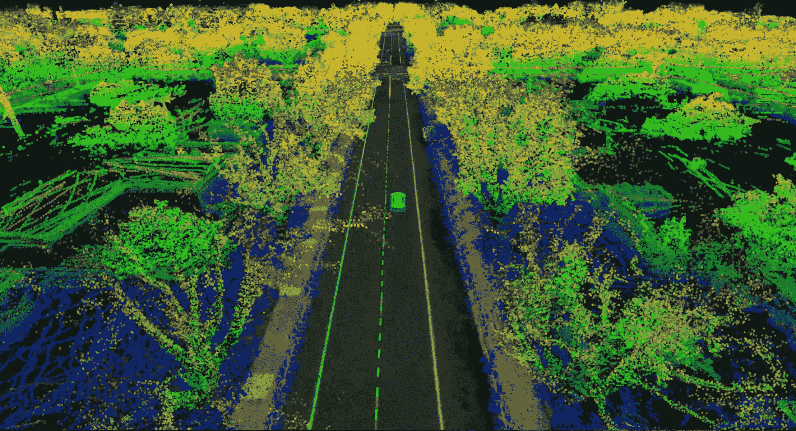
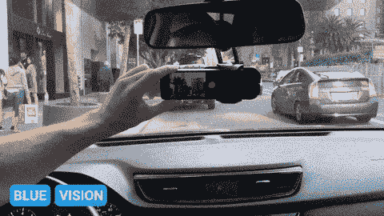

# 谷歌的街景车让街道不仅对人类可见

> 原文：<https://medium.com/swlh/googles-street-view-cars-are-making-streets-viewable-to-more-than-just-humans-33a69438ef7d>

## 赢得万亿美元不眨眼比赛的竞赛

Courtesy of Wired

2001 年，一位斯坦福大学的教授和他的几个天才开车去见拉里·佩奇和谢尔盖·布林，进行了一次秘密的咖啡会面。谷歌的联合创始人有一个想法:如果你可以传送到世界上的任何一条路上会怎么样？

六年后，巴斯蒂安·特龙和他的谷歌地球团队推出了街景，但对他们来说，通过屏幕观看还不够好。他们不想以数字方式旅行到数千英里之外的街道，他们想被带到那里。

Courtesy of Waymo

从那以后，整整十年过去了，谷歌自动驾驶汽车项目，现在的 [Waymo](http://waymo.com) ，即将让公众做到这一点。在编写了数十万行代码来识别双黄线和行人，在现实生活中驾驶了数百万英里来完善他们的左转，在模拟中覆盖了数十亿英里的地面之后，Waymo 的 suped-up 小型货车已经准备好自动驾驶了——嗯，至少在凤凰城是这样。

即使在他们的自动驾驶汽车上绑上了疯狂先进的传感器和高度详细的摄像头，Waymo 也不准备让他们在纽约市或任何其他城市自由行驶。雨、雪，甚至是老化的道路都可以有效地蒙蔽他们的汽车。

The old (left) makes way for the new (right)

这就是街景车被彻底改造的原因。他们仍然有摄像头，但他们也安装了激光雷达传感器，这是自动驾驶汽车的眼睛，可以创建他们正在驾驶的世界的 3D 模型。

Courtesy of the New York Times

这些“点云”让自动驾驶汽车不仅可以了解物体的样子，还可以了解它们的位置和形状。路边，橙色的锥形路标，交通灯，简单。行人，骑自行车的，路上其他车辆，搞定。

通过提前获得他们正在行驶的城市的 3D 地图，Waymo 的汽车可以更少地关注他们已经知道存在的双黄线和人行横道，而更多地关注他们不知道的东西，如行人和骑自行车的人。

另一个好处是:无论天气如何，Waymo 的汽车都可以开到任何地方，因为它们已经知道重要的道路特征在哪里，它们可以开到哪里。当滚动到被雪覆盖的停车标志时，Waymo 汽车会像街景车一样清楚地看到红色油漆，就像它在晴天滚动并捕捉到它一样。

然而，虽然您可以免费访问街景 2D 地图，但这些 3D 地图是非常有价值的、受欢迎的私有热门商品。3D 地图初创公司 Deepmap 已经筹集了大约 1 亿美元，用他们自己的激光雷达测试车来处理高速公路地图。另一家初创公司 Civil Maps 也在做同样的事情，它的投资者名单中包括福特。

Courtesy of Deepmap

为了扩展到越来越多的城市，其他自动驾驶初创公司，如 [Zoox](http://zoox.com) 、 [Cruise](http://getcruise.com) 和 [drive.ai](http://drive.ai) 将不得不要么创建自己的，要么利用像 Deepmap 的 detailed maps 这样的初创公司。虚拟基础设施的缺乏很容易成为阻碍 AV 在家乡扩张的唯一因素。随着抛弃方向盘的竞赛越来越接近现实，对地图的需求将变得更高。

谷歌的街景基础设施使其处于优势，覆盖了地球上的每一个主要城市和国家。随着整个世界再次被绘制出来，街景将为 Waymo 在一个又一个城市推出铺平道路。尽管他们有一个领先的开始，但它将真正是最有效率和最有效的制图者，将把黄金带回家。

Courtesy of Blue Vision and Lyft

Lyft 最近对 Blue Vision 的收购表明，这个年轻而饥渴的竞争对手不想被落在后面。Blue Vision 的技术没有使用激光雷达，而是使用智能手机的摄像头和 GPS 来满足其测绘需求。现在，随着 Lyft 司机大军的召唤，Blue Vision 处于成功的最佳位置。全国各地的 Lyft 司机将配备 Blue Vision dash-cams，绘制街道地图，以与谷歌相同的速度甚至更快的速度众包准确的数据。

> “您拥有的数据量会影响您对系统的依赖程度。我们的技术允许我们利用 Lyft 的车队来训练汽车。这真的改变了游戏规则。”—蓝色愿景首席执行官彼得·翁德拉斯卡。

很快，3D 制图员可能会各自拥有自己的城市，风险投资会将资金投入到他们认为具有竞争优势的城市，而 AV 初创公司要么必须付钱，要么必须全力以赴。

随着地图初创公司的整个子市场的出现，自动驾驶行业的价值可能会比现在更高。最近，预计到 2030 年，这一数字将达到 5 万亿美元。鉴于摩根士丹利(Morgan Stanley)对 Waymo 的估值已经达到 1750 亿美元，谷歌街景汽车可能会在短短几年内将其推上财富 500 强的第 30 位。

一个价值数万亿的新市场正在出现，但实际上，我们只能拭目以待。

## 这篇文章发表在 [The Startup](https://medium.com/swlh) 上，这是 Medium 最大的创业刊物，有+ 381，508 人关注。

## 订阅接收[我们的头条新闻](http://growthsupply.com/the-startup-newsletter/)。

