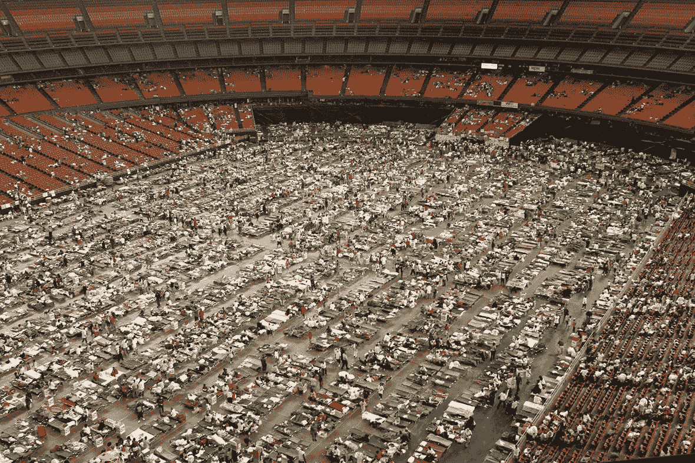

# 有品牌问题吗？放一只鸟在上面。

> 原文：<https://medium.com/swlh/got-a-brand-problem-put-a-bird-on-it-4e99ec94af37>

## 像我这样的设计师的特殊地狱(第二部分)

这个帖子要去一个阴暗的地方，先来点好玩的。这是来自波特兰迪亚的视频剪辑，布莱斯·希弗斯和丽莎·埃弗斯曼通过在东西上放鸟来变废为宝。

笑死我了。反正以后会更有道理。现在，*去地狱吧……*

[我的第一篇关于设计师地狱的帖子](/@ade3/a-special-hell-for-designers-like-me-5c55bd855613#.p66ui147u)展示了设计行业的技巧如何具有欺骗的潜在可能性。从表面上看，这些错觉中固有的罪恶程度是有争议的。要真正与魔鬼共舞，你必须提出问题。让我们从这个开始:

> 为什么发给卡特里娜飓风受害者的数千辆房车上没有任何标识？

我在印第安纳州拍摄照片时，一列南行的火车挡住了我的去路，车上挤满了普通的房车。我天真地以为这代表了善意的举动。我问我的同事，他们是否知道是哪个制造商捐赠的。他们让我知道了这个秘密。

> “捐款？你认为那些房车上为什么没有一个标识？”

很奇怪，不是吗？你可能会猜测，一家房车公司会欢迎帮助受灾难影响的美国同胞的宣传。取消品牌不是一种谦逊的行为，也不是一种疏忽。不，这是否认，是有意否认他们参与了这个项目。原因如下…

联邦应急管理局急于购买房车。他们实际上是在开空白支票。任何一家能把四面墙装在轮子上的公司可能都在排队包装他们的产品。这些房车的质量低于平均水平，考虑到房车行业的低标准，这是一个可怕的想法。

事实上，它们的制造成本如此之低，以至于有人担心，仅仅是将它们从印第安纳州运到路易斯安那州，就可能会将活动房屋震成碎片。如果橱柜还挂在墙上，他们就能幸运地到达目的地。

你不能把你的商标放在这样的东西上。*你希望没人问是谁做的。*

我的眼睛睁开了。在印第安纳州的照相馆里，我通过相机镜头仔细观察了我客户的房车。一张卡通鸟的贴纸对着我微笑。如果我把贴纸撕下来，我就无法把这个白盒子和那列火车上的盒子区分开来。

我想我应该在事情变得更糟之前写一份免责声明。我不知道我客户的房车是不是运往墨西哥湾的货物的一部分。与我一起工作的人都是好人，我没有任何证据表明他们有罪，除了与其他房车制造商没有什么区别。我的目标不是贬低他们，他们只是碰巧是我与更大的故事的联系。)

那些火车上的房车团结在一起。他们完好无损地到达了路易斯安那，但是还有一个问题。急于建造房车的动机诱使制造商跳过正常的安全程序。甲醛是制造过程中常见的副产品，但如果不小心，致癌物的含量会变得致命。

本打算救人的房车最后却毒死了他们。

人们生病了。提起了诉讼。房车需要被隔离。数以千计的空房车停在离新近无家可归的人睡在拥挤的避难所几英里远的地方。

当房车显然不适合居住时，联邦应急管理局有了新的灾难要处理。如何让成千上万的有毒房车消失？

答案:你在窗户上贴上一张贴纸，然后进行一次大甩卖。

你知道橱窗里的通用贴纸写了什么吗？不，它不是一个卡通吉祥物，一只手绘的鸟，或者一个闪亮的标志。这是任何营销人员所能想到的最低调的口号。上面写着，

> “不用于住房。”

A mobile home with a “not to be used for housing” sticker. Maybe if you put it upside-down people won’t read it.

联邦应急管理局成功拍卖了有毒房车。“不得用于住房”的标签被悄悄移除，移动死亡屋遍布全国。经销商们，如果他们再考虑一下的话，可能会用甲醛含量逐年下降的事实来安慰自己。如果你等待的时间足够长，悲剧就会退居幕后。

尼克·夏皮罗(Nick Shapiro)的一部纪录片展示了在美国几乎任何一个房车公园里，你都可以发现有人住在一辆有毒的联邦应急管理局(FEMA)房车里，无视他们的历史或健康风险。

## 这个故事中人性失败在哪里？

似乎很明显要归咎于联邦应急管理局，房车制造商和房车经销商。那太容易了。这些团体由个人组成。链条中的每个人，从装配线上的工人到拍卖商，都对这场灾难负有责任。他们没有提出问题，而是指向了一个已经成为全国性口号的借口:

> “那不是我的工作。”

如果有足够多的人分享这个咒语，可怕的事情就会发生。灾难很少是精心策划的阴谋，它们往往是冷漠的瀑布般的启示。

这就是为什么我只是半开玩笑地说设计师有一个特殊的地狱。似乎我们的工作与道德问题保持着安全的距离，但我们是众多声音中的一员，可以在火车满载有毒货物离开车站之前阻止它。如果我们不提出尖锐的问题，我们只是僵尸，另一个没有生命的工人，由无脑的领导者领导，制造毫无价值的产品。

很明显，我对自己在这场悲剧中的微小贡献感到内疚。我不能摆脱它的原因是因为我知道我很容易再次陷入这个陷阱。见鬼，当我写《活死人艺术》的时候，我是一家公司的设计师，这家公司比房车罪犯好不了多少。我并不质疑我帮助销售的产品的完整性，而是常常乐于“在东西上放鸟”

作为设计师，我们渴望相信自己创造的神话。当我们得知我们的客户有阿米什人时，我们的本能是在我们的宣传册上添加关于“阿米什工艺”的要点，并附上一张戴着草帽的大胡子男子的照片，以辅助我们创作的小说。*心虚。*

在我的职业生涯中，我创造了许多标志。我可以离开这些标志，指着我的设计技巧说，“我做了我的工作。”事实是，我的设计不是伟大品牌的作品。它们是精心制造的假象，是扭曲它们所代表的公司真相的小谎言。*再次心虚。*

我经常[第三部分:牙刷致死](/@ade3/shortcut-addiction-9e7e8c622371#.kiz29gpqd)

感谢阅读。*现在我需要你的帮助。除非你传播，否则我的想法无法传播。推荐这个帖子就像戳那个小心脏一样简单。我很感激。*保持创造力。**