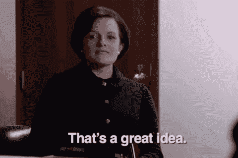
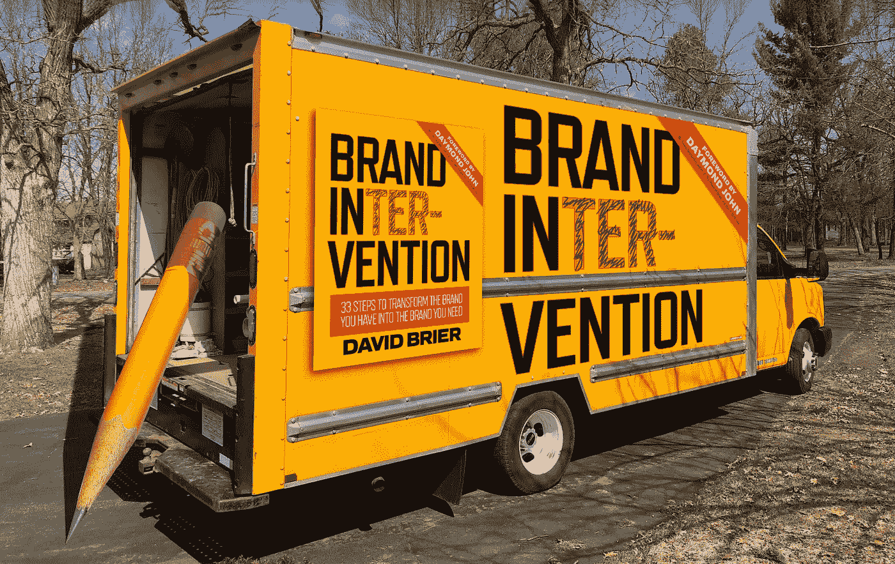

# 伟大的领袖、企业家和艺术家都有这一不经意间被观察者忽略的第一特征

> 原文：<https://medium.com/swlh/great-leaders-entrepreneurs-and-artists-share-this-1-trait-casual-observers-miss-7f9c2cc4b504>

## 如果你创造了什么，这个技能是至关重要的。如果你领导任何人，你对这个的掌握程度就是一切。

伟大的领导者都有一个共同的特点:对事物为什么会这样着迷。

他们不会等待事情、事件或发现向他们伸出援手。

这是《周三一分钟》第 18 集的话题。

看看埃隆·马斯克、史蒂夫·乔布斯、甲壳虫乐队、托马斯·爱迪生、迈克尔·乔丹、马丁·路德·金和其他许多人。

伟大的领导者(即艺术家、作家、创新者、企业家、设计师和任何类型的创造者)会深入环境，与以下人员建立联系:

*   主意
*   价值观念
*   人
*   志向；抱负
*   经历
*   材料
*   和各种形式的“潜力”。

> *等待*不是等式的一部分。

# 伟大的领导者:他们看起来。他们明白了。他们听到了。他们问。

光看是不够的。

*真正看到* **就可以**足够了。

> 但即使在观察之前，我们也需要足够的关心去做一件我们在伟大领袖身上发现的事情:我们首先需要感兴趣和好奇。

找到你感兴趣的东西。

一些你在乎的东西——一些真正让你兴奋的“生活”标准。

当这些汁液开始为你流动时，它们也会开始为其他人流动。

我在这里解释一下:

*(如果你还没有，订阅我的 YouTube 频道，每周都可以获得零废话的有效见解。)*

# 领导者需要伟大的工具

当我写亚马逊畅销书《品牌干预》时，我写它有两个原因:

1.  提供一本书，免费的，有关于品牌的核心要点，特别是为那些没有时间阅读另一本关于品牌的书的人，和
2.  **给予知识和见解，*而不是*** 更多的规则。为什么？因为*规则使人能够遵循。知识使人能够领导。*

因此，如果你想知道建立品牌的可靠步骤，就去世界上有影响力的人的图书馆里找本书吧。说真的。

[http://a.co/ipzXVhr](http://a.co/ipzXVhr)

*原载于 www.risingabovethenoise.com***。**

**

## *这篇文章发表在 [The Startup](https://medium.com/swlh) 上，这是 Medium 最大的创业刊物，有 320，924+人关注。*

## *在这里订阅接收[我们的头条新闻](http://growthsupply.com/the-startup-newsletter/)。*

**