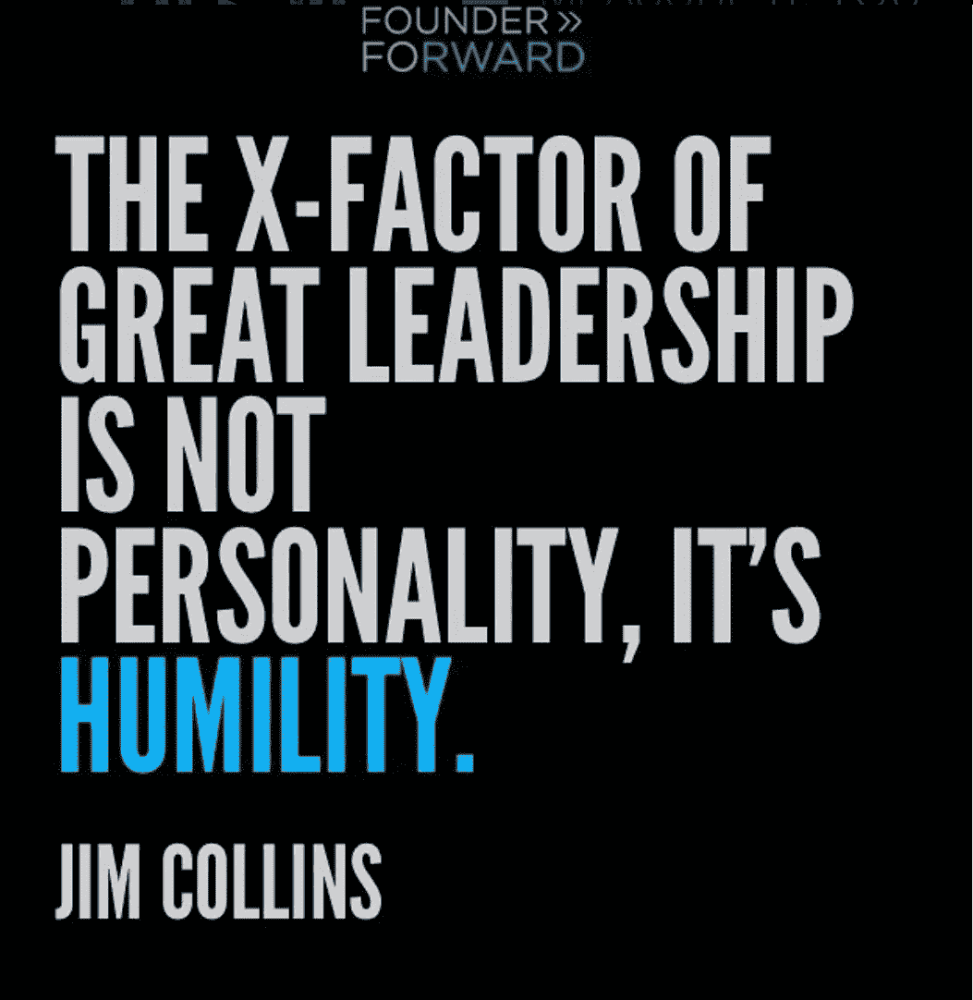

# 伟大的领导是谦逊和服务，而不是自我和指挥

> 原文：<https://medium.com/swlh/great-leadership-is-about-humility-and-serving-not-ego-and-directing-cc3d7c7c1492>

给硅谷一个小小的提醒:在为他的畅销书《从优秀到卓越》研究近 1500 家公司和领导者时，作者吉姆·科林斯发现谦逊是伟大领导力的 X 因素。

太多时候，科技创业文化陷入了“粉碎”、“颠覆”、“范式转换”或“成为下一个独角兽”的虚张声势中。创始人的自信很容易变成创始人的傲慢。不幸的是，我们都知道一些创业者的故事，他们让自己的自我占据了上风。

练习谦逊要难得多，因为这意味着你也必须练习脆弱。

保持谦逊意味着意识到并承认你所不知道的。这意味着犯错和寻求帮助是正常的。当你谦逊的时候，你会向持续的成长和学习敞开心扉，你会优雅而有尊严地处理创业生活中不可避免的低谷。

作为一名领导者，谦逊会让你更有亲和力，更容易接近。反过来，它创造了一个更人性化的工作环境，在这里，你的员工会对开放、冒险和表现脆弱感到更舒服。

# 成为一个仆人式的领导者

那些深谙谦逊之道的人往往对自己的领导地位有不同的看法。

服务型领导是一种领导形式，或者说是一种理念，首席执行官们认为自己是在为下属服务。仆人型领导不把他们的职位视为权力或控制人和结果的方式，而是把他们的职位视为服务和发展他们的员工和组织的机会。

2017 年，Glassdoor 和 Comparably 都将 SendGrid 的首席执行官 Sameer Dholakia 评为评价最高的科技首席执行官。[《福布斯》](https://www.forbes.com/sites/jeffkauflin/2017/08/10/the-unusual-management-style-of-one-of-the-most-highly-rated-ceos-in-tech/#c922a94715b8)随后写了一篇关于这位首席执行官仆人式领导风格的文章，引起了他的关注:

> 他说，成为一名服务型 CEO 意味着颠覆传统的组织结构，将 CEO 放在最底层。他承认自己的工作很困难，“但是，为业务努力奋斗的人不是首席执行官……我不必接一个因为一个 bug 而心烦意乱的客户的电话。我没有销售额度。”他认为领导者的主要工作是赋予他人权力。

微软首席执行官塞特亚·纳德拉也是一名仆人型领导。纳德拉以重视文化和真正赋予员工权力而闻名，他说:“让它发生。你有全权。”他经常寻找别人能赢的方法。

他在他的书*中写道:“这是关于每天质疑我们自己。”这本书的主题是重新发现微软的灵魂，并为每个人设想一个更好的未来*

对自己和公司的质疑有助于保持谦逊。它打开了可能性的大门，并避开了自我，而自我会成为真正解决问题的障碍。

# 另一个“E”字——移情的作用

创始人应该有意识地培养和展示另一个“e”字:同理心，而不是自我。同理心被定义为理解他人感受的能力，它不仅可以激励员工，还可以帮助员工应对挑战，追求卓越。

如果其他人知道你能从他们的角度看世界，这会培养一种信任和支持的感觉。

同理心是情商的 18 个要素之一(阅读关于情商:它是什么，为什么它在商业中很重要？[此处](http://founderforward.com/blog-view/2018/3/5/eq-iq-yes-founders-you-should-sweat-the-soft-skills)。这也是以人为本的服务型领导的重要组成部分。

因此，正如我们之前所写的，你在情商技能上下的功夫越多，你就越有可能成为最好的领导者。从现在开始，问自己以下问题:

*我是带着谦逊还是自我来领导？*

*我在为我的团队服务时是领导者吗？*

我是一个善解人意的领导者吗？

为了服务我的员工，我可以在本周开始做哪三件事？

想了解更多关于现代领导力和创业文化的信息，请前往 FounderForward.com

## 这个故事发表在 [The Startup](https://medium.com/swlh) 上，这是 Medium 最大的创业刊物，拥有 317，238+人关注。

## 在此订阅接收[我们的头条新闻](http://growthsupply.com/the-startup-newsletter/)。

