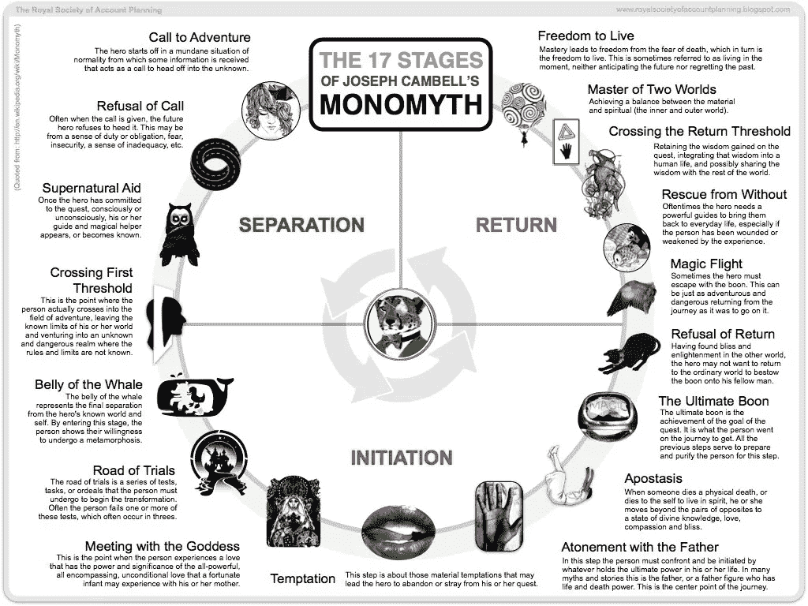
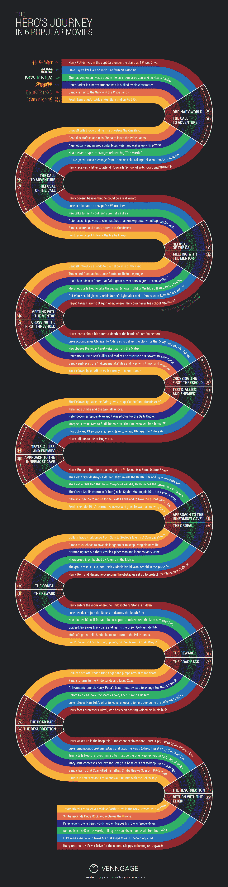

# 发展你的事业，认识你的英雄！

> 原文：<https://medium.com/swlh/grow-your-business-know-thy-hero-5107d28dd23f>

超人之所以成为英雄，不是因为他拥有力量，而是因为他有智慧和成熟去明智地运用这种力量。从表演的角度来看，我就是这样接近这个角色的。”

克里斯托弗·里夫说过这句话，在我看来，他是我们有史以来最好的超人。即使在一次事故使他瘫痪直至死亡后，他仍表现得像个英雄。我相信他作为一个人比作为一个虚构的角色更好地扮演了他的超人角色。

**现在，让我问你这个问题:你的企业有英雄吗？**值得尊敬并称赞为神奇和神圣的人？你抬起头，知道你为什么服务于你的市场，为什么你追求你的目标吗？

**你的顾客是你真正的英雄吗？你的客户是推动任何业务的引擎，是核心，是唯一的，是你存在的理由，是你创造、摧毁和制造新产品的理由。**

*如果你还没有这样做，看看我之前发表在*[*The Startup*](https://medium.com/swlh)*的两篇文章，链接到主人公的旅程:*

*   [*创建你的头像*](/swlh/choose-wisely-your-target-audience-is-out-there-somewhere-456414dc4360) *:明智地选择，你的目标受众就在某处*
*   [*商业共情地图*](/swlh/what-is-an-empathy-map-and-why-is-it-valuable-for-your-business-14236be4fdf4) *:什么是共情地图，为什么它对你的商业有价值？*

> 字典对英雄的定义是:a:神话或传说中的人物，通常是具有强大力量或能力的神的后裔；b:杰出的战士；c:因成就和高尚品质而受人钦佩的人；d:表现出巨大勇气的人

# 换句话说，顾客、客户、消费者、购物者、购买者，你想叫他们什么名字都行，他们是你的英雄，如果他们不是，他们也应该是。

早在 20 世纪 40 年代初，坎贝尔·约瑟夫在他的书——《千面英雄》(T33)(1949)中以 17 个阶段推广了一元论或英雄的神话模式——该书定义了一个人如何经历一系列改变他们生活的特定事件，并最终发掘他们成为英雄的内在潜力。

所有电影都会经历这一系列事件，从《星球大战》、《黑客帝国》、《灰姑娘》、《阿凡达》、《哈利波特》、《指环王》到《海底总动员》等等，你懂了吧。相信我；一旦你理解了用来娱乐和激励你的模式，你就再也不会看同样的电影了，抱歉！

克里斯多佛·沃格勒在迪斯尼工作时创作了一部浓缩的 12 步版本的坎贝尔·约瑟夫的《蒙娜丽莎》，沃戈尔公司是第一个称之为《英雄之旅》的公司。这是大多数电影叙事中出现的一个序列，你们都非常熟悉。

尽管对这位英雄的旅程有不同的解释，有些比其他的更复杂，但我将带你浏览南希·杜阿尔特在她的精彩书籍[共鸣](https://www.amazon.com/Resonate-Present-Stories-Transform-Audiences/dp/0470632011/ref=sr_1_1?ie=UTF8&qid=1512490300&sr=8-1&keywords=resonate)中的视觉效果。

Nancy Duarte — Resonate — Hero’s Journey

主人公的旅程分为 12 个阶段和两个主要区域。顶部区域是我们的英雄日常生活的普通世界。底部是非凡的世界，或者说是展现在他们眼前的新世界，在那里发生了冒险和转变。

让我们来分解阶段。(弄点咖啡、茶、啤酒，任何你想要的，转变总是痛苦的！)我是黑客帝国的粉丝，所以我就用电影来举例。

# 1.平凡的世界

主人公被介绍到他们的平凡世界。他们对面临的问题认识有限。在《黑客帝国》中，我们认识了尼欧，他生活在一个他不适应的世界里，做着他不喜欢的工作，过着普通人和黑客的双重生活。

# 2.冒险的召唤

英雄对前方任务的情况有了更多的了解。尼奥从他的电脑屏幕上收到一条信息，说的是“跟着白兔”。

# 3.拒绝通话

英雄现在面临的情况，并要求拥抱的追求。在《寻找冒险》中，当主人公拒绝离开舒适区时，拒绝召唤就变得很突出。尼奥向三一讲述了黑客帝国，但他并不相信，认为这只是一场梦。

# 4.会见导师

英雄必须克服不愿改变的心理，向新的可能性敞开心扉。尼奥遇见了墨菲斯。莫斐斯让他服用蓝色药丸或红色药丸；他必须做出选择。过他的生活或者找出母体的真相。

# 5.跨过门槛

英雄需要致力于改变。无论发生什么事情，他们都必须行动起来。尼奥选择服用红色药丸，从母体中醒来，发现自己的新现实。没有回头路；现在主人公面临着难以克服的磨难。

# 6.测试、盟友和敌人

他们开始尝试改变。尼奥遇到了团队，他接受了训练，并面临与墨菲斯的第一场战斗，以了解和学习控制他的新能力。他面临着新的挑战，需要适应新的现实。

# 7.走近最深处的洞穴

主人公为他们最重大的变化做好了准备。先知告诉尼欧，他或墨菲斯都会死，他必须选择谁活着。尼奥需要做决定，开始怀疑自己。

# 8.折磨

主人公面临着他们最大的挑战；这是故事的中间，情节变得复杂了。在《黑客帝国》中，尼奥和他的团队在一栋旧公寓楼中遭到伏击，他们差点被特工杀死。在这个阶段，英雄意识到自己的潜力并开始相信。

# 9.奖励(夺剑)

男主角忍受了死亡，现在意识到他可以抓住剑。尼奥因为让特工抓住了墨菲斯而感到内疚，并决定冒着生命危险进入母体去营救他。

# 10.回去的路

尼奥试图逃离母体，被特工史密斯杀死。这里是我们看到英雄复活的地方；摧毁旧的自我，让新的自我诞生，变得更强大、更明智。

# 11.恢复

我们的英雄面临着最终的尝试，去跳跃，去改变。三一告诉尼奥她爱他，他复活了。尼奥可以看到矩阵并控制它的每一个方面。他现在可以挡住子弹，杀死特工史密斯。尼奥就是那个人。

# 12.带着仙丹回来

Neo 通过模拟电话呼叫 Matrix 并宣布胜利，人类战胜了机器，电影结束时留给我们的是一个从普通人变成英雄的角色。

我们可以看到主人公的旅程如何适用于任何电影。这是哲学上的，但对我们来说也是合乎逻辑的。这就是为什么不跟随主人公的旅程的电影不是很有娱乐性或者缺乏实质内容。

当我们推销产品时，同样的事情也会发生。有些想法很棒，但营销是错误的或误导的，导致我们对信息感到困惑，并做出不购买的决定。

传达真实故事的简单信息将是我们认同的东西，它是令人向往的，我们会被这些故事、口号或电视广告所吸引。

# 那么我们能把英雄的旅程应用到任何产品或服务中吗？

# 是啊！！

在销售时，我们需要理解我们的客户可能不愿意购买，改变他们现有的品牌，或者他们可能想用新产品进行新的冒险，但需要你的营销来说服他们这样做。

我们认同日常生活中的例子，我们认同我们可能遭受或已经遭受的痛点。这是你大放异彩的机会，你可以成为导师，带着你的产品带领顾客走过这段旅程。

有多少次你发现你的客户不理解你的产品，而其他人从一开始就明白了。

这些英雄，[你的顾客](/swlh/choose-wisely-your-target-audience-is-out-there-somewhere-456414dc4360)，带着你的产品和服务，正面临着他们自己的英雄之旅。一些人可能会带着灵丹妙药回来，另一些人不愿意改变，或者拒绝了召唤。

**努力发现你的客户在英雄之旅中的位置，并从你的营销策略中获益。**

如果你能发现你的客户在英雄之旅中的位置，你就可以开始改变你的沟通方式，并慢慢地整合新的战术和策略来定位你的产品。

在我们公司( [Yumiwi:活动营销平台](https://www.yumiwi.com/))我们将我们的英雄定义为活动领域的代理和品牌。我们已经成为许多寻求活动行业数字化帮助的顶级公司的导师，从而使他们更接近他们的与会者。

现在，品牌将通过提供更好的活动让他们的参与者受益。对于品牌来说，与会者已经成为他们的英雄，对于与会者来说，品牌是他们的导师。

# **挑战。**

我们已经发现我们的一些客户处于第一阶段:对他们的问题——平凡的世界——认识有限。他们不知道他们错过了在比赛中使用新技术的机会。

所以我们教他们，我们给他们发送内容，以确保他们不会错过数字化他们的活动，让他们有能力获得更多关于他们客户的见解。

有些现在处于第三阶段(不愿改变)。这些客户知道他们需要新的活动技术，但并不热衷于实施它，他们需要做出跳跃。

我们为这些客户提供了一个免费的试点，以测试我们可以一起完成什么，并让他们尝试，无风险，新技术，可以让他们成为他们公司的英雄。

其他人正处于磨难阶段，他们尝试了其他技术，但都悲惨地失败了。我们需要改变这种状态，教育他们他们做错了什么，以及他们如何才能提高生产力和效率。

我们甚至有一些客户，他们需要的只是部署技术。我们认为这些客户正处于复苏阶段。

# **成为导师！**

你所有的客户都会落入英雄旅程中 12 个阶段中的一个。你的目标是识别他们，并调整你的营销信息、促销策略或语气，将你的所有客户——或至少大部分客户——转变为英雄。

**你的客户会感觉得到回报，受到尊重和信任，被视为英雄，允许他们推荐、评价和谈论你的产品或服务。**

所有的英雄都有导师:卢克·天行者有尤达；尼奥有墨菲斯，比尔博·巴金斯有甘道夫。我们都需要那种真正的力量，让我们相信，实现不容置疑和未知的目标是可能的。

你的内容应该是他们的导师。你如何告诉他们你的产品和服务的重要性，这对于增加你的销售额至关重要。

成为他们的导师，帮助他们理解使用你的产品和服务，他们的生活会变得更加舒适和富有成效

购买产品是一种心态，调整你的信息使销售成为现实。

**祝你好运，莫斐斯！**

祝你生活愉快！

*附言*

所有电影都会经历这一系列事件，从《星球大战》、《黑客帝国》、《灰姑娘》、《阿凡达》、《哈利·波特》、《指环王》、《海底总动员》等等，你懂了吧。

这是一张信息图，展示了英雄通过[复仇](https://venngage.com/)的旅程。

[*german Coppola，Coppola 学院首席执行官/创始人(此处提供* AVATHY WORKSHOP)如果您想沉浸在一个包含超过 22 课内容的完整研讨会中，引导您完成创建头像或理想客户地图、移情地图的整个过程，并获得锁定理想受众所需的所有数据，请确保查看上面的链接。](https://www.udemy.com/course/avathy_method/?referralCode=FA20E0E757C5BF4B45DC)

## 这个故事发表在 [The Startup](https://medium.com/swlh) 上，这是 Medium 最大的企业家出版物，拥有 273，103+人。

## 在此订阅接收[我们的头条新闻](http://growthsupply.com/the-startup-newsletter/)。

